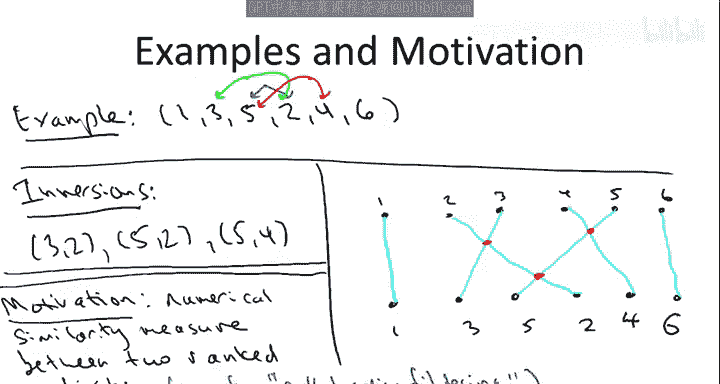
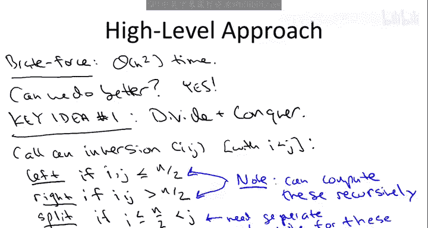
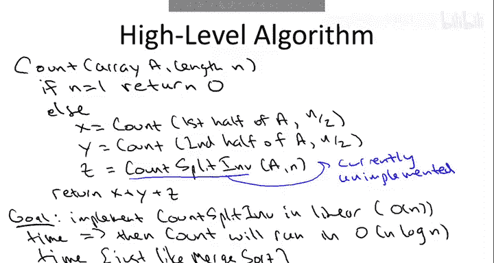

# 013：计算逆序数的O(n log n)算法 I

## 概述

在本节课中，我们将学习如何应用分治算法设计范式来解决一个新问题：计算数组的逆序数。我们将从回顾分治范式的一般步骤开始，然后定义逆序数问题，并探讨其应用场景。最后，我们将设计一个基于分治思想的高层算法框架，其目标是达到O(n log n)的时间复杂度。

## 分治范式回顾

上一节我们介绍了分治算法设计范式。本节中，我们来回顾其三个核心步骤，为后续解决具体问题打下基础。


分治范式包含以下三个概念性步骤：

1.  **分解**：将原始问题划分为更小的子问题。有时这只是概念上的划分，有时则需要实际复制部分输入数据（例如创建新数组）以传递给递归调用。
2.  **征服**：递归地解决子问题。例如，在归并排序中，递归地对数组的左半部分和右半部分进行排序。
3.  **合并**：将子问题的解组合成原始问题的解。这通常是算法中最需要巧思的部分。例如，在归并排序中，递归调用后，我们需要将两个已排序的半边数组合并成一个完整的有序数组。

## 逆序数问题定义

现在，让我们转向计算逆序数这个具体问题，看看如何应用分治范式。

首先，我们正式定义问题：给定一个长度为n的数组A作为输入。为简化问题，我们假设数组包含数字1到n，但这些数字以某种顺序排列。问题的目标是计算这个数组的**逆序数**。

那么，什么是逆序？一个逆序是指一对数组索引`(i, j)`，其中`i < j`，但数组元素满足`A[i] > A[j]`。也就是说，**前面的元素比后面的元素大**。

显然，如果数组是按升序排序的（即`1, 2, 3, ..., n`），那么逆序数为0。反之，任何其他排列都会产生非零的逆序数。

让我们看一个例子。假设有一个包含六个元素的数组，顺序为：`1, 3, 5, 2, 4, 6`。这个数组有多少逆序呢？

我们需要找出所有前面元素大于后面元素的配对：
*   `(5, 2)`：5在2前面，且5 > 2。
*   `(3, 2)`：3在2前面，且3 > 2。
*   `(5, 4)`：5在4前面，且5 > 4。

因此，该数组的逆序对是`(3,2)`, `(5,2)`, `(5,4)`，总共有3个逆序。

## 逆序数的应用

你可能会问，为什么要解决这个问题？原因有几个，其中一个主要应用是作为一种**数值相似性度量**，用于量化两个不同排序列表之间的接近程度。

例如，假设我和你的一位朋友各自对10部看过的电影进行排名（从最喜欢到最不喜欢）。我可以根据这些排名生成一个数组：数组的第一个元素是你朋友对你最喜欢的电影的排名，第二个元素是你朋友对你第二喜欢的电影的排名，依此类推。

*   如果你们的排名完全一致，这个数组的逆序数将为0。
*   一般来说，逆序数越多，表明两个列表的差异越大。

这种度量在**协同过滤**中很有用。例如，购物网站通过分析你的购买历史（你的“排名”），找到与你偏好相似的其他顾客，然后根据这些相似顾客的购买记录向你推荐新产品。计算逆序数可以帮助识别哪些顾客具有相似的偏好。

## 逆序数的范围

为了确保我们理解一致，让我们思考一个简短的问题：一个数组可能拥有的最大逆序数是多少？

对于一个包含n个元素的数组，最大逆序数出现在数组完全逆序（即降序排列）时。此时，每一对索引`(i, j)`（其中`i < j`）都构成一个逆序。这样的配对总数是：

**公式：** `n * (n - 1) / 2`

对于6个元素的数组，最大逆序数就是15。



## 暴力算法与分治思路

现在，我们关注如何尽可能快地计算数组的逆序数。

一种选择是**暴力算法**：使用双重循环遍历所有索引对`(i, j)`（其中`i < j`），检查每一对是否构成逆序，并累加计数。这个算法是正确的，但时间复杂度是**O(n²)**，因为需要检查大约`n²/2`对元素。

作为优秀的算法设计者，我们总是要问：**我们能做得更好吗？** 答案是肯定的，我们将使用**分治**方法。

我们的分解方式将直接借鉴归并排序：递归地处理数组的左半部分和右半部分。为了理解仅通过递归我们能取得多少进展，让我们将数组的逆序分为三种类型：

假设有一个逆序对`(i, j)`，其中`i < j`。设数组长度为`n`。
1.  **左逆序**：如果`i`和`j`都位于数组的前半部分（即 `i, j <= n/2`）。
2.  **右逆序**：如果`i`和`j`都位于数组的后半部分（即 `i, j > n/2`）。
3.  **分裂逆序**：如果`i`位于前半部分，而`j`位于后半部分（即 `i <= n/2` 且 `j > n/2`）。

当我们递归调用算法处理数组的左半部分时，如果实现正确，我们将成功计算出所有纯粹位于左半部分的逆序，即**左逆序**。同样，对右半部分的递归调用将计算出所有**右逆序**。

剩下的问题就是如何计算**分裂逆序**。我们不应感到意外，即使在递归调用完成其工作后，仍然有一些剩余工作要做。这就像归并排序一样：递归调用神奇地排序了左半部分和右半部分，但在它们返回后，我们仍然需要将两个已排序的数组合并成一个。在这里，递归之后，我们需要“清理”并计算分裂逆序的数量。

例如，回顾之前那个六元素数组`[1, 3, 5, 2, 4, 6]`，你会发现所有的逆序（`(3,2)`, `(5,2)`, `(5,4)`）实际上都是分裂逆序。因此，递归调用将返回0，而该示例的所有工作都将由“计算分裂逆序”的子程序完成。

## 高层算法框架

让我们总结一下目前的进展，并给出一个高层算法描述（其中部分细节尚未指定）：



1.  **基准情况**：如果数组只有一个元素，则没有逆序，直接返回0。
2.  **分解与征服**：
    *   通过递归调用计算**左逆序**的数量。
    *   通过递归调用计算**右逆序**的数量。
    *   调用一个（尚未实现的）子程序计算**分裂逆序**的数量。
3.  **合并结果**：由于每个逆序要么是左逆序、右逆序，要么是分裂逆序，且只能属于其中一类，因此我们可以简单地将这三部分的结果相加并返回。

**代码框架如下：**
```python
def count_inversions(arr):
    n = len(arr)
    # 基准情况
    if n <= 1:
        return 0
    # 分解
    mid = n // 2
    left = arr[:mid]
    right = arr[mid:]
    # 征服：递归计算左逆序和右逆序
    left_inv = count_inversions(left)
    right_inv = count_inversions(right)
    # 合并：计算分裂逆序 (待实现)
    split_inv = count_split_inversions(arr, left, right) # 假设的函数
    # 返回总和
    return left_inv + right_inv + split_inv
```

## 目标与挑战

我们的高层攻击计划是如何计算逆序数。当然，我们需要具体说明如何计算分裂逆序的数量，并且我们希望这个子程序运行得很快。

**类比归并排序**，在递归调用之外，归并子程序只做了线性工作。在这里，我们也希望只使用**线性时间**来完成分裂逆序的计数。

如果我们能成功实现一个正确且线性的`count_split_inversions`子程序，那么整个递归算法的时间复杂度将是**O(n log n)**。原因与归并排序达到O(n log n)的原因完全相同：有两个对半规模问题的递归调用，而递归调用外部我们只进行线性工作。我们可以直接套用为归并排序设计的递归树论证，它在这里同样适用。

需要意识到的是，**用线性时间计算分裂逆序的数量是一个相当有雄心的目标**。分裂逆序的数量可能非常多（最坏情况下可达`n²/4`个，全是分裂逆序）。我们试图用线性时间来计算一个可能数量级为平方的事物。这真的能做到吗？

**是的，可以做到。** 我们将在下一个视频中看到如何实现。

## 总结



本节课中，我们一起学习了如何将分治范式应用于计算数组逆序数的问题。我们定义了逆序数，探讨了其应用场景，并分析了暴力解法的局限性。通过将逆序分类为左、右、分裂三种类型，我们设计了一个高层分治算法框架。该框架的关键在于，在递归调用解决了左、右逆序后，需要一个高效的线性时间子程序来计算剩余的分裂逆序。如果能够实现这一点，整个算法就能达到O(n log n)的优异时间复杂度。在下一节，我们将深入探讨如何实现这个关键的线性时间计数步骤。