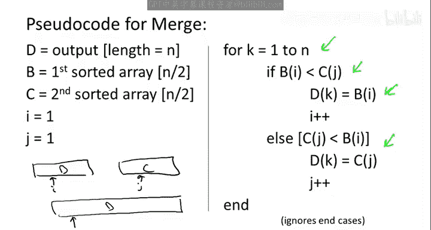

# 014：计算逆序对的O(n log n)算法 II 🧮

在本节课中，我们将学习如何通过一个巧妙的分治算法，在O(n log n)时间内计算一个数组中的逆序对总数。我们将看到，通过将计算过程与归并排序相结合，可以高效地解决这个问题。

---

## 分治策略的挑战

上一节我们介绍了计算逆序对的分治方法。该方法将数组分成两半，递归地计算左半部分和右半部分的逆序对。然而，我们识别出了一个关键挑战：如何快速计算“分裂逆序对”的数量。分裂逆序对指的是第一个索引在数组左半部分，第二个索引在数组右半部分的逆序对。这些逆序对会被两个递归调用所遗漏。

问题的核心在于，分裂逆序对的数量可能高达O(n²)。为了达到我们期望的O(n log n)运行时间，我们需要在线性时间内完成分裂逆序对的计算。

---

## 结合归并排序的巧妙想法

这里有一个非常巧妙的想法，可以让我们实现目标：**将计算过程“搭载”在归并排序之上**。

这意味着，我们将要求递归调用完成更多的工作，以便让计算分裂逆序对的任务变得更简单。这类似于在数学归纳法中，有时需要加强归纳假设来推进证明。因此，我们将要求递归调用不仅计算传入数组的逆序对数量，还要在过程中对数组进行排序。

为什么不这样做呢？我们知道归并排序可以在O(n log n)时间内完成排序，而这正是我们追求的运行时间。所以，不妨将排序功能加入进来，也许它能在合并步骤中帮助我们。事实上，正如我们将要看到的，它确实能。

为什么我们要对递归调用提出更高的要求呢？在接下来的几页幻灯片中，我们会看到，归并子程序似乎就是为计算分裂逆序对数量而设计的。当你合并两个已排序的子数组时，你会自然地发现所有的分裂逆序对。

---

## 算法升级：排序与计数

让我更清楚地说明，我们之前的高层算法将如何升级，使得递归调用同时进行排序。

以下是之前提出的高层算法，我们递归地计算左半部分和右半部分的逆序对，然后有一个尚未实现的子程序`CountSplitInv`负责计算分裂逆序对的数量。

现在，我们将对这个算法进行如下增强：
*   我们将算法名称从`Count`改为`SortAndCount`。
*   递归调用同样调用`SortAndCount`。因此，现在我们知道每个递归调用不仅会计算子数组中的逆序对数量，还会返回一个已排序的版本。
*   从第一个递归调用中，我们将得到一个已排序的数组`B`（即传入子数组的排序版本）。
*   从第二个递归调用中，我们将得到一个已排序的数组`C`。
*   现在，`CountSplitInv`子程序除了计算分裂逆序对之外，还负责合并两个已排序的子数组`B`和`C`。

因此，`CountSplitInv`将负责输出一个数组`D`，它是原始输入数组`A`的排序版本。为了反映其更宏大的目标，我应该将这个子程序重命名为`MergeAndCountSplitInv`。

我们不应该因为要求合并子程序去合并两个已排序的子数组`B`和`C`而感到畏惧，因为我们已经知道如何在线性时间内完成合并。问题在于，在完成这项工作的同时，我们能否在线性时间内额外计算出分裂逆序对的数量？我们将看到这是可以做到的，尽管这并非显而易见。

此时，你可能会问：我们为什么要这样做？为什么我们要给自己增加更多的工作？再次强调，我们希望这样做能让计算分裂逆序对变得更容易。

---

## 归并如何揭示分裂逆序对

为了理解为什么要求递归调用进行排序能让`CountSplitInv`变得更容易，让我们回忆一下归并排序中原始归并子程序的定义。

以下是我们在几个视频前讨论过的相同伪代码，我重命名了数组的字母以符合当前的符号表示。我们被给予两个已排序的子数组（来自递归调用），称它们为`B`和`C`，长度均为`n/2`。我们的责任是生成`B`和`C`的排序组合，即一个长度为`n`的输出数组`D`。

其思想很简单：你取两个已排序的子数组`B`和`C`，以及你负责填充的输出数组`D`。在外层`for`循环中，你将从左到右遍历输出数组`D`。你将为排序子数组`B`和`C`分别维护指针`i`和`j`。唯一的观察是：无论尚未复制到`D`的最小元素是什么，它必须是`B`中尚未见过的最左元素，或者是`C`中尚未见过的最左元素。由于`B`和`C`已排序，剩余的最小元素必须是`B`或`C`中下一个可用的元素。因此，你只需以显而易见的方式进行：比较两个候选的下一个要复制的元素，查看`B[i]`和`C[j]`，哪个更小就复制哪个。`if`语句的第一部分处理`B`包含较小元素的情况，`else`语句处理`C`包含较小元素的情况。

这就是归并的工作原理：你并行地遍历`B`和`C`，从左到右按排序顺序填充`D`。

现在，为了理解这与数组的分裂逆序对有什么关系，请思考一个具有以下属性的输入数组`A`：**该数组没有任何分裂逆序对**。也就是说，这个输入数组`A`中的每一个逆序对要么是左逆序对（两个索引都≤ n/2），要么是右逆序对（两个索引都严格大于n/2）。

那么问题来了：给定这样一个数组`A`，在合并步骤中，已排序的子数组`B`和`C`会是什么样子？

正确答案是第二个选项。如果一个数组没有分裂逆序对，那么前半部分的所有元素都小于后半部分的所有元素。

为什么？考虑逆否命题：假设前半部分有一个元素大于后半部分的任何一个元素，仅这一对元素就构成一个分裂逆序对。因此，如果你没有分裂逆序对，那么左半部分的所有元素都小于右半部分的所有元素。

更重要的是，思考一下在具有此属性的数组上执行归并子程序的情况，即在一个左半部分所有元素都小于右半部分所有元素的输入数组`A`上。归并会做什么？记住，它总是在寻找剩余元素中较小的那个：`B`中剩余的第一个元素或`C`中剩余的第一个元素，并将其复制过去。如果`B`中的所有元素都小于`C`中的所有元素，那么在`C`被触及之前，`B`中的所有元素都会被复制到输出数组`D`中。因此，在没有分裂逆序对（即零个分裂逆序对）的输入数组上，归并的执行过程异常简单：首先遍历`B`并复制其所有元素，然后直接拼接`C`。两者之间没有交错。

所以，这表明从第二个子数组`C`复制元素可能与原始数组中的分裂逆序对数量有关，事实确实如此。我们将看到一个普遍模式：**从第二个数组`C`复制元素到输出数组`D`的过程，揭示了原始输入数组`A`中的分裂逆序对**。

---

## 通过示例理解模式

让我们回到上一个视频中的例子，这是一个包含六个元素的数组：`[1, 3, 5, 2, 4, 6]`。我们进行递归调用。实际上，数组的左半部分`[1, 3, 5]`和右半部分`[2, 4, 6]`都已经排序，所以不需要进行排序工作。你会从两个递归调用中得到零个逆序对。记住，在这个例子中，所有的逆序对都是分裂逆序对。

现在，让我们跟踪在这两个已排序子数组上调用的归并子程序，并尝试找出其与原始六元素数组中分裂逆序对数量的联系。

我们初始化索引`i`和`j`，指向每个子数组的第一个元素。左边的子数组是`B`，右边的是`C`，输出是`D`。

首先，我们将`B`中的元素`1`复制到输出数组。`1`被复制过去，我们将索引`i`前进到`3`。这里没有发生什么有趣的事情，没有理由计算任何分裂逆序对。确实，元素`1`不涉及任何分裂逆序对，因为`1`小于所有其他元素，并且它也在第一个索引位置。

当我们从第二个数组`C`复制元素`2`时，事情变得有趣得多。注意，在这一点上，我们已经偏离了在没有分裂逆序对的数组上会看到的简单执行过程。现在，我们在耗尽`B`之前就从`C`复制了元素。因此，我们希望这能揭示一些分裂逆序对。

我们复制了`2`，并将第二个指针`j`在`C`中前进。需要注意的关键点是：这揭示了**两个**分裂逆序对，即涉及元素`2`的逆序对：`(3, 2)`和`(5, 2)`。

为什么会这样？原因是我们复制`2`是因为它小于`B`和`C`中所有我们尚未查看的元素。特别是，`2`小于`B`中剩余的元素`3`和`5`。而且，由于`B`是左数组，`3`和`5`的索引必须小于这个`2`的索引。因此，这些是逆序对：`2`在原始输入数组中更靠右，但它却小于`B`中这些剩余的元素。`B`中剩余两个元素，这就是涉及元素`2`的两个分裂逆序对。

现在让我们回到归并子程序，看看接下来会发生什么。接下来，我们从第一个数组复制元素，我们意识到从第一个数组复制元素时，至少在分裂逆序对方面，没有发生什么有趣的事情。

然后我们复制`4`，再次发现一个分裂逆序对：`(5, 4)`。原因同样是：鉴于`4`是在`B`中剩余元素（即`5`）之前被复制的，它必须小于`5`，但由于它来自右半部分数组，它的索引也更大，所以它必然是一个分裂逆序对。

现在，归并子程序的其余部分执行没有任何意外：`5`被复制（我们知道从左数组复制是“无聊”的），然后我们复制`6`（从右数组复制通常是“有趣”的，但如果左数组为空，则不涉及任何分裂逆序对）。

你会回忆起之前的视频，这些就是原始数组中的逆序对：`(3,2)`, `(5,2)`, `(5,4)`。我们通过一种自动化的方法发现了它们，只需留意何时从右数组`C`复制元素。

这确实是一个普遍原则。

---

## 普遍原则的陈述与证明

让我来陈述这个普遍主张：**不仅在这个特定的例子或特定的执行过程中，无论输入数组是什么，无论有多少分裂逆序对，涉及数组右半部分某个元素的那些分裂逆序对，恰好就是在该元素被复制到输出数组时，左数组中剩余的元素数量。**

这正是我们在例子中看到的模式。在右数组`C`中，我们有元素`2`、`4`和`6`。记住，根据定义，每个分裂逆序对必须涉及一个来自前半部分的元素和一个来自后半部分的元素。因此，对于计算分裂逆序对，我们可以根据它们涉及的右数组元素进行分组。

对于`2`、`4`和`6`：
*   `2`涉及的分裂逆序对是`(3,2)`和`(5,2)`。`3`和`5`正是当我们复制`2`时`B`中剩余的元素。
*   `4`涉及的分裂逆序对是`(5,4)`。`5`正是当我们复制`4`时`B`中剩余的元素。
*   没有涉及`6`的分裂逆序对，确实，当我们复制`6`到输出数组`D`时，`B`中的元素已经为空。

那么普遍的论证是什么呢？这很简单。让我们聚焦于左数组`B`中的一个特定元素`x`（即属于原始数组前半部分的元素），并检查哪些`y`（即来自原始数组后半部分的元素）会与`x`形成分裂逆序对。

这有两种情况，取决于`x`是在`y`之前还是之后被复制到输出数组`D`中：
1.  如果`x`在`y`之前被复制到输出数组`D`，那么由于输出是按排序顺序的，这意味着`x`小于`y`。因此，不会形成分裂逆序对。
2.  如果`y`在`x`之前被复制到输出数组`D`，那么同样因为我们是按排序顺序从左到右填充`D`，这必然意味着`y`小于`x`。此时`x`仍然留在左数组`B`中，所以它的索引小于`y`（`y`来自右数组）。因此，这确实是一个分裂逆序对。

将这两种情况结合起来，可以得出：与`y`形成分裂逆序对的`B`中的元素`x`，正是那些在`y`被复制之后才会被复制到输出数组的元素。也就是说，这些元素的数量恰好等于当`y`被复制时`B`中剩余的元素数量。这就证明了普遍主张。

这一页幻灯片是关键的洞见所在。

---

## 实现细节与运行时间分析

既然我们完全理解了为什么在合并两个已排序子数组时计算分裂逆序对很容易，那么将其转化为代码，并得到一个同时进行合并和计算分裂逆序对数量的线性时间子程序，就是一件简单的事情了。这个子程序在整体递归算法中将具有O(n log n)的运行时间，就像归并排序一样。

让我们花一点时间来填充这些细节。我不会写出完整的伪代码，而是写出你需要如何增强几页幻灯片前讨论的归并伪代码，以便在归并的同时计算分裂逆序对。这将直接遵循之前的普遍主张，该主张指出了分裂逆序对与归并过程中左数组剩余元素数量的关系。

其思想很自然：在按照先前伪代码合并两个已排序子数组的同时，只需维护一个运行总数，记录我们遇到的分裂逆序对数量。你有一个已排序子数组`B`，一个已排序子数组`C`。

你将它们合并到一个输出数组`D`中。当`k`从1遍历到`n`时，你从0开始计数，每次从`B`或`C`复制元素时，根据某种规则递增这个计数。

那么递增规则是什么？我们刚刚看到，涉及从`B`复制的操作不计入分裂逆序对。只有当我们从`C`复制元素时，我们才查看分裂逆序对。每个分裂逆序对恰好涉及`B`和`C`中的一个元素。因此，我们可以通过`C`中的元素来计数。一个给定的`C`元素涉及多少个分裂逆序对？正是当它被复制时`B`中剩余的元素数量。这告诉了我们如何递增这个运行计数。

根据前一页幻灯片的普遍主张，这个运行总数的实现恰好计算了原始输入数组`A`所拥有的分裂逆序对数量。回想一下，左逆序对由第一个递归调用计数，右逆序对由第二个递归调用计数。每个逆序对要么是左逆序对、右逆序对，要么是分裂逆序对，恰好是这三种类型之一。因此，通过这三个不同的子程序（两个递归调用和这里的合并计数），我们成功地计算出了原始输入数组的所有逆序对。这就是算法的正确性。

运行时间是多少？回想一下在归并排序中，我们首先分析了归并的运行时间，然后讨论了整个归并排序算法的运行时间。让我们在这里也简要地做同样的事情。

这个子程序（同时进行合并和计算分裂逆序对）的运行时间是多少？这里有我们在合并过程中所做的工作，我们已经知道这是线性的。这里唯一额外的工作是递增这个运行计数，这对于`D`的每个元素来说是常数时间（每次我们复制一个元素时，我们对运行计数进行一次加法操作）。因此，对于`D`的每个元素是常数时间，总体上是线性时间。

我在这里的表述有些随意（以一种非常常规的方式），但确实有些随意：通过写O(n) + O(n) = O(n)。当你做这样的陈述时要小心。如果你把O(n)加到自己身上n次，那将不是O(n)。但如果你把O(n)加到自己身上常数次，它仍然是O(n)。作为练习，你可能想写出正式版本的含义。基本上，存在某个常数`c1`，使得合并工作最多需要`c1 * n`步；存在某个常数`c2`，使得其余工作最多需要`c2 * n`步。当我们将它们相加时，我们得到最多`(c1 + c2) * n`步，这仍然是O(n)，因为`c1 + c2`是一个常数。

因此，归并子程序总体上是线性工作。现在，通过我们在归并排序中使用的完全相同论证，因为我们有两个对半大小数组的递归调用，并且在递归调用之外做线性工作，所以总体运行时间是O(n log n)。

我们确实只是“搭载”在归并排序之上，在常数因子范围内，顺路完成了计数工作，但运行时间保持为O(n log n)。

---

## 总结

在本节课中，我们一起学习了如何通过一个巧妙的分治算法高效计算数组的逆序对总数。核心思想是将计数过程与归并排序相结合。我们升级了算法，要求递归调用不仅计数，还返回排序后的子数组。关键在于，在合并两个已排序子数组的过程中，每当从右半部分子数组复制一个元素时，左半部分子数组中剩余的元素数量恰好就是涉及该元素的分裂逆序对数量。利用这一洞察，我们可以在线性时间内完成合并与计数，从而使整个算法达到O(n log n)的最优运行时间。