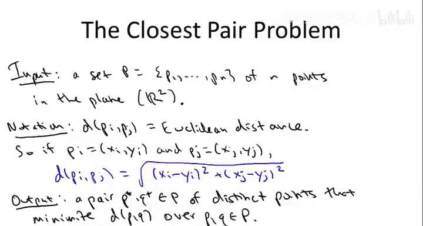
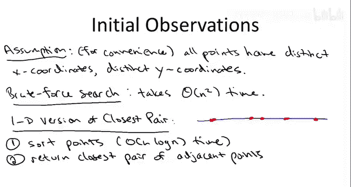
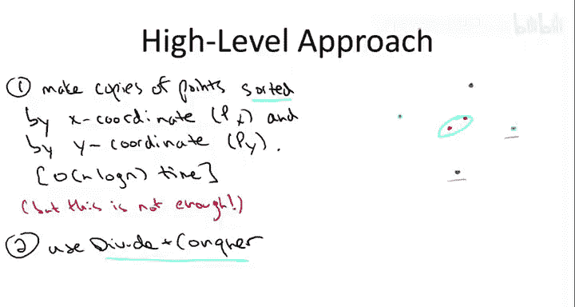
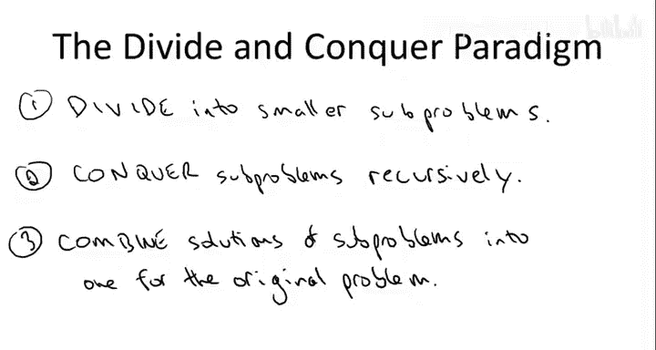
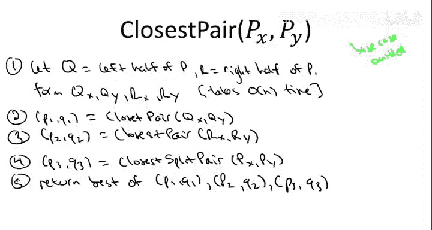
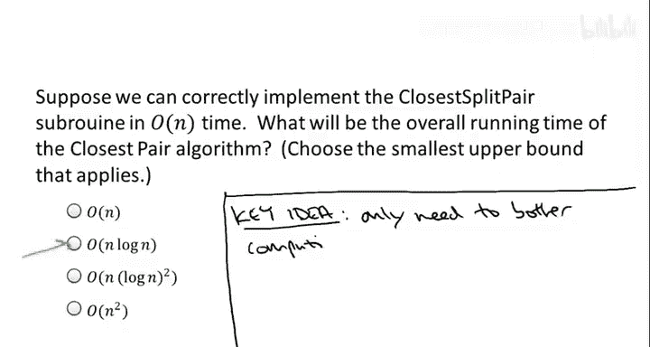
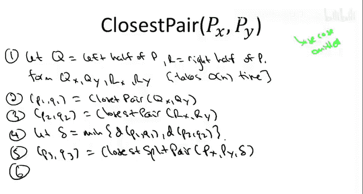
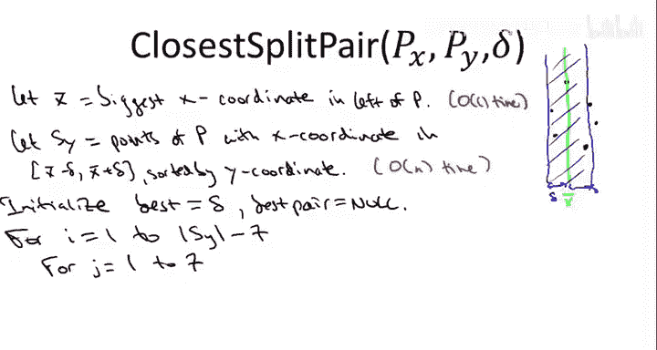
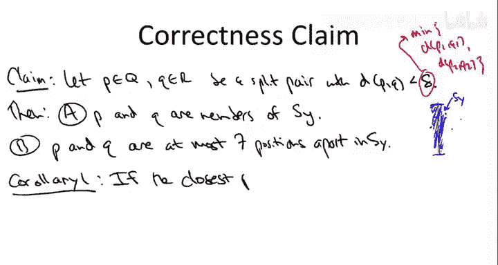

# 015：最近点对问题 I（高级篇）🎯

在本节课中，我们将学习一个非常巧妙的**分治算法**，用于解决**最近点对问题**。这个问题是：给定平面上的若干个点，找出其中距离最近的一对点。这是我们第一次接触**计算几何**领域的应用，该领域研究如何推理和操作几何对象，这类算法在机器人学、计算机视觉和计算机图形学等领域非常重要。

这部分内容相对高级，比我们之前见过的分治应用要复杂一些。算法本身有些巧妙，其正确性证明也相当不平凡。请注意，由于内容更深入，本视频的讲解节奏会比大多数其他视频稍快一些。

## 问题定义

我们被给定平面上的 `n` 个点，每个点由其 `x` 坐标和 `y` 坐标定义。在本问题中，我们关注两点之间的**欧几里得距离**。我们用 `d(pi, pj)` 表示点 `pi` 和 `pj` 之间的欧几里得距离。用坐标表示，其公式为：

`d(pi, pj) = sqrt((xi - xj)^2 + (yi - yj)^2)`

问题的目标很明确：在所有点对中，找出距离最小的那一对。

## 初步观察

首先，为了简便起见，我们做一个假设：所有点的 `x` 坐标互不相同，所有点的 `y` 坐标也互不相同。这个假设并非必需，算法可以扩展到处理坐标相同的情况，你可以课后思考如何实现。

接下来，让我们与之前学过的**计算逆序对**问题做个类比。第一个相似点是，如果我们满足于一个 `O(n^2)` 的算法，那么这个问题并不难。我们可以简单地通过**暴力搜索**解决：设置一个双重循环，遍历所有不同的点对，计算每对的距离，并记住最小的那个。这显然是一个正确的算法，但它需要遍历 `O(n^2)` 对点，因此运行时间是 `Θ(n^2)`。

和往常一样，问题是：我们能否运用一些算法技巧来做得更好？能否找到一个比这种遍历所有点对的朴素算法更优的算法？你可能会本能地认为，既然问题涉及 `O(n^2)` 个不同的对象（点对），我们可能本质上就需要做 `O(n^2)` 的工作。但请回忆，在计算逆序对时，我们利用分治法得到了一个 `O(n log n)` 的算法，尽管一个数组中可能存在多达 `O(n^2)` 个逆序对。那么问题是：我们能否在这里为最近点对问题做类似的事情？

在计算逆序对时，获得 `O(n log n)` 时间算法的关键之一是**利用排序子程序**。我们借助归并排序在 `O(n log n)` 时间内计算逆序对数量。那么，对于最近点对问题，排序是否也能以某种方式帮助我们突破 `O(n^2)` 的障碍呢？

为了证明排序确实有助于我们以优于 `O(n^2)` 的时间计算最近点对，让我们先看一个问题的特例，或者说一个更简单的版本：当所有点都在**一维空间**（即一条直线上）时，而不是在二维平面中。

## 一维情况下的解法

在一维版本中，所有点都位于一条直线上，并且我们以任意顺序给出这些点（不一定是排序好的）。

解决一维最近点对问题的一个方法是：首先对点进行排序。显然，最近的点对必然是排序后相邻的点。因此，你只需遍历 `n-1` 对相邻点，找出距离最近的一对即可。

更正式地说，解决一维版本问题的步骤如下：
1.  根据点唯一的坐标（因为是一维）对点进行排序。使用归并排序，我们可以在 `O(n log n)` 时间内完成。
2.  然后线性扫描这些点（这需要 `O(n)` 时间），对于每一对相邻点，计算它们的距离，并记住其中最小的那一对，最后返回它。这必然就是最近点对。

下图用绿色圆圈标出了最近点对，这是我们通过排序和线性扫描发现的。

当然，这并不能直接解决我们最初的问题。我们想要的是在平面（二维）中寻找最近点对，而不是在直线（一维）上。但我想指出的是，即使在直线上，也存在 `O(n^2)` 个不同的点对，因此暴力搜索在一维情况下仍然是 `O(n^2)` 的算法。至少在一维情况下，我们可以利用排序来突破朴素暴力搜索的界限，在 `O(n log n)` 时间内解决问题。因此，本讲的目标将是设计一个同样优秀的算法来处理二维情况：我们希望在 `O(n log n)` 时间内解决平面上的最近点对问题。

我们将成功实现这个目标。我将向你展示一个用于二维最近点对的 `O(n log n)` 时间算法。这需要几个步骤，让我们从高层次的方法开始。

## 高层次方法

首先，我们尝试模仿在一维情况下奏效的方法。在一维情况下，我们首先根据点的坐标对它们进行排序，这非常有用。在二维情况下，点有两个坐标：`x` 坐标和 `y` 坐标，因此有两种排序方式。所以，我们第一步就是对点进行两种排序。这可以看作是一个预处理步骤：我们获取输入的点集，使用归并排序一次，根据 `x` 坐标对它们进行排序（得到点的一份副本），然后制作点的第二份副本，根据 `y` 坐标进行排序。我们将这些排序后的点集副本分别称为 `Px`（按 `x` 坐标排序的点数组）和 `Py`（按 `y` 坐标排序的点数组）。我们知道归并排序需要 `O(n log n)` 时间，所以这个预处理步骤总共需要 `O(n log n)` 时间。既然我们的目标是获得一个运行时间为 `O(n log n)` 的算法，那么先对点进行排序是可行的。我们现在甚至不知道将如何使用这个事实，但这并无害处，不会影响我们获得 `O(n log n)` 时间算法的目标。

这实际上说明了一个更广泛的要点，也是本课程的主题之一。我希望你从这门课程中获得的一点是：理解什么是“免费原语”——即那些你可以对数据执行的基本操作或操作，它们基本上是“无成本”的。这意味着，如果你的数据集能放入计算机的主内存，你基本上可以调用这个原语，它会运行得非常快，你甚至可以在不知道原因的情况下使用它。排序是典型的免费原语（尽管我们会在课程后面看到更多）。在这里，我们正是运用了这个原则。我们甚至还不完全理解为什么可能需要排序的点，只是受一维情况的启发，觉得它可能有用。所以，让我们先根据 `x` 和 `y` 坐标对点进行排序。

通过类比一维情况，排序点可能有用，但我们不能将这个类比推得太远。特别是，我们不能仅仅通过对这些数组进行简单的线性扫描来识别最近点对。

为了说明这一点，考虑以下例子：我们看一个有六个点的点集。其中有两个点（用蓝色表示）的 `x` 坐标非常接近，但 `y` 坐标相距甚远。另外还有一对点（用绿色表示）的 `y` 坐标非常接近，但 `x` 坐标相距甚远。然后还有一对红点，它们在 `x` 坐标和 `y` 坐标上都不是特别远。在这个六点集合中，最近的点对是红点对。然而，这对红点在两个排序数组中都不会是连续的。在按 `x` 坐标排序的数组 `Px` 中，这个蓝点会夹在两个红点之间，它们不会是相邻的。同样，在按 `y` 坐标排序的数组 `Py` 中，这个绿点会夹在两个红点之间。因此，如果你只是线性扫描 `Px` 和/或 `Py` 并查看连续的点对，你甚至不会注意到这对红点。

因此，在完成预处理步骤（即调用两次归并排序）之后，我们将采用一个相当不平凡的分治算法来计算最近点对。实际上，在这个算法中，我们两次应用了分治法：第一次是在排序子程序内部（假设我们使用归并排序算法，分治法在那里被用来获得 `O(n log n)` 的运行时间），然后我们将以一种新的方式在排序后的数组上再次使用它。这就是我接下来要讲的内容。

## 分治法设计范式回顾

在将其应用于最近点对问题之前，让我们简要回顾一下分治算法设计范式。通常，第一步是找到一种方法将问题分解成更小的子问题。有时这需要相当多的巧思，但在最近点对问题中不会。我们将完全按照在归并排序和计算逆序对问题中所做的那样进行：我们将输入点集分成左半部分和右半部分。这里，我们将根据点的 `x` 坐标，递归处理左半部分的点，并递归处理右半部分的点。

“征服”步骤通常不需要任何巧思，它只是意味着你解决第一步中识别的子问题，即递归地解决它们。我们将在这里递归计算左半部分点的最近点对和右半部分点的最近点对。

分治算法中所有创造性的部分都体现在“合并”步骤中：给定子问题的解，你如何恢复原始问题（你真正关心的问题）的解？对于最近点对，问题将是：给定你已经计算出的左半部分点的最近点对和右半部分点的最近点对，你如何快速找出整个点集中的最近点对？这是一个棘手的问题，我们将花费大部分时间来解决它。

## 最近点对分治算法详述

现在让我们更精确地阐述最近点对的分治方法。我们实际上开始拼写我们的最近点对算法。输入是在预处理步骤之后得到的：我们调用了两次归并排序，得到了点的两个排序副本 `Px`（按 `x` 坐标排序）和 `Py`（按 `y` 坐标排序）。

第一步是**划分步骤**。由于我们有点按 `x` 坐标排序的副本 `Px`，很容易识别出最左边的半数点（即 `n/2` 个最小的 `x` 坐标）和右半部分的点（即 `n/2` 个最大的 `x` 坐标）。我们将分别称这两个子集为 `Q` 和 `R`。

我省略了基本情况。基本情况就是你想象的那样：当点的数量很少时（比如两个或三个点），你可以通过暴力搜索在常数时间内解决问题，只需查看所有点对并返回最近的一对。所以，可以认为输入中至少有四个点。

为了递归调用 `closestPair` 函数处理左半部分和右半部分，我们需要 `Q` 和 `R` 按 `x` 坐标和 `y` 坐标排序的版本。我们将通过对 `Px` 和 `Py` 进行适当的线性扫描来形成这些排序子列表。我鼓励你在课后仔细思考，甚至编写代码来实现：给定已有的 `Px` 和 `Py`，如何形成 `Qx`、`Qy`、`Rx` 和 `Ry`？如果你仔细想想，因为 `Px` 和 `Py` 已经排序好了，生成这些排序子列表只需要线性时间。这有点像归并排序中合并子程序的反向操作——这里我们是拆分而不是合并。同样，这可以在线性时间内完成，这是你以后应该仔细思考的问题。

这就是划分步骤。现在我们进行**征服**，即递归调用 `closestPair` 处理两个子问题。当我们对左半部分的点 `Q` 调用 `closestPair` 时，我们将得到 `Q` 中真正的最近点对，我们称之为 `p1` 和 `q1`。也就是说，在所有两个点都位于 `Q` 中的点对里，`p1` 和 `q1` 最小化了它们之间的距离。

类似地，我们将第二个递归调用的结果称为 `p2` 和 `q2`。也就是说，`p2` 和 `q2` 是在所有两个点都位于 `R` 中的点对里，具有最小欧几里得距离的那一对。

从概念上讲，有两种情况：幸运的情况和不幸运的情况。在原始点集 `P` 中，如果我们幸运，整个 `P` 中最近的点对实际上都位于 `Q` 中，或者都位于 `R` 中。在这种幸运的情况下，我们已经完成了任务。如果整个点集中最近的点对恰好都在 `Q` 中，那么第一个递归调用就会找到它们，我们直接得到 `p1` 和 `q1`。类似地，如果整个 `P` 中最近的点对都在右侧 `R` 中，那么第二个递归调用（仅对 `R` 操作）就会把它们交给我们。

在不幸运的情况下，`P` 中最近的点对恰好是**分割的**，即一个点位于左半部分 `Q`，另一个点位于右半部分 `R`。请注意，如果整个 `P` 中最近的点对是分割的，一半在 `Q`，一半在 `R`，那么两个递归调用都不会找到它，因为这对点没有传递给任何一个递归调用，所以它不可能被返回给我们。因此，如果最近点对恰好是分割的，在这两个递归调用之后，我们还没有识别出最近点对。

这与我们在计算逆序对时发生的情况完全类似：对数组左半部分的递归调用计算了左逆序对，对右半部分的递归调用计算了右逆序对，但我们仍然需要计算分割逆序对。所以，在这个最近点对算法中，我们仍然需要一个特殊用途的子程序来计算**分割最近点对**，即一个点在 `Q`、一个点在 `R` 的情况。就像在计算逆序对时一样，我将写下这个子程序，暂时不实现它，我们将在本讲的剩余部分快速弄清楚如何实现它。

如果我们有一个正确的 `closestSplitPair` 实现，它以原始点集（按 `x` 和 `y` 坐标排序）作为输入，并返回最小的分割点对（一个点在 `Q`，一个点在 `R`），那么我们就完成了。因为最近点对要么在左侧，要么在右侧，要么是分割的。步骤二到四计算了每个类别中的最近点对，所以这些是最近点对唯一可能的候选者，我们只需返回它们中最好的一个。

因此，如果我们有一个正确的 `closestSplitPair` 子程序实现，那就意味着我们有一个正确的 `closestPair` 实现。那么运行时间呢？`closestPair` 算法的运行时间将部分取决于 `closestSplitPair` 的运行时间。在下一个测验中，我希望你思考一下，对于 `closestSplitPair` 子程序，我们应该追求什么样的运行时间。

## 运行时间目标

考虑到我们预处理步骤（两次归并排序）已经是 `O(n log n)`，并且我们计划使用分治递归，如果 `closestSplitPair` 子程序能在 `O(n)` 时间内运行，那么整个算法的递归部分（类似于归并排序）也将是 `O(n log n)`，从而整体达到 `O(n log n)` 的目标。因此，正确的选择是第二个：`closestSplitPair` 应该在 `O(n)` 时间内运行。

推理过程与我们之前对归并排序和计算逆序对的算法分析类似。在这个算法中，我们有一个预处理步骤（两次归并排序，`O(n log n)`），然后是一个递归算法：它进行两次递归调用，每个调用处理规模为原问题一半的子问题，并且在递归调用之外，根据假设，`closestSplitPair` 子程序做 `O(n)` 的工作。这与证明归并排序为 `O(n log n)` 的递归树完全相同，因此预处理步骤之后的递归部分也是 `O(n log n)`。这给了我们整体的 `O(n log n)` 运行时间上界。记住，这正是我们追求的目标：我们在一维情况下已经通过排序得到了 `O(n log n)` 算法，本讲的目标就是为二维版本获得一个 `O(n log n)` 算法。这太棒了。

换句话说，目标应该是拥有一个正确的、线性时间的 `closestSplitPair` 子程序实现。如果我们能做到这一点，我们就大功告成了，得到了期望的 `O(n log n)` 算法。

现在，我将继续向你展示如何实现 `closestSplitPair`。但在那之前，我想指出一个微妙但关键的想法，这将使我们能够获得这个线性时间的正确实现。

## 关键洞察

关键洞察是：我们实际上并不需要一个完全通用的、总是能正确计算任意点集分割最近点对的 `closestSplitPair` 子程序实现。我不会向你展示一个总是能正确计算任意点集分割最近点对的线性时间子程序。原因是，那实际上是一个比我们所需更困难的问题。为了拥有一个正确的递归算法，我们并不需要一个总是为每个点集正确计算分割最近点对的子程序。

请记住，有幸运的情况和不幸运的情况。幸运的情况是：整个点集 `P` 中最近的点对恰好完全位于左半部分的点集 `Q` 中，或者完全位于右半部分的点集 `R` 中。在这种幸运的情况下，我们的一个递归调用将识别出这个最近点对，并将其交给我们。在这种情况下，我们根本不在乎分割点对是什么，我们无需查看分割点对就能得到正确答案。

只有在不幸运的情况下，即最近点对恰好是分割的时候，我们才需要这个线性时间子程序来找出它。也就是说，我们只需要这个子程序在最近点对是分割对时正确工作。

这在某种意义上是一个相当平凡的观察，但如何利用这个观察——即我们只需要解决一个严格更简单的问题——则需要很多巧思。正是这个事实将使我接下来要展示的线性时间实现成为可能。

## 修改后的高层递归算法

现在，让我们稍微重写一下高层递归算法，以利用这个观察：`closestSplitPair` 子程序只需要在不幸运的情况下（即当分割最近点对确实比任一递归调用的结果更近时）正确运行即可。

在调用 `closestSplitPair` 之前，我们要看看递归调用的效果如何。我们将定义一个参数 `δ`，它代表我们通过递归调用找到的最近点对的距离，即左半部分最近点对距离 `d(p1, q1)` 和右半部分最近点对距离 `d(p2, q2)` 中的最小值。

然后，我们将把这个 `δ` 作为参数传递给 `closestSplitPair` 子程序。我们稍后会看到为什么这会有用，目前我们只是将其作为一个参数传递。然后，和之前一样，我们只需比较三个候选最近点对（左、右、分割），并返回其中最好的一个。

## `closestSplitPair` 子程序实现

在描述它之前，让我明确一下我们对这个子程序的要求：为了得到一个正确且运行时间为 `O(n log n)` 的 `closestPair` 算法，我们需要什么？

正如你在测验中看到的，我们希望 `closestSplitPair` 的运行时间总是 `O(n)`。至于正确性，我们不需要它总是计算分割最近点对，但我们需要它在**存在距离严格小于 `δ` 的分割点对**时，能够计算出这个分割最近点对。也就是说，当存在一个分割点对，其距离比任一递归调用的结果都更好时，子程序必须找到它。

现在我们已经明确了需求，让我们继续看看 `closestSplitPair` 子程序的伪代码。我提前说明：很容易看出这个子程序以线性时间 `O(n)` 运行；但 `closestSplitPair` 的正确性要求将非常不明显。事实上，在我展示完伪代码后，你可能不会相信我。你会看着伪代码想：“你在说什么？” 但在关于最近点对的第二个视频中，我们实际上将证明这是一个正确的子程序。

它是如何工作的呢？让我们来看一个点集。

首先，我们进行一个**过滤步骤**：我们将修剪掉许多点，专注于一个点的子集。我们要查看的子集是那些位于一个大致以点集中点为中心的垂直条带中的点。

具体来说，我们定义 `x̄` 为左半部分最大的 `x` 坐标。也就是说，在按 `x` 坐标排序的点中，我们看第 `n/2` 小的 `x` 坐标。在这个有六个点的例子中，这意味着我们想象在从左数第三个点处画一条线，那就是 `x̄`。

由于我们输入中有一个按 `x` 坐标排序的点副本 `Px`，我们可以通过访问 `Px` 数组的相关条目在常数时间内找出 `x̄`。

现在，我们将使用传递给我们的参数 `δ`。记住 `δ` 是什么：在递归算法中调用 `closestSplitPair` 子程序之前，我们进行了两次递归调用，找到了左侧和右侧的最近点对，`δ` 是这两个距离中较小的那个。`δ` 这个参数控制着我们是否真正关心分割最近点对：我们只关心是否存在距离小于 `δ` 的分割点对。

那么，我们如何使用 `δ` 呢？它将决定我们条带的宽度。条带的宽度将为 `2δ`，并以 `x̄` 为中心。我们要做的第一件事是：永远忽略那些不落在这个垂直条带中的点。算法的其余部分将只操作位于这个条带中的点集 `P` 的子集，并且我们将按 `y` 坐标排序来跟踪它们。

形式化地说，点位于这个条带中的条件是：其 `x` 坐标在区间 `[x̄ - δ, x̄ + δ]` 内。

我们如何构造这个按 `y` 坐标排序的集合 `Sy` 呢？幸运的是，我们输入中已经有一个按 `y` 坐标排序的点集 `Py`。因此，要从 `Py` 中提取 `Sy`，我们只需要对 `Py` 进行一次简单的线性扫描，检查每个点的 `x` 坐标是否在条带内。这可以在线性时间内完成。

我还没有向你展示为什么拥有这个排序集合 `Sy` 是有用的。但如果你暂且相信，拥有这个垂直条带中按 `y` 坐标排序的点是有用的，那么你现在就能明白为什么在算法一开始、甚至还没有进行任何递归之前就进行归并排序是有用的了。记住我们对 `closestSplitPair` 子程序的运行时间目标：我们希望它在**线性时间**内运行。这意味着我们不能在 `closestSplitPair` 子程序内部进行排序，那会花费太长时间。幸运的是，由于我们在 `closestPair` 算法一开始就一劳永逸地进行了排序，从这些已排序的点列表中提取排序子列表可以在线性时间内完成，这符合我们这里的目标。

现在，到了子程序的其余部分，你可能永远不会相信它能做任何有用的事情。我声称，本质上通过对 `Sy` 进行一次线性扫描，我们就能够在有趣的不幸运情况下（即存在距离小于 `δ` 的分割点对时）识别出分割最近点对。

以下是我所说的对 `Sy` 进行线性扫描的含义：

在进行扫描时，我们将跟踪迄今为止看到的特定类型的最近点对。让我引入一些变量来跟踪我们迄今为止看到的最佳候选。有一个变量 `best`，我们将其初始化为 `δ`（记住，除非分割点对的距离严格小于 `δ`，否则我们不感兴趣）。然后我们将跟踪点本身，所以将 `bestPair` 初始化为 `null`。

以下是线性扫描的过程：

我们按 `y` 坐标的顺序遍历 `Sy` 中的点。嗯，并不完全是 `Sy` 中的所有点，我们会在倒数第八个点处停止，你马上就会明白为什么。然后，对于数组 `Sy` 的每个位置 `i`，我们调查该数组中随后的七个点。

也就是说，对于 `j` 从 1 到 7，我们查看 `Sy` 的第 `i` 个和第 `i+j` 个条目。

如果 `Sy` 看起来像这里的数组，那么在这个双重循环的任何给定点，我们通常查看一个索引 `i`（数组的第 `i` 个条目中的一个点），然后查看数组中一个非常近的点（第 `i+j` 个条目），因为这里的 `j` 最多为 7。所以我们不断地查看数组中的点对，但我们并不是查看所有点对，我们只查看那些彼此非常接近的点对——在数组中彼此位置相差不超过七个。

对于每一对 `(i, j)`，当我们查看这两个点时，我们计算它们的距离，看看它是否比我们过去查看过的所有这种形式的点对都要好。如果更好，我们就记住它。也就是说，我们只记住这种特定形式（`i` 和 `i+j`）的点对中，迄今为止看到的最佳（即最近）点对。

更详细地说，如果当前点对 `p` 和 `q` 的距离小于我们迄今为止看到的最佳距离 `best`，那么我们将 `bestPair` 重置为 `p` 和 `q`，并将 `best`（迄今为止看到的最短距离）重置为 `p` 和 `q` 之间的距离。就这样。

一旦这个双重循环结束，我们只需返回 `bestPair`。

`closestSplitPair` 的一种可能执行情况是，它从未找到距离小于 `δ` 的点对。在这种情况下，它将返回 `null`。然后，在外层的 `closestPair` 调用中，显然你会将 `null` 点对解释为具有无限距离。所以，如果你调用 `closestSplitPair` 而它没有返回任何点，那么解释就是没有有趣的分割点对，你只需返回两个递归调用结果 `(p1, q1)` 或 `(p2, q2)` 中较好的那个。

至于这个子程序的运行时间，这里发生了什么？我们在初始化变量时做了一些常数工作。然后注意，`Sy` 中的点数最多可能是 `P` 中的所有点，所以最多有 `n` 个点。因此，外层循环有 `O(n)` 次迭代。但关键是：在内层循环中，通常双重循环会导致二次运行时间，但在这个内层循环中，我们只查看常数个其他位置（最多七个）。对于这七个位置中的每一个，我们只做常数量的工作（计算距离、进行一些比较、重置变量）。因此，对于 `O(n)` 次外层迭代中的每一次，我们做常数量的工作。这给了我们算法这一部分的 `O(n)` 运行时间。

正如我所承诺的，分析这个 `closestSplitPair` 子程序的运行时间并不具有挑战性。我们只是以一种直接的方式查看了所有操作，并且由于关键的线性扫描中每个索引只做常数工作，整体运行时间是 `O(n)`，正如我们所愿。这确实意味着我们的整体递归算法将具有 `O(n log n)` 的运行时间。

完全不明显、甚至可能令人难以置信的是，这个子程序满足我们想要的正确性要求。记住我们需要什么：我们需要每当处于不幸运的情况时（即当整个点集中最近的点对确实是分割的时候），这个子程序必须找到它。而它确实能做到。这一点在下面的正确性声明中得到了精确表述。

## 正确性声明

让我用任意一个距离小于 `δ` 的分割点对（不一定是最接近的那个）来表述这个声明。

**声明**：假设存在一个分割点对 `p`（在左侧）和 `q`（在右侧），使得该点对的距离 `d(p, q) < δ`。那么：
1.  `p` 和 `q` 都是 `Sy` 的成员（即它们都位于宽度为 `2δ` 的垂直条带内）。
2.  `p` 和 `q` 在排序数组 `Sy` 中几乎彼此相邻，它们彼此相距不超过 7 个位置。

第一部分（A部分）说，如果存在一个这种类型的分割点对 `p` 和 `q`，那么 `p` 和 `q` 都是 `Sy` 的成员。让我重新画一下示意图。记住 `Sy` 是什么：`Sy` 是那个垂直条带。我们通过中位数 `x` 坐标画一条线，然后向两边各扩展 `δ` 将其加粗，然后只关注位于这个垂直条带中的点。

请注意，我们的 `closestSplitPair` 子程序如果要返回一对点，它返回的点对 `(p, q)` 必然属于 `Sy`。因为它首先过滤到 `Sy`，然后对 `Sy` 进行线性搜索。所以，如果我们想相信我们的子程序能识别最佳分割点对，那么这样的分割点对必须出现在 `Sy` 中，它必须在过滤步骤中幸存下来。这正是声明 A 部分的内容。

这是声明的 B 部分，也是更引人注目的部分：`p` 和 `q` 在这个排序数组 `Sy` 中几乎是彼此相邻的。它们不一定紧挨着，但非常接近，彼此相距不超过 7 个位置。这确实是算法中令人惊讶的部分，也是使整个算法可行的关键。

为了确保我们都清楚一切，让我们证明：如果我们能证明这个声明，那么我们就完成了，我们就有了一个正确且快速的最近点对算法实现。我当然欠你一个对这个声明的证明，这将是下一个视频的全部内容。但让我们先展示一下，如果声明成立，我们就大功告成了。

## 推论

如果这个声明成立，那么下面的推论1也成立：
**推论1**：如果我们处于之前讨论的不幸运情况（即整个点集 `P` 中最近的点对不是完全在左侧，也不是完全在右侧，而是一个在左、一个在右，也就是说它是一个分割点对），那么 `closestSplitPair` 子程序将正确识别出这个分割最近点对，从而也就是整个点集的最近点对。

为什么这是真的？`closestSplitPair` 做了什么？它有一个双重循环，因此显式地检查了许多点对，并记住了它所检查的所有点对中最近的一对。那么，`closestSplitPair` 检查一对点需要满足哪些条件？首先，点 `p` 和 `q` 都必须通过过滤步骤，进入数组 `Sy`（`closestSplitPair` 只搜索数组 `Sy`）。其次，它只搜索那些在 `Sy` 中几乎相邻的点对（彼此相距不超过七个位置）。但在满足这两个条件的点对中，`closestSplitPair` 肯定会计算出其中最近的一对，因为它显式地记住了最好的一个。

现在，声明的内容是什么？声明保证，每一个潜在有趣的分割点对（即每一个距离小于 `δ` 的分割点对）都满足被 `closestSplitPair` 子程序检查所必需的两个条件。首先，根据 A 部分，如果你有一个有趣的分割点对（距离小于 `δ`），那么它们都会通过过滤步骤，进入数组 `Sy`。B 部分说，它们在 `Sy` 中几乎是相邻的。因此，如果你有一个有趣的分割点对（距离小于 `δ`），那么它们实际上最多相距七个位置。因此，`closestSplitPair` 将检查所有这样的分割点对（所有距离小于 `δ` 的分割点对），并且通过构造，它将计算出它们之中最近的一对。

再次强调，在不幸运的情况下（最佳点对是分割点对），这个声明保证了 `closestSplitPair` 将计算出最近点对。

因此，在处理好正确性之后，我们可以将其与之前关于运行时间的观察结合起来。推论2 说明：如果我们能证明这个声明，我们就拥有了我们想要的一切：一个正确的、`O(n log n)` 的最近点对算法实现。通过进一步的努力和更多的巧思，我们复制了在一维情况下仅通过排序就能获得的保证。

再次强调，这些推论只有在声明确实成立的情况下才成立。而我还没有为这个声明提供任何理由，事实上，即使这个声明的陈述本身也令人有点震惊。所以，如果我是你，我会要求解释为什么这个声明是成立的。而这正是我将在下一个视频中要给你的内容。

## 总结

在本节课中，我们一起学习了解决二维最近点对问题的一个高级分治算法框架。我们首先定义了问题，并与一维情况进行了类比，认识到排序可能是一个有用的预处理步骤。接着，我们概述了分治法的整体思路：将点集按 `x` 坐标分成左右两半，递归求解，然后处理跨越中线的“分割点对”这一棘手情况。

我们引入了关键的 `closestSplitPair` 子程序，它利用预先的排序和参数 `δ`，通过过滤到垂直条带并仅检查条带内按 `y` 坐标排序后彼此接近的有限点对（最多检查随后的7个点），从而在线性时间内运行。我们陈述了关于该子程序正确性的关键声明，并说明了如果该声明成立，整个算法就是正确且高效的。

本节课的核心在于理解算法的高层结构、`closestSplitPair` 子程序如何利用预处理排序和递归信息 (`δ`) 来高效工作，以及正确性所依赖的那个非平凡声明。在下一讲中，我们将深入探究并证明那个令人惊讶的正确性声明，从而完成整个算法的构建。