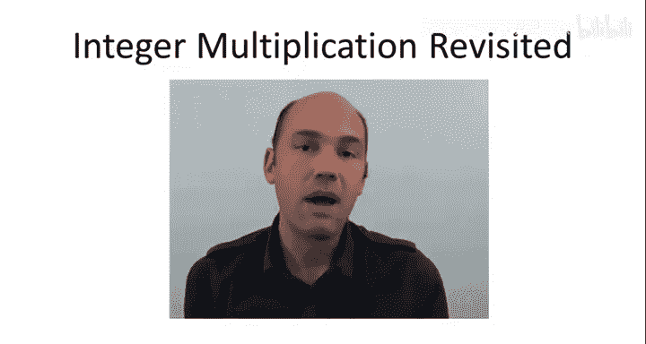
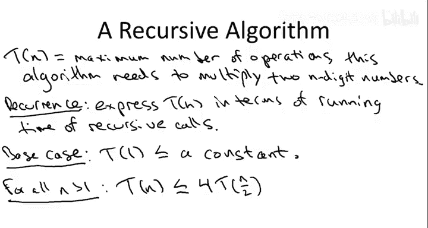

# 017：主方法入门 🧮

在本节课中，我们将学习**主方法**。这是一种用于分析分治算法运行时间的通用数学工具。我们将从介绍主方法的动机开始，然后给出其正式描述，并通过六个示例进行讲解。最后，我们将用三节课的时间讨论主方法的证明，特别强调其三种情况的概念性解释。

需要说明的是，本节课的内容比前两节课更具数学性。但这并非为了数学而数学，我们的努力将换来一个强大的工具——**主方法**。它具有很强的预测能力，能为我们提供关于哪些分治算法可能运行得更快、哪些可能更慢的指导。事实上，一个新的算法思想通常需要数学分析来正确评估，本节课就是这一普遍现象的一个例证。

## 动机：整数乘法问题

作为引入主方法的动机，我们考虑计算两个n位数相乘的问题。在第一组课程中我们回顾过，我们都学过迭代式的小学乘法算法，它所需的基本操作（单数字的加法和乘法）数量随着位数n呈**二次方**增长。

另一方面，我们也讨论了一种使用分治范式的有趣递归方法。分治法需要识别更小的子问题。对于整数乘法，我们需要识别更小的数字进行相乘。因此，我们采用了一种显而易见的方式：将两个数字各自拆分为左半部分和右半部分的数字。

为方便起见，我们假设位数n是偶数，但这实际上并不重要。以这种方式分解X和Y后，我们可以展开乘积并观察结果。

让我们把这个表达式框起来，称之为**星号表达式**。

我们最初从一个简单的递归算法开始，即直接计算星号表达式。也就是说，星号表达式包含了四个涉及n/2位数的乘积：AC、AD、BC和BD。因此，我们进行四次递归调用来计算它们，然后以自然的方式完成计算：根据需要补零，并将这三个项相加得到最终结果。

## 递归算法的运行时间分析：递推关系

我们分析此类递归算法运行时间的方法是使用所谓的**递推关系**。为了引入递推关系，首先让我定义一些符号：**T(n)**。这是我们真正关心的量，我们想要上界的量。即，这是该递归算法在最坏情况下相乘两个n位数所需的操作数。这正是我们想要上界的量。

递推关系则是一种用**T(更小的数)** 来表达**T(n)** 的方式，即用递归调用所做的工作来表达算法的运行时间。

每个递推关系都有两个组成部分：
1.  **基本情况**：描述没有进一步递归时的运行时间。在这个整数乘法算法中，像大多数分治算法一样，基本情况很简单：当输入足够小（此处为两个一位数）时，运行时间只是常数。你只需将两个数字相乘并返回结果。我将其表示为：**T(1) ≤ 某个常数**。我不打算具体说明这个常数是多少，你可以认为是1或2，这对后续分析没有影响。
2.  **一般情况**：这是重要的部分，描述当不在基本情况中、需要进行递归调用时的情况。你只需将运行时间写成两部分：递归调用所做的工作，以及递归调用之外、当前步骤所做的工作。

在这个递归整数乘法算法中，递推关系应该是显而易见的。正如我们所讨论的，恰好有四次递归调用，每次调用处理一对n/2位数。这给出了**4 * T(n/2)**。在递归调用之外，我们做了什么？我们将递归调用的结果补上一些零，然后将它们相加。可以验证，小学加法算法实际上运行时间与位数成线性关系。因此，递归调用之外所做的工作总量是线性的，即**O(n)**。

综合起来，我们得到该算法的递推关系：
*   基本情况：**T(1) ≤ c** (c为常数)
*   一般情况：**T(n) ≤ 4T(n/2) + O(n)**

## 更聪明的递归算法：高斯方法

现在，让我们转向第二个更聪明的整数乘法递归算法，其思想可追溯至高斯。高斯的洞见在于认识到，在我们试图计算的星号表达式中，我们真正关心的基本量只有三个：表达式中三个项的系数。这让我们希望，也许我们可以只用**三次**递归调用来计算这三个量，而不是四次。事实上，我们可以做到。

我们的做法是：
1.  像之前一样递归计算 **A * C**。
2.  像之前一样递归计算 **B * D**。
3.  计算 **(A + B) * (C + D)**。

一个非常巧妙的事实是：如果我们给这三个乘积编号为1、2、3，那么我们关心的最终量——10^(n/2)项的系数，即 **AD + BC**——恰好等于**第三个乘积减去第一个再减去第二个**。

这就是新的算法。那么新的递推关系是什么？基本情况显然和之前完全相同。所以问题在于，一般情况如何变化？

以下是几个要点：
*   唯一的变化是递归调用的数量从**4次**减少到了**3次**。
*   当我们说每次递归调用处理n/2位数时，这里有一点不严谨：计算A+B和C+D时，结果可能具有n/2+1位。但作为近似，我们仍然称之为n/2位，这个额外的+1在最终分析中不会产生影响。
*   我忽略了递归调用之外线性工作的具体常数因子。实际上，在高斯算法中，这个常数因子比朴素的四次递归调用算法要大一些，但它只是一个常数因子，在大O表示法中会被忽略。

因此，高斯算法的递推关系为：
*   基本情况：**T(1) ≤ c**
*   一般情况：**T(n) ≤ 3T(n/2) + O(n)**

## 递推关系的比较

让我们看看这个递推关系，并将其与另外两个递推关系进行比较：一个更大，一个更小。

首先，正如我们注意到的，它与朴素递归算法的递推关系不同之处在于少了一次递归调用。虽然我们不知道这两种递归算法的具体运行时间，但我们可以确信，这个（高斯算法）肯定只会更好。

另一个对比点是**归并排序**。想想归并排序算法的递推关系会是什么样子。它几乎与此相同，只是把**3**换成了**2**。归并排序进行两次递归调用，每次处理一半大小的数组，在递归调用之外进行线性工作（即合并子程序）。我们知道归并排序的运行时间是**O(n log n)**。所以高斯算法会比归并排序差，但我们不知道差多少。

因此，虽然我们对这个算法的运行时间可能比某个值大还是小有一些线索，但老实说，我们目前**并不知道**高斯递归整数乘法算法的运行时间到底是什么。这并不明显，我们目前对此没有直觉，也不知道这个递推关系的解是什么。但它将是接下来我们要解决的通用**主方法**的一个特例。

---

**本节课总结**：在本节课中，我们一起学习了引入**主方法**的动机。我们以整数乘法问题为例，回顾了分治算法的思想，并学习了如何用**递推关系**来描述递归算法的运行时间。我们比较了朴素递归算法和高斯改进算法的递推关系，并指出目前尚无法直接求解这些递推关系，这引出了对通用分析工具——主方法的需求。在接下来的课程中，我们将正式学习主方法。