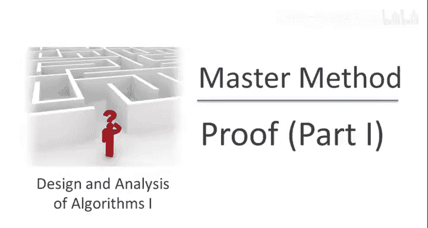
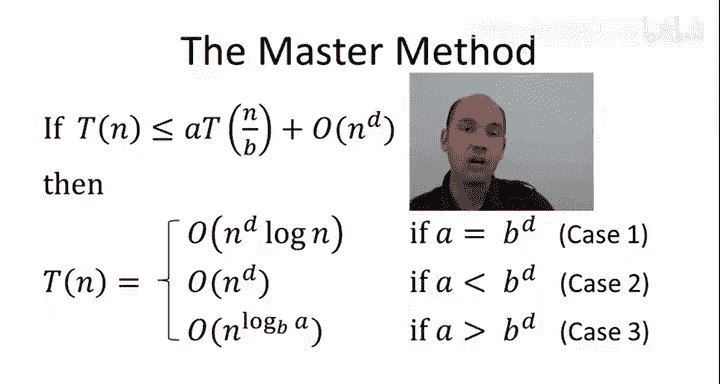
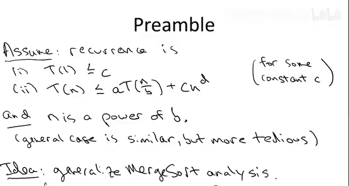
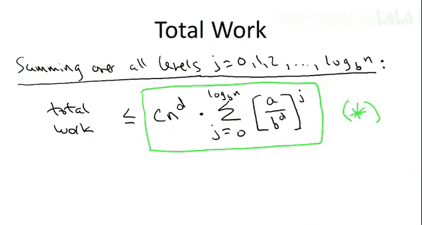

# 020：主定理证明（第一部分）

## 概述

在本节中，我们将开始学习主定理的证明过程。主定理为特定形式的递归关系提供了通用解法。我们将通过递归树的方法，逐步分析递归算法的运行时间，并理解主定理三种情况背后的概念。

---

## 主定理回顾

上一节我们介绍了主定理的基本形式。主定理适用于以下形式的递归关系：

**T(n) ≤ a * T(n/b) + O(n^d)**

其中：
- **a** 表示递归调用的次数。
- **b** 表示每次递归调用时问题规模缩小的因子。
- **d** 表示算法在递归调用之外所做工作的指数。

主定理的解决方案分为三种情况，具体取决于 **a** 与 **b^d** 的比较关系。

---

## 证明概述

本次证明将是我们目前遇到的最长证明，跨越本视频及后续两个视频。证明的核心是概念性的，我们将通过递归树的方法进行分析，类似于归并排序的运行时间分析。

证明的关键在于理解主定理三种情况对应的三种不同类型的递归树。记住这些概念后，您将无需死记硬背任何运行时间公式，包括第三种情况中较为复杂的公式。

在开始证明之前，我们做出以下简化假设，以便分析更加清晰。

---

## 简化假设

首先，我们假设递归关系具有以下形式：

**T(n) ≤ a * T(n/b) + C * n^d**

这里，我们明确写出了所有常数。我们假设基本情况在输入规模为1时触发，且基本情况的运算次数最多为C。这个常数C与递归关系一般情况中的大O符号所隐藏的常数相同。

其次，我们假设 **n** 是 **b** 的幂。一般情况的分析基本相同，只是稍微繁琐一些。

---

## 递归树方法

在最高层次上，主定理的证明方法应该让您感到非常自然。我们只需回顾归并排序的分析方法，并尝试将其推广到一般情况。

以下是递归树的基本结构：

- 第0层（根节点）对应最外层的递归调用，输入规模为 **n**。
- 第1层对应第一批递归调用。
- 第2层对应第一批递归调用所进行的递归调用，依此类推，直到树的叶子节点，对应基本情况，不再进行递归。

在归并排序分析中，我们识别出了一个关键模式：在给定的深度 **j**，我们需要知道该层有多少个不同的子问题，以及每个子问题的输入规模是多少。

以下是关于递归树层级的关键信息：

- 在第 **j** 层，有 **a^j** 个子问题。
- 每个子问题的输入规模为 **n / b^j**。

这是因为每次递归调用会产生 **a** 个新的子问题，且每次递归调用将输入规模缩小 **b** 倍。因此，经过 **j** 层递归后，子问题数量增加为 **a^j**，输入规模缩小为 **n / b^j**。

递归树的总层数为 **log_b(n) + 1**，从第0层到第 **log_b(n)** 层。

---

## 计算每层的工作量

现在，我们模仿归并排序的分析方法，计算递归树中每一层的工作量。具体步骤如下：

1. 聚焦于特定层 **j**。
2. 计算该层所有子问题的工作量总和，不包括后续递归调用所做的工作。

首先，第 **j** 层的子问题数量为 **a^j**。

其次，每个子问题的输入规模为 **n / b^j**。根据递归关系，每个子问题在递归调用之外所做的工作量不超过 **C * (n / b^j)^d**。

因此，第 **j** 层的总工作量可以计算为：

**工作量(j) = (a^j) * [C * (n / b^j)^d]**

简化这个表达式，我们可以将其重写为：

**工作量(j) = C * n^d * (a / b^d)^j**

这里，我们首次看到了 **a** 与 **b^d** 的比值，这提示我们这两个量的相对大小可能在分析中起到关键作用。

---

## 计算总工作量

为了计算算法的总工作量，我们需要将每一层的工作量相加。总工作量可以表示为：

**总工作量 = Σ [工作量(j)]，其中 j 从 0 到 log_b(n)**

代入工作量表达式，我们得到：

**总工作量 = C * n^d * Σ [(a / b^d)^j]，其中 j 从 0 到 log_b(n)**

这个表达式虽然看起来复杂，但它包含了主定理证明的关键信息。后续的证明将致力于解释和理解这个表达式，并展示它如何导致三种不同情况下的运行时间界限。

---

## 总结

在本节中，我们开始了主定理的证明。我们通过递归树的方法，分析了递归算法的运行时间，并推导出了总工作量的关键表达式。下一节中，我们将进一步解释这个表达式，并探讨它如何对应主定理的三种情况。记住，理解递归树的概念比死记硬背公式更为重要。