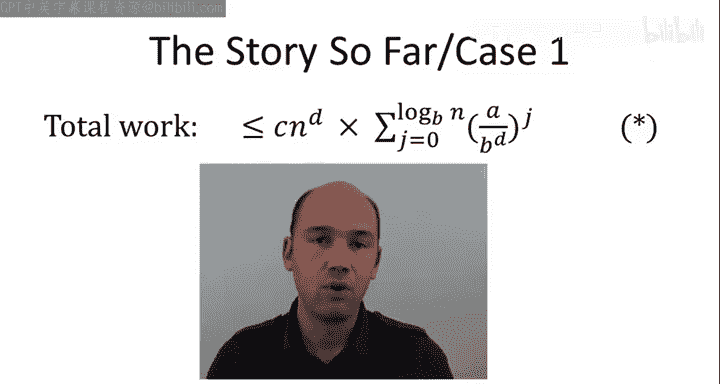
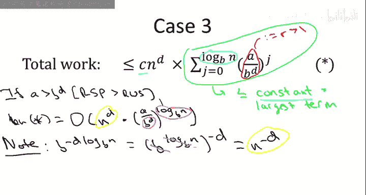
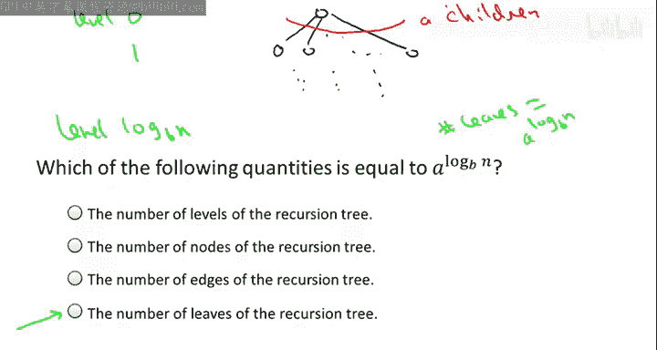

# 022：主定理证明（第二部分）📚

在本节课中，我们将完成主定理的证明。我们将把之前视频中建立的直观理解，转化为一个严谨的数学证明。我们将逐一验证主定理的三种情况，并最终理解第三种情况中那个看似复杂的表达式。

## 回顾与目标

上一节我们通过递归树分析了递归算法的工作量，得到了一个核心表达式 **star**：

**star = C * n^d * Σ_{j=0}^{log_b(n)} (a / b^d)^j**

我们认识到，比值 **r = a / b^d** 决定了递归树的三种基本类型：
*   **r = 1**：每层工作量相同。
*   **r < 1**：工作量随层级递减。
*   **r > 1**：工作量随层级递增。

这为我们理解主定理的三种情况提供了直觉。本节的目标是将这种直觉转化为严格的证明。

## 情况一：完美平衡 ⚖️

首先，我们来看最简单的情况，即情况一。我们假设 **a = b^d**。

这意味着子问题增殖的速率与每个子问题工作量减少的速率恰好抵消，达到了完美的平衡。现在，让我们检查表达式 **star**。

当 **a = b^d** 时，比值 **r = a / b^d = 1**。因此，对于所有的 **j**，**(a / b^d)^j = 1^j = 1**。

于是，求和部分变得非常简单：

**Σ_{j=0}^{log_b(n)} 1 = log_b(n) + 1**

将这个结果代入 **star** 表达式，我们得到：

**star = C * n^d * (log_b(n) + 1)**

用大O记法表示，我们可以写作 **O(n^d log n)**。这里我们省略了对数的底数，因为不同底数的对数只相差一个常数因子，这个常数可以被大O记法中的隐藏常数吸收。

至此，情况一的证明完成。这是最简单的情况。

## 几何级数引理 📈

当 **a ≠ b^d** 时（即 **r ≠ 1**），我们需要处理一个几何级数的求和。为此，我们先做一个简短的数学引理。

考虑一个常数 **r > 0** 且 **r ≠ 1**。我们要求和：

**S = 1 + r + r^2 + ... + r^k**

这个和有一个简洁的封闭形式公式：

**S = (r^{k+1} - 1) / (r - 1)**

这个公式可以通过数学归纳法证明，我们在此将其留作练习。我们更关心的是这个公式能为我们带来什么洞见。

以下是两个关键的推论：
1.  当 **r < 1** 时，这个和 **S** 可以被一个常数上界所限制，即 **S ≤ 1 / (1 - r)**。这个常数与求和的项数 **k** 无关。直观上，当 **r=1/2** 时，级数 `1 + 1/2 + 1/4 + ...` 收敛于 2。这意味着级数的首项（1）主导了整个和。
2.  当 **r > 1** 时，这个和 **S** 可以被最后一项的常数倍所限制，即 **S ≤ 常数 * r^k**。直观上，当 **r=2** 时，级数 `1 + 2 + 4 + ... + 2^k` 的和总是小于 `2 * 2^k`。这意味着级数的最大项（最后一项）主导了整个和。

总结来说：**当我们对一个常数 r 的幂次求和时，若 r>1，则最大项主导总和；若 r<1，则总和本身是一个常数。**

## 情况二：工作量递减 📉

现在，我们应用几何级数的知识来证明情况二。在情况二中，我们假设 **a < b^d**。

这意味着子问题增殖的速率被每个子问题工作量减少的速率所淹没。这是工作量随递归树层级递减的情况。我们的直觉是，所有工作量（在一个常数因子内）都集中在根节点完成。

由于 **a < b^d**，比值 **r = a / b^d < 1**。**r** 是一个常数（依赖于 a, b, d，但不依赖于 n）。

在表达式 **star** 中，求和部分正是 **Σ_{j=0}^{log_b(n)} r^j**，其中 **r < 1**。

根据几何级数引理，这样的和有一个常数上界（与项数 **log_b(n)** 无关）。因此，表达式 **star** 可以简化为：

**star = C * n^d * O(1) = O(n^d)**

这精确地证实了我们的直觉：在这种工作量递减的递归树中，算法的总运行时间由根节点的工作量主导，其他层级的工作量只贡献一个常数因子。

## 情况三：工作量递增与叶子节点 🍃

最后，我们来看最具挑战性的情况三。我们假设 **a > b^d**。

这意味着子问题增殖的速率超过了每个子问题工作量减少的速率。这是工作量随递归树层级递增的情况，大部分工作将在叶子节点完成。我们的直觉是，我们只需要关心叶子节点的工作量。

再次使用几何级数引理。此时 **r = a / b^d > 1**。求和 **Σ_{j=0}^{log_b(n)} r^j** 由它的最大项（即最后一项，当 **j = log_b(n)** 时）主导，最多相差一个常数因子。

因此，我们可以将 **star** 表达式简化为（用大O记法吸收常数 C 和来自几何级数的常数因子）：

**star = O( n^d * (a / b^d)^{log_b(n)} )**

这个表达式看起来很复杂，但我们可以进行惊人的简化。让我们专注于后半部分：

**(a / b^d)^{log_b(n)} = a^{log_b(n)} * (b^{-d})^{log_b(n)} = a^{log_b(n)} * b^{-d * log_b(n)}**

我们知道 **b^{log_b(n)} = n**，所以 **b^{-d * log_b(n)} = (b^{log_b(n)})^{-d} = n^{-d}**。

于是，**n^d * n^{-d}** 相互抵消！我们最终得到：

**star = O( a^{log_b(n)} )**

这个表达式 **a^{log_b(n)}** 有着非常自然的解释：**它正是递归树中叶子的数量！**

为什么？让我们思考递归树的结构：
*   在根节点（第0层），有1个节点。
*   每向下一层，节点数量乘以分支因子 **a**。
*   递归持续进行，直到问题规模缩小到1，这发生在第 **log_b(n)** 层。
*   因此，叶子节点的总数就是 **a^{log_b(n)}**。

这完美地证实了我们的直觉：在情况三中，算法的运行时间由叶子节点的工作量主导，即 **O(叶子节点数量)**。

然而，在主定理的标准陈述中，情况三的运行时间写作 **O(n^{log_b(a)})**。这两个表达式其实是等价的，因为：

**a^{log_b(n)} = n^{log_b(a)}**

你可以通过对两边取以 **b** 为底的对数来验证这一点。虽然 **a^{log_b(n)}** 在概念上（叶子数量）更直观，但 **n^{log_b(a)}** 在实际应用（代入 a, b 的具体数值计算）时更为方便。

无论如何，我们已经证明了情况三。至此，主定理的证明全部完成！🎉

## 总结与核心要点 🎯

本节课我们一起完成了主定理的证明。虽然证明细节繁多，但有几个高层次的概念要点值得长期记忆：

1.  **递归树分析**：我们从递归树出发，逐层累计算法的工作量，得到了一个通用表达式。
2.  **三种树型**：我们认识到递归树有三种基本类型（工作量恒定、递增、递减），这直接对应主定理的三种情况。
3.  **运行时间直觉**：
    *   **情况一 (a = b^d)**：每层工作量相同，共有 **O(log n)** 层，每层做 **O(n^d)** 工作，总时间为 **O(n^d log n)**。
    *   **情况二 (a < b^d)**：工作量递减，根节点主导，总时间为 **O(n^d)**。
    *   **情况三 (a > b^d)**：工作量递增，叶子节点主导。叶子数量为 **a^{log_b(n)}**，等价于 **n^{log_b(a)}**，总时间为 **O(n^{log_b(a)})**。

记住这些核心概念，你就能深刻理解主定理为何成立，并能自信地应用它来分析递归算法的运行时间。