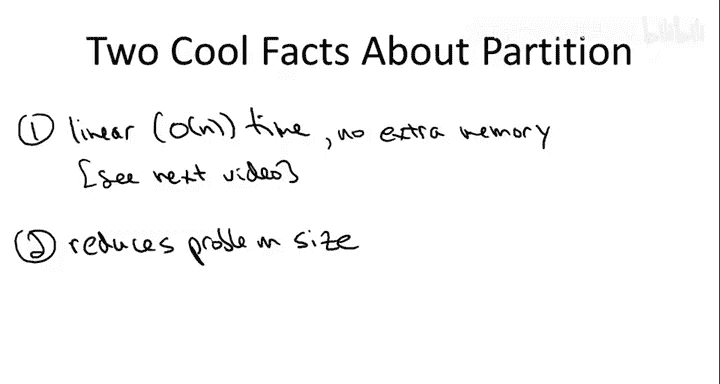
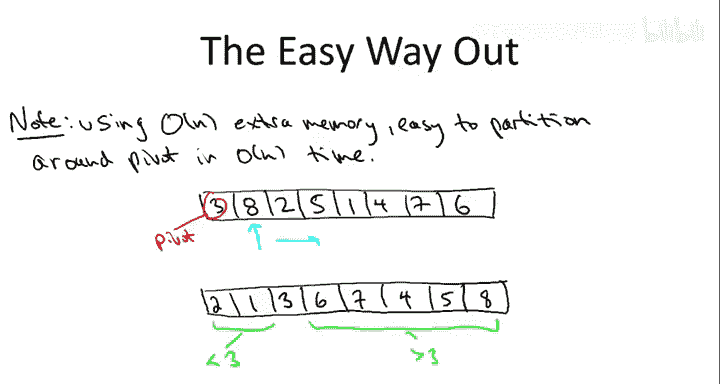
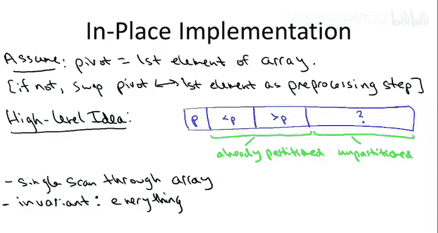
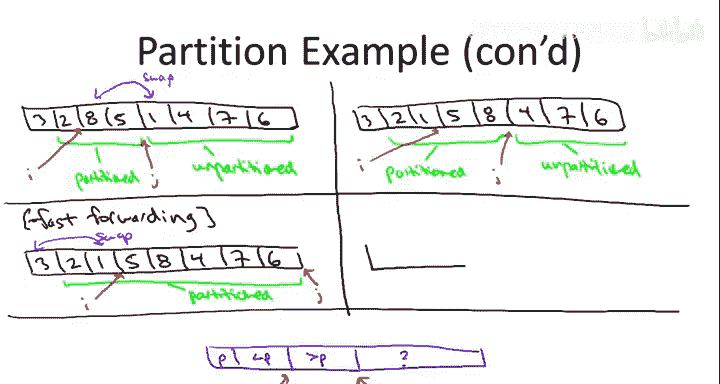
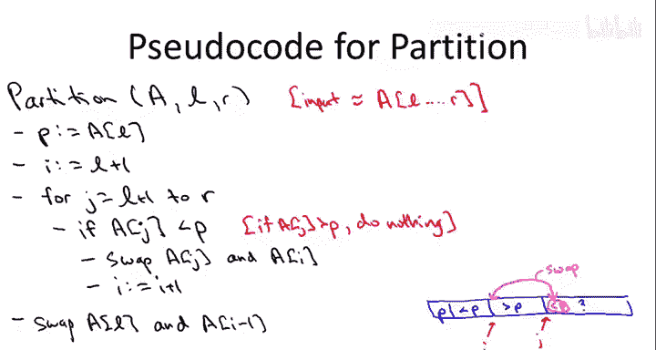

# 024：围绕基准元素进行分区 🎯


在本节课中，我们将深入学习快速排序算法的核心——分区子程序。我们将详细探讨如何围绕一个基准元素对数组进行重新排列，使其满足“基准左侧元素均小于基准，右侧元素均大于基准”的性质，并且我们将学习如何在线性时间内、仅使用常数级额外空间（原地操作）高效地实现这一过程。

## 分区子程序的目标



快速排序的关键思想是围绕一个基准元素对输入数组进行分区。这包含两个步骤：首先，选择一个基准元素；其次，重新排列数组以满足分区性质。

例如，给定数组 `[3, 8, 2, 5, 1, 4, 7, 6]`，我们选择第一个元素 `3` 作为基准。一个合法的分区结果可能是 `[2, 1, 3, 8, 5, 4, 7, 6]`。在这个结果中：
*   基准元素 `3` 位于其最终排序后的正确位置。
*   所有小于 `3` 的元素（`1`, `2`）都在其左侧。
*   所有大于 `3` 的元素（`4`, `5`, `6`, `7`, `8`）都在其右侧。



分区完成后，我们只需递归地对基准左侧和右侧的子数组进行排序即可。因此，实现一个高效的分区子程序至关重要。

## 简单的分区方法（使用额外空间）

如果我们不关心空间效率，允许使用额外的线性空间，那么实现分区会非常简单。



以下是其基本思路：
1.  创建一个与原数组等长的空数组 `B`。
2.  遍历原数组 `A`。
3.  对于每个元素 `A[i]`：
    *   如果 `A[i] < pivot`，则将其放入 `B` 的**左侧**（从左向右填充）。
    *   如果 `A[i] > pivot`，则将其放入 `B` 的**右侧**（从右向左填充）。
4.  遍历完成后，将基准元素 `pivot` 放入 `B` 中剩余的空位。

这种方法的时间复杂度是 **O(n)**，但空间复杂度也是 **O(n)**，因为它需要一个额外的数组。

## 高效的原位分区方法

上一节我们介绍了使用额外空间的简单方法，本节中我们来看看如何在不使用额外数组的情况下，仅通过交换操作在线性时间内完成分区。我们将假设基准元素是数组的第一个元素（这可以通过一次常数时间的交换操作实现）。

算法的核心思想是**在单次线性扫描中维护一个不变式**。我们使用两个指针 `i` 和 `j`：
*   `j`：指向当前扫描到的元素，是“已处理”和“未处理”区域的分界。
*   `i`：指向“已处理区域”内，**最后一个小于基准的元素**的下一个位置。换句话说，`A[l+1...i-1]` 都是小于基准的，`A[i...j-1]` 都是大于基准的。


初始状态时，`i = j = l+1`（`l` 是子数组左边界，基准在 `A[l]`）。我们通过一个 `for` 循环让 `j` 从 `l+1` 遍历到 `r`（右边界）。

在每一步，我们检查新元素 `A[j]`：
*   **情况1：`A[j] > pivot`**。这很简单，我们只需将 `j` 加1，扩大“大于基准”的区域。`i` 保持不变。
*   **情况2：`A[j] < pivot`**。这破坏了不变式，因为一个小于基准的元素出现在了“大于基准”的区域之后。为了修复，我们需要：
    1.  将 `A[j]` 与 `A[i]`（即“大于基准”区域的第一个元素）交换。
    2.  将 `i` 加1，因为现在“小于基准”的区域扩大了一个位置。
    3.  将 `j` 加1。

扫描完成后，数组结构为：`[pivot, <pivot的元素们, >pivot的元素们]`。最后，我们将基准 `A[l]` 与 `A[i-1]`（即最后一个小于基准的元素）交换，基准就到达了其最终的正确位置。

### 算法示例

让我们通过一个具体例子来演示上述过程。数组为 `A = [3, 8, 2, 5, 1, 4, 7, 6]`，基准 `pivot = 3`。



以下是每一步的状态（`|` 表示 `i` 和 `j` 的位置）：
1.  初始：`[3, |8, 2, 5, 1, 4, 7, 6]`，`i=j=1`
2.  `j=1, A[j]=8 > 3`：无事发生，`j++`。`[3, 8, |2, 5, 1, 4, 7, 6]`，`i=1`
3.  `j=2, A[j]=2 < 3`：交换 `A[j]`(2) 和 `A[i]`(8)，`i++`, `j++`。`[3, 2, 8, |5, 1, 4, 7, 6]`，`i=2`
4.  `j=3, A[j]=5 > 3`：`j++`。`[3, 2, 8, 5, |1, 4, 7, 6]`，`i=2`
5.  `j=4, A[j]=1 < 3`：交换 `A[j]`(1) 和 `A[i]`(8)，`i++`, `j++`。`[3, 2, 1, 5, 8, |4, 7, 6]`，`i=3`
6.  `j=5,6,7`：`A[j]=4,7,6` 均 `> 3`，仅 `j++`。
7.  循环结束：`[3, 2, 1, 5, 8, 4, 7, 6]`，`i=3`。
8.  最后交换：交换 `A[l]`(3) 和 `A[i-1]`(1)。得到：`[1, 2, 3, 5, 8, 4, 7, 6]`。✅ 分区完成。

## 分区子程序的伪代码

理解了算法流程后，我们现在可以给出清晰的形式化描述。以下是分区子程序的伪代码：

```pseudocode
function Partition(A, l, r):
    // 输入：数组 A，左右边界 l, r
    // 输出：基准元素的最终位置索引
    pivot = A[l]          // 选择第一个元素作为基准
    i = l + 1             // i 指向小于基准区域的末尾下一个位置

    for j = l+1 to r do:  // j 遍历整个子数组
        if A[j] < pivot then:
            // 交换 A[j] 和 A[i]，将小的元素移到前面
            swap(A[j], A[i])
            i = i + 1     // 小于基准的区域扩大
        // 如果 A[j] >= pivot，则什么都不做，j 会在循环中自增
    end for

    // 将基准元素交换到正确位置（即 i-1 处）
    swap(A[l], A[i-1])
    return i-1            // 返回基准的最终位置，用于后续递归
```

## 算法分析

现在我们来分析一下这个分区算法的性能。



*   **时间复杂度**：算法只包含一个从 `l+1` 到 `r` 的 `for` 循环，循环内执行常数时间的比较和可能的交换操作。因此，对于长度为 `n = r - l + 1` 的子数组，时间复杂度为 **Θ(n)**。
*   **空间复杂度**：算法只使用了几个额外的变量（`pivot`, `i`, `j`），没有分配任何与输入规模成比例的额外数组。因此，它是一个**原地**算法，空间复杂度为 **O(1)**。
*   **正确性**：算法的正确性可以通过我们之前讨论的**循环不变式**来严格证明：
    *   **不变式**：在 `for` 循环的每次迭代开始时，对于任意索引 `k`：
        *   如果 `l < k < i`，则 `A[k] < pivot`。
        *   如果 `i ≤ k < j`，则 `A[k] ≥ pivot`。
    *   这个不变式在循环开始时（`i=j=l+1`，两个区域为空）显然成立。
    *   在循环的每一步，无论是 `A[j] ≥ pivot`（仅 `j++`）还是 `A[j] < pivot`（交换后 `i++, j++`），都能维持这个不变式。
    *   循环结束时（`j = r+1`），整个数组 `A[l+1...r]` 被划分为 `< pivot` 和 `≥ pivot` 两部分。最后将 `A[l]`（基准）与 `A[i-1]` 交换，就得到了完整的分区结果。


## 总结

本节课中我们一起学习了快速排序算法的核心——分区子程序。我们首先明确了分区的目标，即围绕基准元素重排数组。接着，我们对比了使用额外空间的简单方法。然后，我们深入探讨了高效的原位分区算法，该算法通过维护 `i` 和 `j` 两个指针，在一次线性扫描中完成所有工作。我们通过详细的示例演示了算法的执行过程，并给出了正式的伪代码。最后，我们分析了该算法在线性时间复杂度和常数空间复杂度上的优异性能，并通过循环不变式论证了其正确性。


掌握这个高效的分区方法是理解快速排序后续内容（如基准选择策略、算法复杂度分析）的重要基础。在接下来的课程中，我们将探讨如何选择基准元素，以及不同的选择策略如何影响快速排序的整体效率。