# 030：概率回顾（上）🎲

## 概述

在本节课中，我们将回顾概率论中的几个核心概念，这些概念对于理解随机化算法的分析至关重要。我们将从样本空间和事件开始，然后讨论随机变量、期望值，以及一个极其重要的性质——期望的线性性。最后，我们将通过一个负载均衡的例子，将这些概念串联起来。

---

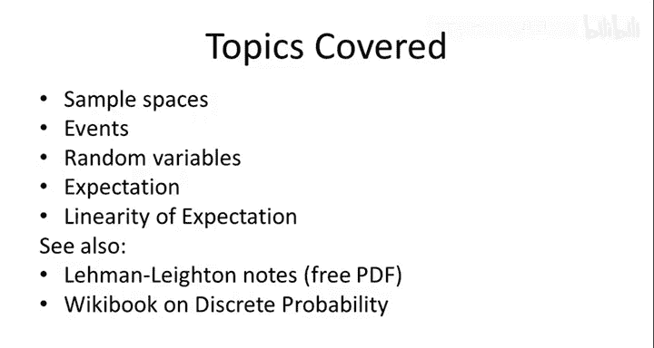

## 样本空间

上一节我们介绍了课程背景，本节中我们来看看概率论的基础——样本空间。

样本空间是我们分析随机过程时，所有可能发生结果的集合。它定义了我们将要讨论概率和平均值的“宇宙”。我们通常用符号 **Ω** 表示样本空间。

在算法设计中，我们通常可以将 Ω 视为一个有限集，这就是我们只处理离散概率的原因，这比更一般的概率论要简单得多。

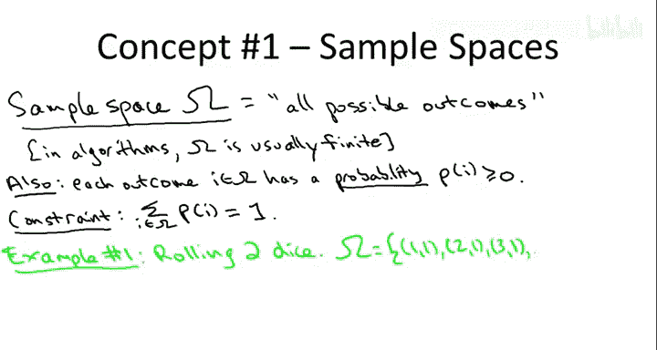

除了定义所有可能的结果，我们还需要定义每个结果发生的概率。每个结果的概率应至少为零（非负），并且所有结果的概率之和必须为一，因为最终恰好会发生一件事。

为了更具体地理解这些抽象概念，我们将使用两个简单的例子：

*   **例子一：掷两个六面骰子**。样本空间是这两个骰子所有可能结果的组合，共 36 种。假设骰子质地均匀，则每个结果出现的概率相等，均为 **1/36**。
*   **例子二：快速排序的随机主元选择**。我们只关注快速排序最外层调用中随机选择主元的过程。假设数组长度为 **n**，那么样本空间就是所有可能的 **n** 个主元选择（对应数组索引 1 到 n）。根据算法定义，每个主元被选中的概率相等，均为 **1/n**。

---

## 事件

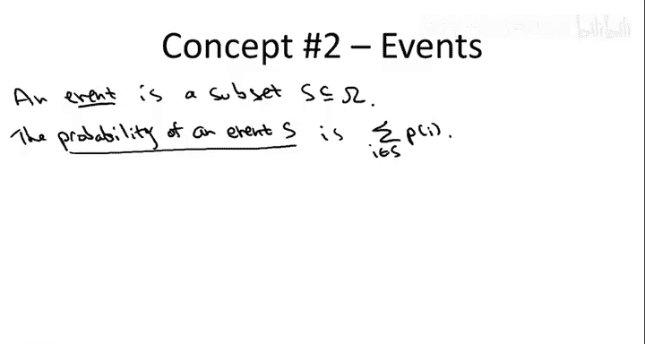

上一节我们定义了样本空间，本节中我们来看看事件。

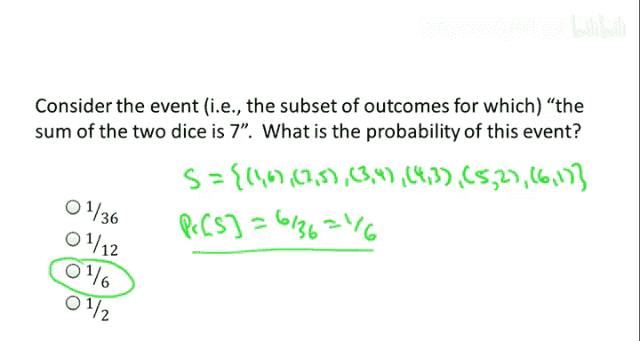

事件无非是样本空间 Ω 的一个子集，即所有可能发生结果的一部分。事件的概率就是该事件包含的所有结果的概率之和。

以下是两个练习，帮助你熟悉这些概念，特别是计算我们两个例子中的事件概率。

**练习一：掷两个骰子**
考虑“两个骰子点数之和等于 7”这个事件。其概率是多少？

**答案：1/6**

**解释：**
该事件包含以下 6 个结果：(1,6), (2,5), (3,4), (4,3), (5,2), (6,1)。每个结果的概率为 1/36，因此事件概率为 6 * (1/36) = 1/6。

**练习二：快速排序的随机主元**
在快速排序最外层调用中，随机选择一个主元。我们希望得到一个“合理”的划分，即划分后的两个子数组大小都至少是原数组的 25%（即 25-75 划分或更好）。随机选择的主元满足此条件的概率是多少？

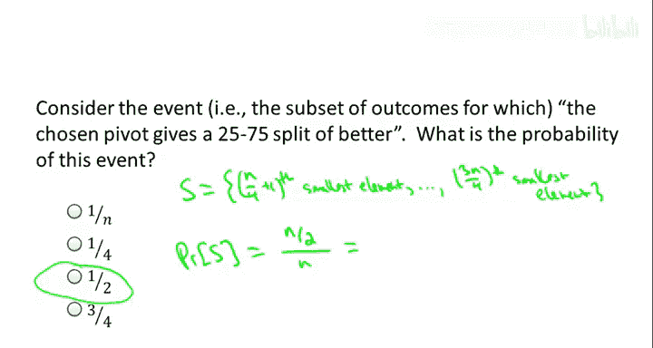

**答案：1/2**

**解释：**
我们希望主元既不在最小的 25% 元素中，也不在最大的 25% 元素中。换句话说，主元需要来自中间 50% 的元素。在 n 个均匀随机的选择中，满足条件的数量约为 n/2。因此，概率为 (n/2) / n = 1/2。

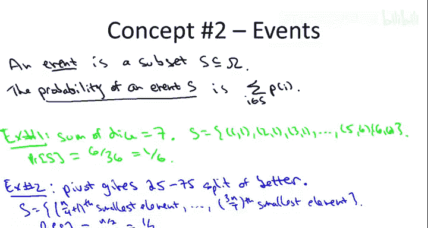

---

## 随机变量

上一节我们讨论了事件及其概率，本节中我们来看看随机变量。

随机变量本质上是衡量随机结果某种统计量的函数。形式上，它是定义在样本空间 Ω 上的实值函数。给定一个随机结果（即一个具体的“世界状态”），它会输出一个数值。

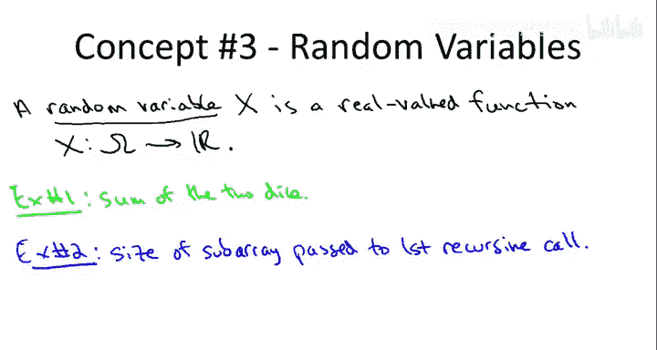

在算法设计中，我们最常关心的随机变量是随机化算法的运行时间。例如，在快速排序算法中，运行时间就是一个随机变量：如果我们知道代码所有随机选择（如抛硬币）的结果，就能确定一个具体的运行时间（例如多少毫秒）。

以下是我们在两个例子中定义的随机变量：

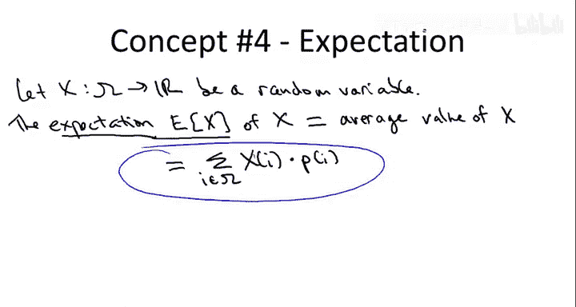

*   **掷两个骰子**：一个简单的随机变量是输入两个骰子的结果，输出它们的点数之和。这个随机变量可以取 2 到 12 之间的整数值。
*   **快速排序的随机主元**：考虑一个随机变量，它表示传递给第一个递归调用的子数组的大小（即元素个数）。等价地，它是输入数组中小于随机选择的主元的元素数量。这个随机变量可以取 0（选择最小元素）到 n-1（选择最大元素）之间的整数值。

---

## 期望值

上一节我们引入了随机变量，本节中我们来看看它的一个核心特征——期望值。

随机变量的期望值就是它的平均值，并且是按照各种可能结果的概率进行加权后的平均值。

考虑一个随机变量 **X**。它的期望值（也称预期值）记作 **E[X]**。数学上，它定义为对所有可能结果 i 求和：`E[X] = Σ_i (X(i) * P(i))`，其中 X(i) 是结果 i 发生时 X 的值，P(i) 是结果 i 发生的概率。

以下是两个练习，要求你计算上一节定义的两个随机变量的期望值。

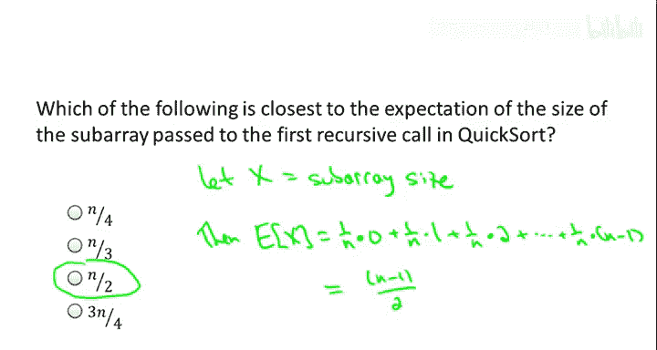

**练习三：两个骰子点数之和的期望值**
两个骰子点数之和的平均值（期望值）是多少？

**答案：7**

**解释：**
有多种方法计算。最直接的是利用期望的线性性（下一节概念）。也可以暴力枚举所有 36 种结果并求和，或者利用对称性配对（如和为2与和为12的概率相同，平均为7等）。最终结果是 7。

**练习四：快速排序递归调用子数组大小的期望值**
在快速排序最外层调用中，传递给第一个递归调用的子数组的平均大小（期望值）是多少？等价地，平均有多少个元素小于随机选择的主元？

**答案：(n-1)/2**

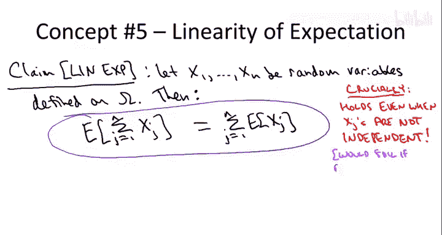

**解释：**
可以直接根据期望定义计算。设随机变量 X 为子数组大小。选择第 k 小的元素作为主元的概率是 1/n，此时子数组大小为 k-1。因此，期望值为：
`E[X] = Σ_{k=1}^{n} ( (k-1) * (1/n) ) = (0 + 1 + 2 + ... + (n-1)) / n = (n-1)/2`。
直观上，由于两个递归调用是对称的，它们总共包含 n-1 个元素，因此每个的期望大小约为一半。

---

## 期望的线性性

上一节我们定义了期望值，本节中我们来看看一个极其重要的性质——期望的线性性。

期望的线性性是一个非常简单但超级重要的性质，在分析随机化算法和随机过程中无处不在。

**定理（期望的线性性）：**
假设有一组定义在同一个样本空间上的随机变量 **X1, X2, ..., Xn**。那么，这些随机变量之和的期望值等于它们各自期望值的和。即：
`E[X1 + X2 + ... + Xn] = E[X1] + E[X2] + ... + E[Xn]`

这个性质之所以如此有用，是因为它**总是成立**，无论这些随机变量之间是否相互独立。这一点非常强大，因为对于乘积，如果没有独立性，类似的等式通常不成立。

**证明思路：**
证明非常简单，本质上只是交换求和顺序。从等式右边开始，写出每个期望的定义（对结果求和），然后交换两个求和的顺序，即可得到左边和的期望的定义。

**一个简单示例：**
回顾计算两个骰子点数之和的期望。定义 X1 为第一个骰子的点数，X2 为第二个骰子的点数。易知 `E[X1] = E[X2] = 3.5`。根据线性性，`E[X1+X2] = E[X1] + E[X2] = 3.5 + 3.5 = 7`。这比直接枚举 36 种结果要简单得多。

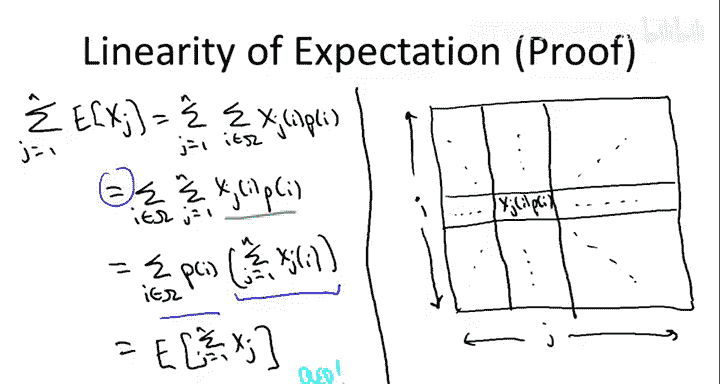

---

## 应用示例：负载均衡

现在，我们用一个负载均衡的例子来串联本节学到的所有概念。

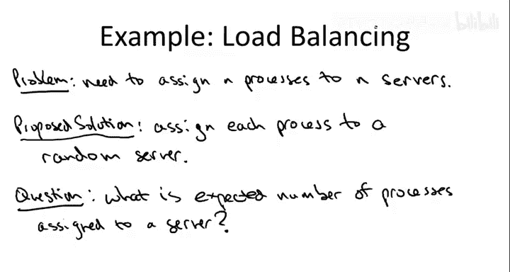

**问题描述：**
有 **n** 个计算进程需要分配到 **n** 台服务器上。我们采用一种极其“懒惰”的策略：将每个进程独立地、随机地分配到任意一台服务器，每台服务器被选中的概率均为 **1/n**。问题是：从平均（期望）来看，这种随机分配的策略效果如何？具体来说，一台服务器（比如第一台）的期望负载（即分配到的进程数）是多少？

**解决方案：**

1.  **定义样本空间**：每个进程有 n 种分配选择，因此总共有 **n^n** 种可能的分配结果。由于每个进程是均匀随机分配的，所以每种结果出现的概率相等，均为 **1/(n^n)**。

2.  **定义随机变量**：我们关心第一台服务器的负载。设随机变量 **Y** 为分配给第一台服务器的进程数量。

3.  **利用期望的线性性**：直接计算 Y 的期望需要枚举 n^n 种结果，不可行。我们引入**指示随机变量**。对于每个进程 j (1 ≤ j ≤ n)，定义：
    `Xj = 1`（如果进程 j 被分配到第一台服务器），否则 `Xj = 0`。
    显然，`Y = X1 + X2 + ... + Xn`。

4.  **计算单个指示变量的期望**：对于任意进程 j，它被分配到第一台服务器的概率是 **1/n**。因此，`E[Xj] = 0 * P(Xj=0) + 1 * P(Xj=1) = 1/n`。

5.  **应用线性性**：`E[Y] = E[X1] + E[X2] + ... + E[Xn] = n * (1/n) = 1`。

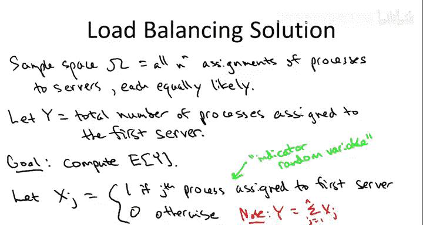

**结论：**
尽管分配策略是完全随机的，但平均来看，每台服务器的期望负载仅为 **1**。这表明，至少在期望意义上，这种简单的随机分配策略效率很高，每台服务器平均只承担一个进程。这体现了随机化在算法设计中的威力：通过简单的随机选择，往往能获得良好的平均性能。快速排序算法（通过随机选择主元获得高效平均性能）正是这一思想的典型代表。

---

## 总结

本节课我们一起回顾了概率论的几个基础概念：
1.  **样本空间**：所有可能结果的集合。
2.  **事件与概率**：样本空间的子集及其发生可能性。
3.  **随机变量**：将随机结果映射为实数的函数。
4.  **期望值**：随机变量的加权平均值。
5.  **期望的线性性**：和之期望等于期望之和，这是一个极其强大且常用的工具。

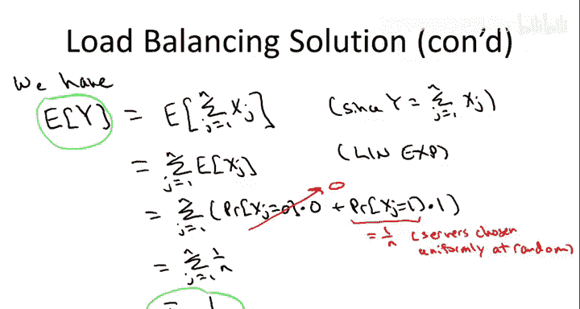

我们通过掷骰子和快速排序的例子理解了这些概念，并最终在负载均衡问题中应用它们，展示了随机化策略的平均效果分析。这些工具是分析随机化算法（如快速排序、随机最小割、哈希表性能）的基石。