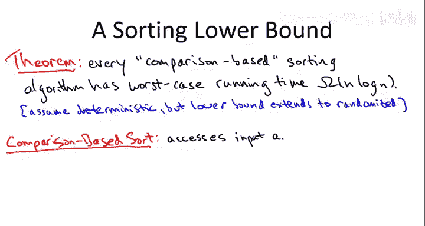
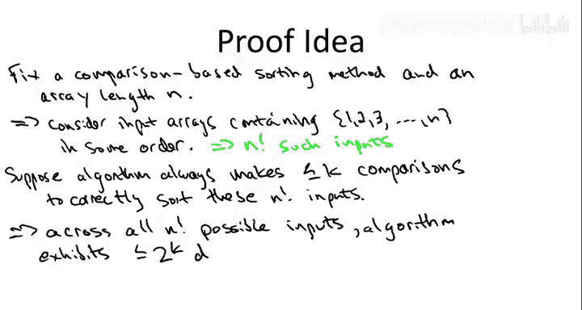
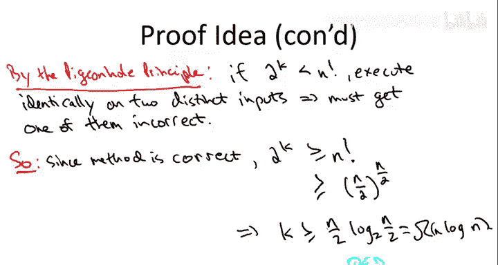

# 031：比较排序的Ω(n log n)下界

## 概述
在本节中，我们将探讨一个关于排序算法性能的根本性问题：我们能否设计出比 **O(n log n)** 更快的排序算法？我们将聚焦于**比较排序**这一特定算法类别，并证明其性能存在一个**下界**，即任何正确的比较排序算法在最坏情况下都需要至少 **Ω(n log n)** 次比较。这意味着像归并排序和快速排序这样的算法，在比较排序的范畴内，已经达到了理论上的最优效率。

## 什么是比较排序？
上一节我们介绍了排序算法的基本概念，本节中我们来看看一个重要的分类：比较排序。

比较排序算法是指那些**仅通过比较元素对**来访问输入数组中元素的算法。这类算法不直接操作单个元素的值，也不对数据的分布做任何假设。它们只关心元素之间的相对顺序，通过一个“比较”API来工作。你可以将其想象成一个通用排序函数，它接收一个用于比较抽象数据类型的函数指针。

以下是我们课程中讨论过的比较排序算法示例：
*   **归并排序**：仅通过比较和复制元素来工作。
*   **快速排序**：仅通过比较和交换元素来工作。
*   **堆排序**（后续会学到）：通过构建堆并提取最小元素来工作，也仅使用比较。

## 非比较排序示例
为了更清晰地理解比较排序的限制，我们来看几个**非比较排序**的例子。这些算法通过直接查看元素的值（而非仅比较）来工作，因此可以绕过 **n log n** 的下界，但通常需要对数据做出额外假设。

以下是几种著名的非比较排序算法：
*   **桶排序**：假设数据在某个区间（如[0,1]）上均匀分布。算法根据元素值将其分配到不同的“桶”中，然后对每个小桶单独排序。在理想分布下，其时间复杂度可达 **O(n)**。
*   **计数排序**：假设数据是范围有限的小整数（例如0到K，K=O(n)）。算法统计每个值出现的次数，然后直接按顺序输出。其时间复杂度为 **O(n + K)**。
*   **基数排序**：假设数据是整数。算法从最低位到最高位，逐位进行稳定排序（常以内层调用计数排序实现）。对于位数有限的整数，其时间复杂度也可达 **O(n)**。

总结来说，比较排序只能通过比较API访问数据，不能进行类似上述算法的“分桶”操作。当你可以对数据做出特定假设时，非比较排序可能更快。但如果你需要一个通用的、不依赖数据特性的排序程序，那么比较排序的 **n log n** 下界是无法避免的。

## Ω(n log n)下界证明
现在，我们来理解为什么任何正确的确定性比较排序算法在最坏情况下都需要 **Ω(n log n)** 次比较。我们将通过一个概念性的论证来阐明其核心思想。

我们考虑一个固定的比较排序算法，并专注于一个特定的输入长度 **n**。由于算法只关心顺序，我们可以假设输入数组是数字 **1 到 n** 的某种排列。总共有 **n!**（n的阶乘）种不同的可能输入。

设 **K** 是该算法在最坏情况下执行的比较次数。对于每一个输入，算法会产生一个由比较结果（是/否）组成的序列，长度不超过 **K**。因此，算法所有可能的执行路径最多有 **2^K** 种（每个比较有两种可能结果）。

**关键矛盾点**：如果 **2^K < n!**，即可能的执行路径数少于可能的输入数，那么根据**鸽巢原理**，至少有两个不同的输入会引导算法走完全相同的执行路径，得到完全相同的比较结果序列。对于算法而言，这两个输入是无法区分的。因此，如果算法能正确排序其中一个输入，它必然会对另一个输入输出错误的结果。这与算法的正确性矛盾。

由此，我们得出结论：**2^K ≥ n!**。

为了得到 **K** 的下界，我们对 **n!** 进行一个简单的下界估计：
`n! ≥ (n/2)^(n/2)`
取以2为底的对数：
`K ≥ log₂( (n/2)^(n/2) ) = (n/2) * log₂(n/2)`
这证明了 **K = Ω(n log n)**。因此，任何正确的确定性比较排序算法在最坏情况下都必须进行至少 **Ω(n log n)** 次比较。

## 总结
本节课中我们一起学习了比较排序算法的性能下界。我们首先明确了比较排序的定义，并将其与桶排序、计数排序等非比较排序进行了区分。随后，我们通过基于**鸽巢原理**和**执行路径分析**的论证，证明了任何正确的确定性比较排序算法在最坏情况下都需要 **Ω(n log n)** 次比较。这一重要结论意味着，像归并排序和堆排序（最坏情况 **O(n log n)**）以及快速排序（平均情况 **O(n log n)**）这样的算法，在比较排序的框架内已经达到了理论上的最优效率。