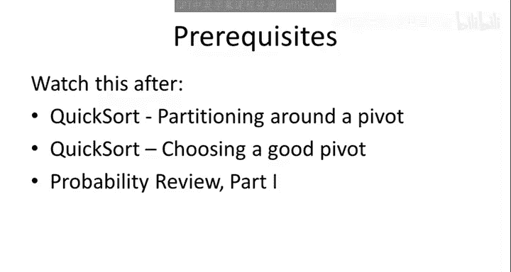
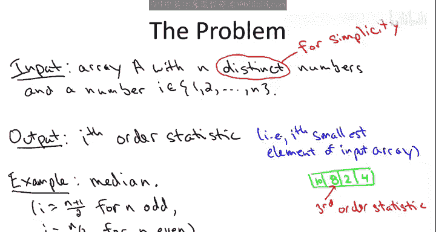
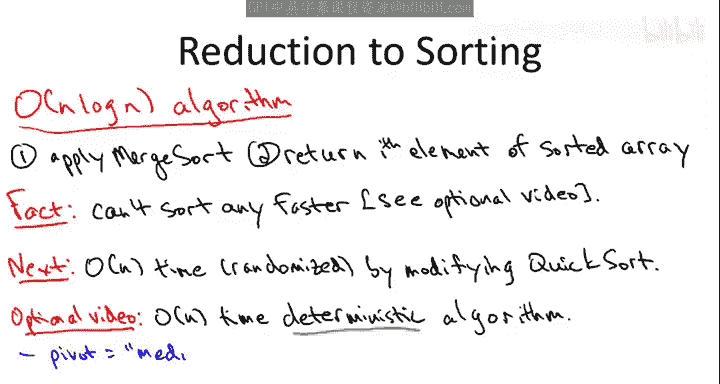
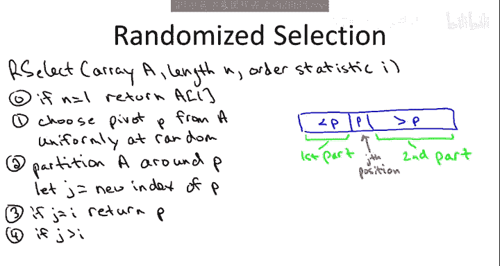
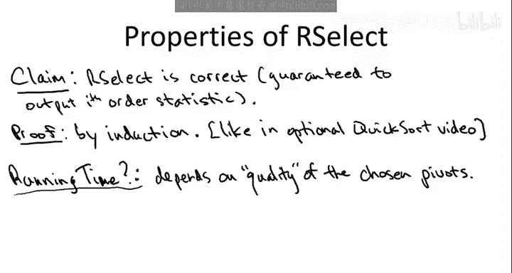
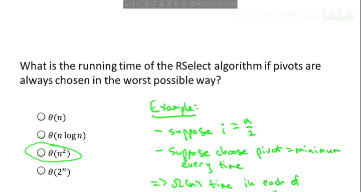
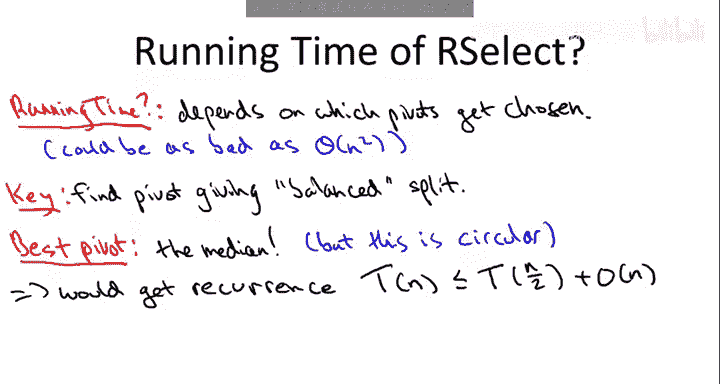
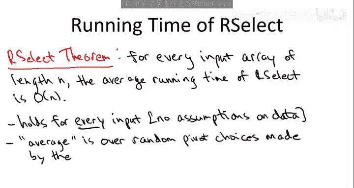

# 032：随机选择算法 🎲

在本节课中，我们将学习一个与排序紧密相关的重要问题：选择问题。我们将设计并分析一个极其实用的随机算法来解决它，并证明其期望运行时间是线性的，即对于长度为 `n` 的输入数组，运行时间为 `O(n)`。这与快速排序的 `O(n log n)` 期望运行时间形成对比。此外，我们还将探讨如何在不使用随机化的情况下，在线性时间内确定性地解决选择问题。

## 选择问题定义

选择问题的输入与排序问题相同：给定一个包含 `n` 个不同元素的数组。此外，还需要指定一个介于 `1` 和 `n` 之间的整数 `i`，表示要查找的顺序统计量。目标是输出数组中第 `i` 小的元素。



**公式定义**：
给定数组 `A` 和整数 `i`（`1 ≤ i ≤ n`），找到元素 `x`，使得恰好有 `i-1` 个元素小于 `x`。

例如，对于数组 `[10, 8, 2, 4]`，第三顺序统计量是 `8`。第一顺序统计量是最小值，第 `n` 顺序统计量是最大值。中位数是典型的选择问题，当 `n` 为奇数时，中位数是第 `(n+1)/2` 小的元素；当 `n` 为偶数时，通常取第 `n/2` 小的元素。

中位数比平均值更稳健，因为单个异常值会严重影响平均值，但对中位数影响很小。本教程假设数组元素互异，但算法可以轻松适配包含重复元素的情况。



## 现有解决方案：归约到排序

我们已有一个相当不错的算法来解决选择问题，它通过归约到排序问题来实现。

以下是该算法的两个简单步骤，其运行时间为 `O(n log n)`：
1.  对输入数组进行排序（例如使用归并排序）。
2.  返回排序后数组的第 `i` 个元素。

这展示了计算机科学中一个超级有用且基础的概念：**归约**。我们通过将选择问题归约到已知如何解决的排序问题，从而获得了 `O(n log n)` 的解决方案。

然而，优秀的算法设计师总会问：我们能做得更好吗？线性时间似乎是可能的目标，因为最坏情况下我们至少需要查看所有元素。但对于排序问题，我们有充分的理由满足于 `O(n log n)` 的时间上界。事实上，对于所谓的**比较排序**，你无法在平均或最坏情况下做得比 `O(n log n)` 更好（这将在可选视频中详细说明）。

因此，如果我们想为选择问题获得优于 `O(n log n)` 的通用算法，就必须证明选择在根本上比排序更容易，从而设计出线性时间算法。这正是我们接下来要做的。

## 随机选择算法设计

我们将展示选择确实比排序更简单，可以设计出线性时间算法。这个算法可以看作是快速排序范式的修改，同样是一个随机算法，其期望运行时间对于任何输入数组都是线性的。



对于排序，我们有像归并排序这样的确定性 `O(n log n)` 算法。那么选择是否有类似的不使用随机化的线性时间算法呢？答案是肯定的，但算法更复杂，因此不如随机算法实用。其核心思想是使用一种称为“中位数的中位数”的技巧来确定性选择主元。我们将在可选视频中讨论它。

**重要提示**：如果你要实际实现一个选择算法，应该使用本视频讨论的随机版本，因为它常数更小且是原地操作。

接下来，我们将开发如何修改快速排序范式来直接解决选择问题。

### 回顾分区子程序

与快速排序一样，分区子程序是我们选择算法的主力。它的输入是一个乱序数组，其任务比排序更简单：首先选择一个主元元素，然后重新排列数组，使得：
*   所有小于主元的元素都在其左侧（可以是乱序）。
*   所有大于主元的元素都在其右侧（可以是乱序）。

这会将主元放置在其在最终排序数组中应有的正确位置。对于快速排序，这使我们能够递归地对两个较小的子问题进行排序。

### 适应选择问题

现在，假设我们选择算法的第一步是选择一个主元并对数组进行分区。关键问题是：我们该如何递归？我们需要理解如何通过在一个较小规模的子问题中递归查找合适的顺序统计量，来找到原始输入数组的第 `i` 顺序统计量。

让我们通过一个具体例子来思考。假设有一个包含10个元素的数组，我们选择了一个主元，分区后主元位于第3的位置（即它是第三小的元素）。而我们原本要查找的是第五小的元素。

由于主元是第三小的元素，而我们要找的第五小的元素肯定比它大，因此目标元素必然位于主元的右侧。所以，我们应该在右侧子数组上递归。那么，在右侧子数组中我们要找的是第几小的元素呢？我们丢弃了主元及其左侧的所有元素（共3个），这些元素都小于目标元素。因此，在剩下的元素中，我们要找的就是第 `5 - 3 = 2` 小的元素。

### 随机选择算法描述

我们将这个算法称为 `RSelect`（随机选择）。

**算法输入**：
*   数组 `A`，长度为 `n`
*   整数 `i`，`1 ≤ i ≤ n`，表示要查找的顺序统计量



**算法步骤**：
1.  **基准情况**：如果 `n == 1`，则返回数组中唯一的元素。
2.  **选择主元**：从数组的 `n` 个元素中均匀随机地选择一个作为主元 `p`。
3.  **分区**：围绕主元 `p` 对数组进行分区。分区后，设：
    *   `j` = 主元 `p` 在分区后数组中的位置（即它是第 `j` 小的元素）。
    *   左子数组 `L` 包含所有小于 `p` 的元素。
    *   右子数组 `R` 包含所有大于 `p` 的元素。
4.  **递归选择**：
    *   如果 `j == i`，说明主元恰好就是我们要找的第 `i` 小元素，直接返回 `p`。
    *   如果 `j > i`，说明目标元素在左子数组 `L` 中。在 `L` 上递归调用 `RSelect`，查找第 `i` 小的元素。
    *   如果 `j < i`，说明目标元素在右子数组 `R` 中。在 `R` 上递归调用 `RSelect`，查找第 `i - j` 小的元素。

**代码框架**：
```python
def RSelect(A, i):
    n = len(A)
    if n == 1:
        return A[0]
    # 随机选择主元索引
    pivot_index = random.randint(0, n-1)
    p = A[pivot_index]
    # 分区操作，返回主元最终位置 j
    j = partition(A, p) # partition 函数需实现标准分区逻辑
    if j == i:
        return p
    elif j > i:
        return RSelect(A[:j], i) # 递归左子数组
    else: # j < i
        return RSelect(A[j+1:], i - j) # 递归右子数组
```

## 算法正确性与运行时间分析

### 正确性



该算法的正确性可以通过归纳法证明，其思路与快速排序正确性证明类似。无论算法的随机硬币翻转结果如何，无论选择什么随机主元，该算法都能保证输出正确的第 `i` 顺序统计量。

### 运行时间与主元质量



与快速排序一样，该算法的运行速度取决于主元的质量。“好”的主元能产生平衡的分割，从而保证每次递归时问题规模都能显著减小。

**最坏情况**：如果每次都非常不幸地选择了最小（或最大）元素作为主元，那么每次递归只能从输入数组中剥离一个元素。为了找到中位数，你需要进行大约 `n/2` 次递归调用，每次调用处理的数组大小至少是原始数组的常数倍。这将导致总运行时间达到 `O(n²)`。虽然这种情况发生的概率极低，但理论上存在。

**最好情况（直觉）**：如果每次都能幸运地选择中位数作为主元，那么每次递归调用都处理一个大小至多为 `n/2` 的子问题。这会产生递归式 `T(n) ≤ T(n/2) + O(n)`。根据主定理（情况2），这确实能得出 `T(n) = O(n)`，即线性时间。

### 期望运行时间声明

我们声称，对于任意长度为 `n` 的输入数组，随机选择算法的**期望运行时间是线性的**，即 `O(n)`。



需要强调的是：
1.  我们对数据没有任何假设，输入数组可以是任意的。这个保证适用于你输入该随机算法的任何数组，因此它是一个完全通用的子程序。
2.  期望值来源于算法代码内部的随机性（随机选择主元），而不是输入数据的随机分布。

在下一节中，我们将深入分析并证明这一线性期望运行时间。

## 总结



本节课中，我们一起学习了选择问题及其一个非常实用的随机算法解决方案。我们首先定义了选择问题，并回顾了通过归约到排序的 `O(n log n)` 解决方案。接着，我们探讨了能否获得线性时间算法，并引入了随机选择算法 `RSelect`。该算法通过随机选择主元、分区，并仅在包含目标元素的那个子数组上递归，巧妙地修改了快速排序的范式。我们讨论了算法的正确性，并分析了其运行时间如何依赖于主元的质量，最后声明了其线性期望运行时间。在接下来的课程中，我们将完成对这一线性时间界的数学证明。