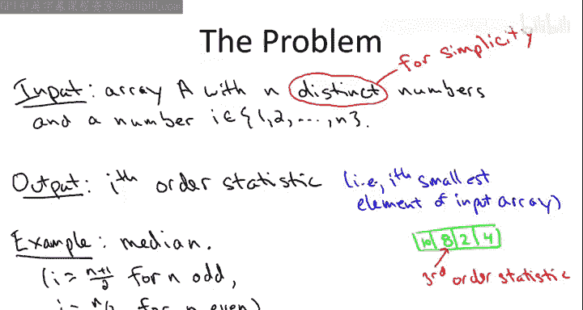
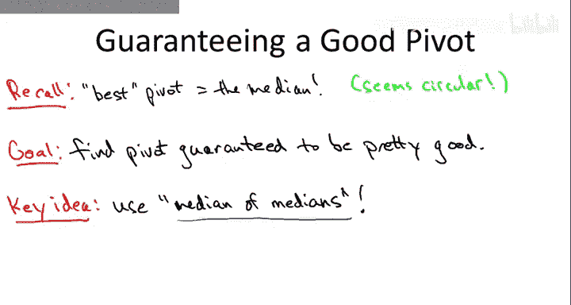
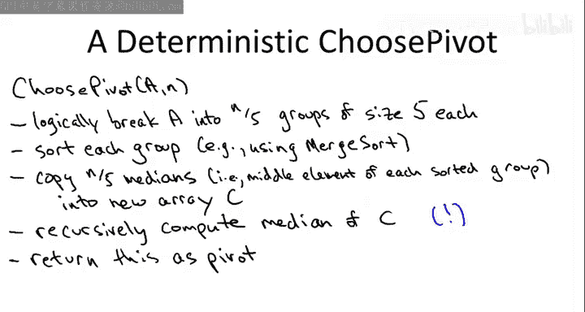

# 034：确定性选择算法详解 🧠

在本节课中，我们将学习一种用于解决选择问题的确定性算法。选择问题是指，给定一个数组和一个顺序统计量 `i`，我们需要找出数组中第 `i` 小的元素。我们将深入探讨这个算法的设计思路、工作原理，并分析其时间复杂度。

---

## 回顾随机选择算法



上一节我们介绍了随机选择算法（RSelect）。该算法在实践中非常高效，其期望运行时间为 `O(n)`。该算法的核心是随机选择一个主元（pivot），然后根据主元对数组进行分区，并递归地在相应的子数组中继续查找。

然而，随机选择算法在最坏情况下的运行时间可能达到 `O(n²)`。本节中，我们将探讨一种确定性选择算法（DSelect），它能在最坏情况下保证 `O(n)` 的运行时间，且完全不依赖随机性。

---

## 确定性选择算法的核心思想

确定性选择算法的关键在于如何**确定性地选择一个“好”的主元**。一个好的主元是指，在分区后能产生一个相对平衡的划分，即左右两部分的元素数量大致相等。

### 中位数的中位数

算法的核心策略是使用“中位数的中位数”作为主元的近似值。具体步骤如下：

1.  **分组**：将输入数组 `A`（长度为 `n`）划分为 `⌈n/5⌉` 个小组，每组包含 5 个元素（最后一组可能少于 5 个）。
2.  **寻找小组中位数**：对每个小组进行排序（例如使用归并排序），并找出每个小组的中位数（即第 3 小的元素）。
3.  **递归寻找中位数**：将所有小组的中位数收集到一个新数组 `C` 中。然后，**递归地**调用选择算法本身，找出数组 `C` 的中位数。这个中位数就是我们的主元 `p`。



以下是选择主元步骤的伪代码描述：

```python
def choose_pivot(A):
    # 1. 将数组A分成每组5个元素
    groups = split_into_groups_of_five(A)
    # 2. 对每组排序并取中位数
    medians = [sorted(group)[len(group)//2] for group in groups]
    # 3. 递归地找出中位数的中位数
    pivot = select(medians, len(medians)//2)
    return pivot
```

---

## 确定性选择算法完整流程

现在，我们将选择主元的步骤整合到完整的选择算法框架中。以下是确定性选择算法 `DSelect` 的步骤概述：

1.  **基础情况**：如果数组长度 `n` 为 1，则直接返回该元素。
2.  **选择主元**：使用上述“中位数的中位数”方法确定性地选择一个主元 `p`。
3.  **分区**：围绕主元 `p` 对数组进行分区，将所有小于 `p` 的元素移到其左侧，大于 `p` 的元素移到其右侧。设主元最终位于位置 `j`。
4.  **递归搜索**：
    *   如果 `j == i`，那么主元 `p` 就是我们要找的第 `i` 小元素，直接返回 `p`。
    *   如果 `j > i`，则第 `i` 小元素位于主元左侧的子数组中。我们在左侧子数组上递归调用 `DSelect`，寻找第 `i` 小的元素。
    *   如果 `j < i`，则第 `i` 小元素位于主元右侧的子数组中。我们在右侧子数组上递归调用 `DSelect`，寻找第 `i - j` 小的元素。



以下是算法的递归调用结构示意图：

```
DSelect(A, i):
    if n == 1: return A[0]
    p = choose_pivot(A)        // 递归调用 #1
    j = partition(A, p)
    if j == i: return p
    elif j > i: return DSelect(A[0:j-1], i)      // 递归调用 #2
    else: return DSelect(A[j+1:n], i-j)          // 递归调用 #2
```

**重要提示**：与随机选择算法只有一个递归调用不同，确定性选择算法在每次调用中可能进行**两次递归调用**。一次用于选择主元（`choose_pivot` 内部），另一次用于在分区后的子数组中继续搜索。

---

## 算法性能与特点

### 时间复杂度分析


确定性选择算法最精妙的部分在于其时间复杂度分析。通过选择“中位数的中位数”作为主元，可以保证每次分区后，至少有 `3n/10` 个元素被确定性地排除在下一轮递归之外。这确保了递归问题的规模以几何级数递减。

最终，通过递归树分析，可以证明算法的运行时间满足以下递归式：
`T(n) ≤ T(n/5) + T(7n/10) + O(n)`

该递归式的解为 `T(n) = O(n)`。这意味着，**对于任何输入，确定性选择算法都能在最坏情况下以线性时间运行**。

### 与随机选择算法的比较

以下是两种算法的关键对比：

*   **运行时间保证**：
    *   `RSelect`：**期望** `O(n)`，最坏 `O(n²)`。
    *   `DSelect`：**最坏情况** `O(n)`。
*   **实践性能**：
    *   `RSelect` 通常更快，因为其隐藏常数更小，且是原地操作（无需额外内存）。
    *   `DSelect` 由于需要创建额外数组 `C` 来存储中位数，并且递归调用开销更大，所以实际常数因子更大。
*   **算法思想**：
    *   `RSelect` 利用随机性作为“平衡划分”的廉价代理。
    *   `DSelect` 通过精巧的确定性结构（中位数的中位数）来保证平衡划分。

---

## 总结与历史背景

本节课中我们一起学习了确定性选择算法。我们了解到，通过“中位数的中位数”这一巧妙设计，我们可以在完全不依赖随机性的情况下，解决选择问题并保证最坏情况下的线性时间复杂度。

尽管在实践中随机选择算法更常被使用，但确定性选择算法以其理论上的优雅和强大的最坏情况保证，在算法史上占有重要地位。该算法由五位杰出的计算机科学家（Blum, Floyd, Pratt, Rivest, Tarjan）于1973年提出，其中四位后来都获得了图灵奖，这足以证明其思想的深刻性与影响力。


总而言之，确定性选择算法展示了如何通过深入的结构性分析来克服随机算法的局限性，是算法设计中“以巧破力”的典范。