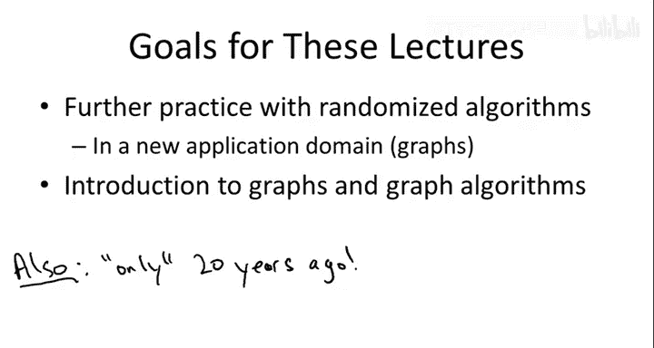
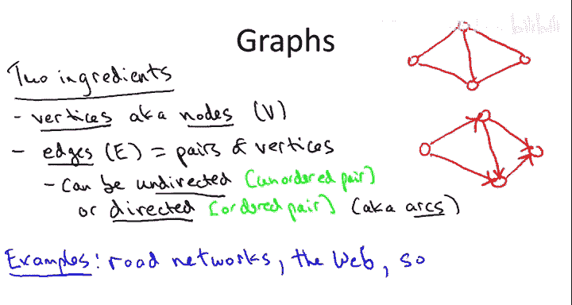
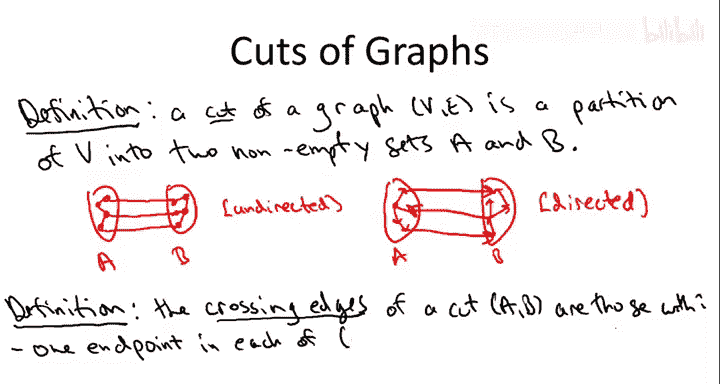
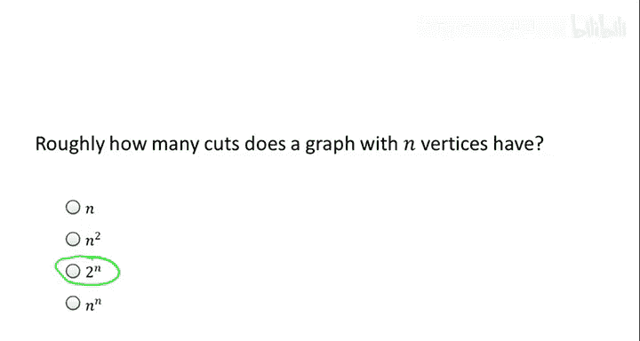
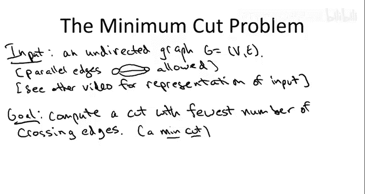
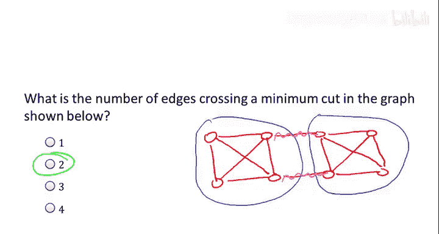
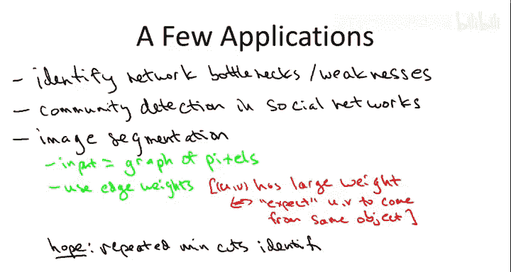

# 001：-01-9 图和最小割 🧩

在本节课中，我们将要学习图论中的最小割问题，并介绍一个名为“随机收缩算法”的随机算法。这个算法极其简单优雅，以至于让人难以置信它竟然有效，而这正是我们将要证明的。你可以将这几节课视为从随机化讨论到图论讨论之间的一个过渡。我们刚刚在排序和搜索的背景下结束了随机化的讨论，并将在课程后期讨论哈希时再次涉及。在复习随机化和概率的中间阶段，我想在另一个完全不同的领域——图论领域，而非排序和搜索——为你展示随机化的另一个应用。这是这几节课的一个高层次目标。

第二个目标是，我们将开始初步接触图论。在接下来的几周里，我们将讨论基础的图论原语。这给了我们一个机会，开始熟悉图的词汇、一些基本概念以及图算法的样貌。

另一个值得一提的好处是，至少与本课程中讨论的大部分内容相比，这个收缩算法是一个相对较新的算法。所谓相对较新，我的意思是它大约有20年的历史。我知道并非所有人，但至少我们中的大多数人在这个算法被发明时已经出生。在这类入门课程中，我们将要涵盖的大部分内容都是“经典佳作”，有些甚至有50年历史。尽管过去50年世界和技术发生了巨大变化，但这么久远的计算机科学思想仍然有用，这本身就很神奇。第一代计算机科学家发现的东西至今仍然相关，这令人惊叹。话虽如此，算法学仍然是一个充满活力的领域，有许多开放性问题。当有机会时，我会尝试让你一窥这个事实。因此，我想指出，这是一个相对较新的算法，可以追溯到90年代，而我们将看到的大多数其他算法则更古老。

---

## 图的基本概念

现在我们来谈谈图。从根本上说，图用于表示一组对象之间的成对关系。因此，图包含两个组成部分。

首先，是你谈论的对象。这些对象有两个非常常见的名称，你必须同时知道这两个名称，尽管它们完全同义。第一个名称是**顶点**。Vertex是单数，vertices是复数。它们也常被称为**节点**。

我将用大写字母 **V** 表示顶点集合。这些就是对象。

现在，我们想要表示成对关系，这些对被称为**边**，并用大写字母 **E** 表示。

图有两种类型，两者都非常重要，在应用中经常出现，所以你应该了解这两种类型。它们是**无向图**和**有向图**，这取决于边本身是无向的还是有向的。

边可以是无向的，这意味着这个对是无序的。一条边只有两个顶点，两个端点，比如 **u** 和 **v**，你不需要区分哪个是第一，哪个是第二。

或者，边可以是有向的，在这种情况下你得到的是一个有向图。这里，一个对是有序的，所以你确实有第一个顶点（或第一个端点）和第二个顶点（或第二个端点）的概念。它们通常分别被称为**尾**和**头**。偶尔，虽然我会尽量避免使用这个术语，你会听到有向边被称为**弧**。

我认为，如果我画一些图，所有这些会清晰得多。事实上，图过去常被称为“点和线”。“点”指的是顶点，所以这里有四个点或四个顶点。“边”就是线。表示其中一条边的方法是在该边的两个端点（即它对应的两个顶点）之间画一条线。这是一个具有四个顶点和五条边的无向图。

我们同样可以拥有这个图的有向版本。让我们仍然有四个顶点和五条边。但为了表明这是一个有向图，并且每条边都有一个第一个顶点和一个第二个顶点，我们将在线上添加箭头。箭头指向第二个顶点或边的头部。因此，第一个顶点通常被称为边的尾部。

图是基础中的基础，它们不仅出现在计算机科学中，还出现在各种不同的学科中，社会科学和生物学是两个突出的例子。让我仅凭记忆列举几个你可能使用图的原因，但实际上有数百或数千种其他原因。

一个非常字面的例子是**道路网络**。想象一下，你在某个网络应用或软件中输入请求，要求从A点开车到B点。它为你计算路线。它所做的是操作道路网络的某种表示，而这种表示不可避免地会存储为一个图，其中顶点对应交叉路口，边对应单个道路。

**万维网**通常被富有成效地视为一个有向图。这里，顶点是各个网页，边对应超链接。因此，一条边的第一个顶点（尾部）将是包含超链接的页面，第二个顶点（边的头部）将是超链接指向的页面。这就是作为有向图的万维网。

**社交网络**很自然地表示为图。这里，顶点对应社交网络中的个体，边对应关系，比如好友链接。我鼓励你思考一下，在当今流行的社交网络中，哪些是无向图，哪些是有向图，我们有一些有趣的例子。

即使在没有明显网络结构的情况下，图也常常很有用。让我举一个例子，写下**先修课程约束**。我的意思是，你可能想到，比如，你是一名大学新生，正在考虑你的专业，比如计算机科学专业，你想知道要修哪些课程以及顺序如何。你可以考虑以下图：你专业中的每门课程对应一个顶点，如果课程A是课程B的先修课程（即必须在开始课程B之前完成），则从课程A到课程B画一条有向边。这是一种使用有向图表示对象之间依赖关系或时间顺序的方法。

---

## 图的割

以上就是图的基本语言。现在让我谈谈图中的**割**，因为这几节课将要讨论所谓的**最小割问题**。

图的一个割的定义非常简单。它只是将图的顶点**分组**或**划分**成两个组，A和B，并且这两个组都应该是**非空**的。

为了用图片描述这一点，让我为你展示在无向图和有向图情况下割的示意图。

对于无向图，你可以想象画出你的两个集合A和B。一旦你定义了集合A和B，边就属于以下三类之一：两个端点都在A中的边；两个端点都在B中的边；以及一个端点在A中，另一个端点在B中的边。这就是从一个特定割AB的视角来看，图的通用样貌。

有向图的示意图类似。你同样有一个A和一个B。你有两个端点都在A中的有向边，两个端点都在B中的有向边。现在你实际上还有另外两类边：从左到右穿过割的边（即尾顶点在A中，头顶点在B中）；以及从右到左穿过割的边（即尾顶点在B中，头顶点在A中）。

通常当我们谈论割时，我们关心的是有多少条边**穿过**一个给定的割。我的意思是：

**割AB的交叉边**是满足以下性质的边：

*   在无向情况下，这完全符合你的想象：一个端点在A中，另一个端点在B中。这就是“穿过割”的含义。
*   在有向情况下，关于哪些边穿过割，你可以提出许多合理的定义。通常，在本课程中，我们将专注于只考虑从左到右穿过割的边（即尾在A中，头在B中），而忽略从右到左穿过的边。

因此，参考我们的两张割的示意图：对于无向图，这三条蓝色边都将是穿过割AB的边，因为它们一端在左侧，一端在右侧。对于有向图，我们只有两条交叉边，即从左到右穿过、尾在A中头在B中的那两条。向后穿过的那一条不算作割的交叉边。

---

## 最小割问题

现在，最小割问题正是你所想的那样。我给你一个图作为输入，在这指数级数量的割中，我希望你为我找出一个**交叉边数量最少**的割。

几点快速说明：
1.  这个割的名称是**最小割**。最小割是交叉边数量最少的割。
2.  为了澄清，在输入中，我将允许所谓的**平行边**。在许多应用中，平行边可能没什么意义，但对于最小割问题，允许平行边是很自然的。这意味着你可以有两条边对应完全相同的顶点对。
3.  你们中经验更丰富的程序员可能想知道“给你一个图作为输入”具体是什么意思。你可能想知道图是如何精确表示的。下一个视频将讨论图的流行表示方法，以及我们在这门课程中通常如何做，特别是通过所谓的**邻接表**。

---

## 最小割的应用

那么，为什么你应该关心计算最小割呢？这是**图划分**这类问题中的一个。给你一个图，你想把它分成两块或多块。这类图划分问题在各种各样令人惊讶的应用中频繁出现。让我在高层面上提几个。

一个非常明显的应用是，当你的图表示一个物理网络时，识别像最小割这样的东西可以让你识别网络中的**弱点**。也许这是你自己的网络，你想了解哪里需要加强基础设施，因为它在某种意义上是你网络的热点或薄弱点。或者，也许是别人的网络，你想知道他们网络中的薄弱点在哪里。事实上，大约15年前有一些解密的文件显示，冷战时期的美国和苏联军方实际上对计算最小割非常感兴趣，因为他们正在寻找诸如“最有效破坏对方国家交通网络的方法”之类的东西。

另一个在当今社交网络分析中很重要的应用是**社区检测**的概念。问题是，在一个巨大的图中，比如Facebook上所有人的图，你如何识别那些看起来紧密联系、关系密切的小群体？你希望从中推断出他们是某种社区——也许他们都上同一所学校，也许他们有相同的兴趣，也许是同一个生物家族的一部分，等等。如何在社交网络中最好地定义社区，在某种程度上仍然是一个开放性问题。但作为一个快速而粗略的一阶启发式方法，你可以想象寻找那些一方面内部高度互联，但与图的其他部分连接相当薄弱的区域。像最小割问题这样的子程序可以用来识别图中这些内部密集互联但与外部连接薄弱的小区域。

最后，割问题在**视觉**中也经常使用。例如，一种使用方式是在所谓的**图像分割**中。这里的情况是，你得到一个二维数组作为输入，其中每个条目是来自某个图像的像素。给定一个像素的二维数组，定义一个图是非常自然的：如果两个像素是相邻的（即左右或上下紧挨着），你就在它们之间放一条边。这样就得到了所谓的**网格图**。与这里讨论的基本最小割问题不同，在图像分割中，最自然的是使用**边权重**，其中一条边的权重基本上是你预期这两个像素来自同一物体的可能性。为什么你可能预期两个相邻像素来自同一物体？也许它们的颜色映射几乎完全相同，你只是期望它们是同一物体的一部分。一旦你定义了这个具有合适边权重的网格图，现在你运行图划分或最小割类型的子程序。希望它识别出的割能将图片中的一个连续物体“撕”下来。然后你这样做几次，就能得到给定图片中的主要物体。

这个列表远未穷尽最小割和图划分子程序的应用，但我希望它能作为足够的动力，让你观看本系列接下来的课程。

---

## 总结

本节课中，我们一起学习了图的基本概念，包括顶点、边、无向图与有向图。我们定义了图的割，并引出了最小割问题，即寻找交叉边数量最少的割。我们还探讨了最小割在网络弱点分析、社交网络社区检测和图像分割等多个领域的应用，为后续深入学习图算法奠定了基础。