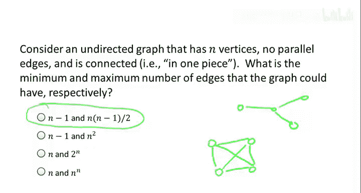
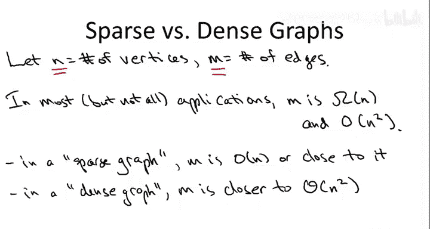
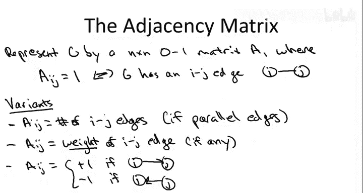
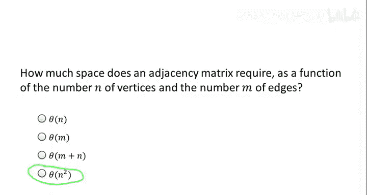
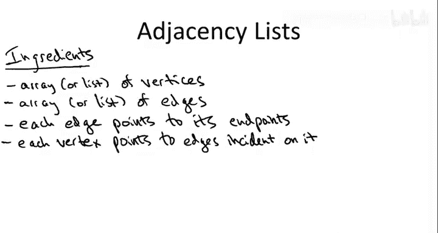
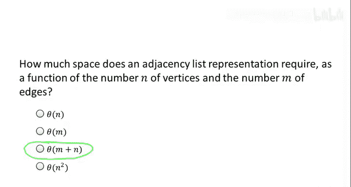
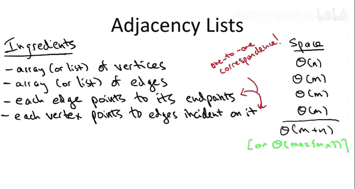

# 002：图表示方法

## 概述
在本节中，我们将学习图的基本表示方法。我们将探讨如何衡量图的大小，以及两种主要的图表示方式：邻接矩阵和邻接表。理解这些表示方法对于后续学习图算法至关重要。

## 图的基本概念
图由两个基本要素构成。首先，我们有一组对象，这些对象可以称为顶点或节点。其次，我们使用边来表示这些对象之间的成对关系。

边可以是无向的，此时它们是无序对；边也可以是有向的，从一个顶点指向另一个顶点，此时它们是有序对，我们称之为有向图。

## 图的规模参数
当我们讨论图的大小或图算法的运行时间时，需要考虑输入规模的含义。与数组不同，图的大小由两个参数控制：顶点数量和边数量。

我们通常使用以下符号：
- **N** 表示顶点数量
- **M** 表示边数量

### 边数量的范围
对于具有N个顶点的无向连通图（没有平行边），边数量M的范围是：
- 最小边数：**M ≥ N-1**
- 最大边数：**M ≤ N×(N-1)/2**（即组合数C(N,2)）

最小边数的原因是：要从N个孤立顶点开始构建连通图，每添加一条边最多能将两个连通分量合并为一个。从N个分量减少到1个分量，至少需要N-1条边。

最大边数的原因是：在没有平行边的情况下，最多可以在每对顶点之间都有一条边，总共有C(N,2)种可能的边。

## 稀疏图与稠密图
了解边数量如何随顶点数量变化后，我们来讨论稀疏图和稠密图的区别。这个区别很重要，因为某些数据结构和算法更适合稀疏图，而其他则更适合稠密图。

虽然这个术语在实际使用中有些灵活，但基本概念是：
- **稀疏图**：边数量接近下界，即接近线性关系（M ≈ O(N)）
- **稠密图**：边数量接近上界，即接近二次关系（M ≈ O(N²)）

在大多数应用中，M至少是N的线性函数（如果图是连通的），最多是N的二次函数。

## 图的表示方法
接下来我们讨论图的两种表示方法。本课程主要使用第二种方法，但第一种方法也值得了解。

### 邻接矩阵表示法
邻接矩阵是一种直观的表示方法，使用矩阵来表示图中的边。

对于无向图，邻接矩阵A是一个N×N的方阵，其中：
- **A[i][j] = 1** 当且仅当顶点i和j之间存在边
- **A[i][j] = 0** 表示没有边

这种表示法可以扩展以适应各种情况：
- 平行边：A[i][j]可以存储i和j之间的边数量
- 带权边：A[i][j]可以存储边的权重
- 有向图：可以使用+1和-1表示边的方向

#### 空间需求分析
邻接矩阵的空间需求是**O(N²)**，这与边的实际数量M无关。对于稠密图，这是可以接受的；但对于稀疏图，这种表示法会浪费大量空间。

### 邻接表表示法
邻接表是本课程主要使用的表示方法，它有多个组成部分。

以下是邻接表的基本结构：

1. 顶点数组：存储所有顶点
2. 边数组：存储所有边
3. 边到端点的指针：每条边存储指向其两个端点的指针
4. 顶点到边的指针：每个顶点存储指向与其相连的所有边的指针

#### 空间需求分析
邻接表的空间需求是**θ(M + N)**，我们可以将其视为图的线性空间。

具体分析如下：
- 顶点数组：θ(N)
- 边数组：θ(M)
- 边到端点的指针：θ(M)（每条边两个指针）
- 顶点到边的指针：θ(M)（与边到端点的指针一一对应）

总空间为θ(M + N)，这在大多数情况下是理想的表示方式。

## 表示方法的选择
面对这两种图表示方法，你可能会问：应该记住哪种？应该使用哪种？

答案取决于两个因素：图的密度和你需要支持的操作类型。

对于本课程，我们将主要关注邻接表，原因如下：

### 操作需求
本课程涉及的大多数图原语都与图搜索相关。邻接表非常适合图搜索操作：到达一个节点，跟随出边到达另一个节点，依此类推。

### 图密度和应用场景
许多图原语的动机来自大规模网络。以万维网为例，它可以被看作一个有向图：
- 顶点：单个网页（约100亿个）
- 有向边：超链接

如果使用邻接矩阵，N=10¹⁰，则N²=10²⁰，这远远超出了当前技术的处理能力。而使用邻接表，由于平均度数约为10，M≈10¹¹，虽然也很大，但在当前技术范围内是可处理的。

## 总结
在本节中，我们一起学习了图的基本表示方法。我们了解了如何用N和M衡量图的大小，探讨了稀疏图和稠密图的区别，并详细分析了邻接矩阵和邻接表两种表示方法的空间需求和适用场景。

对于本课程后续内容，我们将主要使用邻接表表示法，因为它既适合图搜索操作，又能有效处理大规模稀疏图，如万维网这样的现实世界网络。