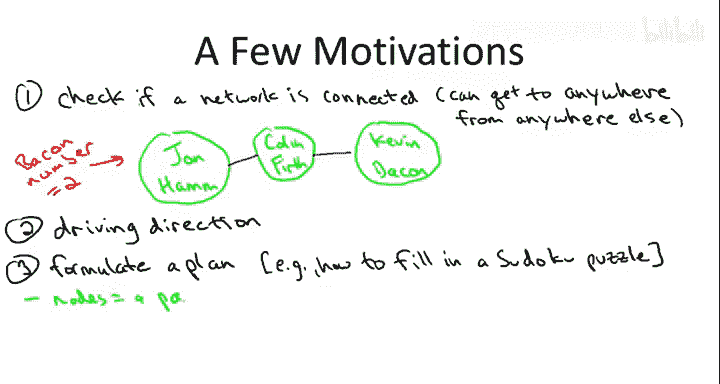
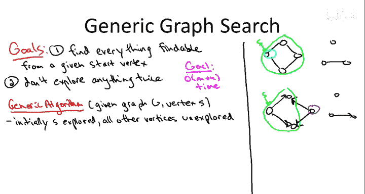
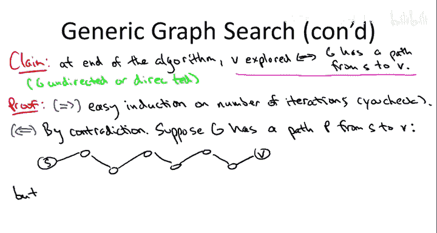
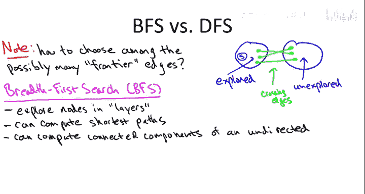

# 003：-03-10 图搜索概述

在本节课中，我们将要学习图搜索这一基础问题，以及与之紧密相关的寻找图中路径的问题。图搜索是理解图结构和解决众多实际问题的核心工具。

## 🧭 为什么需要图搜索？

图搜索的应用场景非常广泛。以下是几个关键原因：

*   **物理网络的连通性**：例如电话网络或公路网，我们需要确保网络中任意两点之间都是连通的。如果加利福尼亚州的电话无法接通犹他州，那将是一场灾难。因此，网络功能的一个基本条件就是任意两点间存在路径。
*   **逻辑网络的分析**：以电影演员网络为例，节点代表演员，如果两位演员曾出现在同一部电影中，则他们之间有一条边。我们可以研究这个网络的连通性，例如著名的“培根数”——衡量任意演员通过共同出演关系，最少需要多少步（边）能联系到演员凯文·培根。这本质上是在寻找最短路径。
*   **路径规划**：在使用地图应用寻找从当前位置到餐厅的最佳路线时，我们就是在图中寻找一条路径，通常还是最短路径（按距离或时间衡量）。
*   **抽象决策序列**：图搜索的思维可以抽象化。路径可以看作是从初始状态（如一个未完成的数独谜题）到目标状态（已完成的谜题）的一系列决策（在空格中填入数字）。这种抽象思维使得图搜索在人工智能规划等领域无处不在。
*   **计算连通分量**：这与图搜索紧密相关，本身也有许多应用。对于无向图，连通分量对应图的各个“部分”，可以用于简单的聚类分析。对于有向图，计算连通分量有助于理解网络（如万维网）的结构。

总之，高效地搜索图是一项基础且应用广泛的图算法原语。好消息是，本节课程中讨论的所有算法都将是**线性时间**的，运行速度几乎和读取输入数据一样快，因此你可以放心地在分析图数据时使用它们。

## 🔍 图搜索的通用方法

有多种系统性的图搜索方法。本课程将重点介绍两种非常重要的方法：**广度优先搜索（BFS）** 和 **深度优先搜索（DFS）**。不过，所有图搜索方法都有一些共同点。

以下是任何图搜索算法的高层思路：

*   **输入**：算法接受一个起始顶点（通常称为源点 `s`）。
*   **目标**：找出从源点 `s` 出发**所有可达的**顶点。所谓“可达”，是指存在一条从 `s` 到该顶点的路径。
*   **效率要求**：我们希望高效地完成搜索，避免重复探索。算法运行时间应为 **O(m + n)**，其中 `n` 是顶点数，`m` 是边数。

现在，我们来看一个通用的图搜索框架。这个框架是未完全指定的，存在多种实例化方式，其中两种特定的实例化将分别得到广度优先搜索和深度优先搜索。

以下是该通用方法，旨在找出所有可达顶点且每个部分只探索一次：

1.  初始化时，将所有顶点标记为“未探索”，唯独将起始点 `s` 标记为“已探索”。
2.  将已探索的顶点集合视为算法已“征服”的领土，其边界之外是未探索的领土。
3.  算法的主循环是：只要存在一条边，其**一个端点在已探索集合内，另一个端点在未探索集合内**，就执行以下操作：
    *   选择一条这样的边（具体选择哪条，算法未指定）。
    *   将该边中那个未探索的端点标记为“已探索”，将其纳入已征服的领土。
4.  当不存在这样的边时，算法终止。

**算法正确性**：无论以何种方式实例化这个通用搜索过程（即无论按什么规则选择边），算法终止时，被标记为“已探索”的顶点**恰好就是**所有从 `s` 出发可达的顶点。这个结论对无向图和有向图均成立。

**证明思路（反证法）**：
假设存在一个顶点 `v`，它可以从 `s` 到达（即存在路径 `P`），但算法结束时 `v` 却是“未探索”的。沿着路径 `P` 从已探索的 `s` 走到未探索的 `v`，必然存在路径上的第一条边 `(u, w)`，使得 `u` 已探索而 `w` 未探索。然而，如果存在这样的边，我们的通用算法就不会终止，它会继续探索 `w`。这与算法已终止且 `v` 未探索的假设矛盾。因此，算法不可能遗漏任何可达顶点。

## ⚖️ 两种重要的搜索策略

通用方法中的模糊之处在于：在每次循环迭代中，通常有多条边横跨“已探索”和“未探索”的边界。**选择哪条边（即接下来探索哪个未探索的顶点）的不同策略，导致了具有不同性质和应用的图搜索算法。**

上一节我们介绍了图搜索的通用框架，本节中我们来看看两种最重要的具体策略。

### 1. 广度优先搜索（BFS）🚀

**核心思想**：BFS 按“层”探索顶点。
*   第 0 层：只有起始点 `s`。
*   第 1 层：`s` 的所有邻居。
*   第 2 层：第 1 层顶点的所有**尚未被访问过的**邻居。
*   以此类推。

**实现关键**：使用**队列（Queue）** 这种先进先出（FIFO）的数据结构来管理待探索的顶点。

**主要应用**：
*   **计算最短路径（边数最少）**：在无权图中，顶点所在的层数就等于从 `s` 到该顶点的最短路径长度。这正是计算“培根数”或简单网络跳数所需的方法。
*   **计算无向图的连通分量**：通过循环调用 BFS，可以找出图的所有连通部分。

### 2. 深度优先搜索（DFS）🔄

**核心思想**：DFS 采取一种更“激进”的策略，它沿着一条路径尽可能深地探索，直到无法继续，然后回溯到最近的分叉点选择另一条路径。这类似于走迷宫时的策略。

**实现关键**：使用**栈（Stack）** 这种后进先出（LIFO）的数据结构。DFS 也常以**递归**形式实现，此时调用栈隐式地充当了栈数据结构。

**主要应用**：
*   **拓扑排序**：对于**有向无环图（DAG）**，DFS 可以产生一个顶点的线性序列（拓扑序），使得图中所有的边都从序列中前面的顶点指向后面的顶点。这在处理具有依赖关系的任务调度时非常有用（例如课程选修的先后顺序）。
*   **计算有向图的强连通分量**：在有向图中定义“连通部分”（强连通分量）更为微妙，而 DFS 提供了计算它们的线性时间算法（Kosaraju 算法或 Tarjan 算法）。
*   **探索图的结构**：DFS 的探索顺序有助于发现图中的环、关节点等结构。

## 📊 总结

本节课中我们一起学习了图搜索的基础概念和通用框架。我们了解到图搜索的目标是找出从给定起点出发所有可达的顶点，并且存在高效的线性时间算法来实现。

我们重点比较了两种核心的搜索策略：
*   **广度优先搜索（BFS）** 按层推进，适用于计算最短路径和无向图连通分量。
*   **深度优先搜索（DFS）** 深入优先再回溯，适用于拓扑排序和计算有向图的强连通分量。

这两种策略都使用简单的数据结构（队列或栈）即可在 **O(m + n)** 时间内完成搜索，是分析图数据时强大而高效的基本工具。在接下来的课程中，我们将对它们进行更深入的探讨。