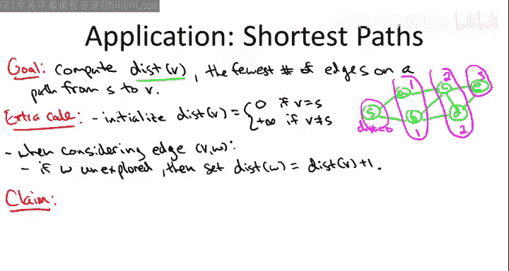

# 005：BFS与最短路径

## 概述
在本节课中，我们将要学习广度优先搜索算法的一个核心应用：计算图中从一个起点到所有其他节点的最短路径距离。我们将看到，只需对基础的BFS代码进行微小的修改，就能高效地计算出这些距离。

## 最短路径的概念
让我们从最短路径的概念开始。假设我给你一个电影演员关系图，并指定凯文·贝肯作为起点。问题是：到达另一个演员，例如约翰·汉姆，所需的最少“跳数”或路径上的最少边数是多少？

为此，我们引入一些符号。我将使用 **`DIST(v)`** 来表示从起点 `s` 到节点 `v` 的最短路径距离。这个距离定义为从 `s` 出发到达 `v` 的所有路径中，边数最少的那条路径的边数。这个概念同样适用于无向图或有向图。在有向图中，我们总是沿着弧的正确方向（向前）遍历。

## 在BFS中计算最短路径
为了实现最短路径计算，我们只需要在之前展示的BFS代码基础上增加非常少量的额外代码。这只会带来很小的常数开销，其核心思想是跟踪每个节点属于哪一层，而这些层恰好对应着距离起点 `s` 的最短路径距离。

那么，额外的代码是什么呢？首先，在初始化步骤中：

*   我们为从起点 `s` 到顶点 `v` 的最短路径距离设置一个初步估计值。
*   如果 `v` 等于起点 `s`，我们知道可以通过长度为0的路径（空路径）从 `s` 到达 `s`，因此设置 `DIST(s) = 0`。
*   对于其他所有顶点，我们最初一无所知，不知道是否存在通往它们的路径。因此，我们暂时将所有非起点顶点的距离设为 **`+∞`**。当然，一旦我们实际发现了通往顶点 `v` 的路径，就会修正这个值。

你需要添加的另一处额外代码位于探索边的过程中：

*   当你从队列前端取出一个顶点 `v`，然后遍历它的边时，你会考虑其中一条边 `(v, w)`。
*   按照惯例，如果边的另一端 `w` 已经被处理过，则直接忽略它，再次查看将是冗余工作。
*   但如果是第一次见到顶点 `w`，那么除了之前所做的操作（将其标记为已探索并放入队列末尾）之外，我们还需要计算它的距离。
*   顶点 `w` 的距离，将比首先发现它的那个顶点 `v` 的距离多1。即：**`DIST(w) = DIST(v) + 1`**。

## 实例演示
回到我们广度优先搜索的运行示例，让我们看看会发生什么。

首先，我们从顶点 `s` 开始，在初始化中设置 `DIST(s) = 0`，其他顶点的距离未知。

1.  初始步骤：将 `s` 放入队列，进入主 `while` 循环。
2.  队列非空，取出 `s`，查看其邻居 `a` 和 `d`。假设我们先处理边 `(s, a)`。
    *   这是第一次见到 `a`，因此标记 `a` 为已探索，将其放入队列末尾。
    *   执行额外步骤：计算 `a` 的距离。`s` 是发现 `a` 的顶点，`DIST(s)=0`，所以设置 **`DIST(a) = 0 + 1 = 1`**。这相当于 `a` 属于第一层。
3.  仍在处理 `s` 的边，现在处理边 `(s, b)`。
    *   第一次见到 `b`，标记并放入队列。
    *   设置 **`DIST(b) = DIST(s) + 1 = 1`**。`b` 也属于第一层。
4.  处理完 `s` 的所有邻接点后，回到 `while` 循环。队列包含 `a` 和 `b`。
5.  取出队列第一个顶点 `a`，查看其关联边。忽略已见的 `(s, a)`，处理 `(a, c)`。
    *   第一次见到 `c`，标记并放入队列。
    *   设置 **`DIST(c) = DIST(a) + 1 = 1 + 1 = 2`**。`c` 属于第二层。
6.  处理队列中的下一个顶点 `b`。忽略已见的 `(s, b)` 和 `(b, c)`，处理 `(b, d)`。
    *   第一次通过 `b` 发现 `d`，标记并放入队列。
    *   设置 **`DIST(d) = DIST(b) + 1 = 1 + 1 = 2`**。`d` 属于第二层。
7.  处理顶点 `c`。在它的边中，第一次见到 `e`。
    *   标记并放入队列。
    *   设置 **`DIST(e) = DIST(c) + 1 = 2 + 1 = 3`**。`e` 属于第三层。

算法的剩余部分照常进行。你会注意到，计算出的最短路径标签恰好就是我们之前定义的层。此时，你应该很容易相信这个结论在一般情况下是成立的：对于从 `s` 可达的任意顶点 `v`，广度优先搜索计算出的距离等于 `i`，当且仅当 `v` 位于我们之前定义的第 `i` 层。而位于第 `i` 层，正意味着 `v` 和 `s` 之间的最短路径距离是 `i` 跳（`i` 条边）。

## 算法正确性简述
我不想花时间给出这个结论的超级严格的证明，但让我概述一下基本思路。你可以通过归纳法来证明，归纳的对象是层数 `i`。你想要证明的是，所有属于给定第 `i` 层的节点，BFS确实为它们计算出了距离 `i`。

成为一个第 `i` 层的节点意味着什么？首先，你在之前的任何层（0到 `i-1`）中都没有出现过。其次，你是某个第 `i-1` 层节点的邻居，并且是在所有第 `i-1` 层节点都被处理后才第一次被发现的。

归纳假设告诉我们，对于更低层的所有节点，距离都被正确计算了。因此，具体来说，那个在第 `i-1` 层、负责在第 `i` 层发现你的节点 `v`，其计算出的距离是 `i-1`。你的距离被赋值为比它的距离多1，也就是 `i`。这样就完成了归纳步骤，证明了第 `i` 层上的所有节点确实获得了与 `s` 的最短距离标签 `i`。

## BFS的特殊性与下个应用预告
在结束这个应用之前，我想强调，**只有广度优先搜索能为我们提供这种最短路径的保证**。我们有一系列图搜索策略，它们都能找到所有可达的节点，广度优先搜索是其中之一。但计算最短路径距离是BFS一个特殊的附加属性。特别是，深度优先搜索通常**不**计算最短路径距离，这确实是广度优先搜索的独有特性。

相比之下，在下一个应用中——计算无向图的连通分量——情况则不同。这个应用并非BFS所独有，例如，你也可以在这里使用深度优先搜索，效果一样好。

## 总结
本节课中，我们一起学习了如何利用广度优先搜索算法计算图中从单一源点到所有其他顶点的最短路径距离。我们了解到，只需在标准BFS流程中增加简单的距离记录步骤——初始化时设置起点距离为0、其他点为无穷大，并在首次发现新节点时将其距离设为发现者距离加1——即可高效完成计算。我们通过实例演示了这一过程，并简要讨论了其正确性。最后，我们指出了计算最短路径是BFS特有的优势，为学习图算法的下一个重要应用做好了准备。