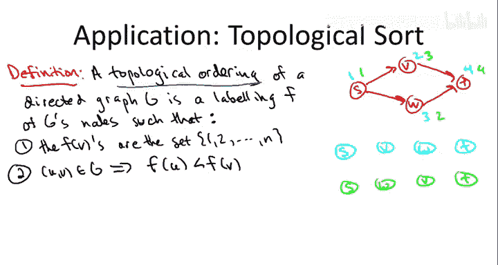
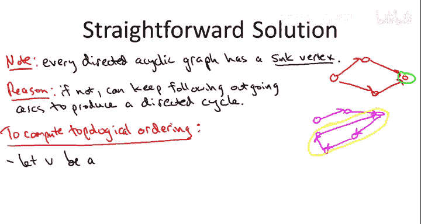
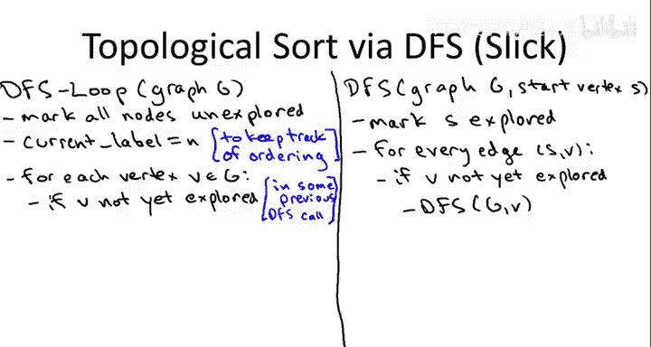
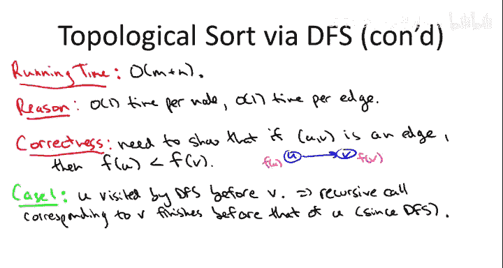

# 008：-08-10 拓扑排序 🧭

在本节课中，我们将要学习**拓扑排序**。这是一种针对有向无环图的顶点排序方法，它确保图中所有的有向边都从排序靠前的顶点指向排序靠后的顶点。这种排序在任务调度、课程安排等有依赖关系的场景中非常有用。

## 什么是拓扑排序？ 📖

首先，我们来定义什么是有向图的拓扑排序。

本质上，它是图顶点的一种排序，使得图中所有的弧（即有向边）在排序中只向前指。

我们可以通过给顶点标记数字1到n来编码一个排序，这只是为了表示每个顶点在这个排序中的位置。形式化地说，存在一个函数F，它将图G的顶点映射到1到n之间的整数，每个数字恰好被一个顶点使用（n是图G的顶点数）。

真正重要的属性是：图G的每条有向边在排序中都向前指。也就是说，如果(U, V)是有向图G的一条有向边，那么尾部U的F值应该小于头部V的F值。即，当你沿着边的正确方向遍历时，这个有向边会指向一个F值更高的顶点。

让我举个例子来更清楚地说明这一点。假设我们有一个非常简单的、有四个顶点的有向图。

我将展示这个图的两种完全合法的拓扑排序。

第一种做法是：标记S为1，V为2，W为3，T为4。
另一种选择是：以同样的方式标记它们，但交换V和W的标签。所以，你可以标记V为3，W为2。

这些标签真正要编码的是顶点的顺序。蓝色的标签可以理解为编码了顺序：S第一，然后是V，接着是W，最后是T。而绿色的标签可以理解为相同的节点顺序，只是W在V之前。

重要的是，在这两种情况下，边的模式完全相同，特别是所有的边在这个排序中都向前指。无论V和W的顺序如何，从S到V和从S到W的边看起来都一样。同样地，从V和W到T的边也是如此。

你会注意到，无论我们以何种顺序放置V和W，这四条边在每种排序中都向前指。现在，如果你试图把V放在S之前，那将行不通，因为如果V在S之前，从S到V的边就会向后指。类似地，如果你把T放在除最后位置之外的任何地方，你都不会得到一个拓扑排序。事实上，这是这个有向图仅有的两种拓扑排序。我鼓励你自己去验证这一点。

## 拓扑排序的应用场景 🎯

那么，谁关心拓扑排序呢？实际上，这是一个非常有用的子程序，在各种应用中都会出现。基本上，每当你想对一系列任务进行排序，而这些任务之间存在“先决条件”约束时，就会用到它。所谓先决条件约束，是指一个任务必须在另一个任务之前完成。

例如，你可以考虑像计算机科学专业这样的本科专业中的课程。这里的顶点将对应于所有的课程，如果课程A是课程B的先修课程（即你必须先修A），那么就会有一条从课程A到课程B的有向边。那么，你当然想知道一个可以修读这些课程的顺序，以便你总是在修完先修课程后才修读该课程。这正是拓扑排序将要实现的目标。

## 存在性与必要条件 🔍

因此，一个合理的问题是：有向图何时具有拓扑排序？当一个图确实有这样的排序时，我们如何得到它？

首先，图要具有拓扑排序，有一个非常明确的必要条件，那就是它最好是无环的。换句话说，如果一个有向图有有向环，那么它肯定不可能有拓扑排序。

我希望这个原因相当清楚。考虑任何一个确实有有向环的有向图，并考虑任何声称的顶点排序方式。现在，只需逐个遍历环上的边。你从这个环上的某个地方开始，如果第一条边向后指，那么你已经搞砸了，你已经知道这个排序不是拓扑的——没有边可以向后指。因此，显然这个环的第一条边必须向前指。现在你必须遍历这个环上的其余边。最终你会回到起点。所以，如果你一开始向前走，那么在某个时刻你必须向后走。这样，那条边就向后指，违反了拓扑排序的性质。这对于每一种排序都是如此。因此，有向环排除了拓扑排序的可能性。

现在的问题是：如果你没有环呢？这个条件是否足够强，能保证你有一个拓扑排序？是否存在除了明显的循环先决条件约束之外的其他障碍，使得无法无冲突地排序任务？

## 一个直观的算法 💡

事实证明，答案不仅是肯定的——只要没有任何有向环，你就能保证有一个拓扑排序——而且我们甚至可以通过深度优先搜索在线性时间内计算出一个排序。

在展示如何通过深度优先搜索非常巧妙且高效地计算拓扑排序之前，让我先介绍一个相当好但稍微不那么巧妙、效率也稍低的解决方案，以帮助你建立对有向无环图及其拓扑排序的直觉。

对于这个直接的解决方案，我们将从一个简单的观察开始。

每个有向无环图都有一个我称之为**汇点**的顶点，即没有任何出弧的顶点。

在我们上一张幻灯片探讨的四个节点的有向无环图中，恰好有一个汇点，就是最右边的这个顶点，它没有出弧。其他三个顶点都至少有一条出弧。

那么，为什么有向无环图必须有一个汇点呢？假设它没有。假设它没有汇点，那就意味着每个顶点都至少有一条出弧。那么，如果每个顶点都有一条出弧，我们能做什么呢？我们可以从一个任意节点开始。我们知道它不是汇点，因为我们假设没有汇点，所以它有一条出弧，让我们跟着它走。我们到达另一个节点。根据假设，没有汇点，所以这个节点也不是汇点，所以它有一条出弧，让我们跟着它走。我们到达另一个节点。那个节点也有一条出弧，让我们跟着它走。如此继续。我们就这样一直跟着出弧走。只要每个顶点都至少有一条出弧，我们就可以想走多久就走多久。但是，顶点的数量是有限的，比如说这个图有n个顶点。所以，如果我们跟着n条弧走，我们将看到n+1个顶点。根据鸽巢原理，我们必然会看到一个重复的顶点。例如，也许在我从这个顶点出发的弧之后，我又回到了之前见过的那个顶点。

那么，我们做了什么？当我们通过追踪这些出弧并重复访问一个顶点时，会发生什么？我们已经展示了一个有向环。而这正是我们假设不存在的东西——我们讨论的是有向无环图。换句话说，我们刚刚证明了一个没有汇点的图必须有一个有向环。因此，一个有向无环图必须至少有一个汇点。

## 基于汇点的递归算法 🔄

现在，我们来看看如何利用这个非常简单的观察来计算有向无环图的拓扑排序。

让我们做一个小思想实验。假设这个图确实有一个拓扑排序。让我们想想在这个拓扑排序中排在最后的顶点。

记住，任何在排序中向后指的弧都是违规的，所以我们必须避免这种情况，我们必须确保每条弧在排序中都向前指。现在，对于任何有出弧的顶点，我们最好把它放在除最后位置之外的某个地方。因此，我们放在最后位置的节点，它的所有出弧最终都会在拓扑排序中向后指。它们没有别的地方可去，因为这个顶点是最后一个。换句话说，如果我们计划成功计算一个拓扑排序，那么排序中最后位置的唯一候选顶点就是汇点。只有汇点放在那里才行得通。如果我们把一个非汇点放在那里，那就完蛋了，这是不可能发生的。

幸运的是，如果图是有向无环的，我们知道存在一个汇点。

所以，设V是图G的一个汇点。如果有多个汇点，我们任意选择一个。我们将V的标签设置为可能的最大值。因为有n个顶点，我们将把它放在第n个位置。然后，我们只需在图的其余部分上递归，这部分现在只有n-1个顶点。

让我们看看这个例子是如何工作的。在第一次迭代或最外层的递归调用中，唯一的汇点是这个用绿色圈出的最右边的顶点。总共有四个顶点，我们将给它标签4。然后，在标记了4之后，我们删除那个顶点以及所有与它相连的边，并在图的剩余部分上递归。这将是左边三个顶点加上最左边的两条边。现在，在我们删除了顶点4及其所有关联边之后，这个图有两个汇点：上面这个顶点和下面这个顶点在剩余图中都是汇点。所以，在下一个递归调用中，我们可以选择其中任何一个作为我们的汇点，因为我们有两个选择，这会产生两种拓扑排序，这正是我们在例子中看到的那两种。但是，例如，如果我们选择这个顶点作为我们的汇点，那么它得到标签3。然后我们只在最西北的两个边上递归，这个顶点是该图中唯一的汇点，得到标签2。然后我们在一个节点的图上递归，它得到标签1。

## 算法正确性证明 ✅

为什么这个算法有效？我们只需要两个快速的观察。

首先，我们需要论证，在每次迭代或每次递归调用中，我们确实可以找到一个汇点，并将其分配到尚未填充的最后位置。原因在于，如果你取一个有向无环图并从中删除一个或多个顶点，你仍然会得到一个有向无环图——你不可能仅仅通过去掉一些东西来创建环，你只能破坏环。我们开始时没有环，所以在所有中间的递归调用中，我们都没有环。根据我们的第一个观察，总是存在一个汇点。

其次，我们必须论证我们确实产生了一个拓扑排序。记住这意味着什么：对于图的每条边，它在排序中都向前指，即弧的头部被分配的位置比弧的尾部晚。

这简单地源于我们总是使用汇点这一事实。考虑被分配到位置i的顶点V。这意味着当我们只剩下i个顶点的图时，V是一个汇点。那么，它在原始图中具有什么属性呢？这意味着它所有的出弧都必须指向那些已经被删除并分配了更高位置的顶点。因此，对于每个顶点，当它实际被分配一个位置时，它是一个汇点，并且它只有来自尚未标记的顶点的入弧。它的出弧都向前指向那些已经被分配了更高位置并先前从图中删除的顶点。

## 基于深度优先搜索的高效算法 ⚡

现在，我们已经掌握了一个相当合理的解决方案，用于计算有向无环图的拓扑排序。特别是，我们观察到，如果一个图确实有有向环，那么当然不可能有拓扑排序。然而，上一张幻灯片的解决方案表明，只要没有环，就保证拓扑排序确实存在。事实上，它是一个构造性的证明，一个构造性的论证，给出了一个算法：你只需不断地一个一个地去掉汇点，并从右到左填充排序，就像你不断地剥离这些汇点一样。

这是一个相当好的算法，速度不慢，实际上，如果你正确实现它，你甚至可以让它在线性时间内运行。但我想通过一个深度优先搜索的应用来结束这个视频，这是一个非常巧妙、非常高效的计算有向无环图拓扑排序的方法。

我们只需要对我们之前的深度优先搜索子程序做两个相当小的修改。

第一件事是，我们必须将它嵌入到一个for循环中，就像我们在计算无向图的连通分量时对广度优先搜索所做的那样。这是因为在计算拓扑排序时，我们最好给每个顶点一个标签，我们最好至少查看每个顶点一次。为了做到这一点，我们将确保有一个外层的for循环，然后如果我们有多个连通分量，我们只需根据需要多次调用DFS。

第二件事是，我们将添加一点簿记工作，这将确保每个节点都得到一个标签，事实上，这些标签将定义一个拓扑排序。

让我们不要忘记深度优先搜索的代码。这里你被给定一个图G（在这种情况下，我们提到我们感兴趣的是有向无环图）和一个起始顶点S。你要做的是，一旦你到达S，就非常积极地开始尝试探索它的邻居。当然，你不会访问任何你已经去过的顶点。要记录你访问过谁。如果你发现任何你以前没见过的顶点，你立即开始递归调用那个节点。

我说过，我们需要做的第一个修改是将其嵌入到一个外层的for循环中，以确保每个节点都得到标记。我将调用那个子程序`DFS_loop`。它不接收起始顶点作为参数。初始化时，所有节点都未被探索。我们还将跟踪一个全局变量，我称之为`current_label`。它将被初始化为n，每当我们完成探索一个新节点时，我们就递减它。这些值将恰好是F值，也就是我们输出的拓扑排序中顶点的位置。

在主循环中，我们将遍历图的所有节点。例如，我们只需扫描节点数组。像往常一样，我们不想做重复的工作，所以对于已经在之前的DFS调用中被探索过的顶点，我们不再从它开始搜索。当我们计算无向图的连通分量时，将广度优先搜索嵌入for循环中，这应该都很熟悉。如果我们遇到一个尚未探索的图顶点V，那么我们就调用DFS，以该顶点作为起点。

最后我需要补充的是，我需要告诉你F值是什么，即顶点到位置的实际分配是什么。正如我预示的那样，我们将使用这个全局的`current_label`变量，它将让我们从右到左分配顶点的位置，非常模仿我们在递归解决方案中所做的事情，在那里我们一个一个地去掉汇点。

那么，什么时候是给顶点分配其位置的正确时机呢？事实证明，正确的时机是我们完全完成对该顶点的处理时，即我们即将从堆栈中弹出对应于该顶点的递归调用时。

所以，在我们遍历完给定顶点的所有出边的for循环之后，我们设置`F[S]`等于当前的`current_label`值。然后我们递减`current_label`。

就是这样。这就是整个算法。

## 算法示例演示 🧪

声称将要产生的结果是：产生的F值将是一个拓扑排序。你会注意到，这些值将是n到1之间的整数，因为DFS最终会在每个顶点上被调用一次，并且在结束时都会得到一个整数分配，每个人都会得到一个不同的值，最大的是n，最小的是1。

让我们看看它在我们运行的例子中是如何工作的。假设我们有这个我们已经很熟悉的四个节点的有向图。

它有四个顶点。所以我们将`current_label`变量初始化为等于4。

假设在外层的DFS循环中，我们从某个顶点开始，比如顶点V。注意，在外层的for循环中，我们最终会以完全任意的顺序考虑顶点。假设我们首先从顶点V调用DFS。那么会发生什么？

从V唯一能去的地方是T。然后在T，没有地方可去。所以我们调用`DFS(T)`，没有边可以遍历，for循环结束，因此T将被分配一个F值，等于当前的`current_label`，也就是n，这里n是顶点数，即4。所以`F[T]`将得到4。

然后，我们完成了T的处理，我们回溯到V。当我们完成T时，我们递减`current_label`，我们回到V，现在没有更多的出弧需要探索，所以for循环结束，所以我们完成了深度优先搜索，所以它得到新的`current_label`，现在是3。同样，在完成V之后，我们递减`current_label`，现在降到2。

现在，我们回到外层的for循环。也许我们考虑的下一个顶点是顶点T，但我们已经去过那里了，所以我们不会在T上调用DFS。然后，也许在那之后，我们尝试在S上调用。所以S可能是for循环考虑的第三个顶点。我们还没有见过S，所以我们从顶点S开始调用DFS。

从S出发，有两条弧可以探索：一条到V（我们已经见过V，所以弧S->V不会发生任何事情），但另一方面，弧S->W将导致我们递归调用`DFS(W)`。从W，我们尝试查看从W到T的弧，但我们已经去过T了，所以我们什么也不做。这样就完成了W的处理，所以深度优先搜索然后在顶点W处结束，W得到`current_label`的分配，所以`F[W] = 2`。我们递减`current_label`，现在它的值是1。现在我们回溯到S，我们已经考虑了S的所有出弧，所以我们完成了S的处理，它得到当前的`current_label`，即1。这确实是我们几页前展示的这个图的两种拓扑排序之一。

## 算法性能与正确性分析 📊

这就是算法的完整描述以及它在具体示例中的工作原理。让我们讨论一下它的关键属性：运行时间和正确性。

就运行时间而言，这个算法的运行时间是线性的，这正是你想要的。运行时间是线性的原因与这些图搜索算法通常在线性时间内运行的常见原因相同：你明确地跟踪你去过哪些节点，这样你就不会重复访问它们，所以你只对每个节点做常数量的工作；在有向图中，每条边实际上你只在访问该边的尾部时查看一次，所以你也只对每条边做常数量的工作。

当然，另一个关键属性是正确性，即我们需要证明你保证能得到一个拓扑排序。

这意味着什么？这意味着每条边、每条弧在排序中都向前指。所以如果(U, V)是一条边，那么算法分配给U的标签`F[U]`小于分配给V的标签`F[V]`。

正确性证明分为两种情况，取决于深度优先搜索首先访问顶点U和V中的哪一个。

由于我们的for循环会遍历图G的所有顶点，深度优先搜索将恰好从每个顶点被调用一次。U或V都有可能先被访问，两者都是可能的。

**情况一**：假设U在V之前被DFS访问。那么会发生什么？记住深度优先搜索的作用：当你从一个节点调用它时，它将找到从该节点可到达的所有节点。如果U在V之前被访问，那意味着V还没有被探索，所以它是被发现的候选者。此外，有一条直接从U到V的弧，所以从U调用的DFS肯定会发现V。而且，对应于节点V的递归调用将在U的递归调用之前完成并从程序堆栈中弹出。理解这一点的最简单方法是思考深度优先搜索的递归结构。当你从U调用深度优先搜索时，那个递归调用将对所有相关的邻居（包括V）进行进一步的递归调用。U的调用在V的调用完成之前不会被弹出堆栈，这是因为堆栈或递归算法的后进先出性质。

因为V的递归调用在U之前完成，这意味着它将获得一个比U更大的标签。记住，随着越来越多的递归调用从堆栈中弹出，标签会不断减小。这正是我们想要的。

**情况二**：这是V在U之前被访问的情况。这里我们利用了图没有环的事实。因为有一条从U到V的直接弧，这意味着不可能有任何从V一路回到U的有向路径，否则就会形成一个有向环。

因此，从V调用的DFS不会发现U。同样，如果存在从V到U的有向路径，就会有一个有向环，所以它根本找不到U。因此，V的递归调用再次会在U的调用甚至被推入堆栈之前就被弹出。所以，在我们甚至开始考虑U之前，我们就已经完全处理完了V。因此，出于同样的原因，由于V的递归调用先完成，它的标签将会更大，这正是我们想要证明的。

## 总结 📝

本节课中，我们一起学习了**拓扑排序**。我们首先定义了拓扑排序的概念，即对有向无环图的顶点进行排序，使得所有有向边都从排序靠前的顶点指向靠后的顶点。我们探讨了拓扑排序在任务调度等场景中的应用。

我们分析了拓扑排序存在的必要条件：图必须是无环的。接着，我们介绍了一个直观的基于递归删除汇点的算法，并理解了其工作原理。

最后，我们重点学习了一个基于**深度优先搜索**的高效线性时间算法。该算法通过外层循环确保访问所有顶点，并在DFS递归调用完成时，按逆序为顶点分配标签，从而自然地得到一个拓扑排序。我们通过示例演示了算法的执行过程，并分情况证明了其正确性。

拓扑排序是深度优先搜索的一个经典应用。在接下来的视频中，我们将探讨一个更有趣的应用：计算有向图的强连通分量，那时我们将需要两次深度优先搜索。