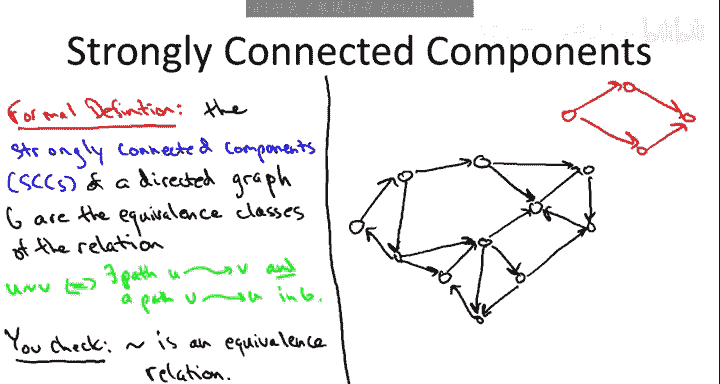
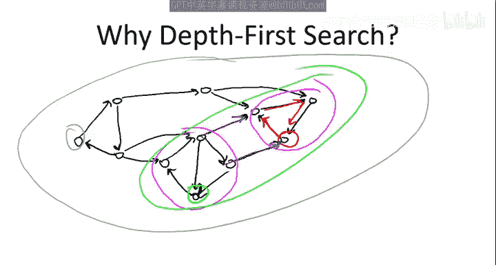
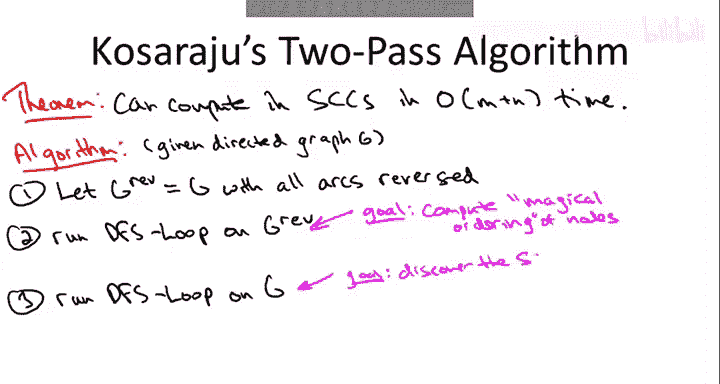
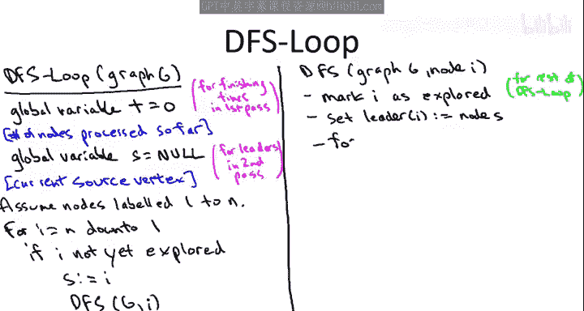
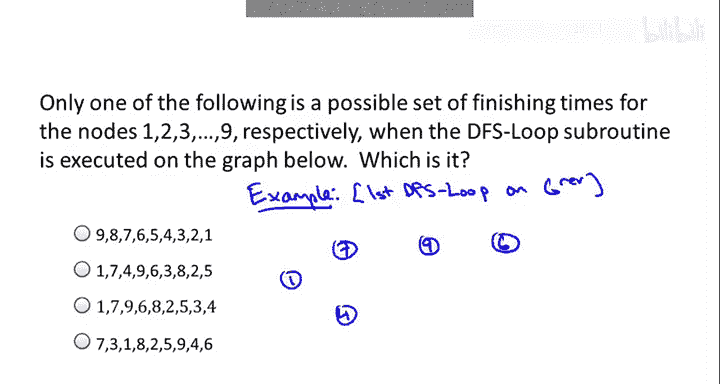
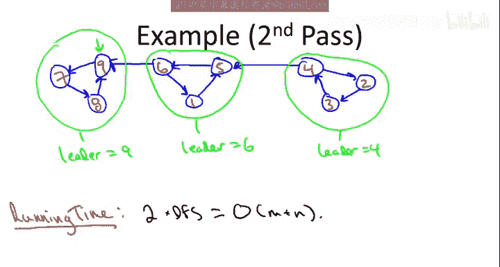

# 009：计算强连通分量算法 🧩

在本节课中，我们将要学习如何为有向图计算强连通分量。我们将从一个直观的定义开始，逐步理解一个基于深度优先搜索的、运行速度极快的线性时间算法——Kosaraju算法。

## 概述

在上一节中，我们掌握了如何在线性时间内计算无向图的连通分量。现在，我们将注意力转向有向图。好消息是，我们同样能获得一个极其快速的原语来计算有向图的连通性信息。但我们需要更深入地思考，因为定义有向图中的“连通块”并不像无向图那样直观。

## 强连通分量的定义

首先，我们需要明确什么是有向图的“连通块”。考虑一个四节点的有向图。一方面，这个图在物理意义上是“一整块”；另一方面，你无法从任意一个节点通过有向路径到达另一个任意节点（例如，从最右边的节点无法到达最左边的节点）。

因此，对于有向图，通常研究的是**强连通性**。如果一个有向图中，从任意节点A到任意节点B都存在一条有向路径，并且从B到A也存在一条有向路径，那么这个图就是强连通的。

**强连通分量** 则是图中满足强连通性的**最大区域**，即在这些区域内，你可以从任何一点沿着有向路径到达任何其他点。

更正式的定义是，我们可以在图的节点上定义一个等价关系：节点U与节点V相关，当且仅当存在从U到V的有向路径**和**从V到U的有向路径。强连通分量就是这个等价关系的等价类。

让我们用一个更复杂的图来具体说明。下图有四个强连通分量：左侧的三角形、右侧的三角形、顶部的一个单节点，以及底部的一个带对角线的有向四环。



每个被圈出的区域内部都是强连通的。同时，这些区域是“最大”的，因为如果你取两个不同圈中的节点对，要么没有从第一个到第二个的路径，要么没有从第二个返回第一个的路径。实际上，这个黑色图中强连通分量的结构，精确地反映了我们开始时用红色绘制的那个四节点有向无环图的结构。


## 算法动机与挑战

我们已经了解了强连通分量的定义。现在的问题是：如何高效地计算它们？

我们即将介绍的算法基于**深度优先搜索**，这是它速度极快的主要原因。你可能会疑惑，图搜索和计算分量有什么关系？它们看起来并不直接相关。

让我们回到之前展示的那个有向图。为了理解DFS为何可能有用，假设我们从红色节点开始调用DFS。DFS的保证是：它能找到所有从起点“可到达”的节点，仅此而已。从红色节点出发，DFS将恰好发现三角形中的三个节点，即这个强连通分量。

这看起来很酷！似乎我们只需进行一次DFS，就能得到一个SCC。如果我们能反复这样做，就能得到所有SCC。

然而，事情可能出错。如果我们从底部绿色的节点启动DFS呢？从该节点出发，不仅可以到达其自身SCC中的四个节点，还可以通过蓝色弧线到达红色三角形中的三个节点。因此，这次DFS调用将捕获这七个节点，即多个SCC的并集。

最坏情况下，如果从左边的节点启动DFS，它将发现整个图，这完全没有揭示强连通分量的结构。

**关键点在于**：如果从正确的位置调用DFS，你就能揭示一个SCC；如果从错误的位置调用，你将得不到任何有用信息。

接下来算法的魔力在于，我们将展示如何通过一个非常巧妙的预处理步骤（讽刺的是，它本身也是一次DFS调用），在线性时间内精确计算出后续DFS应该从哪些起点开始，使得每次调用恰好得到一个强连通分量，不多不少。




## Kosaraju 算法

我将要展示的算法归功于Kosaraju。该算法表明：

**定理**：有向图的强连通分量可以在线性时间内计算完成。我们将看到，其常数也非常小，本质上只是两次深度优先搜索。

我们通常假设边数 `m` 至少和节点数 `n` 一样多，但计算连通分量时，图可能非常稀疏，因此线性时间指的是 `O(m + n)`。

Kosaraju算法简单得令人震惊。它只有三步：

1.  **反转所有弧**：将给定图的所有有向边反向。目前尚不清楚为何要这样做。
2.  **第一次DFS（在反向图上进行）**：在反向图上运行深度优先搜索。一种优化方法是直接在原图上运行DFS，但沿着边反向遍历，这模拟了在反向图上的搜索。这里写的“DFS循环”是指通常的技巧：用一个外层循环确保访问图的所有节点（即使图不连通），对每个尚未访问的节点分别启动DFS。
3.  **第二次DFS（在原图上进行）**：再次运行深度优先搜索，但这次是在原始有向图上。

此时，你可能会觉得这完全不合理。我们试图计算真实的强连通分量，但所做的只是搜索图——一次正向，一次反向——这似乎不是在计算任何东西。



**诀窍在于一点简单的簿记**，开销很低，但仍能保持算法的极速。在第二次DFS的搜索过程中，它将以一种非常自然的方式，一次一个地发现强连通分量。当我们进行示例时，这会变得非常明显。

为了让第二次DFS以这种神奇的方式工作（一次发现一个SCC），**它必须以特定的顺序执行DFS**，即按照特定的顺序遍历图中的节点。而这正是第一次遍历的任务。


在反向图上的深度优先搜索将计算出一个节点顺序。当第二次深度优先搜索按照这个顺序遍历节点时，它将在线性时间内一次一个地发现SCC。

让我再详细说明一下簿记的形式，然后展示在进行深度优先搜索时如何维护这些簿记。

我们将有**顶点完成时间**的概念，这将在第一次遍历（在反向图上进行DFS）时计算。我们将在第二次遍历中使用这个数据。在第二次遍历中，我们不是以任意顺序遍历节点，而是确保按照这些完成时间的**递减顺序**来处理顶点。

关于第二次DFS如何发现并报告它找到的强连通分量：我们将为第二次遍历中的每个节点标记一个**领导者**。其思想是，同一个强连通分量中的节点将被标记为完全相同的领导者节点。一旦我们进行具体示例，这一切会更加清晰。

## 算法细节与子程序

Kosaraju算法的核心是 `DFS_Loop` 子程序。它以一个图作为输入（而不是一个起始节点），它将循环遍历可能的起始节点。

为了计算完成时间，我们将跟踪一个初始化为0的全局变量 `t`。`t` 用于计算到目前为止我们已经完全探索完毕的节点数量。这就是我们在第一次遍历中计算那些神奇顺序时使用的变量。

我们还将有第二个全局变量 `s` 来计算领导者，这只在第二次遍历中相关。`s` 将跟踪最近一次启动DFS的顶点。

为了代码简洁，我将所有簿记都放在 `DFS_Loop` 中，但实际上 `DFS_Loop` 被调用两次：一次在反向图上，一次在正向图上。我们只需要在反向图的第一次遍历中计算完成时间，只需要在正向图的第二次遍历中计算领导者。

我们需要遍历顶点，问题是以什么顺序遍历？这在两次遍历中会不同。让我们假设在子程序中，节点以某种方式标记为1到n。

在第一次深度优先搜索中，顺序是完全任意的（例如节点的名称或它们在数组中的位置）。第二次运行 `DFS_Loop` 时，正如前面提到的，我们将使用完成时间作为标签。

以下是 `DFS_Loop` 的工作流程：



```
# 全局变量
t = 0  # 用于完成时间的计数器
s = None  # 当前领导者（在第二次遍历中使用）
explored = [False] * (n+1)  # 标记节点是否已被访问
finishing_time = [0] * (n+1)  # 节点的完成时间
leader = [0] * (n+1)  # 节点的领导者

def DFS_Loop(Graph G, order):
    for i in order:  # order 在第一次遍历是 [n, n-1, ..., 1]，第二次是依完成时间降序
        if not explored[i]:
            s = i  # 为第二次遍历设置领导者
            DFS(G, i)

def DFS(Graph G, start_node i):
    explored[i] = True
    leader[i] = s  # 记录领导者（第二次遍历有效）
    for each arc (i, j) in G.outgoing(i):
        if not explored[j]:
            DFS(G, j)
    t += 1
    finishing_time[i] = t  # 记录完成时间
```



在 `DFS` 中，当我们首次遇到一个节点时，我们将其标记为已探索。一旦一个节点被标记，它就在这次 `DFS_Loop` 的整个调用期间都是已探索状态。

我们的簿记工作之一是跟踪DFS是从哪个顶点调用的。当节点 `i` 首次被遇到时，我们记住 `s`（启动此DFS的节点）就是 `i` 的领导者。

然后我们进行常规的深度优先搜索：立即查看从 `i` 出发的弧，并尝试递归地对任何尚未访问的邻居进行DFS。

一旦 `for` 循环完成（即检查完 `i` 的所有出边），我们就认为完成了节点 `i`。此时，我们递增全局计数器 `t`，并将节点 `i` 的完成时间设置为当前的 `t` 值。

由于深度优先搜索保证恰好访问每个节点一次，并恰好完成每个节点一次，全局计数器 `t` 将从1到n。第一个完成的节点完成时间为1，下一个为2，依此类推，最后一个完成的节点完成时间为n。

## 示例演示

让我们通过一个仔细的例子使这一切更加具体。我认为，如果你能自己在一个具体例子上跟踪部分算法，对大家会更好。

我为你画了一个有9个节点的图。假设我们已经执行了算法的第一步，即已经反转了图。因此，幻灯片上的这个蓝色图就是反转后的图。


节点以某种任意方式标记为1到9。记住，在 `DFS_Loop` 例程中，我们应该从上到下（从n到1）处理节点。

我的问题是：在算法的第二步，当我们在蓝色图上运行 `DFS_Loop` 并从最高标签9依次向下处理到最低标签1时，我们会计算出怎样的完成时间？

实际上，根据DFS选择探索哪条出边的不同决定，你可能会得到不同的完成时间。但我给出了四组可能的完成时间选项，只有其中一组可能是 `DFS_Loop` 在这个图上输出的结果。

**答案是第四组选项**。这是你可能看到的唯一一组完成时间。让我们跟踪 `DFS_Loop`，看看如何得到这组完成时间。

记住在主循环中，我们从最高的节点9开始，然后下降到最低的节点1。
1.  我们从节点9启动DFS。
2.  从9只能到6，标记9和6为已探索。
3.  从6可以去3或8。假设我们先去3（为了匹配第四组结果）。
4.  从3只能到9，但9已探索，所以跳过。此时3没有其他出边，因此**完成**。递增 `t=1`，`finishing_time[3] = 1`。
5.  回溯到6，现在探索另一条边到8。
6.  从8必须到2，从2必须到5，从5必须到8（已探索）。完成5，`t=2`, `finishing_time[5] = 2`。
7.  回溯到2，完成2，`t=3`, `finishing_time[2] = 3`。
8.  回溯到8，完成8，`t=4`, `finishing_time[8] = 4`。
9.  回溯到6，完成6，`t=5`, `finishing_time[6] = 5`。
10. 回溯到9，完成9，`t=6`, `finishing_time[9] = 6`。
11. 外层循环继续：`i=8`（已探索），跳过。`i=7`（未探索），启动DFS。
12. 从7可以去4或9。假设先检查9（已探索），所以去4。
13. 从4必须到1，从1必须回7（已探索）。完成1，`t=7`, `finishing_time[1] = 7`。
14. 回溯到4，完成4，`t=8`, `finishing_time[4] = 8`。
15. 回溯到7，完成7，`t=9`, `finishing_time[7] = 9`。

这样就得到了第四组完成时间：`[7, 3, 1, 8, 2, 5, 9, 4, 6]`（分别对应节点1-9）。

现在，让我们在正向图上进行第二次遍历。第一次遍历的目的是计算一个神奇的顺序，即这些完成时间。现在，我们将丢弃原始的节点名称，用红色的完成时间替换蓝色的原始名称。同时，我们需要处理原始图，这意味着必须将弧的方向反转回原始方向。

因此，当我重画这个图时，你会看到两个变化：首先，所有弧的方向反转回原始方向；其次，所有节点的名称从原始名称更改为我们刚刚计算的完成时间。



这是具有新节点名称且弧方向已反转的新图。现在，我们再次在这个图上运行DFS，并且我们仍然按照标签从高到低（9到1）的顺序处理节点。在第二次遍历中，我们不需要计算完成时间，只需要跟踪领导者。记住，一个顶点的领导者是首次发现该节点的DFS调用起点。

会发生什么？
1.  外层循环从 `i=9` 开始，从节点9调用DFS。节点9成为当前领导者。
2.  从9只能到7，从7只能到8，从8只能回9（已见）。回溯。这次调用发现了节点9、7、8，它们都获得领导者9。**这正好是图的一个SCC**。
3.  外层循环继续：`i=8`（已见），`i=7`（已见），`i=6`（未见）。从节点6调用DFS，重置领导者 `s=6`。
4.  从6可以去9或1。假设先探索9（已见），所以回溯后探索1。
5.  从1必须到5，从5必须回6（已见）。回溯。这次调用新发现了节点6、1、5，它们都获得领导者6。**这是另一个SCC**。
6.  外层循环继续：`i=5`（已见），`i=4`（未见）。从节点4调用DFS。
7.  从4可以尝试去5（已见），所以去2。
8.  从2必须到3，从3必须回4（已见）。回溯。这次调用新发现了节点4、2、3，它们都获得领导者4。**这是最后一个SCC**。
9.  外层循环检查剩余节点（3,2,1）均已见，算法结束。

我们看到，使用第一步DFS遍历计算出的完成时间，第二次遍历中，图的强连通分量就像放在银盘上一样，一次一个地呈现在我们面前。每次调用DFS新发现的节点恰好是一个SCC，不多不少。

## 算法性能与总结

当然，这仅仅是一个例子。你不应该仅凭一个例子就认为这个算法总是有效。我将在下一个视频中给出一般性论证。但希望这至少提供了一个合理性的论证，这个三步算法不再显得完全疯狂。

有一件事我希望很清楚：无论这个算法正确与否，它的速度是极快的。你所做的几乎就是两次深度优先搜索。正如我们过去所看到的，深度优先搜索的运行时间与图的大小成线性关系，因此Kosaraju的两遍算法也是如此。

这里有一些细节需要思考（例如在第二遍中如何按完成时间降序处理节点，而不想进行 `O(n log n)` 的排序），但直觉就是：这基本上就是正确实现的双重DFS。


**本节课总结**：
我们一起学习了有向图中强连通分量的概念。理解了Kosaraju算法的核心思想：通过第一次在反向图上的DFS，计算出一个特殊的节点处理顺序（完成时间）；然后第二次在原图上按照此顺序（降序）进行DFS，每次DFS调用恰好会探索出一个完整的强连通分量，并将其所有节点标记为同一个领导者。该算法的时间复杂度为 `O(m + n)`，效率极高。虽然我们通过示例看到了其工作原理，但要完全理解其正确性，还需要更一般的证明。