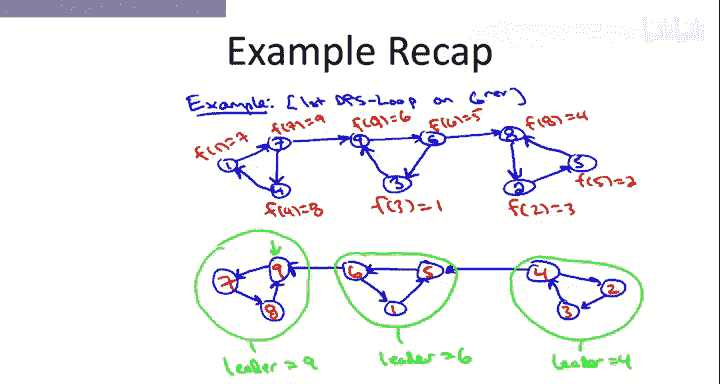
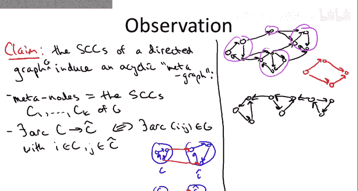
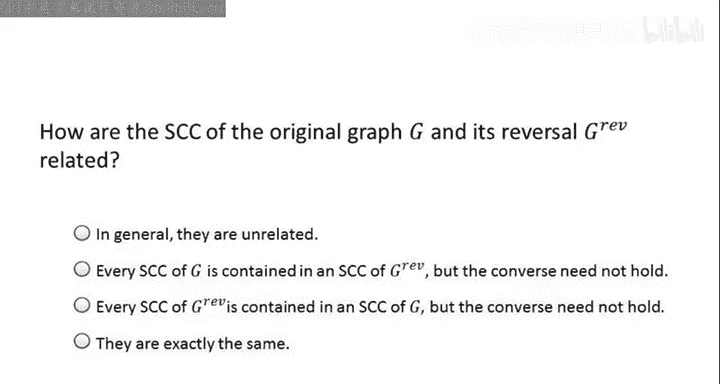
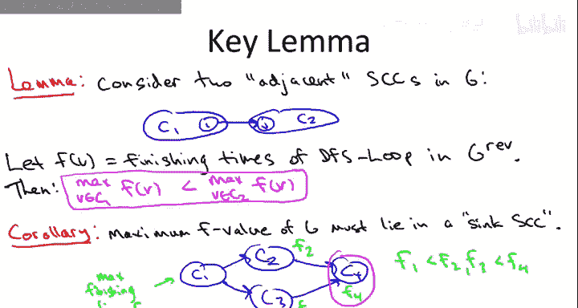
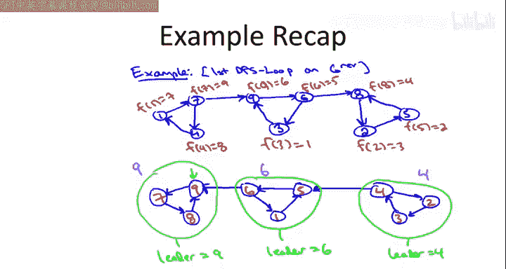
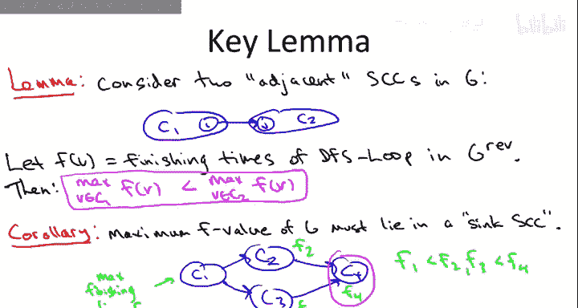
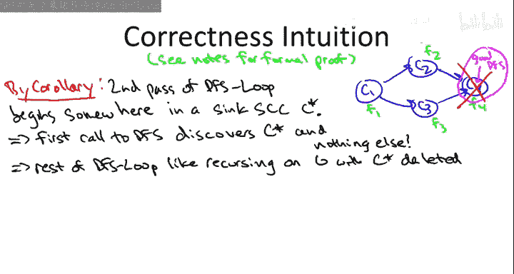
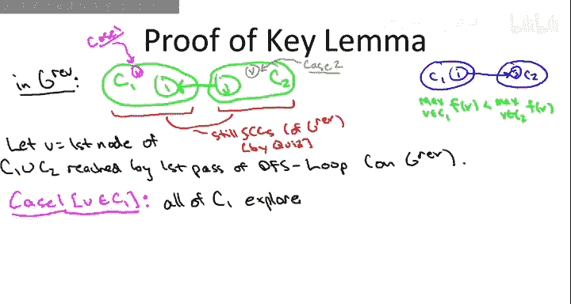
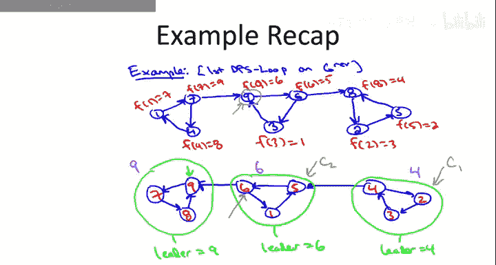

# 010：计算强连通分量分析

在本节课中，我们将要学习并证明Kosaraju两遍深度优先搜索算法的正确性。该算法能以线性时间计算有向图的强连通分量。

## 概述：有向图的元图结构

上一节我们介绍了Kosaraju算法的基本步骤，本节中我们来看看其背后的原理。首先，我们需要理解有向图的一个重要性质。

每个有向图在宏观上都具有一个简单的结构。具体来说，有向图的强连通分量自然地诱导出一个**有向无环图**，我们称之为**元图**。

以下是元图的定义：
*   **元图的节点**：每个强连通分量本身被视为元图中的一个节点。假设有K个强连通分量，记为 `C1, C2, ..., Ck`。
*   **元图的边**：如果在原图G中，存在一条从强连通分量 `Ci` 中的某个节点指向 `Cj` 中某个节点的边，那么在元图中就存在一条从节点 `Ci` 指向节点 `Cj` 的有向边。

**公式**：`元图边(Ci -> Cj) 存在 ⇔ 在原图G中，∃ u ∈ Ci, v ∈ Cj 使得边 (u -> v) 存在。`

为什么元图保证是无环的？假设元图中存在一个环，例如 `Ci -> Cj -> ... -> Ci`。这意味着在原图中，你可以从 `Ci` 到达 `Cj`，也可以从 `Cj` 最终回到 `Ci`。根据强连通分量的定义，`Ci` 和 `Cj` 中的所有节点将变得相互可达，因此它们本应属于同一个强连通分量，这与它们是不同的分量相矛盾。所以元图不可能有环。

## 关键引理

理解了元图的概念后，我们现在可以阐述驱动Kosaraju算法正确性的核心引理。

考虑两个相邻的强连通分量 `C1` 和 `C2`，这里“相邻”意味着在原图中存在一条从 `C1` 中的某个节点 `i` 直接指向 `C2` 中某个节点 `j` 的边。

假设我们已经对**反向图**运行了第一遍DFS循环，并计算出了每个节点的完成时间 `f(v)`。

**引理断言**：设 `C1` 中所有节点的最大完成时间为 `max_f(C1)`，`C2` 中所有节点的最大完成时间为 `max_f(C2)`。那么，`max_f(C2)` 一定大于 `max_f(C1)`。

**公式**：`若存在边 i(∈ C1) -> j(∈ C2)，则 max_f(C2) > max_f(C1)。`

为了推进证明，我们暂时假设这个引理成立，并探讨其直接推论。

## 推论：最大完成时间位于“汇”SCC中

基于上述引理，我们可以得出一个重要推论。

考虑整个图中具有最大完成时间 `f(v)` 的那个节点 `v`。这个节点 `v` 必然位于一个**“汇”强连通分量**中。“汇”SCC指的是在元图中没有出边的SCC（即没有边指向其他SCC）。

**证明（反证法）**：
假设节点 `v` 所在的SCC（记为 `C`）不是一个汇SCC，即它有一条出边指向另一个SCC `C‘`。根据我们的关键引理，`C‘` 中的最大完成时间将大于 `C` 中的最大完成时间。这与 `v` 的完成时间是整个图中最大的这一前提矛盾。因此，`v` 必须位于一个汇SCC中。

这个推论至关重要，因为它告诉我们算法第二遍DFS的起点（即具有最大完成时间的节点）位于一个“安全”的位置。

## 算法正确性证明（基于引理）

现在，我们利用这个推论来完成算法正确性的证明。

回忆我们最初关于DFS用于寻找强连通分量的讨论：从一个“错误”的节点（例如源SCC中的节点）开始DFS，可能会探索整个图，无法分离出单个SCC；而从“正确”的节点（例如汇SCC中的节点）开始，则只会探索该SCC本身。

Kosaraju算法的精妙之处在于，其第一遍DFS在反向图上计算出的完成时间顺序，恰好能确保第二遍DFS总是从“正确”的节点——即汇SCC中的节点——开始。

以下是证明思路：
1.  **发现第一个SCC**：根据推论，第二遍DFS首先从具有最大完成时间的节点 `v` 开始，而 `v` 位于某个汇SCC（记为 `C*`）中。从 `v` 开始的DFS将探索所有从 `v` 可达的节点。由于 `C*` 是汇SCC，没有边指向其他SCC，因此这次DFS只会发现 `C*` 中的所有节点，不会涉足其他SCC。这样，我们就正确地找到了第一个强连通分量 `C*`。
2.  **递归剥离与处理**：在DFS过程中，`C*` 中的所有节点都被标记为已探索。在后续的第二遍DFS循环中，这些节点将被忽略。从效果上看，这相当于我们从原图中删除了 `C*`，然后在剩余的图上重新运行算法。
3.  **重复过程**：在剩余的图中，我们再次考虑具有最大完成时间的节点（当然是尚未探索的节点中）。根据关键引理在剩余图上的类似推理（因为元图结构是层次化的），这个节点必然位于剩余图的某个汇SCC中。再次调用DFS，将发现下一个SCC。
4.  **归纳进行**：这个过程持续进行。每次DFS调用都从一个汇SCC中的节点开始，发现一个完整的SCC并将其从考虑中移除。最终，所有SCC都将按照其**在元图中拓扑排序的逆序**被逐一发现。

因此，如果关键引理成立，那么Kosaraju算法就能正确计算所有强连通分量。

## 关键引理的证明

现在，我们来填补证明中最后的空白，证明关键引理本身。

我们需证明：若存在边 `i(∈ C1) -> j(∈ C2)`，则在第一遍（对反向图进行的）DFS中，有 `max_f(C2) > max_f(C1)`。

考虑反向图。反向后，原来的边 `i -> j` 变成了 `j -> i`。重要的是，反向图的强连通分量与原图完全相同。

我们在反向图上运行第一遍DFS。考虑算法首次探索到 `C1 ∪ C2` 中任一节点的时刻。设这个首次遇到的节点为 `v`。这里有两种情况：

**情况一：`v` 在 `C1` 中**
*   在这种情况下，DFS从 `v` 开始，会探索所有从 `v` 可达的节点。
*   由于元图是无环的，并且我们已经有一条从 `C2` 到 `C1` 的边（`j -> i`），因此不可能存在从 `C1` 到 `C2` 的路径（否则会形成环，导致 `C1` 和 `C2` 合并）。
*   因此，从 `v` 开始的DFS会探索完整个 `C1`，但**无法到达 `C2`** 中的任何节点。
*   `C2` 中的节点只能在后续的外层循环中被首次探索。这意味着，`C1` 中所有节点的探索和完成都发生在 `C2` 中任何节点被探索之前。
*   所以，`C1` 中所有节点的完成时间都小于 `C2` 中所有节点的完成时间。结论 `max_f(C2) > max_f(C1)` 自然成立。

**情况二：`v` 在 `C2` 中**
*   在这种情况下，DFS从 `v` 开始。
*   由于存在从 `C2` 到 `C1` 的边（`j -> i`），并且 `C1` 和 `C2` 内部都是强连通的，因此从 `v` 出发可以到达 `C1 ∪ C2` 中的所有节点。
*   **深度优先搜索的特性**是：一个节点的DFS调用只有在其所有可达节点都被完全探索后才会返回并标记该节点为“完成”。
*   因此，节点 `v` 的完成时间，将晚于所有从它可达的节点（包括 `C1` 和 `C2` 中的所有节点）的完成时间。
*   特别地，`v` 的完成时间（它是 `C2` 中某个节点的完成时间）将大于 `C1` 中所有节点的完成时间。所以同样有 `max_f(C2) > max_f(C1)`。

无论哪种情况，结论都成立。至此，关键引理得证。

## 总结

本节课中我们一起学习了Kosaraju两遍DFS算法正确性的完整证明。我们首先引入了**元图**的概念，理解有向图的强连通分量构成一个有向无环图。随后，我们陈述并证明了关键的**完成时间引理**，该引理指出在相邻SCC中，靠后的SCC拥有更大的最大完成时间。基于此，我们推导出**最大完成时间节点必位于汇SCC中**的推论。最后，我们展示了算法如何利用这个性质，通过第二遍DFS，按照元图拓扑逆序依次“剥离”出每一个强连通分量，从而高效、正确地解决问题。整个证明巧妙地结合了图的结构性质与深度优先搜索的行为特性。