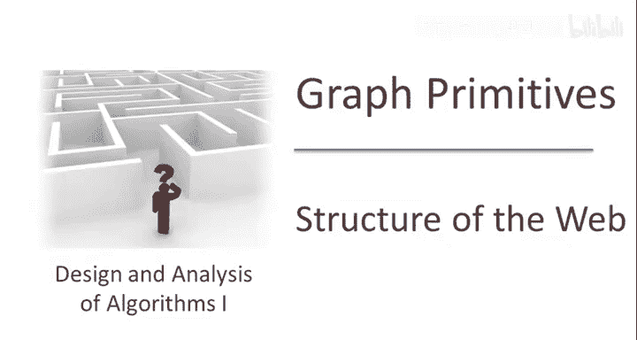
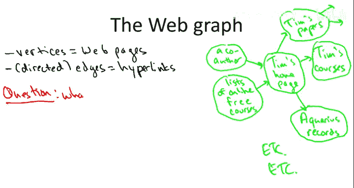
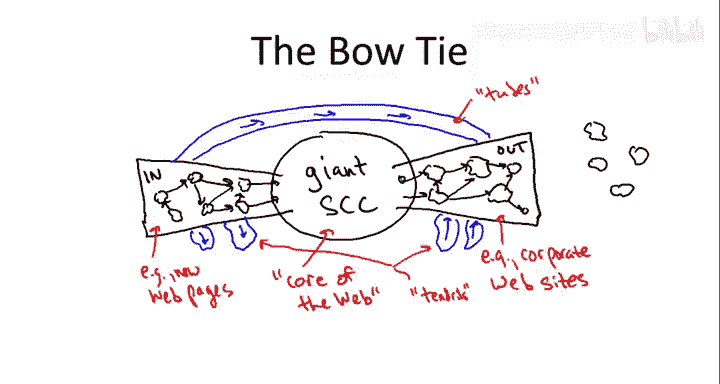

# 011：11-10 网络的结构（可选） 🌐

在本节可选视频中，我们将探讨为何需要能够处理超大规模图的高速算法。具体来说，我们将回顾一项著名的研究，该研究计算了万维网（Web）图的强连通分量，并揭示了其独特的“领结”结构。

上一节我们设计和分析了用于图推理的快速算法。本节中，我们来看看这些算法在分析真实世界超大规模图（如万维网）时的应用价值。

## 什么是网络图？

网络图是一个有向图。
*   **顶点** 对应网页。
*   **有向边** 对应超链接。边的尾部是包含链接的页面，头部是点击链接后到达的页面。

例如，个人主页可能包含指向研究论文、课程页面的链接，甚至指向喜欢的唱片店。当然，整个网络图是分布在全球服务器上的海量结构。

## 研究背景与挑战

在2000年左右，尽管互联网尚处早期，但网络图的规模已非常庞大。本研究（由Andre Broder等人完成）使用的数据包含约**2亿个节点**和**15亿条边**。

分析如此大规模图的主要挑战在于其**海量规模**。当时还没有MapReduce、Hadoop等大数据处理工具，研究者必须从头开始构建计算方法。他们选择了**线性时间算法**，特别是使用深度优先搜索来计算强连通分量。

## 网络的“领结”结构 🎀

通过计算强连通分量，研究者发现了网络图呈现出一个“领结”形状的结构。以下是该结构的主要组成部分：

**1. 巨型强连通分量**
这是“领结”的中心结。它是一个巨大的强连通区域，意味着从该区域内的任何一个网页出发，都可以通过一系列超链接到达区域内的任何其他网页。这被认为是网络的核心。

**2. IN 区域**
这是“领结”的左翼。它包含许多（通常较小的）强连通分量，可以从这些分量到达**巨型SCC**，但**无法从巨型SCC到达它们**。新创建的、只向外链接而尚未被广泛链接的页面常位于此区域。

**3. OUT 区域**
这是“领结”的右翼。它同样包含许多强连通分量，可以从**巨型SCC到达它们**，但**无法从它们返回巨型SCC**。一些公司网站因政策禁止外链而位于此区域。

**4. 其他部分**
*   **管道**：直接从IN区域连接到OUT区域的边，绕过了巨型SCC。
*   **卷须**：从IN区域伸出但未连接到巨型SCC的部分，或从OUT区域接入的部分。
*   **孤岛**：与巨型SCC没有连通关系的孤立强连通分量。

研究发现，这四个主要部分（巨型SCC、IN、OUT、其他）的规模大致相当，各占节点总数的**25%左右**。这个比例在后续研究中保持相对稳定。

## 小世界属性

虽然核心的巨型SCC只占约四分之一，但它具有异常良好的连接性，即**小世界属性**（俗称“六度分隔”）。

这个概念源于社会心理学家斯坦利·米尔格拉姆1967年的实验：他发现平均只需通过约**6个中间人**，就能将信件从内布拉斯加州的陌生人传递到波士顿的一位医生手中。

在网络科学中，小世界属性意味着：
*   网络中任意两点间存在**短路径**。
*   只需遵循简单启发式规则（如“向目标方向转发”），就能高效地找到这些短路径。

研究表明，网络的巨型SCC就具有这种丰富的短路径结构，使得信息路由非常高效。

## 前沿研究方向

网络图的研究远不止于强连通分量计算。当前许多有趣的研究方向包括：

以下是几个活跃的研究领域：
1.  **网络演化模型**：如何用数学模型描述网络随时间的动态增长与变化？
2.  **信息传播动力学**：研究信息（如新闻、观点）如何在网络（如社交网络）中传播。
3.  **社区发现**：如何更精确地定义和识别网络中紧密连接的子图（社区）？这比简单的割集方法要复杂得多。

这些研究不仅具有数学和技术挑战，也能帮助我们更好地理解所处的世界。若想深入了解，推荐阅读David Easley和Jon Kleinberg的著作《Networks, Crowds, and Markets》。

## 总结

本节课中我们一起学习了：
1.  如何应用强连通分量算法分析真实的万维网图。
2.  网络图呈现出包含**巨型SCC、IN区域、OUT区域**等的“领结”结构。
3.  网络的巨型核心具有**小世界属性**，支持高效的信息路由。
4.  图算法是理解复杂信息网络结构的基础，并引出了网络演化、社区发现等前沿研究方向。