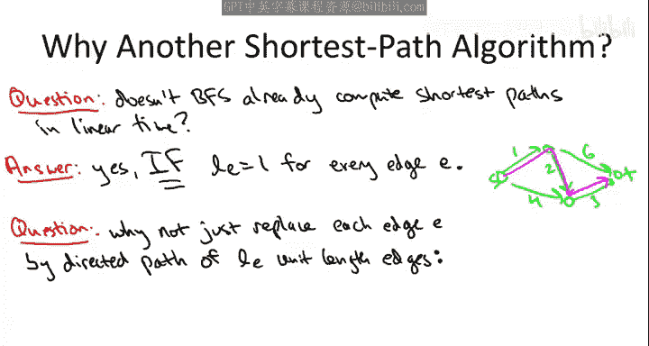

# 012：Dijkstra 最短路径算法

在本节课中，我们将要学习计算机科学中的一个经典算法——Dijkstra 最短路径算法。我们将从问题定义开始，理解其与广度优先搜索的区别，然后详细讲解算法的伪代码和核心思想，并通过示例演示其运行过程。最后，我们会讨论算法适用的前提条件。

## 问题定义：单源最短路径

我们面临的问题称为“单源最短路径”问题。其目标类似于计算行车路线。算法的输入是一个图（在本讲座中，我们主要处理有向图，但该算法经过微小调整后也适用于无向图）。我们通常用 **M** 表示边的数量，用 **N** 表示顶点的数量。

输入还包括两个额外的要素：
1.  对于每条边 **E**，我们被赋予一个非负的长度，记作 **L(e)**。在行车路线应用中，**L(e)** 可以表示道路的里程或预计行驶时间。
2.  第二个要素是一个起始顶点，我们称之为**源点**，记作 **S**。

我们的任务是，对于网络中的每一个其他顶点 **V**，计算从源点 **S** 到目标顶点 **V** 的**最短路径的长度**。

一条路径的长度定义为路径上所有边的长度之和。例如，一条包含三条边（长度分别为1、2、3）的路径，其总长度为 **1 + 2 + 3 = 6**。最短路径距离则定义为所有从 **S** 到 **V** 的路径中，长度最小的那个值。

为了简化讨论，我们做出两个假设：
1.  **便利性假设**：图中存在从源点 **S** 到其他每个顶点 **V** 的有向路径。如果某些顶点不可达，其最短路径距离定义为正无穷。这个假设并非必需，因为我们可以通过预处理（如广度/深度优先搜索）识别并删除不可达部分。
2.  **关键性假设**：图中所有边的长度都是**非负**的。Dijkstra 算法**不适用于**存在负长度边的图。对于包含负权边的应用，需要使用其他算法，如 Bellman-Ford 算法。

## 为何广度优先搜索不够用？

你可能会想到，我们之前已经通过广度优先搜索（BFS）解决过最短路径问题。这个想法既对也不对。

BFS 确实能计算最短路径，但它仅在**每条边的长度都为 1** 的特殊情况下有效。我们现在要解决的是更一般化的问题：边的长度可以是任意的非负值。

例如，在一个边权各不相同的图中，BFS 会按照“跳数”（边数）最少来寻找路径，但这可能不是长度最短的路径。在像行车路线这样的应用中，道路长度或时间显然各不相同，因此我们需要能处理一般边权重的算法。

一个聪明的想法是：能否将一条长度为 **L** 的边替换为由 **L** 条长度为 1 的边组成的路径，从而将问题转化为 BFS 可解的单位权重问题？理论上可以，但当边权非常大时（例如 1000），这种替换会极大地膨胀图的规模，导致算法效率低下。因此，我们需要一种能直接在原图上高效运行的算法，这就是 Dijkstra 算法。

## Dijkstra 算法核心思想与伪代码

Dijkstra 算法可以看作是广度优先搜索在边权非负情况下的优雅推广。其核心思想是逐步扩张一个已确定最短路径的顶点集合 **X**。

以下是算法的主要步骤和伪代码概述：

我们维护两个数组：
*   **A[v]**：存储从源点 **S** 到顶点 **v** 的（当前已知）最短路径距离。
*   **B[v]**：存储从 **S** 到 **v** 的（当前认为的）最短路径本身（实际实现中通常只存储前驱节点）。

**初始化**：
*   将源点 **S** 加入集合 **X**。
*   设置 **A[S] = 0**，**B[S] = [S]**（空路径）。

**主循环**：
当 **X** 未包含所有顶点时，重复以下步骤：
1.  观察所有从 **X** 内部指向 **X** 外部的边（即“跨越边”）。
2.  对于每条这样的边 **(v, w)**（其中 **v ∈ X**, **w ∉ X**），计算一个得分：**A[v] + L(v, w)**。这表示从 **S** 到 **v** 的最短已知距离，加上直接从 **v** 到 **w** 的边的长度。
3.  选择得分最小的那条边，记其端点为 **(v\*, w\*)**。
4.  将顶点 **w\*** 加入集合 **X**。
5.  设置 **A[w\*] = A[v\*] + L(v\*, w\*)**。
6.  设置 **B[w\*] = B[v\*] + [w\*]**（即路径延续）。

循环结束时，数组 **A** 中存储的就是从源点 **S** 到所有顶点的最短路径距离。

## 算法示例演示

让我们通过一个简单例子来理解算法的执行过程。考虑以下带权有向图，源点为 **S**。

（假设有一个包含顶点 S, A, B, C, D 的图，边权分别为：S->A=4, S->B=2, A->C=1, B->A=1, B->C=5, C->D=3）

**初始化**：
*   X = {S}
*   A[S]=0, B[S]=[S]
*   A[A]=A[B]=A[C]=A[D]=∞

**迭代 1**：
*   跨越边：(S,A) 得分 0+4=4；(S,B) 得分 0+2=2。
*   最小得分边是 (S,B)，得分 2。所以 v\*=S, w\*=B。
*   将 B 加入 X：X = {S, B}
*   更新：A[B] = 2；B[B] = [S, B]

**迭代 2**：
*   跨越边：(S,A) 得分 0+4=4；(B,A) 得分 2+1=3；(B,C) 得分 2+5=7。
*   最小得分边是 (B,A)，得分 3。所以 v\*=B, w\*=A。
*   将 A 加入 X：X = {S, B, A}
*   更新：A[A] = 3；B[A] = [S, B, A]

**迭代 3**：
*   跨越边：(A,C) 得分 3+1=4；(B,C) 得分 2+5=7。
*   最小得分边是 (A,C)，得分 4。所以 v\*=A, w\*=C。
*   将 C 加入 X：X = {S, B, A, C}
*   更新：A[C] = 4；B[C] = [S, B, A, C]

**迭代 4**：
*   跨越边：(C,D) 得分 4+3=7。
*   唯一跨越边是 (C,D)，得分 7。所以 v\*=C, w\*=D。
*   将 D 加入 X：X = {S, B, A, C, D}
*   更新：A[D] = 7；B[D] = [S, B, A, C, D]

**算法结束**。最终结果：A[S]=0, A[B]=2, A[A]=3, A[C]=4, A[D]=7。

## 负权边的影响：一个反例

Dijkstra 算法的正确性依赖于边权非负的假设。让我们看一个简单的反例。

考虑一个包含三个顶点 S, A, B 的图：
*   边 S->A，长度 5
*   边 S->B，长度 2
*   边 B->A，长度 -4

从 S 到 A 的最短路径显然是 S->B->A，总长度为 2 + (-4) = -2。

现在运行 Dijkstra 算法：
1.  初始化 X={S}，A[S]=0，A[A]=A[B]=∞。
2.  迭代1：跨越边 (S,A)得分5，(S,B)得分2。选择 (S,B)，将 B 加入 X，设 A[B]=2。
3.  迭代2：跨越边 (S,A)得分5，(B,A)得分 2+(-4)=-2。选择 (B,A)，将 A 加入 X，设 A[A]=-2。

**结果错误**：算法得出的 A[A] = -2。但注意，此时顶点 A 和 B 都已加入 X，算法认为处理完毕。然而，存在一条更短的路径吗？没有，-2 已经是最短的了。等等，这个结果看起来是对的？让我们仔细检查。

问题出在哪里？关键在于，当存在负权边时，**“已处理”集合 X 的贪心选择策略不再安全**。在第二步，我们基于“当前已知最短距离”选择了 B->A 边，并认为 A 的最短距离就是 -2。但是，如果图中存在从 A 出发指向 X 内部（比如指向 S 或 B）的负权边，那么就有可能通过再次离开 X 并返回，找到一条更短的、包含环路的路径。Dijkstra 算法一旦将顶点加入 X，就永远不会重新考虑或更新其距离，因此在负权存在的情况下可能得到错误结果。

为了构造一个算法确实出错的经典反例，需要存在一个从已处理顶点出发，经过负权边，能更新另一个已处理顶点距离的结构。上述简单例子中，因为 A 之后没有出边，所以巧合地得到了正确答案。一个更典型的反例是：S->A=1, S->B=4, A->B=2, B->A=-5。Dijkstra 会先处理 A（距离1），然后错误地认为 B 的最短距离是 min(4, 1+2)=3，而实际上通过 B->A->B 的环路，距离可以无限减小（存在负权环时最短路径无定义）。这清楚地说明了为什么负权边会破坏 Dijkstra 算法的贪心正确性基础。

## 总结

本节课中我们一起学习了 Dijkstra 最短路径算法。我们从**单源最短路径**的问题定义出发，理解了其与广度优先搜索在处理**一般非负边权**时的区别。接着，我们深入探讨了算法的核心思想：通过维护一个已确定最短路径的顶点集合 **X**，并利用 **Dijkstra 贪心准则** `A[v] + L(v, w)` 在每一步中选择下一个要处理的顶点。我们详细分析了算法的伪代码，并通过一个实例逐步演示了其运行过程。最后，我们探讨了算法对**边权非负**这一关键假设的依赖，并通过反例说明了当图中存在负权边时，算法的贪心选择将导致错误结果，这引出了对算法正确性证明的必要性（将在后续视频中讲解），也提示我们在有负权需求时应转向如 Bellman-Ford 等其他算法。