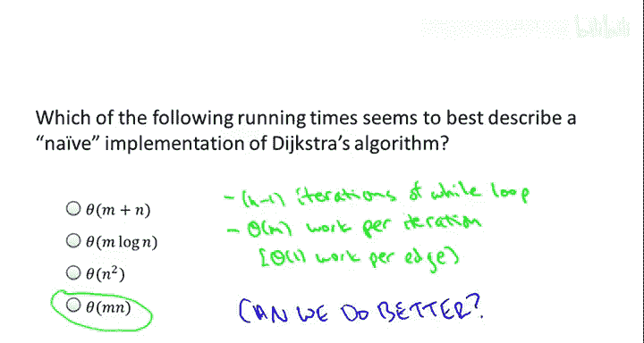
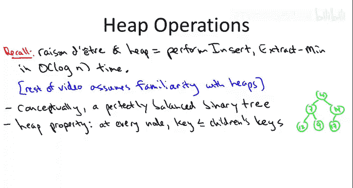
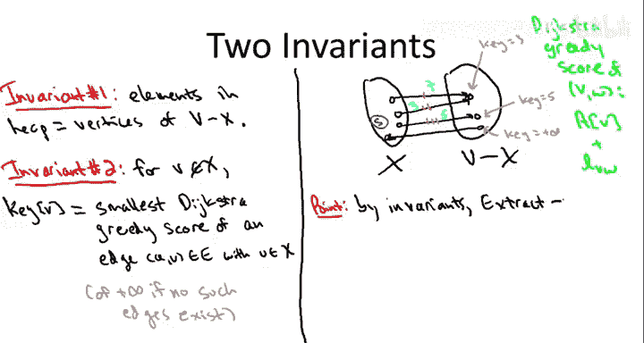
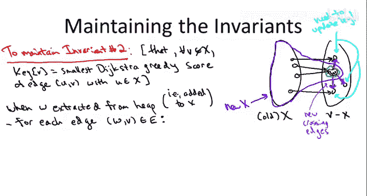
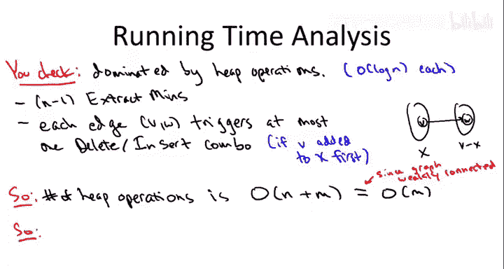

# 015：实现与运行时间 🚀

在本节课中，我们将学习如何实际实现Dijkstra最短路径算法。特别是，我们将看到如何通过使用**堆**数据结构，获得一个几乎达到线性时间的、极其高效的实现。

## 概述 📋

我们解决的问题是**单源最短路径问题**。给定一个有向图和一个源顶点 `S`，我们假设从 `S` 到其他每个顶点 `V` 都存在一条路径（如果不成立，可以通过简单的预处理步骤检测）。我们的任务是找出从源顶点 `S` 到每个可能目的地 `V` 的最短路径。此外，图中的每条边都有一个非负的长度，我们用 `L(e)` 表示。

## Dijkstra算法回顾 🔄

上一节我们介绍了Dijkstra算法的核心思想。本节中，我们来看看它的具体实现细节。

Dijkstra算法由一个主循环驱动。算法过程中，我们逐步将一个顶点添加到一个不断演化的集合 `X` 中。`X` 是到目前为止已处理的顶点集合。我们维护一个不变式：对于每个已处理的顶点，我们已经计算出了我们认为的到该顶点的最短路径距离。

*   初始时，`X` 仅包含源顶点 `S`。从 `S` 到自身的距离自然是 `0`。
*   算法的巧妙之处在于如何确定每次迭代中要添加到集合 `X` 的顶点。
*   首先，我们只关注那些跨越边界的边，即尾在 `X` 内、头在 `X` 外的边。
*   对于每条这样的跨越边，我们计算 **Dijkstra贪婪分数**，其定义为：到弧尾顶点的已知最短路径距离 + 该弧的长度。
*   我们为每条跨越边计算这个分数，然后选择分数最小的那条边 `(v*, w*)`。
*   我们将该边的头顶点 `w*` 添加到集合 `X` 中，并计算到 `w*` 的最短路径距离为：到 `v*` 的已知距离 + 边 `(v*, w*)` 的长度。

在之前的解释中，我使用了两个数组：数组 `A` 用于计算最短路径距离，数组 `B` 用于记录最短路径本身。然而，在实际实现算法时，我们并不需要数组 `B`。因此，在讨论真实实现时，我们将忽略与数组 `B` 相关的所有指令。

## 朴素实现的运行时间 ⏱️

在讨论高效实现之前，我们先分析一下如果按照伪代码直接实现（不使用特殊数据结构），算法的运行时间是多少。



以下是分析步骤：

1.  **主循环迭代次数**：算法在将所有顶点都加入 `X` 后终止。初始时 `X` 有1个顶点，因此需要 `n-1` 次迭代。
2.  **每次迭代的工作量**：在每次迭代中，我们需要扫描所有边，检查哪些是“合格”的边（尾在 `X` 内，头在 `X` 外）。我们可以为每个顶点维护一个布尔变量来跟踪它是否在 `X` 内。然后，在所有合格的边中，通过穷举搜索找出具有最小Dijkstra分数的边。为每条边计算Dijkstra分数是常数时间操作。

因此，朴素实现的总运行时间与顶点数 `n` 和边数 `m` 的乘积成正比，即 **O(m * n)**。

对于具有数百或数千个顶点的小型图，这种实现尚可接受。但我们希望算法能扩展到更大的图，例如具有百万级顶点的图。答案是肯定的，我们可以做得更好。



## 利用数据结构加速 ⚡

我们无需改变算法本身，而是通过改变算法过程中数据的组织方式来获得加速。这是本课程中第一次使用数据结构来获得算法速度的提升，我们将看到算法设计和数据结构设计之间美妙的相互作用。

你可能会问，是什么线索表明数据结构可能有助于加速Dijkstra算法？关键在于观察工作量来自哪里。在每次主循环迭代中，我们都在进行**最小值计算**——寻找具有最小Dijkstra分数的边。我们反复进行最小值计算。是否存在一种数据结构，其存在的理由正是为了执行快速的最小值计算？答案是肯定的，那就是**堆**数据结构。

在接下来的描述中，我假设你已经熟悉堆数据结构。以下是堆的快速回顾：

*   堆在逻辑上被视为一棵**完全二叉树**（尽管通常用数组实现）。
*   堆的关键性质是**堆属性**：每个节点的键值必须**不大于**其两个子节点的键值。这确保了所有键值中的最小值位于树的根节点。
*   **提取最小值（extract-min）**：只需取出根节点，这就是返回的最小元素。然后将最底层最右边的叶子节点（最后一个元素）交换到根位置，并根据需要将其“冒泡”下沉以恢复堆属性。
*   **插入（insert）**：将新元素作为新的最底层最右边的叶子节点插入，然后根据需要将其“冒泡”上浮以恢复堆属性。
*   在Dijkstra算法中，我们还需要能够**从堆中间删除元素**，这同样可以通过交换元素并根据需要上浮或下沉来实现。
*   由于堆维护为一棵基本平衡的二叉树，树的高度大约是 `log₂(n)`，其中 `n` 是堆中元素的数量。
*   因为每个操作都只需在树的每一层做常数工作量，所以所有这些操作都在 **O(log n)** 时间内运行。

堆数据结构与Dijkstra算法之间的直观联系在于：Dijkstra算法的主循环每次迭代都需要找到一个最小值。堆擅长在**对数时间**内找到最小值，这比朴素实现中的线性时间要好得多。

## 使用堆加速Dijkstra算法 🏎️

现在让我们看看如何使用堆来加速Dijkstra最短路径算法。

由于主循环的每次迭代都负责挑选一条边，你可能会认为我们将把边存储在堆中。但第一个巧妙而重要的想法是：我们实际上用堆来存储**顶点**，而不是边。

回顾Dijkstra算法的伪代码，我们关注一条边的唯一原因是为了推断出哪个顶点（即该边的头顶点）应该被添加到集合 `X` 中。因此，我们将直接切入主题，只保留尚未在 `X` 中的顶点。当我们从堆中提取最小值时，它会告诉我们下一个应该添加到集合 `X` 中的顶点是哪个。

我们需要在脑海中想象Dijkstra算法在某个中间迭代时的画面：集合 `X` 中有一批顶点（源顶点加上到目前为止我们已处理的其他顶点），然后是所有尚未处理的顶点 `V - X`。在这两个集合之间有跨越边界的边。

### 堆中顶点的键值定义 🔑

因为我们存储的是顶点而不是边，所以我们必须巧妙地定义堆中顶点的**键值**。

我们将维护以下不变式：顶点 `V` 的键值是**所有以该顶点为头、且尾在 `X` 内的边中，最小的Dijkstra贪婪分数**。

让我通过一个例子来解释。假设有三个跨越边，它们的Dijkstra分数分别是7、3和5。我们来看 `V - X` 中这三个顶点的键值应该是什么：



*   对于最上面的顶点，有两条不同的边以其为头，且尾都在 `X` 内。那么该顶点的键值应该是这两条边中较小的Dijkstra分数，即 `3`。
*   对于第二个顶点，只有一条以其为头、尾在 `X` 内的边。因此该顶点的键值就是那条唯一边的分数，即 `5`。
*   对于第三个顶点，根本没有以其为头、尾在 `X` 内的边。对于任何没有合格边指向的 `X` 外顶点，我们认为其键值为 **+∞**。

理解这些键值的一种方式是：我们把原来“一轮定胜负”的锦标赛，变成了一个“两轮淘汰赛”。

*   **第一轮（本地锦标赛）**：`V - X` 中的每个顶点在其所有“入边”（尾在 `X` 内，头为该顶点）中，选出Dijkstra分数最小的那条边作为“本地优胜者”。堆只记住这些第一轮的优胜者分数（作为该顶点的键值）。
*   **第二轮（总决赛）**：当我们从堆中执行 **`extract-min`** 时，实际上就是在执行第二轮总决赛。堆从所有顶点的本地优胜者中，选出分数最小的那个顶点。

关键在于，如果我们能成功维护这两个不变式，那么当我们从堆中提取最小值时，我们将得到完全正确的顶点 `w*`，即下一个应该添加到集合 `X` 的顶点。堆会“端上银盘”递给我们，与之前通过穷举搜索边所计算出的选择完全相同。

在Dijkstra算法中，我们不仅要找到下一个顶点 `w*`，还要计算其最短路径距离。记住，我们计算的最短路径距离就是Dijkstra贪婪分数，而在这里，Dijkstra贪婪分数正是该顶点在堆中的键值。因此，我们也在以更高效的方式复现朴素实现中的计算。

## 维护不变式与键值更新 🛠️

我们已经展示了，如果有一个具备这些属性的数据结构，我们就可以模拟朴素实现。现在，我必须展示如何在不做太多工作的情况下维护这些不变式。

维护不变式一（堆中存储的是 `V - X` 中的顶点）基本上会自行处理。真正的技巧在于如何维护不变式二（键值定义）。

让我指出，这是一个微妙的问题。当我们在一次迭代中从堆中提取一个顶点 `W` 并将其概念上添加到集合 `X` 时，`X` 和 `V - X` 之间的边界发生了变化。这导致跨越边界的边也发生了变化。

*   有些边以前跨越边界，现在不再跨越（例如指向新加入顶点 `W` 的边），这些边我们不关心。
*   **棘手的是**，有些边以前不跨越边界，现在却开始跨越了。这些边正是从 `W` **指出去**的边。

为什么这很棘手？因为不变式二要求，对于堆中的每个顶点（即仍在 `V - X` 中的顶点），其键值必须是所有从 `X` 指向该顶点的边中最小的Dijkstra分数。当我们将 `W` 移入 `X` 后，对于堆中某些顶点，现在可能有新的边（从 `W` 出发）指向它们。因此，这些顶点的最小Dijkstra分数（即键值）**可能降低了**，我们需要更新这些键值以维持不变式二。

困难的部分在于更新，但好的一面是：破坏是局部的。我们知道哪些顶点的键值可能需要更新：正是那些位于从 `W` 出发的边的**头顶点**。

以下是更新键值的伪代码：

```
当从堆中提取顶点 W 后（即概念上将 W 加入 X）：
    对于 W 的每一条出边 (W, V)：
        如果 V 仍在堆中（即 V 不在 X 内）：
            计算新的候选键值：distance[W] + length(W, V)
            如果这个新值 < V 当前的键值：
                将 V 从堆中删除
                将 V 的键值更新为新值
                将 V 重新插入堆中
```



作为一个优化，请注意顶点 `V` 的键值只能以**一种方式**改变。`V` 的键值是其所有“入边”（尾在 `X` 内）中Dijkstra分数的最小值。在加入 `W` 后，`V` 的本地锦标赛只是多了一个新参赛者：边 `(W, V)`。因此，新的键值只能是以下两者之一：
1.  原来的键值（如果新边 `(W, V)` 的分数更大或相等）。
2.  新边 `(W, V)` 的分数（如果它更小）。

这三行代码（删除、更新、插入）共同完成了一次对数时间的键值更新。

## 运行时间分析 📊

让我们统计一下这个新实现的运行时间。你需要理解的一点是，几乎所有的工作都是通过堆的API完成的。每个堆操作的时间复杂度是 **O(log n)**，因为堆中存储的是顶点，数量不会超过 `n`。

我们执行了哪些堆操作？

1.  **`extract-min`（提取最小值）**：在 `while` 循环的每次迭代中执行一次。共有 `n-1` 次迭代，所以是 **O(n log n)**。
2.  **键值更新（删除+插入）**：每次提取最小值后，我们可能需要更新从该顶点出发的边的头顶点的键值。关键是从**边的视角**来看，而不是顶点的视角。

    *   对于图中的每条边 `(V, W)`，它最多只会**触发一次**键值减小操作（即一次删除加一次插入）。这种情况发生在边尾 `V` 被加入 `X`，而边头 `W` 仍在堆中（即 `X` 外）时。
    *   如果 `W` 先于 `V` 被加入 `X`，那么这条边根本不会触发对 `V` 的键值更新。

因此，堆操作的总数是：`extract-min` 操作的 O(n) 次，加上由边触发的键值更新操作的 O(m) 次。由于我们假设图是弱连通的（从 `S` 可到达所有顶点），这意味着 `m ≥ n-1`。所以总操作数可以简化为 **O(m)** 次堆操作。



每次堆操作耗时 O(log n)，因此，使用堆实现的Dijkstra算法的总运行时间为 **O(m log n)**。

这个算法的常数因子通常很小，因此对于计算最短路径这样一个实用的问题来说，这是一个非常、非常快速的算法。

我们在讨论图搜索和连通性时有点被“惯坏”了，似乎所有问题都能在线性时间 O(m + n) 内解决。这里我们多了一个对数因子，但这仍然非常出色。**O(m log n)** 的运行时间比朴素实现的 **O(m * n)** 要快得多。堆数据结构的巧妙运用，为我们解决计算最短路径这个极具实际意义的问题，提供了一个真正意义上的高速算法。

## 总结 🎯

本节课中，我们一起学习了Dijkstra最短路径算法的高效实现。


*   我们首先分析了朴素实现的运行时间为 O(m * n)，这对于大规模图来说太慢。
*   接着，我们引入了**堆**数据结构，它擅长在 O(log n) 时间内进行最小值操作，这正是Dijkstra算法每次迭代的核心。
*   我们设计了一个巧妙的方案：在堆中存储**顶点**，并将顶点的键值定义为“所有从已处理集合 `X` 指向该顶点的边中最小的Dijkstra分数”。
*   我们详细说明了如何在算法过程中维护这个键值定义，特别是在将新顶点加入 `X` 后，需要更新受影响的顶点的键值，这一操作可以在 O(log n) 时间内完成。
*   最终，我们分析了基于堆的Dijkstra算法的运行时间为 **O(m log n)**，这相比朴素实现是一个巨大的提升，使得算法能够高效处理大规模图。

通过结合算法设计（Dijkstra的贪心策略）和恰当的数据结构（堆），我们获得了一个既优雅又高效的解决方案。