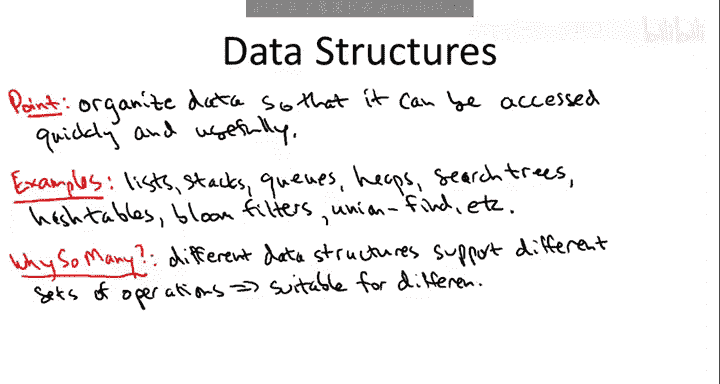
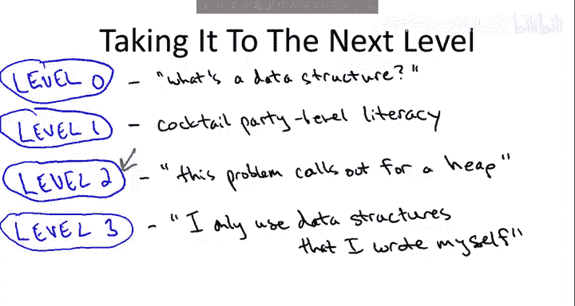

# 016：数据结构概述

在本节课中，我们将要学习数据结构的基本概念、重要性以及学习数据结构的不同层次。理解数据结构的核心在于知道如何根据任务需求选择合适的结构来组织数据，以实现高效的数据访问和操作。

## 为什么需要数据结构？

数据结构是几乎所有主要软件的基础。它的核心任务是**以能够快速、有效访问的方式组织数据**。掌握何时以及如何使用基本数据结构，是每位程序员必备的核心技能。

## 数据结构的多样性

存在许多数据结构，从简单的列表、栈和队列，到更复杂但非常有用的堆、搜索树、哈希表，以及它们的变体，如布隆过滤器、并查集等。

之所以存在如此繁多且令人眼花缭乱的数据结构，是因为**不同的数据结构支持不同的操作集合**，因此它们各自适合不同类型的任务。

## 一个具体例子：图搜索

上一节我们介绍了数据结构的基本概念，本节中我们来看看一个具体应用。回想我们在讨论图搜索，特别是广度优先搜索和深度优先搜索时提到的例子。

*   **广度优先搜索** 适合使用**队列**。队列支持从**后端**的快速（常数时间）插入和从**前端**的快速（常数时间）删除。
    *   `queue.push(item)` // 插入后端
    *   `queue.pop()` // 从前端删除
*   **深度优先搜索** 由于其递归性质，更适合使用**栈**。栈支持从**前端**的快速（常数时间）插入和删除。
    *   `stack.push(item)` // 插入前端
    *   `stack.pop()` // 从前端删除

栈的**后进先出**特性适合深度优先搜索，而队列的**先进先出**操作则适用于广度优先搜索。

## 权衡：操作与效率

因为不同数据结构适合不同任务，所以你需要了解基本数据结构的优缺点。一般来说，一个数据结构支持的操作越少，其操作速度通常越快，所需的空间开销也越小。

因此，作为程序员，仔细思考应用程序的需求至关重要。你需要明确数据结构必须支持哪些操作，然后选择**正确的数据结构**——即支持你所需全部操作，但理想情况下不包含多余操作的那个。

## 数据结构知识的四个层次

以下是关于数据结构知识掌握程度的四个层次划分：

*   **第0层：无知**。从未听说过数据结构，没有意识到组织数据可以产生本质上更好的软件（例如，更快的算法）。
*   **第1层：认知层**。至少能就基本数据结构进行对话。听说过堆、二叉搜索树等概念，或许了解一些基本操作，但在自己的程序或技术面试中使用时会感到生疏。
*   **第2层：熟练应用层**。对数据结构有扎实的了解。能够自如地在自己的程序中作为“客户端”使用它们，并且很清楚哪种数据结构适合哪种类型的任务。
*   **第3层：深入理解层**。不满足于仅仅作为数据结构的客户端来使用，而是真正理解这些数据结构的内部原理、如何编码以及如何实现。

## 本课程的教学重点

我猜测，你们中的大多数人最终会在自己的程序中使用数据结构。因此，学习不同数据结构的操作及其适用场景，将是一项对编程能力大有裨益的技能。另一方面，我敢打赌，很少有人需要从头开始实现自己的数据结构，而不是仅仅作为客户端使用各种标准编程库中已有的数据结构。

考虑到这一点，我的教学将重点放在将你们提升到**第2层**。讨论将集中在各种数据结构支持的操作和一些典型应用上。希望通过这些内容，培养你们对于何种数据结构适合何种任务的直觉。

如果时间允许，我也会为那些希望更上一层楼、学习这些数据结构内部原理和经典实现方式的同学，提供一些可选材料。

## 总结

本节课中我们一起学习了数据结构的基本概念。我们了解到，数据结构是高效软件的基础，其核心价值在于根据特定操作需求来组织数据。我们通过图搜索的例子看到了队列和栈如何因其不同的操作特性而适用于不同的算法。最后，我们明确了本课程的目标是帮助大家达到能够熟练选择并应用合适数据结构的水平。