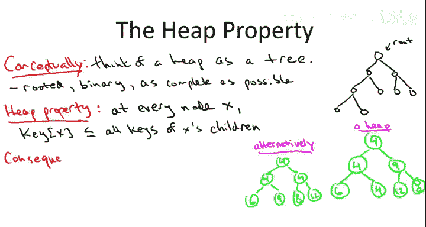

# 018：-18-12 堆的实现细节进阶 🧱

在本节课中，我们将深入学习堆（Heap）数据结构的实现细节。我们将探讨如何从零开始编写一个堆，重点关注其核心操作——插入和提取最小值——的底层实现逻辑。我们将看到，堆虽然逻辑上是一棵树，但在实际代码中通常使用数组高效实现。

## 堆的回顾与核心操作

上一节我们介绍了堆的基本概念。本节中，我们来看看它的具体实现。首先，我们需要明确堆的核心用途和它支持的操作。

堆是一个容器，用于存储对象。每个对象除了可能包含其他数据外，还必须有一个可比较的**键（Key）**，例如社保号、网络边的权重或事件的时间戳。

堆主要支持两个高效操作：
1.  **插入（Insert）**：向堆中添加一个新对象。
2.  **提取最小值（Extract Min）**：从堆中移除并返回具有最小键值的对象。

这两个操作的时间复杂度都是 **O(log n)**，其中 n 是堆中对象的数量。堆允许键值重复，当有多个对象具有相同的最小键值时，提取操作会返回其中之一（具体是哪一个未作规定）。

## 堆的两种视图：树与数组

要理解堆的工作原理，必须同时掌握它的两种视图：逻辑上的**树形结构**和物理上的**数组存储**。我们将从树形视图开始，这有助于解释堆操作的原理。

### 堆的逻辑结构：完全二叉树

在概念上，我们将堆视为一棵满足特定条件的二叉树：
*   **有根（Rooted）**：有一个根节点。
*   **二叉树（Binary）**：每个节点最多有两个子节点。
*   **完全（Complete）**：树的结构尽可能“满”。这意味着除了最底层，所有层都被完全填满，并且最底层的节点都尽可能靠左排列。

例如，一个包含9个节点的“尽可能满”的二叉树结构如下（图中应为树形结构，此处用文字描述）：
*   第0层（根）：1个节点。
*   第1层：2个节点。
*   第2层：4个节点。
*   第3层：2个节点（从左到右填充）。

### 堆序性质

堆序性质（Heap Property）规定了对象在这棵树中的排列顺序：
> 对于树中的任意节点 X，存储在 X 处的对象的键值必须**不大于**其所有子节点的键值。

这意味着，如果一个节点有零个、一个或两个子节点，那么所有这些子节点的键值都至少和该节点的键值一样大。

一个关键推论是：**堆中的最小键值始终位于根节点**。这正好方便了我们实现“提取最小值”操作。

## 堆的物理实现：数组映射

虽然我们在脑海中将堆想象成树，但实际编码时并不使用指针来构建树节点。由于堆是完全二叉树，我们可以用一种非常高效的方式——**数组**——来实现它。

以下是将树形堆映射到数组的方法：
1.  将树的节点按层（从上到下，从左到右）的顺序放入数组。
2.  根节点放在数组的第一个位置（索引 1，为简化计算，有时也从索引 0 开始，但本教程使用索引 1）。
3.  接着放入第一层的所有节点，然后是第二层，以此类推。

**示例**：一个包含9个元素的堆，其数组表示如下：
*   数组索引：`[1, 2, 3, 4, 5, 6, 7, 8, 9]`
*   对应键值：`[4, 4, 8, 4, 9, 9, 12, 13, 5]` （此顺序对应树的层级遍历）

### 父子节点关系的计算

数组实现的妙处在于，我们不需要存储指针就能快速找到任何节点的父节点或子节点。这些关系可以通过简单的算术计算得出：

*   **父节点**：对于数组中索引为 `i` 的节点（`i > 1`），其父节点的索引是 `floor(i / 2)`。
    *   公式：`parent(i) = i // 2` （整数除法）
*   **子节点**：对于索引为 `i` 的节点，其左子节点索引为 `2*i`，右子节点索引为 `2*i + 1`。
    *   公式：`left_child(i) = 2 * i`, `right_child(i) = 2 * i + 1`

**示例**：
*   节点在索引 2，其父节点在索引 1 (`2//2=1`)，子节点在索引 4 (`2*2`) 和 5 (`2*2+1`)。
*   节点在索引 3，其父节点在索引 1 (`3//2=1`)，子节点在索引 6 (`2*3`) 和 7 (`2*3+1`)。

这种实现方式带来了两大优势：
1.  **空间高效**：无需额外空间存储指针。
2.  **速度高效**：通过简单的乘除运算（甚至可以用更快的位运算实现）即可访问父子节点，常数时间内完成。

## 堆操作的实现

了解了堆的数组表示后，我们来看看如何实现插入和提取最小值操作。我们将通过示例来说明，你可以很容易地将这些步骤推广到通用情况并编写代码。

### 操作一：插入（Insert）

插入操作的目标是将一个新元素加入堆，并保持堆序性质和完全二叉树结构。

**步骤**：
1.  **添加到末尾**：为了保持树的完全性，新元素必须被添加到树最后一层最右边的空缺位置，也就是数组的末尾。这是一个常数时间操作。
2.  **向上调整（Bubble Up / Sift Up）**：将新元素与其父节点比较。如果新元素的键值**小于**其父节点的键值，就违反了堆序性质。
    *   交换这两个节点的位置。
    *   重复此过程，将新元素不断与新的父节点比较并交换，直到：
        a) 新元素的键值不再小于其父节点的键值。
        b) 新元素到达了根节点。

**示例**：假设我们有一个堆，要插入键值为 5 的元素。
1.  将 5 放在数组末尾（成为某个节点的左子节点）。
2.  发现 5 小于其父节点 12，交换它们。
3.  现在 5 的父节点是 8，5 小于 8，再次交换。
4.  现在 5 的父节点是 4，5 大于 4，停止。堆序性质恢复。

**时间复杂度分析**：由于堆是完全二叉树，其高度约为 **log₂n**。在最坏情况下，新元素需要从最底层一直交换到根节点，因此插入操作的时间复杂度为 **O(log n)**。

### 操作二：提取最小值（Extract Min）

提取最小值操作的目标是移除并返回堆中的最小元素（根节点），同时保持堆的结构和性质。

**步骤**：
1.  **移除根节点**：记录根节点的值（即最小值）以便返回。
2.  **用末尾元素填充根位**：将堆中最后一个元素（数组末尾的元素）移动到根节点的位置。这保证了树结构的完全性。
3.  **向下调整（Bubble Down / Sift Down）**：现在根节点的元素可能破坏了堆序性质。将其与它的两个子节点比较。
    *   如果它比**至少一个**子节点大，则将其与**较小的那个子节点**交换。
    *   重复此过程，将该元素不断与新的子节点比较并交换，直到：
        a) 它不大于它的任何子节点。
        b) 它到达了叶子节点（没有子节点）。

**示例**：从堆中提取最小值。
1.  移除根节点 4（最小值）。
2.  将最后一个元素 13 移到根节点。
3.  现在根节点 13 大于子节点 4 和 8。与较小的子节点 4 交换。
4.  现在 13 的位置其子节点是 9 和 4（另一个4）。与较小的子节点 4 交换。
5.  现在 13 成为叶子节点，停止。堆序性质恢复。

**时间复杂度分析**：与插入操作类似，向下调整的过程最多需要从根节点移动到叶子节点，经过 **log₂n** 层，每层进行常数次比较和交换。因此，提取最小值操作的时间复杂度也是 **O(log n)**。

## 总结 🎯

本节课中，我们一起深入探讨了堆数据结构的实现细节：

1.  **双重视角**：堆在逻辑上是一棵满足堆序性质的**完全二叉树**，在物理上则使用**数组**高效实现。
2.  **高效映射**：利用完全二叉树的特性，可以通过简单的索引计算（`parent(i)=i//2`, `child(i)=2*i, 2*i+1`）在常数时间内找到任何节点的父节点和子节点，无需指针。
3.  **核心操作实现**：
    *   **插入**：将新元素置于数组末尾，然后通过**向上调整（Bubble Up）** 恢复堆序。
    *   **提取最小值**：移除根节点，将末尾元素移至根位，然后通过**向下调整（Bubble Down）** 恢复堆序。
4.  **时间复杂度**：由于堆的高度为 O(log n)，插入和提取最小值操作的时间复杂度均为 **O(log n)**。

理解了这些底层机制后，你不仅能够使用堆，更能从零开始实现它，并深刻理解其高效性的来源。这正是成为一名更硬核的程序员和计算机科学家的重要一步。