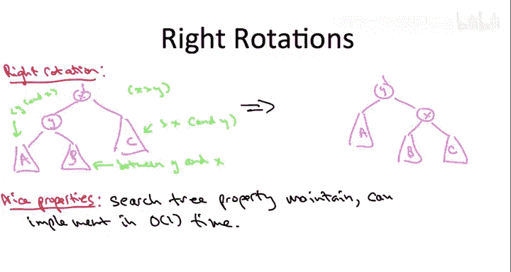

# 022：旋转操作进阶（可选）🔄


在本节课中，我们将深入探讨平衡二叉搜索树实现中的一个核心概念——旋转操作。我们将了解旋转操作的基本原理、类型以及它们如何在不破坏二叉搜索树性质的前提下，通过常数时间的指针重连来实现局部再平衡。

## 概述

在上一节中，我们介绍了平衡二叉搜索树的基本概念。本节中，我们将深入其实现细节，聚焦于所有平衡二叉搜索树实现（如红黑树、AVL树、B树等）都使用的一个关键原语——旋转操作。

## 旋转操作的核心思想

旋转操作的目的是通过仅重连少数几个指针（即执行常数工作量），在局部重新平衡搜索树，同时不违反二叉搜索树的性质。

旋转操作有两种类型：左旋和右旋。无论哪种情况，旋转操作都是针对搜索树中的一个父子节点对进行的。如果子节点是父节点的右子节点，则使用左旋；如果子节点是父节点的左子节点，则使用右旋，右旋在某种意义上可以看作是左旋的逆操作。

## 左旋操作详解

让我们以一个具体的场景为例：假设在搜索树中有一个节点 **X**，它有一个右子节点 **Y**。

以下是该场景的通用结构图：

```
        P (可能是空节点)
        |
        X
       / \
      A   Y
         / \
        B   C
```

为了理解旋转如何保持搜索树性质，我们首先需要明确图中各元素之间的大小关系：
*   **Y** 是 **X** 的右子节点，因此 **Y > X**。
*   子树 **A** 在 **X** 的左侧，因此 **A** 中的所有键值 **< X**。
*   子树 **C** 在 **Y** 的右侧，因此 **C** 中的所有键值 **> Y**。
*   子树 **B** 在 **X** 的右子树中，也在 **Y** 的左子树中，因此 **B** 中的所有键值介于 **X** 和 **Y** 之间，即 **X < B < Y**。

左旋的根本目标是反转节点 **X** 和 **Y** 的关系。目前，**X** 是父节点，**Y** 是子节点。我们希望重连指针，使得 **Y** 成为新的父节点，而 **X** 成为其子节点。

以下是实现这一目标的重连步骤：

1.  **处理父节点关系**：
    *   **Y** 的新父节点变为 **X** 的旧父节点 **P**。
    *   **X** 的新父节点变为 **Y**。

2.  **处理子树关系**：
    *   子树 **A**（所有键值小于 **X** 和 **Y**）保持作为 **X** 的左子节点。
    *   子树 **C**（所有键值大于 **X** 和 **Y**）保持作为 **Y** 的右子节点。
    *   子树 **B**（所有键值介于 **X** 和 **Y** 之间）被移动到 **X** 的右子节点位置。

经过左旋操作后，树的结构变为：

```
        P
        |
        Y
       / \
      X   C
     / \
    A   B
```

可以看到，所有键值的大小关系依然得到保持，搜索树性质得以保留。

## 右旋操作

理解了左旋操作后，右旋操作就很容易理解了，因为它本质上是左旋的逆操作。右旋应用于父节点 **X** 和其左子节点 **Y** 的场景，目标同样是反转它们的父子关系，使 **Y** 成为新的父节点，**X** 成为其右子节点。其重组组件的方式与左旋对称。

## 旋转操作的优良特性

以下是旋转操作值得称道的特性：

*   **常数时间复杂度**：旋转操作仅涉及重连固定数量的指针，因此可以在 **O(1)** 时间内完成。
*   **保持搜索树性质**：如上所述，经过精心设计的指针重连，旋转操作能够保持二叉搜索树的正确排序性质。

正是这些优良特性，使得旋转操作成为所有平衡搜索树实现中普遍使用的核心原语。

## 总结

本节课中，我们一起学习了平衡二叉搜索树实现中的关键原语——旋转操作。我们详细探讨了左旋操作的原理和步骤，并指出右旋是其逆操作。旋转操作通过常数时间的指针调整，在局部重新平衡树结构，同时严格保持二叉搜索树的性质，这是其强大和通用之处。



当然，旋转操作本身并不是完整的平衡搜索树实现方案。一个完整的实现还需要精确规定在何时以及如何部署这些旋转操作。在接下来的视频中，我们将以红黑树为例，初步了解这些策略。若想更深入地理解，建议查阅全面的数据结构教材、观看网上的平衡搜索树演示，或研究相关的开源实现代码。