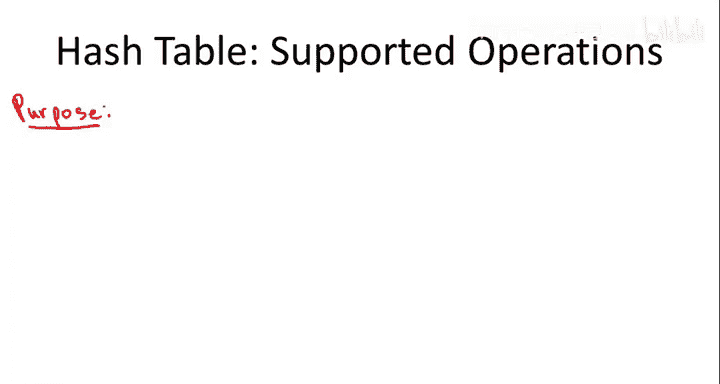
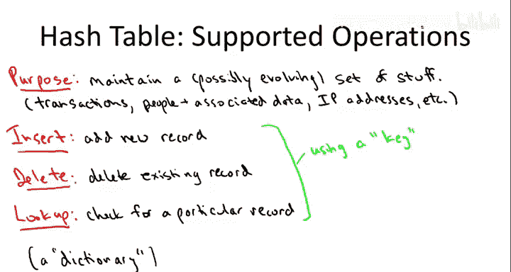
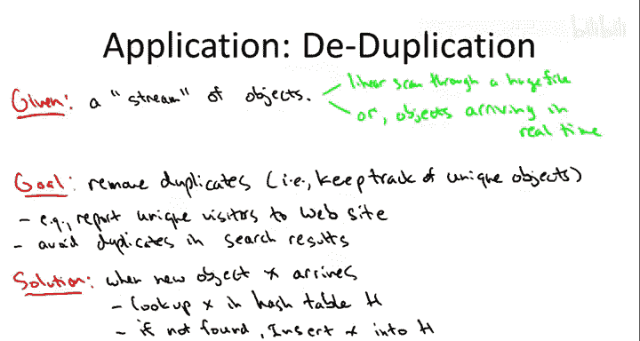
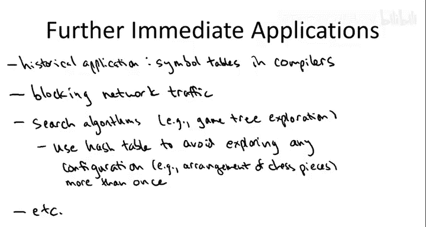

# 023：哈希表的操作与应用 🗂️

在本节课中，我们将要学习哈希表。我们将首先关注哈希表支持的操作以及一些典型的应用场景。

哈希表是一种极其有用的数据结构。如果你想成为一名专业的程序员或计算机科学家，学习哈希表是必不可少的。许多同学可能已经在自己的程序中使用过哈希表。有趣的是，哈希表支持的操作种类并不多，但它所支持的操作，其性能都非常出色。

## 什么是哈希表？ 🤔

从概念上讲，如果忽略所有实现细节，你可以将哈希表看作一个数组。数组的一个巨大优势是支持即时随机访问。例如，如果你想获取数组中第17个位置的元素，只需几条机器指令即可完成。同样，修改数组中第23个位置的内容也可以在常数时间内完成。

让我们考虑一个应用场景：你想记住朋友的电话号码。如果你的朋友们名字都是1到10,000之间的整数，那么你可以简单地维护一个长度为10,000的数组。例如，要存储你最好的朋友（编号173）的电话号码，只需使用这个数组中第173个位置即可。只要所有朋友的名字都是1到10,000之间的整数，这个基于数组的解决方案就非常完美。

然而，现实中你的朋友名字更有趣，比如Alice、Bob、Carol，还有姓氏。理论上，你可以为每一个可能遇到的名字（比如至少30个字母长的名字）在数组中预留一个位置。但这个数组会大到无法实现，其大小可能达到26的30次方。

因此，你真正需要的是一个大小合理的数组，比如几千个位置，其索引不是1到10,000的整数，而是你朋友的名字。你希望能够基于朋友的名字对这个数组进行随机访问。例如，你只需查找这个数组的“Alice”位置，就能在常数时间内获得Alice的电话号码。从概念层面讲，这就是哈希表能为你做的事情。

哈希表的内部实现有很多“魔法”，我们将在其他视频中讨论。你需要一个映射，将你关心的键（如朋友的名字）映射到某个数组的数值索引位置，这由所谓的**哈希函数**完成。如果实现得当，哈希表就能提供这种功能，就像一个其位置由你存储的键来索引的数组。

## 哈希表的目的与操作 📝

你可以将哈希表的目的理解为维护一个可能动态变化的“东西”的集合。当然，你维护的“东西”会因应用而异，可以是任何事物。例如，如果你运营一个电子商务网站，你可能需要跟踪交易记录；或者你可能需要跟踪人员信息，比如你的朋友及其相关数据；又或者你可能需要跟踪IP地址，以了解访问你网站的唯一访客。

更正式地说，哈希表的基本操作包括：
*   **插入**：向哈希表中插入数据。
*   **删除**：在许多（但非所有）应用中，需要能够删除数据。
*   **查找**：通常是最重要的操作。

所有这三个操作都是基于**键**进行的。键通常是所关注记录的唯一标识符。例如，对于员工，可以使用社会保险号；对于交易，可以使用交易ID号；IP地址本身就可以作为键。有时，你只跟踪键本身（例如，仅记录IP地址列表）。但在许多应用中，键会附带一堆其他数据（例如，员工的社会保险号附带其他员工信息）。当你进行插入、删除或查找时，都基于这个键。例如，在查找时，你将键输入哈希表，哈希表会返回与该键关联的所有数据。

有时，人们将支持这些操作的数据结构称为**字典**。哈希表的主要目的是支持类似字典的查找功能。但我觉得这个术语有点误导性，因为大多数字典是按字母顺序排列的，支持类似二分查找的操作。我想强调的是，哈希表**不维护**其存储元素的顺序。如果你需要基于顺序的操作（如查找最小值或最大值），哈希表可能不是合适的数据结构，你可能需要堆或搜索树。

但对于那些基本上只需要查找“某个东西是否存在”的应用，你应该立刻想到哈希表。它很可能是这类应用的完美数据结构。

## 哈希表的性能保证 ⚡

看到这些支持的操作，你可能会觉得哈希表能做的事情不多。但再次强调，它做的事情，做得非常、非常好。

哈希表提供的第一要义是以下惊人的保证：**所有操作（插入、删除、查找）都在常数时间内运行**。这就像将哈希表视为一个数组，其位置由你的键方便地索引。就像数组支持常数时间的随机访问一样，哈希表也让你能在常数时间内基于键进行查找。

当然，这里有两个重要的注意事项：
1.  **实现质量**：哈希表很容易被糟糕地实现。如果实现得不好，你就无法得到这个保证。这个保证是针对**正确实现**的哈希表而言的。如果你使用的是知名库中的哈希表，可以假设它实现得不错。但如果你需要自己实现哈希表和哈希函数（与我们将讨论的其他数据结构不同，有些同学在职业生涯中可能确实需要这样做），那么只有实现得好才能获得这个保证。我们将在其他视频中详细讨论“实现得好”意味着什么。
2.  **最坏情况保证**：与我们在本课程中解决的大多数问题不同，哈希表不提供最坏情况保证。你不能说对于任何可能的数据集，哈希表都能提供常数时间操作。实际情况是，对于**非病态数据**，在正确实现的哈希表中，你将获得常数时间的操作。

我们将在其他视频中进一步讨论这两个问题。目前，只需记住要点：在满足一些注意事项的前提下，哈希表能提供常数时间的性能。

## 哈希表的应用实例 🌟

我们已经介绍了哈希表支持的操作以及理解它们的方式，现在让我们将注意力转向一些应用。所有这些应用在某种意义上都是哈希表的简单使用，但它们都非常实用，经常出现。

### 应用一：去重（删除重复项）

第一个我们将讨论的典型应用是从一堆数据中删除重复项，也称为**去重问题**。

在去重问题中，输入本质上是一个对象流。这里的“流”可以有两种典型情况：
1.  你有一个巨大的文件（例如，网站运行日志或某天商店的所有交易记录），你正在逐行遍历这个文件。
2.  你随着时间的推移不断接收新数据（例如，部署在互联网路由器上的软件，数据包以极快的恒定速率通过路由器，你可能查看每个数据包中的发送方IP地址）。

你的任务是忽略重复项，只记住在这个流中看到的**不同对象**。不难想象为什么在各种应用中需要这样做。例如，运营网站时，你可能想跟踪某天或某周内的不同访客；进行网络爬虫时，你可能想识别重复文档并只记住一次（搜索引擎显然希望避免在搜索结果中显示指向不同URL的相同页面）。

使用哈希表的解决方案简单得可笑：
*   每当流中出现一个新对象，你就去哈希表中查找它。
*   如果它存在，那么它是重复的，忽略它。
*   如果它不存在，那么这是一个新对象，记住它（插入哈希表）。

就这样。当流结束后（例如，读完大文件后），如果你想报告所有唯一对象，哈希表通常支持线性扫描，你可以直接报告所有不同的对象。

### 应用二：两数之和问题

让我们继续看第二个应用，可能稍微不那么简单，但仍然很容易理解。这就是编程项目五的主题。

这个问题被称为**两数之和问题**。你被给予一个包含n个数字的数组（这些整数没有特定顺序）和一个目标总和T。你想知道，在这给定的n个整数中，是否存在两个整数之和等于T？

最明显和朴素的方法是检查输入中所有可能的整数对（共有 `n choose 2` 对），这显然是一个 `O(n²)` 的算法。

但我们可以做得更好。首先，看看如果不使用哈希表等数据结构，一个聪明的改进方案是什么：
1.  **第一步**：预先对数组进行排序（例如，使用归并排序或堆排序），时间复杂度为 `O(n log n)`。
2.  **第二步**：对于排序后数组中的每个元素x，我们寻找其互补元素 `T - x`。由于数组已排序，我们可以使用二分查找，每次查找耗时 `O(log n)`。我们对n个元素都进行这样的查找，因此第二步总时间为 `O(n log n)`。

这是一个非常不错的改进，从 `O(n²)` 提升到了 `O(n log n)`。但我们还可以做得更好。对于两数之和问题，我们没有理由受限于 `O(n log n)` 的下界。显然，因为数组未排序，我们必须查看所有整数，所以我们不可能做得比线性时间更好，但**我们可以通过哈希表实现线性时间**。

此时你可能会问，这个任务的什么线索提示我们应该使用哈希表？哈希表将极大地加速任何主要工作是**重复查找**的应用。如果我们检查 `O(n log n)` 的解决方案，一旦我们有了为每个x搜索 `T - x` 的想法，就会意识到，我们实际上只需要这个排序数组来支持查找。二分查找所做的就是查找。所以，第二步的所有工作都来自重复查找。我们为每次查找支付了对数级的时间，而哈希表可以在常数时间内完成。因此，重复查找——叮咚！——让我们使用哈希表。这确实为我们提供了该问题的线性时间解决方案。

基于哈希表的惊人保证，我们得到了两数之和问题的以下惊人解决方案（当然，同样受限于关于正确实现哈希表和非病态数据的注意事项）：
1.  **第一步**：不是排序，而是将数组中的所有元素插入哈希表。插入是常数时间，所以这一步是线性时间 `O(n)`。
2.  **第二步**：与 `O(n log n)` 解决方案一样，对于数组中的每个x，我们在哈希表中使用常数时间的查找操作寻找其匹配元素 `T - x`。
    *   如果对于某个x，你找到了匹配元素 `T - x`，那么你可以报告x和 `T - x`，证明确实存在一对整数之和为目标T。
    *   如果对于输入数组A中的每一个元素，你都没能在哈希表中找到匹配元素 `T - x`，那么肯定不存在和为T的整数对。

这个算法正确解决了问题。常数时间的插入使得第一步是 `O(n)` 时间，常数时间的查找使得第二步也是线性时间（至少在我们之前讨论的注意事项前提下）。

## 更多应用场景 💡

令人惊讶的是，计算机科学中有多少不同的应用本质上都可以归结为重复查找操作。因此，拥有像哈希表支持的这样超快的查找操作，使得这些应用能够扩展到惊人的规模。这确实令人惊叹，并推动了许多现代技术的发展。让我再举几个例子，如果你观察周围或做一些网络研究，很快会发现更多。

*   **编译器**：最初促使研究人员深入思考支持超快查找的数据结构，是在人们首次构建编译器时（大约20世纪50年代）。为了弄清楚之前定义了什么、没定义什么而进行的重复查找，成为早期编程语言中编译器的瓶颈。哈希表的早期应用之一就是支持超快查找，以加快编译时间，跟踪函数、变量名等。
*   **网络路由器**：哈希表技术对于互联网上的路由器软件也非常有用。例如，你可能想阻止来自某些源的网络流量。你可能怀疑某个IP地址已被垃圾邮件发送者接管，因此你想忽略来自该IP地址的任何流量，甚至不让它到达终端主机。路由器面临的任务本质上是一个查找问题：数据包以极快的速率到达，你需要立即查找它是否在黑名单中。如果是，则丢弃；如果不是，则放行。
*   **搜索算法加速**：这里的“搜索算法”指的是像国际象棋程序这样的博弈树探索。我们已经在本课程中讨论了很多关于图搜索的内容，但在讨论广度优先搜索和深度优先搜索时，我们考虑的是基本上可以写下来的图（可以存储在机器主内存或大型集群中）。然而，在国际象棋程序的背景下，你感兴趣的图比网络图大得多。图的节点对应于棋盘上所有可能的棋子配置，这是一个极其庞大的数字，你永远无法写下所有顶点。图中的边将带你从一个配置到另一个配置，对应于合法的移动。你无法写下这个图，因此不能像之前讨论的那样精确实现BFS或DFS。但你仍然想进行图探索，让你的计算机程序推理你下一步可能走的棋的短期影响。在图的搜索中，一个非常重要的属性是你不想做冗余工作，不想重新探索已经探索过的地方。如果你不能写下整个图，仅仅记住你去过的地方就突然变成了一个不简单的问题。但记住你去过的地方，从根本上说，就是一个查找操作。这正是哈希表的用武之地。更具体地说，在国际象棋程序中，你可以将探索过的每一个棋盘配置放入哈希表。在探索某个配置之前，你先在哈希表中查找是否已经探索过它。如果是，就不再费心去探索。这样，国际象棋程序就能在有限时间内系统地探索尽可能多的配置，而不会浪费任何工作重复探索同一个配置。

当然，这些只是冰山一角。我只是想强调几个看起来相当不同的应用，以说服你哈希表无处不在。它们无处不在的原因是，对快速查找的需求无处不在。令人惊讶的是，有多少技术仅仅是由重复的快速查找所驱动的。作为课后作业，我鼓励你思考一下自己的生活或世界上的技术，猜猜哈希表可能在哪里使某些东西运行得飞快。我想你不需要几分钟就能想出一些好例子。

## 总结 📚

本节课中，我们一起学习了哈希表的基础知识。我们首先将哈希表概念化为一个由键索引的数组，理解了它支持插入、删除和查找这三种基本操作，并且这些操作在理想情况下都能在常数时间内完成。我们探讨了哈希表性能保证的两个重要注意事项：实现质量和缺乏最坏情况保证。接着，我们通过去重和两数之和这两个典型问题，看到了哈希表在实际应用中的强大与简洁。最后，我们还了解了哈希表在编译器、网络路由和博弈树搜索等更广泛领域的应用，认识到快速查找是驱动许多现代技术的核心需求之一。哈希表因其高效的查找能力，成为了计算机科学中不可或缺的基础数据结构。