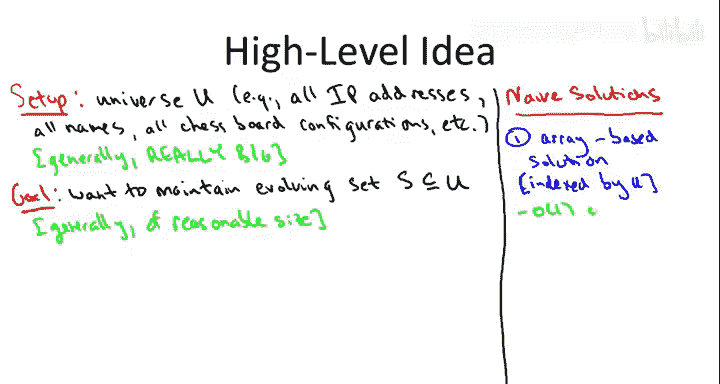
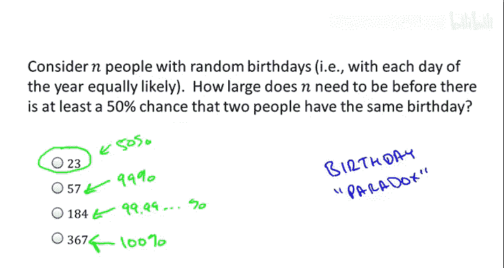
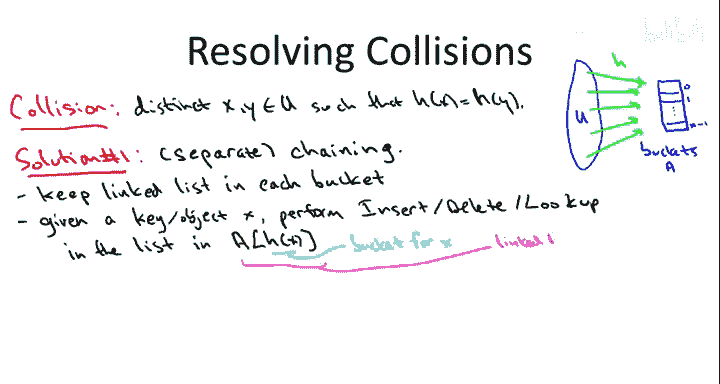

# 024：哈希表实现细节（第一部分）🔍

在本节课中，我们将深入探讨哈希函数的工作原理，并介绍其实现的一些高级原则。我们将学习哈希表如何通过巧妙的数组和函数设计，实现快速的插入、删除和查找操作，同时保持与存储数据量成比例的空间占用。

---

## 哈希表概述

哈希表的核心目标是支持超快速的查找操作。无论是记录网站交易、管理员工信息、追踪IP地址，还是存储国际象棋程序中的棋盘配置，哈希表都能让你高效地插入数据，并在之后快速判断某项数据是否存在。我们将讨论的实现通常也支持删除操作。哈希表能在常数时间内执行这些操作，但前提是哈希表被正确实现，并且数据在某种意义上不是“病态的”。

## 基本结构与挑战

在没有数据结构的情况下，维护一个动态集合的解决方案并不理想。

*   **基于数组的解决方案**：为宇宙中每一个可能存在的元素在数组中预留一个位置。这能实现常数时间的操作，但所需空间与宇宙大小成正比，这在许多应用中是不可行的。
*   **基于链表的解决方案**：只存储集合中实际存在的元素，空间与集合大小成正比。但查找一个元素是否存在，通常需要遍历大部分链表，所需时间与链表长度成正比。

哈希表的目标是结合两者的优点：既想获得基于数组方案的常数时间操作，又想获得基于链表方案的、与存储集合大小成正比的线性空间。

为了实现这个目标，我们将使用一个基于数组的方案，但这个数组不会很大。数组的长度 `n` 大约与我们存储的集合 `S` 的大小相当（例如，`n` 大约是 `S` 的两倍）。数组的每个位置被称为一个“桶”。

> **关于动态集合的说明**：集合 `S` 的大小会动态变化。为了简化讨论，本视频假设 `S` 的大小波动不大。在实际实现中，可以通过监控元素数量，在集合过大时扩容数组（例如翻倍并重新插入所有元素），在集合过小时缩容数组。这些是哈希表实现中的次要细节，本课将聚焦于核心原理。

## 哈希函数的作用

现在，我们有了一个空间合理的数组。接下来，我们需要一种方法，将我们关心的元素（如IP地址、姓名）映射到这个数组的特定位置。负责这种从宇宙中的键到数组位置转换的对象，就是**哈希函数**。

形式上，一个哈希函数 `h` 以键 `x`（如IP地址）作为输入，并输出该数组中的一个位置（索引，例如从0到 `n-1`）。哈希函数告诉我们应在哪个位置存储给定的键及其关联数据。

## 不可避免的冲突

哈希表实现中的一个根本性问题是**冲突**。当两个不同的键 `x` 和 `y` 被哈希函数映射到同一个桶时，就发生了冲突。

冲突是不可避免的。这可以用“生日悖论”来理解：即使哈希表非常空（例如只有1%的占用率），只要数据集的大小达到桶数量的平方根级别，就很可能发生冲突。例如，一个有10,000个桶的哈希表，仅需大约100个元素，就很可能出现冲突。

因此，我们必须有处理冲突的方法。

## 冲突解决方法

以下是两种最普遍的冲突解决方法。

### 方法一：链地址法

这是一种非常自然的解决方案，也相对容易进行数学分析。

**核心思想**：对于哈希到同一个桶的所有元素，我们回退到之前提到的基于链表的解决方案。每个桶不再只包含零个或一个元素，而是包含一个可以容纳任意数量元素的链表。

**操作实现**：要执行插入、删除或查找操作，只需将键哈希到对应的桶，然后在该桶内的链表中执行相应的链表操作。

**示例**：
*   桶0：`Alice -> NULL`
*   桶1：`NULL`
*   桶2：`Bob -> Daniel -> NULL` （Bob和Daniel发生冲突，存储在同一个链表中）
*   桶3：`Carol -> NULL`

### 方法二：开放定址法

这种方法在数学上分析更复杂，但在实践中非常重要。

**核心思想**：不为指针预留额外空间，每个桶只存储一个对象。如果尝试插入一个键时，其哈希值指向的桶已被占用，则按照一个预定的“探测序列”去检查其他桶，直到找到一个空桶为止。

**探测序列策略**：
*   **线性探测**：如果桶 `h(x)` 已满，则尝试桶 `h(x)+1`，然后 `h(x)+2`，依此类推。
*   **双重哈希**：使用两个哈希函数 `h1` 和 `h2`。首先尝试桶 `h1(x)`。如果已满，则尝试桶 `h1(x) + h2(x)`，然后 `h1(x) + 2*h2(x)`，依此类推。对于不同的键，`h2(x)` 提供了不同的偏移量。

## 方法选择建议

两种方法各有优劣，没有一种在所有情况下都占优。

*   **空间考量**：如果空间非常宝贵，可以考虑开放定址法，因为它避免了链地址法中链表指针带来的额外空间开销。
*   **删除操作**：在开放定址法中实现删除操作比在链地址法中更复杂。如果删除是关键操作，这可能使你倾向于选择链地址法。
*   **实践建议**：对于关键代码，最好的方法是两种都实现并进行性能测试，因为很难预测它们与内存层次结构等的交互情况。两者都在各自的情境中有用。

## 哈希函数的设计

到目前为止，我们还没有讨论哈希函数本身。它应该是什么样的函数？这是一个被广泛研究的问题，至今仍兼具艺术性与科学性。

---

本节课中，我们一起学习了哈希表的核心实现思想。我们了解到，哈希表通过一个大小适中的数组和哈希函数，将庞大的键空间映射到有限的桶中。我们探讨了冲突的必然性，并学习了两种主流的冲突解决方法：链地址法和开放定址法。最后，我们指出了哈希函数设计本身是一个关键且复杂的课题，为后续的深入讨论奠定了基础。