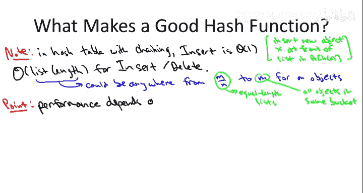
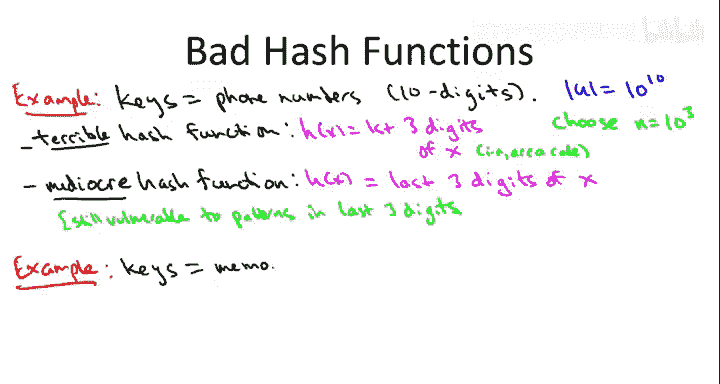
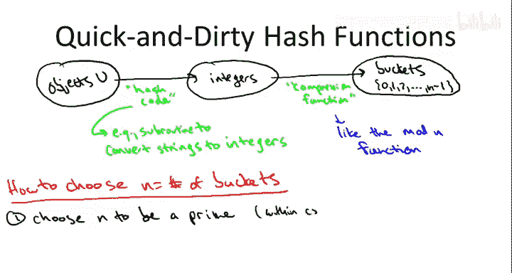

# 025：哈希表实现细节（第二部分）

在本节课中，我们将要学习哈希函数对哈希表性能的关键影响，探讨如何设计一个“好”的哈希函数，并了解一些在实践中需要避免的常见陷阱。

## 哈希函数的重要性

上一节我们介绍了哈希表的两种主要实现方式：链地址法和开放寻址法。本节中我们来看看，在这两种实现中，哈希函数如何直接影响操作的运行时间。

### 链地址法中的性能

在链地址法中，插入操作是常数时间的。这要求一个简单的优化：将新元素插入到对应桶的链表头部。

然而，查找和删除操作的运行时间则取决于对应桶中链表的长度。以下是其工作原理：
*   当查找一个键 `X` 时，我们首先计算 `H(X)` 来确定目标桶。
*   然后，我们需要在该桶的链表中进行线性搜索，以确定 `X` 是否存在。

因此，操作的运行时间与最长的链表长度成正比。哈希函数的质量决定了数据在各个桶之间的分布是否均匀。

### 开放寻址法中的性能

在开放寻址法中，没有链表。操作的运行时间由探测序列的长度决定，即为了找到目标键或一个空桶需要检查的桶的数量。

同样，探测序列的长度也取决于哈希函数。一个好的哈希函数应能均匀地分散数据，从而保持较短的探测序列。

综上所述，**哈希表的性能，无论采用哪种实现方式，都极大地依赖于所使用的哈希函数。**

## 理想哈希函数的特性

基于以上直觉，我们可以总结出一个理想哈希函数应具备的两个关键特性。

首先，它应能带来良好的性能。以链地址法为例，我们希望哈希函数能尽可能均匀地将数据分散到不同的桶中，使得所有链表的长度大致相等。对于开放寻址法，我们希望哈希函数能将数据均匀地分散到所有可能的探测位置上。

在哈希领域，数据均匀分布的“黄金标准”是**完全随机函数**。即，对于每个输入键，都独立、随机地将其映射到任意一个桶。

其次，哈希函数的**计算必须高效**。每次插入、删除或查找操作都需要计算一次哈希值。如果我们希望这些操作是常数时间的，那么哈希函数的计算也必须是常数时间的。

正是第二个特性使得我们无法真正实现完全随机的哈希。因为那意味着我们需要为每个插入的键“记住”其随机映射结果，这实际上退化成了朴素的基于列表的解决方案，计算哈希函数本身就需要线性时间。

因此，我们的目标是**两全其美**：一个可以用常数空间存储、在常数时间内计算，但同时又能像完全随机函数一样均匀分散数据的哈希函数。

## 糟糕的哈希函数示例

设计哈希函数是一门兼具艺术与科学的学问。如果你只从本视频中记住一件事，那就是：**设计糟糕的哈希函数非常容易，而糟糕的哈希函数会导致远比你预期要差的性能。**

以下是两个具体的糟糕设计示例。

### 示例一：基于电话号码的哈希

假设键是10位美国电话号码，我们选择 `N = 1000` 个桶。一个糟糕的哈希函数是取电话号码的前三位（即区号）作为哈希值。

这之所以糟糕，是因为来自同一地区的大量电话号码（如区号415）都会被映射到同一个桶（桶415），导致该桶的链表极长，而许多其他桶（对应无效区号）则完全空置，造成空间浪费和性能低下。

一个稍好但仍属平庸的哈希函数是取电话号码的最后三位。这假设了最后三位数字是均匀分布的，但现实中可能并非如此，仍可能存在不易察觉的模式导致分布不均。

### 示例二：基于内存地址的哈希

假设键是对象的内存地址（均为4的倍数，即为偶数）。我们同样选择 `N = 1000` 个桶。考虑使用取模运算作为压缩函数：`H(x) = x mod 1000`。

由于所有内存地址 `x` 都是偶数，而 `1000` 也是偶数，因此 `x mod 1000` 的结果也必然是偶数。这意味着哈希函数**永远无法输出奇数**，导致哈希表中至少一半的桶（所有奇数编号的桶）被保证是空的。

这个例子揭示了一个普遍问题：**如果所有数据元素都与桶的数量 `N` 共享一个公因子（例如都是2的倍数，且N也是2的倍数），就会导致大量桶必然空置。**

## 设计更好的哈希函数

现在我们已经了解了糟糕哈希函数的例子，自然会问：什么是好的哈希函数？设计一个好的哈希函数相当棘手。这里介绍一种常见且“不算明显糟糕”的快速设计方法，适用于大多数非关键场景。对于关键任务代码，则需要更深入的研究。

哈希函数的设计可以分解为两个步骤：
1.  **生成哈希码**：将非数值型键（如字符串）转换为一个（可能很大的）整数。
2.  **压缩函数**：将这个大的整数映射到桶的索引范围（`0` 到 `N-1`）内。

对于已经是数值的键（如社保号），可以跳过第一步。

### 生成哈希码（以字符串为例）

将字符串转换为整数有标准方法。一种常见思路是遍历每个字符，将其ASCII码值整合到一个累加和中。通常的作法是维护一个“运行总和”，对每个新字符，将当前总和乘以一个常数，然后加上新字符的值，必要时取模以防止溢出。这是一个非常简单的子程序。

### 压缩函数与取模法

最直接的压缩函数就是取模运算：`hash_code mod N`。它的优点是极其简单，易于编码和快速计算。

问题在于如何选择 `N` 以确保良好的数据分布。基于之前糟糕示例的教训，我们有以下经验法则：

**首要法则：选择 `N` 为质数。**
这可以最大限度地减少数据与 `N` 共享非平凡公因子的可能性，从而避免大量桶必然空置的问题。你总能找到一个与你计划存储的元素数量相近的质数作为 `N`。

**次要优化：`N` 不应太接近2的幂或10的幂。**
这是因为数据中的模式（如内存地址的低位、电话号码的十进制位）常常以2为底或10为底的数字形式出现。选择远离这些幂次方的质数，有助于更均匀地分散具有此类模式的数据集。

## 总结

本节课中我们一起学习了哈希函数的核心作用。我们了解到，哈希表的性能高度依赖于哈希函数能否将数据均匀分散到各个桶中。我们看到了设计糟糕哈希函数的例子（如直接使用电话号码区号），并理解了其导致的性能问题。最后，我们介绍了一种实用的哈希函数设计方法：将键转换为整数后，使用取模运算进行压缩，并强调应选择**质数**作为桶的数量 `N`，且最好远离2的幂和10的幂，以获得相对较好的分布效果。

需要牢记的是，本节介绍的是快速实现可用的方法，并非哈希函数设计的尖端技术。对于关键应用，务必进行更深入的研究、参考最佳实践，并通过原型测试来找到最适合你具体场景的实现方案。