# 001：-01-贪心算法简介 🎯

## 概述
在本节课中，我们将要学习一种新的算法设计范式——贪心算法。我们会将其置于更广阔的算法设计背景中，回顾已学的范式，并展望后续内容。同时，我们会探讨贪心算法的核心思想、特点，以及如何分析其正确性。

---

## 算法设计范式概览
在算法设计中，不存在能解决所有计算问题的“银弹”。因此，本课程的重点是讨论适用于不同领域、不同问题的通用技术，即算法设计范式。这些范式是跨越多种应用的高级问题解决策略。

以下是几个例子：
*   **分治算法**：我们在第一部分开始学习。典型例子是归并排序。其步骤是：将问题分解为更小的子问题，递归求解子问题，最后合并结果得到原问题的解。
*   **随机化算法**：我们在第一部分有所涉及。其思想是让代码内部进行随机选择。这通常能带来更简单、实用或优雅的算法，例如使用随机主元的快速排序算法。
*   **贪心算法**：这是我们将要讨论的下一个主要范式。这类算法迭代地做出“短视”的决策。
*   **动态规划**：这是本课程将讨论的最后一个范式，它是一种非常强大的技术，能解决我们之前提出的序列比对和分布式最短路径等核心问题。

---

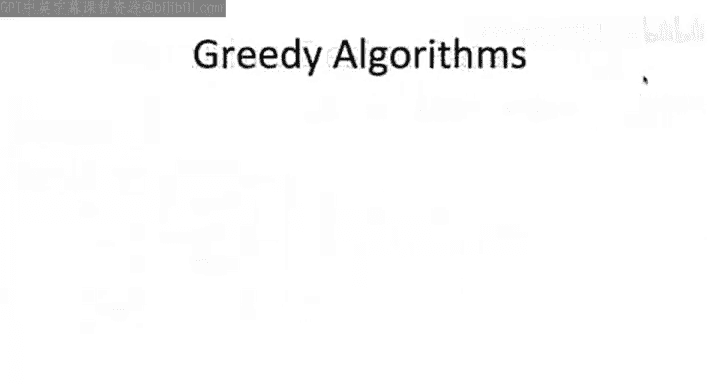

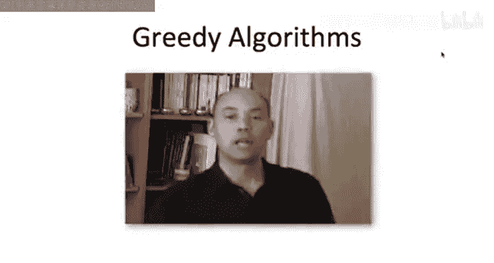

## 什么是贪心算法？🤔
我不会提供一个正式定义，因为关于哪些算法精确属于贪心算法一直存在争议。但我可以给出一个非正式描述，作为判断贪心算法的经验法则。

通常，贪心算法会做出一系列决策，每个决策都是**短视**的——即它**在当下看起来是个好主意**，然后你希望最终一切都能顺利。

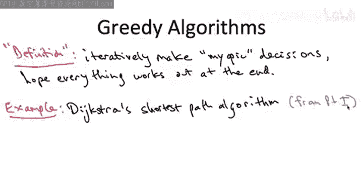

理解贪心算法的最佳方式是看例子，后续课程会提供多个案例。但我想指出，我们实际上已经在课程第一部分见过一个贪心算法的例子：**Dijkstra最短路径算法**。

### Dijkstra算法为何是贪心的？
回顾Dijkstra算法的伪代码，其核心是一个主while循环。算法在每次循环迭代中处理一个新的目标顶点。因此，对于n个顶点的图，总共有n-1次迭代。**算法对每个目标顶点只有一次计算最短路径的机会，之后不会再回头重新审视这个决策**。从这个意义上说，它的决策是**短视且不可撤销**的，这正是Dijkstra算法属于贪心算法的原因。

---

## 贪心算法范式的一般讨论
在深入探讨之前，让我们从更宏观的角度讨论贪心算法设计范式。这个讨论可能有些抽象，建议在看过几个例子后再回顾本节内容，届时理解会更深刻。

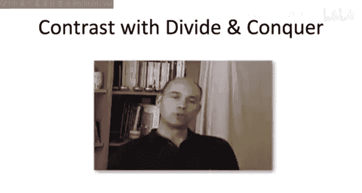

我将通过与我们已深入学习的**分治算法**范式进行比较和对比来展开。

以下是几个关键的对比点：

1.  **设计的难易程度**
    *   **贪心算法**：其优点（也是弱点）在于非常容易应用。通常很容易为一个问题构思出看似合理的贪心算法，甚至多个不同的版本。
    *   **分治算法**：通常构思一个合理的分治算法比较棘手。你往往需要一个“灵光一现”的时刻，才能找到正确分解问题的方式。

2.  **运行时间分析**
    *   **贪心算法**：分析其运行时间通常要简单得多。通常只需一行代码就能说明，例如，主要工作量由一个排序子程序主导，而我们知道排序需要 `O(n log n)` 时间。
    *   **分治算法**：分析其运行时间曾颇具挑战性。我们必须理解递归多层的运行时间，一方面问题规模在减小，另一方面子问题数量在增加。我们不得不借助主定理等强大工具来分析。

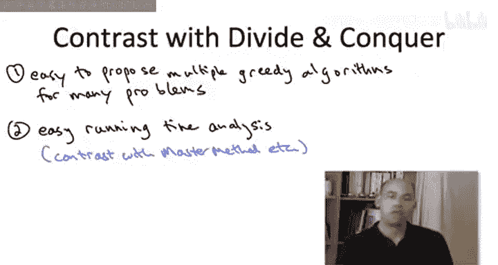

3.  **正确性证明**
    *   **贪心算法**：我们需要付出更多努力来理解其正确性。通常，即使对于一个正确的贪心算法，我们也很难直观理解它为何正确，更不用说如何证明。**许多看似自然的贪心算法其实是错误的**。
    *   **分治算法**：我们之前没有过多讨论正确性证明，因为它通常是一个相当直接的归纳证明。

---

## 贪心算法的不正确性：一个警示 ⚠️
为了让你立即体会到自然贪心算法普遍存在的不正确性，让我们回顾本课程第一部分关于Dijkstra算法的一个要点。

在证明Dijkstra算法正确时，我们做了一个重要假设：**图中所有边的长度都是非负的**。我们不允许负边长的存在。

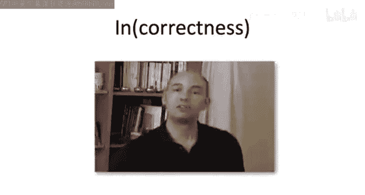

现在，通过一个小测验来回顾为什么Dijkstra算法在允许负边长时是**不正确**的，尽管它看起来如此自然。

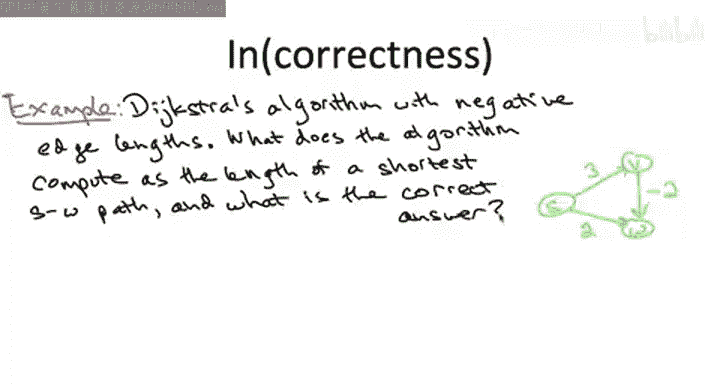

考虑一个简单的图，包含三个顶点S、V、W和三条边：
*   S -> V：长度为3
*   S -> W：长度为2
*   V -> W：长度为-2

**问题**：
1.  Dijkstra算法计算出的从S到W的最短路径距离是多少？
2.  实际上，从S到W的真正最短路径距离是多少？（路径长度是路径上各边长度之和）

**答案与分析**：
*   **实际最短路径距离**：从S到W有两条路径。直接路径S->W长度为2。间接路径S->V->W长度为3 + (-2) = 1。因此，实际最短路径距离是1。
*   **Dijkstra算法的输出**：根据其伪代码，在第一次迭代中，它会“短视”地找到离S最近的顶点。此时，W（距离2）比V（距离3）更近。因此，它会**不可撤销地**将S到W的最短路径距离计算为2，之后不会再考虑经由V的路径。所以，Dijkstra算法会错误地输出2。

这并不违背我们在第一部分证明的结论，因为那个证明的前提就是所有边长为非负。这个例子提醒我们：构思一个贪心算法很容易，尤其是自己构思时，你内心可能深信它总是正确的。但更多时候，你的贪心启发式方法可能仅仅是个启发式方法，在某些实例上会出错。

---

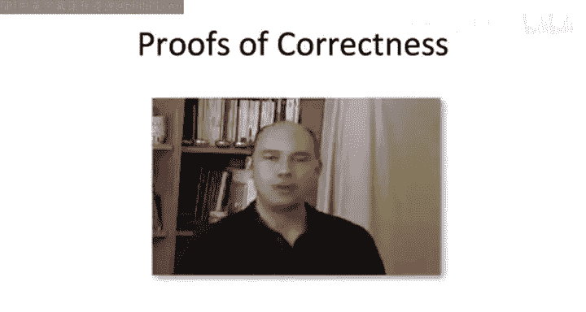

## 如何证明贪心算法的正确性？🔍
既然我已经提醒了你贪心算法设计的风险，现在让我们转向正确性证明。也就是说，如果你有一个实际上是正确的贪心算法（我们将在后续课程中看到一些著名例子），你如何确立这一事实？或者，如果你有一个贪心算法但不知道它是否正确，你该如何着手分析？

坦率地说，证明贪心算法的正确性更像是一门艺术而非精确科学。与分治范式那种公式化的方式不同，贪心算法的正确性证明需要更多创造力和一些特设的技巧。不过，其中仍有一些反复出现的主题和方法。

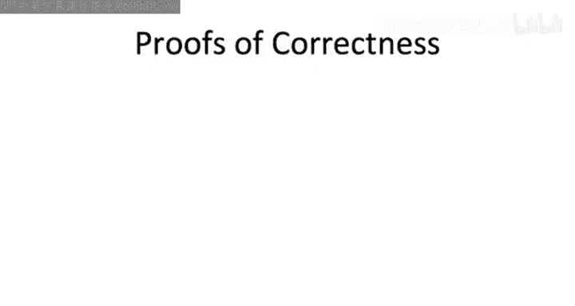

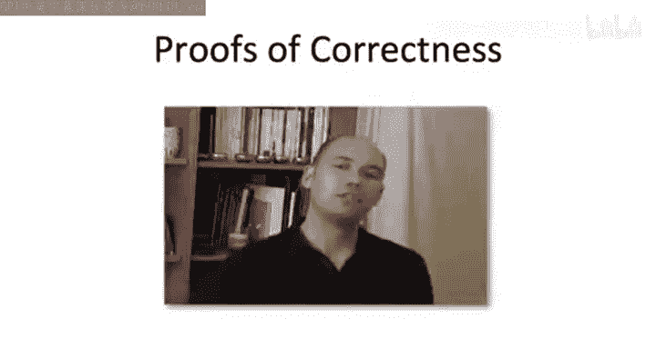

以下是两种常见的高级证明方法，建议在看过具体例子后再来回顾，理解会更清晰。

### 方法一：归纳证明（或“贪心保持领先”）
贪心算法会顺序做出一系列不可撤销的决策。这里的归纳将基于算法所做的决策进行。回顾我们对Dijkstra算法正确性的证明，那正是通过归纳进行的：我们归纳证明主while循环的每一次迭代。我们假设之前的所有计算都是正确的（归纳假设），然后证明当前迭代的计算也是正确的。通过归纳，算法所做的一切都是正确的。一些教科书称这种方法为“贪心保持领先”，意即你一步步证明贪心算法始终在做正确的事。

### 方法二：交换论证
这是另一种在许多情况下有效的证明方法。你尚未在本课程中见过交换论证的例子，所以我们接下来会通过交换论证来证明几个著名贪心算法的正确性。

它有两种常见的思路：
1.  **反证法思路**：假设贪心算法不正确，然后证明你可以取一个最优解，交换其中的两个元素，从而得到一个更好的解。这与你最初假设拥有一个最优解相矛盾。
2.  **转换思路**：逐步将一个最优解通过一系列“交换”操作，转换成贪心算法输出的解，并且在此过程中不使解变差。这表明贪心算法的输出实际上也是最优的。形式上，这可以通过归纳完成，归纳基础是将最优解转换为你的解所需的交换次数。

最后，我必须再次强调，证明贪心算法正确性没有太多固定公式。你通常需要相当有创造性，可能需要结合方法一和方法二，甚至需要完全不同的、任何严谨的证明方法。

---

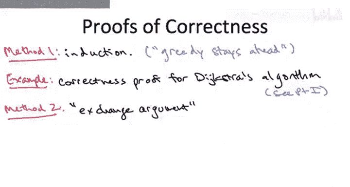

## 总结
本节课我们一起学习了贪心算法设计范式的入门知识。我们将其置于算法设计范式的全景中，理解了贪心算法通过一系列**短视、不可撤销的决策**来求解问题的核心特征。我们以Dijkstra算法为例说明了其贪心本质，并特别警示了贪心算法**常常不正确**的特性，尤其是在允许负边长的图中Dijkstra算法会失效。最后，我们探讨了证明贪心算法正确性的两种高级方法：**归纳证明**和**交换论证**，并指出这通常需要创造性的思维。在接下来的课程中，我们将通过具体例子深入实践这些概念。