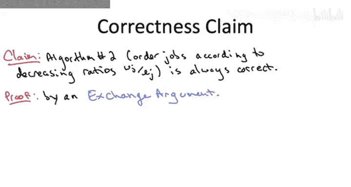
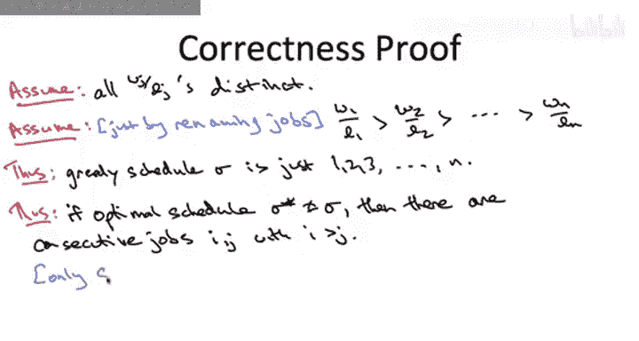
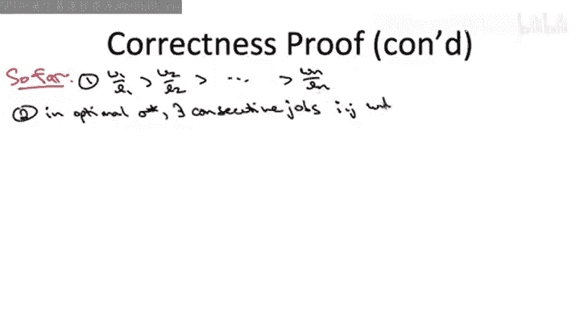
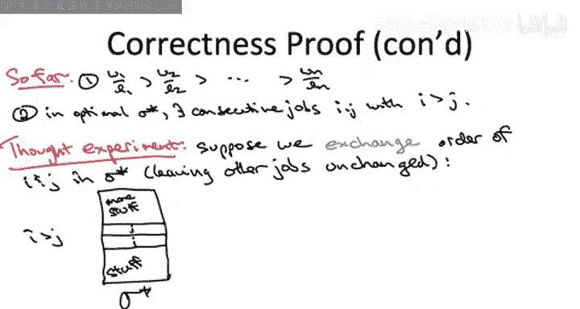

# 004：调度应用的正确性证明 - 第一部分

在本节课中，我们将学习如何证明我们设计的贪心算法的正确性，该算法旨在最小化加权完成时间之和。

## 概述

我们将证明我们设计的第二个贪心算法——即根据每个作业的权重与长度之比进行降序排序的算法——对于所有可能的输入都是正确的。这意味着它总能输出最小化加权完成时间之和的作业序列。

设计这个贪心算法并不困难，分析其运行时间（与排序相同，为 `O(n log n)`）也不难，但证明其正确性却相当棘手。我们将使用一种称为“交换论证”的方法来完成证明，这是贪心算法正确性证明中少数几个反复出现的原理之一。

## 证明计划

我们将从高层次概述证明计划，然后在后续幻灯片中深入细节。

首先，我们将固定一个任意的实例，即任意一组作业的权重和长度描述。由于我们必须证明算法总是正确的，因此我们只需在这个任意实例上证明其正确性。

对于没有比值相等的情况，我们将采用反证法进行证明。这意味着我们假设要证明的结论为假，并从中推导出明显错误或不一致的结论。

假设该主张为假，意味着存在一个实例，使得贪心算法没有产生最优解。也就是说，存在另一个未被贪心算法输出的解，其目标函数值优于贪心算法的解。

我们引入一些符号来设定这个场景。令 `Σ` 表示贪心算法生成的调度方案。如果我们的主张为假，则意味着 `Σ` 不是最优调度，存在另一个更优的调度方案，我们称之为 `Σ*`。

为了完成反证法证明，我们需要推导出明显错误的东西。我们将证明，从“贪心算法非最优且存在更优调度 `Σ*`”这一假设出发，可以构造出另一个比 `Σ*` 更优的调度方案（即具有更小的目标函数值）。为什么这是一个矛盾呢？因为根据假设，`Σ*` 是最优的。如果我们证明了存在比 `Σ*` 更优的方案，那么 `Σ*` 就不是最优的，这就完成了反证法证明。

## 深入细节

现在，让我们开始填充这个证明计划的细节，使其更加严谨。

在本视频及下一个视频中，我们将假设所有作业的权重与长度之比都是互不相同的。当然，在一般情况下，这可能不成立。我们将提供一个单独的处理比值相等情况的论证。

我将做出第二个假设，但与第一个假设不同，第二个假设没有实质内容，只是关于符号的约定。我假设通过重命名作业，使得作业1具有最高的比值，作业2具有第二高的比值，依此类推，作业n具有最小的比值。

由于这个符号转换，贪心调度方案变得非常简单：它首先调度作业1，然后调度作业2，接着是作业3，依此类推，直到作业N。

因此，我们有一个非平凡的假设（我们将单独处理比值相等的情况），以及一个平凡的假设（只是为了简化符号）。

现在，让我们推导一些有实质内容的东西。

## 关键观察

给定贪心调度方案就是按顺序 `1, 2, 3, ..., n` 调度作业，并且假设贪心解不是最优的，存在另一个不同的最优调度方案 `Σ*`。

我断言 `Σ*` 中必须包含一对连续的作业。也就是说，在调度方案 `Σ*` 中的某个位置，我可以找到一对连续执行的作业，使得这对作业中较早执行的那个作业具有较大的索引（即比值较低）。

我将这两个作业称为 `i` 和 `j`，其中 `i` 较早执行。由于最优解 `Σ*` 不同于顺序 `1, 2, 3, ..., N` 的调度，因此在调度中必然存在某处，两个连续执行的作业中，较早的作业 `i` 的索引比较晚的作业 `j` 的索引更大。

为什么这是真的？推理如下：唯一一个索引随着从最早作业到最晚作业执行而只增不减的调度方案，就是按 `1, 2, 3, ..., N` 顺序调度作业的方案。除了 `1, 2, 3, ..., N` 之外，没有其他调度方案具有索引始终递增的性质。因此，任何不同于 `1, 2, 3, ..., N` 的调度方案都必须包含一对连续的作业，其中较早的作业具有比较晚的作业更大的索引。

这个观察在证明的其余部分非常重要。请确保你花时间仔细思考并确信它是正确的。

## 交换论证的核心

现在，我可以解释交换论证中的“交换”了。

让我总结一下到目前为止讨论的两个关键点：

1.  我们改变了符号约定，使得索引越大，比值越小，而这正是贪心算法将输出的调度顺序。
2.  假设最优调度方案 `Σ*` 是其他方案，我们知道它包含一对连续的作业，其中较早的作业具有较大的索引。

请记住本视频第一张幻灯片中的高层次证明计划：我们正在进行反证法证明，需要推导出一个矛盾。我们将通过展示一个比 `Σ*` 更优的调度方案来实现这一点，从而与 `Σ*` 假定的最优性相矛盾。

我们如何做到这一点呢？通过一次交换。

这次交换将采取一个思想实验的形式。我们将取这个据称最优的调度方案 `Σ*`，然后仅交换作业 `i` 和 `j` 的顺序，而保持所有其他作业不变。

因此，`Σ*` 由各种作业组成，我们将其统称为“其他部分”，然后是作业 `i`，紧接着是作业 `j`，之后可能还有一些在 `j` 之后执行的作业。记住，我们可以选择 `i` 和 `j`，使得 `i` 的索引大于 `j`，尽管 `i` 被安排得更早。

然后我们执行这次交换。`i` 和 `j` 之前的部分与之前相同，`j` 和 `i` 之后的部分也与之前相同，但我们将让 `i` 和 `j` 以相反的顺序出现。

接下来我们必须理解的关键是：这次交换的后果是什么？代价是什么？好处是什么？这将是下一个视频的开始。

## 总结

在本节课中，我们开始学习如何证明最小化加权完成时间之和的贪心算法的正确性。我们概述了使用反证法和交换论证的证明计划。我们引入了符号约定，并推导出一个关键观察：任何不同于贪心顺序的最优调度中，必然存在一对连续执行的“逆序”作业（即索引较大的作业先于索引较小的作业执行）。基于此，我们提出了通过交换这对作业的顺序来构造更优解的思想。在下一节中，我们将详细分析这次交换对目标函数值的影响，从而完成证明。