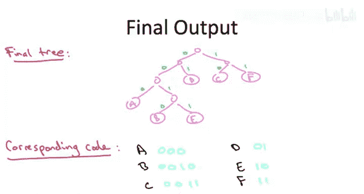

# 010：霍夫曼编码 - 一个更复杂的示例 🧩

在本节课中，我们将通过一个更复杂的示例，详细讲解霍夫曼贪心算法的执行过程。我们将使用一个包含6个字符的字母表，并演示如何一步步构建出最优前缀码。

为了确保霍夫曼贪心算法的过程清晰明了，我们将通过一个稍大、更复杂的示例来讲解。

我们使用一个包含6个字符的字母表。这些字符分别是A、B、C、D、E、F。
我们假设给定这些字符的权重分别为3、2、6、8、2、6。
请记住，即使这些权重之和不等于1，这个问题也是定义明确的。如果你更习惯使用实际概率，可以将这六个数字除以27。

## 第一步：合并最小权重的符号

在霍夫曼贪心算法的第一步中，我们找到具有最小权重（即最小频率）的字母。
在这个例子中，那就是字母B和E。它们的权重都是2。
接下来，我们将这两个字母合并成一个“元字母”，这实际上相当于现在就确定B和E在最终的树中将是兄弟节点。
合并之后，我们的字母表减少到五个符号。符号B和E被合并符号`B-E`取代，而`B-E`的权重是B和E的权重之和，即4。

我们可以想象我们的树通过这些迭代慢慢成形。所以在第一步之后，我们知道B和E将成为兄弟节点，并且我们知道A、C、D和F将成为叶子节点。到目前为止，我们只知道这些。

## 第二步：继续合并最小权重的符号

在下一步迭代中，我们再次寻找权重最小的两个符号。
这里，权重最小的符号是A，它的权重是3。其次是合并符号`B-E`，它的组合权重是4。这是当前五个符号中第二小的。
所以在这一步，我们将A与`B-E`合并。

现在我们的字母表减少到四个符号：合并符号`A-B-E`，其累积权重为7；以及原始符号C、D和F，它们保持原始权重6、8和6。

就我们的树而言，我们现在已经确定符号A将作为兄弟节点B和E的“叔叔”出现。同样，C、D和F，我们只知道它们最终会出现在树的某个叶子位置。

## 第三步：识别并合并新的最小权重对

在第三步中，我们将再次挑选权重最小的两个符号。
在这种情况下，权重最小的两个符号是C和F，每个的权重都是6。
在我们的新字母表中，我们仍然有符号`A-B-E`，权重仍为7。我们仍然有符号D，权重仍为8。但现在我们有了一个新的合并符号`C-F`，其新权重是12。

就我们的树而言，除了我们已经知道的信息外，我们现在还确定了C和F将在最终的树中成为兄弟节点。

## 第四步：构建更大的子树

在第四步，我们合并权重最小的两个符号。那将是权重为7的`A-B-E`和权重为8的D。
这使我们只剩下两个符号：`A-B-D-E`和`C-F`。现在我们知道最终树根的两个子树分别会是什么样子。

## 第五步：完成树的构建

现在我们只剩下两个符号，唯一能做的就是将这两个符号融合成一个。通过用一个共同的根节点将它们连接起来，将这两个子树融合成一个单一的树，这就得到了霍夫曼算法的最终输出。

## 生成前缀码

这个树对应什么样的前缀自由码？和往常一样，我们将所有左分支标记为零，所有右分支标记为一。
现在，和往常一样，一个字符的编码就是当你从根节点遍历到该叶子节点时看到的零和一符号序列。

以下是每个字符的编码：
*   A 编码为 `000`
*   B 编码为 `0010`
*   C 编码为 `10`
*   D 编码为 `01`
*   E 编码为 `0011`
*   F 编码为 `11`

## 总结

本节课中，我们一起学习了霍夫曼贪心算法在一个复杂示例上的完整应用过程。我们从六个带权重的字符开始，通过反复合并当前权重最小的两个符号，逐步构建出最优的二进制前缀码树。这个过程清晰地展示了贪心选择如何导向全局最优解，最终我们根据构建好的树为每个字符分配了唯一的二进制编码。