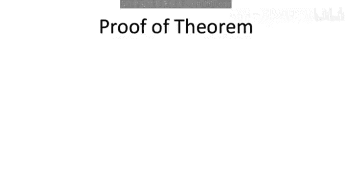
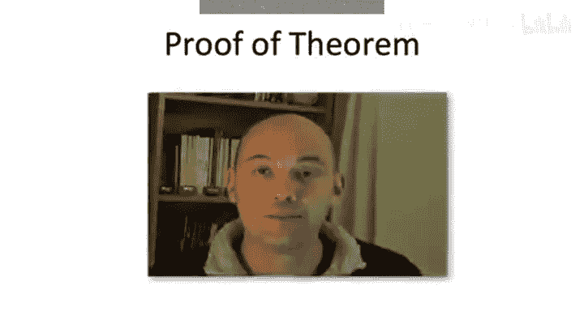
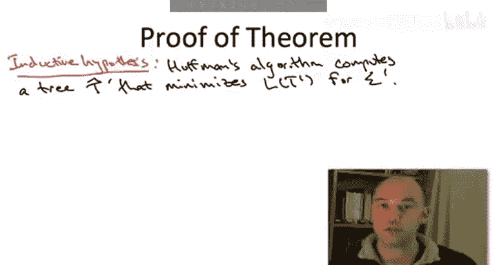
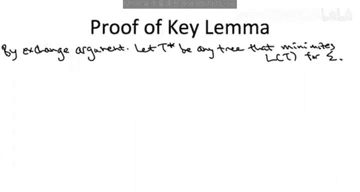
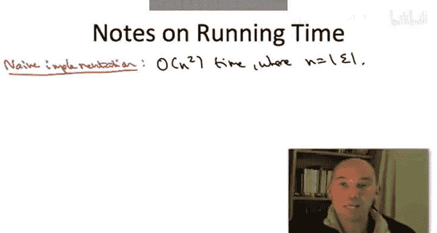
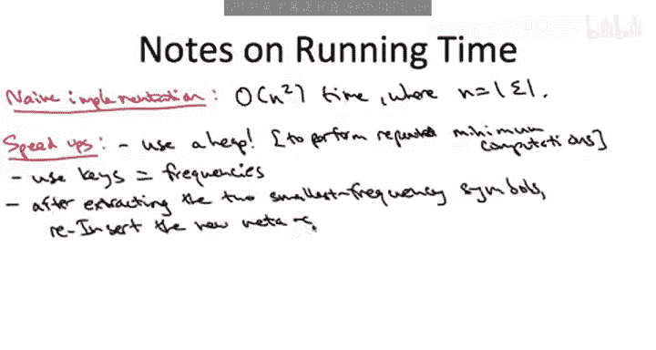

# 012：正确性证明 2






## 概述

在本节课中，我们将完成哈夫曼算法正确性的证明。我们将回顾归纳假设，理解递归调用如何帮助我们解决原始问题，并最终通过一个关键的交换引理证明：合并频率最低的两个符号A和B是安全的，因为总存在一个最优解使得它们是兄弟节点。

---

## 回顾与设定

上一节我们通过计算，建立了原始问题与合并A、B后子问题之间的对应关系。本节中，我们来看看如何利用归纳假设，并证明一个关键性质，从而完成整个证明。

我们拥有归纳假设：当哈夫曼算法递归地处理更小的字母表 Σ‘ 及其对应频率时，它能返回一个最优树 T‘_hat，该树能最小化关于 Σ‘ 的平均编码长度。



结合上一节的计算，我们知道：在原始字母表 Σ 的所有可行解中，存在一个子集 X_AB，其中的树都满足 A 和 B 是兄弟节点。并且，这个子集与子问题 Σ‘ 的所有可行解之间存在一一对应关系，且目标函数值（平均编码长度）只相差一个常数。

因此，递归调用在最小化子问题平均编码长度的同时，实际上也在最小化原始问题在子集 X_AB 上的平均编码长度。

---

## 关键问题与引理

现在的问题是：我们只优化了子集 X_AB 中的解，这足够吗？如果全局最优解根本不在 X_AB 中，那么我们的努力就白费了。

因此，证明的关键在于以下引理：

**关键引理**：对于任意字母表 Σ 及其频率，总存在一个最优前缀编码树（即平均编码长度最小的树），使得频率最低的两个符号 A 和 B 是兄弟节点。

如果这个引理成立，那么全局最优解就在子集 X_AB 中。既然我们的递归调用找到了 X_AB 中的最优解，那么这个解也就是原始问题的全局最优解。

---

## 引理证明：交换论证



我们将使用**交换论证**来证明这个关键引理。

1.  **选取任意最优树**：设 T_star 是原始问题的一个最优解（平均编码长度最小）。可能存在多个，任选其一即可。
2.  **定位最深兄弟节点**：在树 T_star 中，找到最深层的一对兄弟叶子节点，记为 X 和 Y。
3.  **执行交换**：通过交换叶子节点上的标签，构造一棵新树 T_hat。具体操作为：将 A 的标签与 X 的标签交换，同时将 B 的标签与 Y 的标签交换。
4.  **结果**：交换后，A 和 B 成为了兄弟节点（因为它们占据了原来 X 和 Y 的位置），并且 T_hat 仍然是一棵合法的、叶子节点标记为 Σ 中符号的编码树。

为了完成证明，我们需要证明 T_hat 的平均编码长度 **不大于** T_star 的平均编码长度。既然 T_star 是最优的，那么 T_hat 也必然是最优的，并且它满足 A 和 B 是兄弟节点的性质。

---

### 成本差异分析

让我们计算交换前后，平均编码长度（ABL）的变化。只有涉及符号 A, B, X, Y 的项会发生变化，其他项相互抵消。

设 `freq(s)` 为符号 s 的频率，`depth_T(s)` 为符号 s 在树 T 中的深度。

交换前后，ABL 的差值可以整理为：
```
Δ = ABL(T_star) - ABL(T_hat)
  = [freq(X) - freq(A)] * [depth_Tstar(X) - depth_Tstar(A)]
    + [freq(Y) - freq(B)] * [depth_Tstar(Y) - depth_Tstar(B)]
```

以下是分析每一项为何非负的原因：

*   `freq(X) - freq(A) ≥ 0`：因为 A 是频率最低的符号之一，所以 X 的频率不低于 A。
*   `depth_Tstar(X) - depth_Tstar(A) ≥ 0`：因为我们选择 X 位于最深层，所以 X 的深度不小于 A 的深度。
*   同理，`freq(Y) - freq(B) ≥ 0` 且 `depth_Tstar(Y) - depth_Tstar(B) ≥ 0`。

因此，`Δ ≥ 0`。这意味着 `ABL(T_star) ≥ ABL(T_hat)`。由于 T_star 是最优的，T_hat 不可能更好，所以实际上 `ABL(T_star) = ABL(T_hat)`。因此，T_hat 也是一个最优解，并且它满足 A 和 B 是兄弟节点。

**这就证明了关键引理**：总存在一个最优解，其中频率最低的两个符号是兄弟节点。

---

## 算法实现与复杂度

我们已经证明了哈夫曼算法的正确性。现在来看看如何高效地实现它。

### 朴素实现

如果直接按照伪代码实现，我们会得到一个递归算法。在每次递归调用中，我们需要找到当前频率最低的两个符号。这需要线性扫描时间。由于总共进行 n-1 次合并（n 为符号数量），总时间复杂度为 **O(n²)**。

### 使用堆优化

反复查找最小元素的操作提示我们可以使用**堆（Heap）**数据结构。以频率为键，将所有符号放入一个最小堆中。

以下是优化后的步骤：
1.  将所有符号及其频率插入最小堆。
2.  当堆中元素多于一个时：
    a.  弹出两个频率最小的元素（A 和 B）。
    b.  创建一个新的“元符号”，其频率为 `freq(A) + freq(B)`。
    c.  将这个新元符号插入堆中，它代表一个内部节点，其子节点为 A 和 B。
3.  堆中最后剩下的元素就是哈夫曼树的根节点。



每次堆操作（插入、删除最小元素）的时间复杂度为 O(log n)。总共进行 O(n) 次堆操作，因此总时间复杂度为 **O(n log n)**。这是一种非常高效且易于实现的迭代方法。

### 更快的实现（提示）

事实上，通过一次排序加上线性时间的处理，可以实现哈夫曼算法。基本思路是：
1.  首先将所有符号**按频率排序**。
2.  然后使用**两个队列**进行线性时间合并：
    *   一个队列（Q1）存放已排序的原始符号。
    *   另一个队列（Q2）存放新生成的元符号（内部节点）。
    *   每次合并时，只需比较 Q1 和 Q2 的队首元素，取出频率较小的两个进行合并，并将新节点放入 Q2。

这种方法在渐进复杂度上仍然是 O(n log n)（因为排序需要 O(n log n)），但常数更小。在某些特殊情况下（例如频率可以用少量比特表示，可以使用基数排序），甚至可以突破 O(n log n) 的下限。



---

## 总结

本节课中，我们一起完成了哈夫曼算法正确性的证明：

1.  我们利用归纳假设，将递归调用对子问题的优化，与原始问题中特定子集（A、B为兄弟的树）的优化联系起来。
2.  通过**交换论证**，我们证明了关键引理：总存在一个最优编码树，其中频率最低的两个符号是兄弟节点。这保证了合并它们是一个“安全”的贪心选择。
3.  因此，哈夫曼算法通过反复合并频率最低的符号，最终能构造出全局最优的前缀编码树。
4.  最后，我们讨论了算法的实现，指出使用**堆**可以将时间复杂度优化到 O(n log n)，并提示了利用**排序和双队列**可能获得更优的常数因子。

至此，哈夫曼算法——这个优雅而实用的贪心算法——的正确性得到了完整的阐述。