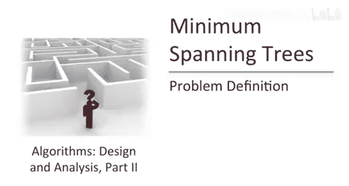
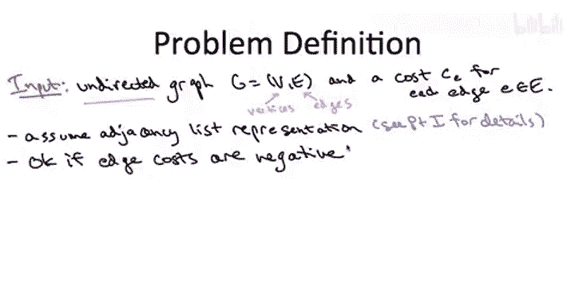

# 013：Prim最小生成树算法_MST问题定义 🌳

在本节课中，我们将学习贪心算法设计范式如何应用于一个基础的图论问题——计算最小生成树。最小生成树问题是贪心算法设计的绝佳实践场，因为几乎任何针对它设计的贪心算法似乎都能奏效。我们将介绍其中两个著名的算法，证明其正确性，并展示如何利用合适的数据结构实现它们，以达到极高的运行效率。

## 问题定义

上一节我们介绍了本课程的目标。本节中，我们来看看最小生成树问题的正式定义。

首先，让我们非正式地理解一下我们想要完成的任务。本质上，我们的目标是以尽可能低的成本将一系列点连接起来。在抽象问题中，这些对象可以代表非常具体的事物，例如计算机网络中的服务器；也可以代表更抽象的概念，例如将文档（如网页）建模为空间中的点，并希望以某种方式将它们连接起来。

我之所以花时间讲解最小生成树问题，主要是出于教学目的。它是一个极好的问题，可以磨练你的贪心算法设计和正确性证明技能。同时，它也为我们提供了另一个机会，来欣赏数据结构与图算法快速实现之间美妙的相互作用。当然，最小生成树问题也有实际应用，一个非常酷的应用是在聚类分析中，我将在后续视频中详细讨论。它也出现在网络领域，如果你搜索“生成树协议”，会找到相关信息。

正如开头所说，最小生成树问题的非凡之处在于，它不仅允许一个正确的贪心算法，事实上存在多个正确的贪心算法。我们将讨论其中最著名的两个，但除此之外，还有一些其他的算法。

我们将要讨论的第一个算法是Prim最小生成树算法。这个算法可以追溯到50多年前的1957年。你会发现，Prim算法与Dijkstra最短路径算法有着惊人的相似之处。因此，当你知道Dijkstra在几年后也独立发现了这个算法时，可能不会感到惊讶。但事实上，直到很久以后人们才注意到，这个完全相同的算法在25年前就已经被一位数学家Jarník首先发现了。因此，你有时会听到它被称为Jarník算法或Prim-Jarník算法。为了简洁并与该领域的一些主要教科书保持一致，我将在整个讲座中称其为Prim算法。

我们将要介绍的另一个同样著名的算法是Kruskal最小生成树算法。据我所知，这确实是Kruskal首先发现的，时间大约与Prim在50年代中期提出其算法的时间相同。

当我说这些算法“极快”时，是指它们几乎以线性时间运行，具体来说是图边数的线性时间。我们将看到，通过使用适当的数据结构，我们可以让每个算法在 **O(m log n)** 的时间内运行，其中 **m** 是图中的边数，**n** 是图中的顶点数。

我们将采用与加速Dijkstra算法完全相同的方式来加速Prim算法，即使用**堆**数据结构。Kruskal算法的一个很酷的地方在于，它将给我们一个机会来学习一种新的数据结构——**并查集**数据结构，这本身也很有趣。

为了让大家对这个惊人的运行时间有更直观的认识，我想强调，它不仅因为几乎线性而显得出色，而且计算生成树所需的时间几乎与读取输入图的时间一样多。请记住，仅读取输入图就需要线性时间 **O(m)**。此外，图可以有数量巨大的不同生成树，是指数级的数量。因此，这些算法在某种意义上是在“大海捞针”，它们没有时间检查所有的生成树，却能找到其中最优的那一个。

这些看似神奇的算法是如何做到的呢？为了讨论细节，让我们从下一张幻灯片开始，正式定义最小生成树问题。

## 输入与输出

上一节我们了解了问题的背景和意义。本节中，我们来具体看看最小生成树问题的输入和输出是什么。

在MST问题中，这是一个图问题，因此输入的主要部分是一个包含顶点和边的图。需要强调的是，对于MST问题，我们只考虑**无向图**。这与我们在课程第一部分讨论最短路径问题时不同，那时我们处理的是有向图。对于有向图，存在一个类似于最小生成树的问题，通常被称为“最优分支问题”，并且有快速的算法解决它，但这些算法略微超出了本课程的范围，因此我们不会涉及。我们只讨论无向图及其最小生成树。

每当讨论图问题时，都需要说明图是如何表示的，这是我们在第一部分详细讨论过的内容。如果你不记得了，我建议你回去复习关于图表示的视频。对于MST问题，我们假设图以**邻接表**的形式给出。这意味着我们给定一个顶点数组、一个边数组，并且有指针将顶点连接到其关联的边，也将边连接回其两个端点。

除了图本身，输入还包括每条边的**成本**。我们将使用符号 **c_e** 表示边 **e** 的成本。与我们对最短路径问题的讨论形成另一个对比的是，我们实际上并不关心边成本是正还是负，它们可以是任何数字。

输出应该是什么，这并不难猜，它就在问题定义中：输出应该是图的**最小成本生成树**。但让我们深入解释一下这具体意味着什么。

首先，我们所说的树的成本（通常是一个子图的成本，即边的子集）是什么意思？我们只是将输出树中所有边的成本**求和**。

另一个问题是，什么叫做“跨越所有顶点”的树？让我来确切地告诉你这意味着什么。这个子图 **T** 应该具有两个属性：
1.  它不能有任何**环**，即树中不能有任何循环。
2.  所谓“跨越所有顶点”，我的意思是这个子图是**连通**的。也就是说，使用 **T** 中的边，可以从图的任何一个顶点到达任何其他顶点。这就是“跨越所有顶点”的含义。

例如，考虑以下具有四个顶点和五条边的图。我给每条边标上了成本，在这个例子中只是1到5之间的整数。

以下是几个子图的例子：
*   让我们从三条边 **AB**、**BD** 和 **CD** 开始。这个子图满足属性1和2。也就是说，它没有环，并且跨越了所有顶点。如果你从这四个顶点中的任何一个出发，你都可以仅使用红色边到达其他三个顶点。因此，这个红色子图是一个生成树。然而，它并不是最小成本生成树。
*   存在另一个生成树，其成本更低，边成本之和更小，即边 **AC**、**AB** 和 **BD**。这个子图也没有环，也是连通的，但边成本之和仅为7，比上一个生成树的8要小。事实上，这个粉色子图是这个图中**唯一**的最小生成树。
*   存在一个具有三条边的子图，其边成本之和甚至更小，即三角形 **AB**、**BD** 和 **AD**。但这个浅蓝色子图，这个三角形，不是一个生成树。事实上，它在两个方面都不符合要求。它显然有一个环（循环），并且它也不连通。因此，无法仅通过浅蓝色边从顶点 **C** 到达其他三个顶点中的任何一个。所以它也不满足属性1。

因此，一般的MST问题是：给定一个无向图（例如这个四节点五边的图，或者在实际问题中可能是一个大得多的图），你需要快速识别出最小生成树，就像这个例子中的粉色子图那样。

## 简化假设

上一节我们明确了问题的输入和输出。本节中，为了便于讲解，我们将做出两个温和的简化假设。

这些假设并不重要，因为即使这些假设不成立，本讲座的所有结论仍然有效。但它们将使讲座更容易理解，让我们能够专注于要点，而不被不太相关的细节分散注意力。

以下是我们在所有关于最小生成树的讲座中将要做出的两个假设：

1.  **连通图假设**：我们假设输入图 **G** 本身是连通的。也就是说，**G** 包含从任一顶点到任何其他顶点的路径。
    *   **为什么做此假设？** 如果这个假设不成立，那么问题甚至没有明确定义。如果图不连通，那么它的任何子图当然也不连通，因此它没有生成树，我们不清楚要做什么。
    *   那些还记得我们在第一部分中涵盖的内容（特别是图搜索）的人应该认识到，这个条件很容易在预处理步骤中检查。只需运行广度优先搜索或深度优先搜索。我们知道如何在**线性时间**内实现这些算法，它们会特别告诉你输入图是否连通。
    *   你可能还会想，如果图不连通，我们是否应该放弃？你可以定义一个更通用的最小生成树问题版本，称为**最小生成森林**，基本上你想要一个成本最小的子图，尽可能多地连接各个部分。本质上，它负责在原始图的每个连通分量内计算一个生成树。使用我将在这里展示的算法（Prim算法、Kruskal算法），它们很容易修改以解决输入图不连通的更一般问题。但再次强调，为了简单起见，让我们只关注连通图的情况，它包含了所有主要思想。

2.  **边成本互异假设**：我们假设在输入图中，所有边的成本是**互不相同**的。
    *   从我们之前对调度算法的探讨中，你已经习惯了这种“无平局”的假设，我们将在这里做类似的事情。
    *   再次强调，这个假设并不重要，因为我们所涵盖的算法（Prim算法、Kruskal算法）即使输入中存在成本相等的边，无论平局如何打破，它们仍然是正确的。因此，这些算法在广泛意义上都是正确的。
    *   话虽如此，我实际上不会向你证明它们在存在平局的情况下也是正确的。请记住，在我们的调度应用中，在没有平局的情况下给出正确性证明要容易一些，我给出了那个证明。然后，可选地，有一个稍微复杂一些的论证来处理平局。你可以在这里做同样的事情，但我不会提供给你，我将留给热心的观众自己去研究。

---

本节课中我们一起学习了最小生成树问题的定义、输入输出形式以及为了简化讲解所做的两个基本假设。我们了解到，MST问题旨在为一个连通的无向图找到一个无环且连通（即跨越所有顶点）的子图，并且要求这个子图所有边的成本之和最小。我们还简要提及了即将学习的Prim和Kruskal这两个著名的贪心算法。在接下来的课程中，我们将深入探讨这些算法的具体步骤、正确性证明以及如何利用数据结构高效实现它们。