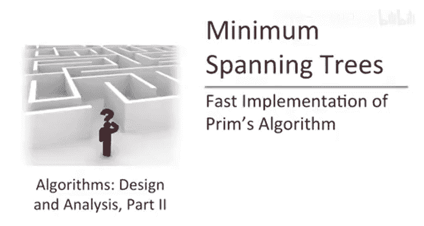
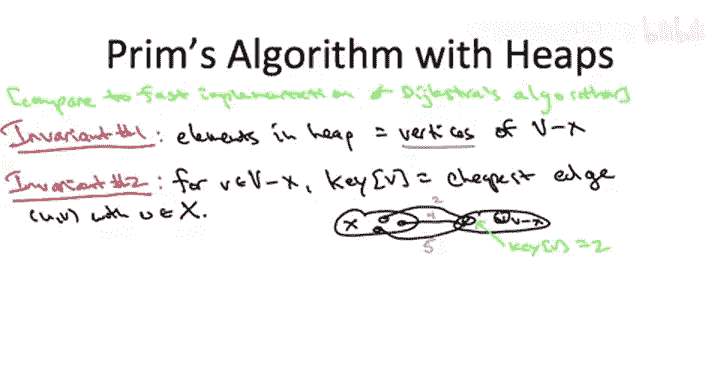

# 015：-15-_ 快速实现 1

## 概述
在本节课中，我们将要学习Prim算法的高效实现方法。我们已经理解了Prim算法的原理及其正确性，现在将转向实现细节和运行时间分析。我们将从分析朴素的实现开始，然后探讨如何通过使用堆数据结构，将算法速度提升至接近线性时间。

---

## 朴素实现分析
上一节我们介绍了Prim算法的正确性，本节中我们来看看它的实现效率。首先，让我们简要回顾Prim算法的伪代码。

Prim算法通过每次添加一条边来逐步生成树，每次迭代跨越一个新的顶点。它维护两个集合：**X**（已跨越的顶点集合）和**T**（已选中的边集合）。算法从一个任意顶点**s**和空集开始，在主循环的每次迭代中，向树中添加一条新边，并将该边跨越的新顶点加入**X**。当所有顶点都被跨越时，算法终止，并得到一个最小生成树。

如果我们直接按此实现算法，运行时间会是多少？

初始化步骤仅需常数时间，可以忽略。主循环的迭代次数恰好是 **n-1** 次，其中 **n** 是顶点数。每次迭代本质上是对所有边进行一次暴力搜索，寻找跨越当前割（即一端在**X**内，一端在**V-X**内）且成本最低的边。每次迭代可以在 **O(m)** 时间内完成，其中 **m** 是边数。

因此，总运行时间为 **O(m * n)**。这个时间复杂度已经是多项式级别，远优于检查所有可能的生成树（数量可能是指数级）。然而，我们总是可以问：能否做得更好？

---

## 使用堆进行加速
加速Prim算法的核心思想，与我们在第一部分加速Dijkstra算法时使用的思想完全相同：部署一个合适的数据结构。

Prim算法主循环中反复需要执行的操作是：在所有跨越当前割的边中找到成本最低的那条。这本质上是一个重复的最小值计算问题。而堆数据结构正是为此而生，它能高效支持重复的最小值计算。

让我们简要回顾堆的操作和运行时间：
*   堆存储一组对象，每个对象都有一个来自全序集（如数字、边成本）的键值。
*   堆支持的主要操作有：
    *   **插入**：将新对象及其键值插入堆中。
    *   **提取最小值**：移除并返回键值最小的对象。
    *   **删除**：从堆中删除任意指定对象。
*   所有这些操作都可以在 **O(log N)** 时间内完成，其中 **N** 是堆中对象的数量。

堆在底层通常实现为**完全二叉树**（逻辑上），并满足**堆性质**：每个父节点的键值都小于其子节点的键值。这使得最小值始终位于根节点，可以快速访问。插入或删除元素后，通过“上浮”或“下沉”操作来恢复堆性质。

现在，让我们回到如何巧妙使用堆来加速Prim算法的问题上。

---

## 堆的部署策略
我们的直觉是，因为Prim算法需要重复计算最小值（最便宜的跨越边），这正好是堆的专长。那么如何使用堆呢？

第一个不错的想法是**用堆来存储边**，键值就是边的成本，因为我们的最小值计算最终要选出一条边。这样，当我们从堆中提取最小值时，就能直接得到一条边。这已经是一个很好的改进，使用这种方式可以将运行时间提升至 **O(m log n)**。

然而，这里有一个小难点：Prim算法需要的不仅仅是最便宜的边，而是最便宜的**跨越当前割**的边。堆可能会给你一条很便宜的边，但它可能并不跨越当前割。因此，需要额外的检查来确保找到的边是跨越割的最小边。

我们将不深入探讨这种实现的细节，而是转向一种更巧妙、更实用的方法，这种方法与我们在Dijkstra算法中使用的快速实现非常相似。

---

## 更优的堆部署策略
关键点在于：我们**不用堆来存储边，而是存储顶点**。

更详细地说，我们的计划是维护两个不变式：
1.  **堆内容不变式**：堆中存储的是尚未被跨越的顶点，即 **V - X** 中的顶点。
2.  **键值不变式**：堆中每个顶点 **v** 的键值，定义为**所有连接 v 与集合 X 的边中成本的最小值**。如果不存在这样的边，则键值定义为 **+∞**。

通过图片可以更清楚地理解这个定义。在算法的某个快照中，我们有已跨越的顶点集合 **X**（左侧）和未跨越的顶点集合 **V - X**（右侧）。对于右侧的任意顶点 **v**，我们查看所有从 **v** 连接到左侧 **X** 的边，这些边跨越了当前割。顶点 **v** 的键值就是这些边中成本的最小值。

给定这种使用堆实现Prim算法的高级方法，我们现在需要思考几个问题：
1.  如何初始化堆，使得在算法开始时这两个不变式得到满足？
2.  如果不变式成立，我们如何快速且正确地模拟Prim算法主循环的每次迭代？
3.  在算法运行过程中，如何维护这些不变式？

---

## 初始化堆
首先，我们考虑如何在预处理步骤中设置堆，以满足两个不变式。

在算法开始时，**X** 仅包含一个任意的起始顶点 **s**。**V - X** 包含其他 **n-1** 个顶点。对于 **s** 以外的任意顶点 **v**，其初始键值就是连接 **v** 与 **s** 的边中成本的最小值（如果存在），否则为 **+∞**。

我们可以通过一次 **O(m)** 的边扫描来计算每个需要入堆的顶点的键值。然后，将这 **n-1** 个顶点插入堆中，插入操作的成本是 **O(n log n)**。

因此，初始化总成本为 **O(m + n log n)**。在渐近表示法中，由于我们假设图是连通的（否则不存在生成树），边数 **m** 至少为 **n-1**，所以 **m** 至少与 **n** 同阶，甚至更大。因此，**O(m + n log n)** 可以简化为 **O(m log n)**。

---

## 模拟主循环迭代
接下来，我们验证在不变式成立的前提下，如何通过堆操作来模拟Prim算法的主循环迭代。

通过构造，这一点将完美实现。我们设置堆和键值定义的方式，使得从堆中**提取最小值**的操作，能够忠实地模拟朴素实现中的暴力搜索。

具体来说，假设不变式成立，当我们从堆中调用 **extract-min** 时：
*   它提供给我们的就是下一个应该加入 **X** 的顶点。
*   同时，连接该顶点与 **X** 的成本最低的边，就是本次迭代中应该加入集合 **T** 的边。

可以这样理解：我们实际上是在用一场**两轮淘汰赛**来模拟朴素实现中的暴力搜索。
1.  **第一轮（本地优胜）**：对于割右侧（**V-X**）的每个顶点，它“记住”了连接它与左侧（**X**）的成本最低的边（即其键值）。这确定了每个顶点本地的“最佳候选边”。
2.  **第二轮（全局优胜）**：**extract-min** 操作在所有右侧顶点的本地优胜者中，找出成本最低的那一个。这条边就是跨越当前割的成本最低的边。

因此，通过一次 **extract-min** 操作，我们就找到了本次迭代需要添加的边和顶点。

---

## 总结
本节课中我们一起学习了Prim算法的高效实现。我们从分析朴素的 **O(m * n)** 实现开始，然后引入了堆数据结构来加速重复的最小值计算。我们探讨了两种使用堆的策略：存储边和存储顶点。重点介绍了一种更优的、基于存储顶点的策略，它通过维护两个关键不变式，并利用堆的 **extract-min** 操作，巧妙地模拟了算法的主循环，将运行时间提升至 **O(m log n)**。在下一节中，我们将继续探讨如何维护堆的不变式，以完成整个算法的实现。