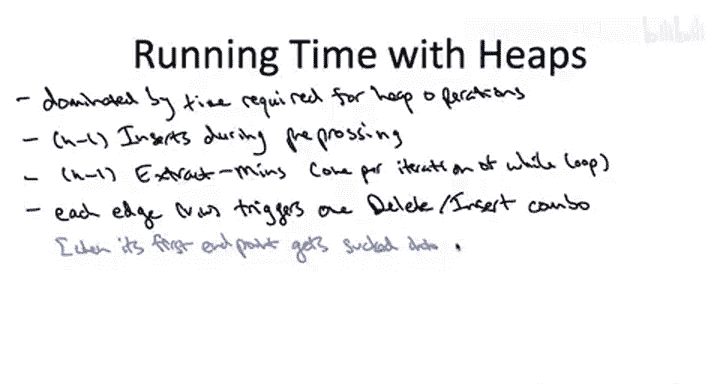

# 016：快速实现（第二部分）🚀

在本节课中，我们将要学习如何高效地实现Prim算法，特别是如何通过堆数据结构来维护算法运行过程中的关键不变量。我们将重点关注在每次迭代后，如何高效地更新堆中顶点的键值，以确保算法能持续找到正确的边。

---

## 概述

上一节我们介绍了使用堆来加速Prim算法的核心思想，即维护两个关键不变量，以便通过简单的 `extract-min` 操作找到每次迭代中跨越切割的最小边。本节中我们来看看，在执行了 `extract-min` 操作后，如何修复被破坏的不变量，特别是第二个不变量（每个不在集合X中的顶点的键值，等于连接该顶点与集合X中顶点的所有边中的最小成本）。我们将通过一个具体例子来理解问题，并给出修复不变量的伪代码，最后分析算法的整体运行时间。

---

## 通过例子理解键值更新

为了理解在维护不变量（特别是第二个不变量）时出现的问题，并确保我们对堆中顶点键值的定义有共同的理解，让我们来看一个例子。

在这个例子中，图中包含六个顶点。实际上，我们已经运行了Prim算法的三次迭代。因此，六个顶点中有四个已经在集合 **X** 中，剩下的两个顶点 **v** 和 **w** 尚未在 **X** 中，它们位于 **V - X** 集合里。对于五条边，我用蓝色标出了它们的成本；其他边的成本与本问题无关，因此无需考虑。

以下是需要回答的问题：
1.  根据我们为不在 **X** 中的顶点定义键值的语义，当前顶点 **v** 和 **w** 的键值应该是什么？
2.  在我们再运行一次Prim算法的迭代后，顶点 **w** 的新键值应该是什么？



正确答案是第四个选项。让我们看看原因。

首先，回忆一下键值的语义：键值应该是所有**一端连接该顶点，另一端跨越切割**的边中，成本最小的那条边的成本。

*   对于节点 **v**，有四条关联边，成本分别为1、2、4和5。成本为1的边没有跨越切割（因为它的另一端 **a** 也在 **V - X** 中），而成本为2、4和5的边跨越了切割。其中最便宜的是2，所以 **v** 当前的键值是2。
*   对于节点 **w**，有两条关联边，成本分别为1和10。成本为1的边没有跨越切割（因为它的另一端 **v** 也在 **V - X** 中），成本为10的边跨越了切割，并且是唯一的候选边，所以它的键值是10。

问题的第三部分问：当我们再执行一次Prim算法的迭代时会发生什么？Prim算法会将具有最小键值的边从右侧（**V - X**）移动到左侧（**X**）。**v** 的键值是2，**w** 的键值是10，因此 **v** 将被从右侧移动到左侧。

一旦发生这种情况，我们现在有了一个新的集合 **X**，其中包含了第五个顶点 **v**。新的 **X** 集合包含了除顶点 **w** 之外的所有顶点。

关键点在于，随着我们改变了集合 **X**，切割的边界也改变了。因此，跨越这个新切割的边集自然也不同了。有些边不再跨越切割，有些边则新成为跨越切割的边。

*   不再跨越切割的边是成本为4和5的边（连接 **v** 和 **X** 中已有的顶点）。任何连接刚被移动的顶点（**v**）和已经在左侧（**X**）中的顶点的边，现在都被“吸收”到了 **X** 内部。
*   另一方面，边 **v-w** 之前完全位于 **V - X** 内部，现在随着它的一个端点 **v** 被拉到左侧，它开始跨越切割。

我们为什么关心这个？关键在于 **w** 的键值现在改变了。它过去只有一条关联边跨越切割，即成本为10的边。现在有了新的切割，它有两条关联边跨越切割：成本为1的边和成本为10的边。这两条边中更便宜的是成本为1的边，这现在决定了它的键值，从10降到了1。

这个例子的启示是：一方面，设置堆来维护这两个不变量非常棒，因为一个简单的 `extract-min` 操作就允许我们实现Prim算法中之前的暴力搜索。但另一方面，提取操作会破坏原有状态，它打乱了我们键值的语义，我们可能需要为顶点重新计算键值。

---

## 修复不变量的伪代码

在下一张幻灯片中，我将展示一段伪代码，用于在不断演化的切割边界背景下重新计算键值。

幸运的是，在执行 `extract-min` 后恢复第二个不变量并不那么痛苦。原因是 `extract-min` 造成的破坏是局部的。

更具体地说，让我们思考哪些边现在可能跨越切割，而之前并没有。唯一改变集合成员身份的顶点是 **v**。因此，这些边必须是**与 v 相关联的边**。如果另一端点已经在 **X** 中，那么我们就不关心这条边了（它刚刚被吸收进 **X**）。但如果另一端点 **w** 不在 **X** 中，那么随着 **v** 被拉到左侧，现在这条边就跨越了边界，而之前并没有。

因此，我们关心的边就是那些**与 v 相关联，且另一端点 w 不在 X 中**的边。

我们的计划就是显而易见的那种：对于每个“危险”的顶点，即每个与 **v** 相关联且另一端点 **w** 不在 **X** 中的顶点，我们只需追踪到另一端点 **w**，然后重新计算它的键值。我们对所有相关的 **w** 都这样做。

必要的重新计算并不困难，基本上有两种情况。对于另一个端点 **w**，现在它多了一条候选边跨越切割，即那条也与刚移动的顶点 **v** 相关联的边 **v-w**。那么，要么这条新的边 **v-w** 是 **w** 最便宜的本地候选边，要么不是。我们只需取这两个选项中较小的那个。

以下是更新键值的核心逻辑，可以用伪代码表示：

```
当从堆中提取出顶点 v（即将其加入集合 X）后：
    对于每一条与 v 相连的边 (v, w)：
        如果 w 不在集合 X 中：
            计算边 (v, w) 的成本 c
            如果 c < w 当前的键值：
                将 w 的键值更新为 c
                （在堆中执行 decrease-key 操作）
```

---

## 算法概念描述与实现细节

这就完成了如何在整个基于堆的Prim算法实现中维护不变量一和二的概要描述。每次迭代中，你执行一次 `extract-min`，随后运行这段伪代码来恢复第二个不变量，这样你就可以为下一次迭代做好准备了。

对于那些不仅想从概念上理解这个实现，还想深入了解细节、做到尽善尽美的人来说，可能需要思考一个微妙的问题：如何实现从堆中删除一个元素？问题在于，从堆中删除通常需要给定位置，而这里我只谈到从堆中删除一个顶点，这并不完全匹配。实际上，更自然的说法是“从堆中删除位置 i 的顶点”。因此，要实现这一点，一个自然的方法是进行一些额外的簿记，以记住哪个顶点在堆中的哪个位置。对于注重细节的你们，这是值得思考的问题。但以上是对算法完整的概念性描述。

---

## 运行时间分析 🧮

现在让我们继续进行最后的运行时间分析。

第一个主张是，该算法的所有非平凡工作都通过堆操作进行。也就是说，只需计算堆操作的数量就足够了，我们知道每个堆操作都在对数时间内完成。

好的，让我们计算所有的堆操作。

1.  **初始化插入**：我们在预处理步骤中进行一系列插入操作来初始化堆。这最多是 **O(n)** 次插入。
2.  **主循环中的提取**：主 `while` 循环恰好有 **n-1** 次迭代，在每次迭代中我们恰好执行一次 `extract-min`。这又是 **O(n)** 次操作。
3.  **键值减少操作**：你应该关心的是那些由需要减少不在 **X** 中的顶点的键值而触发的堆操作（删除和重新插入）。确实，在Prim算法的一次迭代中，将单个顶点移入 **X** 可能需要大量的堆操作。因此，以正确的方式（即以边为中心的方式）来计算这些操作的数量很重要。主张是：图的**每条边最多只会触发一次** `decrease-key` 操作（即一次删除-重新插入组合）。我们甚至可以 pinpoint 发生这次删除和重新插入的时刻：它发生在**第一个端点**（无论是 **v** 还是 **w**）被吸入左侧集合 **X** 的那次迭代。这将为另一个端点触发插入-删除操作。当第二个端点被吸入左侧时，你就不关心了，因为另一个端点已经被从堆中取出，无需再维护其键值。


这意味着堆操作的数量最多是顶点数的两倍（初始插入和提取），加上边数的两倍（每条边最多触发一次 `decrease-key`）。我们再次利用输入图是连通的这一事实，因此边的数量在渐进意义上至少是顶点数量。所以我们可以说，堆操作的数量最多是边数 **m** 的一个常数倍。

正如我们所讨论的，每个堆操作的运行时间与堆中对象数量的对数成正比，在这种情况下是 **O(log n)**。因此，我们得到的总运行时间是 **O(m log n)**。

对于这个相当不简单的最小生成树问题来说，这是一个非常令人印象深刻的运行时间。当然，如果我们能去掉这个对数因子，达到线性时间，那就更好了。但我们对这个运行时间应该感到相当满意，它只比读取输入所需的时间慢一个对数因子。这与我们进行排序所得到的运行时间类型相同。实际上，这使得最小生成树问题成为了一个“几乎免费”的原语。如果你有一个图，它能放入计算机的主内存，这个算法是如此之快，以至于你可能都不知道为什么还要关心图的最小生成树——为什么不直接计算呢？它基本上是零成本的。这就是该算法的速度。


---

## 总结


本节课中我们一起学习了Prim算法高效实现的关键部分。我们首先通过一个具体例子，理解了在每次从堆中提取最小键值顶点后，其他顶点键值可能需要更新的原因。接着，我们给出了修复第二个不变量的核心逻辑和伪代码，其核心思想是：当顶点 **v** 加入集合 **X** 后，只需检查所有与 **v** 相连且另一端不在 **X** 中的顶点 **w**，并用边 **v-w** 的成本去尝试更新 **w** 的键值。最后，我们分析了算法的整体运行时间为 **O(m log n)**，这是一个非常高效的复杂度，使得求解最小生成树问题在实际应用中变得非常快速。