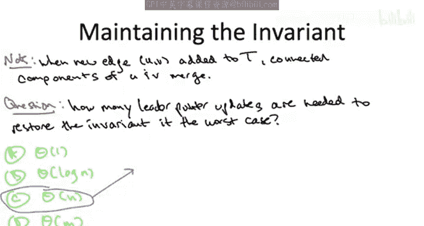
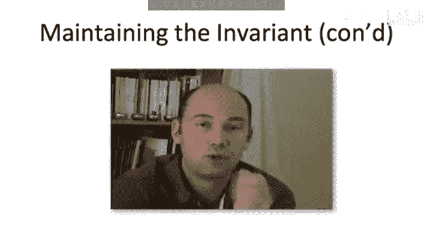
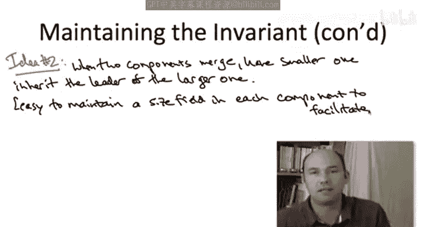
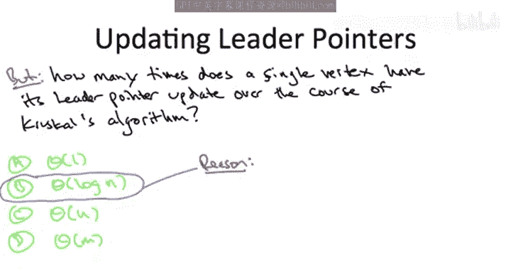
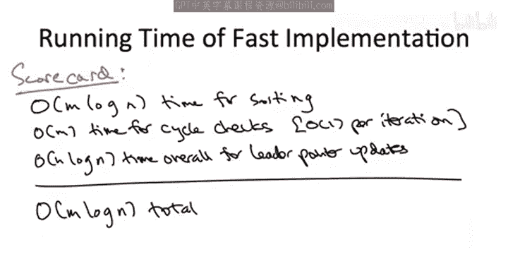

# 021：-21- 通过并查集实现克鲁斯卡尔算法 2

在本节课中，我们将学习如何使用并查集数据结构高效地实现克鲁斯卡尔算法，特别是如何以近乎常数的时间复杂度检查图中是否会形成环。我们将深入探讨并查集的核心思想、实现细节以及其时间复杂度分析。

## 🎯 目标与基本思想

我们的目标是在克鲁斯卡尔算法中，能够以常数时间检查添加一条边是否会形成环。

并查集数据结构实现的第一也是最基本的思想是：为每个连通分量（即克鲁斯卡尔算法当前已选边构成的组件）维护一个**链接结构**。所谓链接结构，是指图的每个顶点都有一个额外的指针字段。

此外，对于每个连通分量，我们将指定其中一个顶点（具体是哪个无关紧要）作为该分量的**领导者顶点**。

我们将维护一个关键的不变量：**给定顶点通过其额外指针，指向其所在连通分量的领导者顶点**。

例如，假设有两个不同的连通分量，一个包含顶点 U、V、W，另一个包含顶点 X、Y、Z。U 可能是第一个分量的领导者，X 是第二个分量的领导者。那么根据不变量，V 和 W 应该指向 U，U 指向自身；同样，Y 和 Z 指向 X，X 指向自身。

在这个设置中，一个非常简单的做法是：每个分量实际上继承了其领导者顶点的“名字”。我们通过代表顶点（即领导者）来指代一个分量。

令人惊讶的是，即使只是对连通分量搭建这样一个简单的框架，只要不变量得到满足，就足以实现常数时间的环检查。

## 🔍 如何进行环检查

检查添加边 (U, V) 是否会形成环，归结为检查 U 和 V 之间是否已经存在路径。而 U 和 V 之间已经存在路径，当且仅当它们位于同一个连通分量中。

给定两个顶点 U 和 V，我们如何知道它们是否在同一个连通分量中？我们只需分别跟随它们的领导者指针，看看是否到达同一个顶点。如果它们在同一个分量中，我们会得到相同的领导者；如果在不同分量中，则得到不同的领导者。因此，检查环只需要比较 U 和 V 的领导者指针是否相等，这显然是常数时间。

更一般地说，在这种并查集数据结构中实现 `Find` 操作的方法是：对于给定的顶点，只需跟随其领导者指针，并返回最终到达的顶点。

只要在这个简单的数据结构中，不变量得到满足，我们就实现了常数时间环检查的理想方案。

## ⚠️ 维护不变量的挑战

然而，数据结构中一个反复出现的主题是：每当执行一个会改变数据结构的操作时（例如，执行 `Union` 操作将两个分量合并），我们必须担心不变量是否会被破坏。如果会，如何在不做过多工作的情况下恢复不变量。

在克鲁斯卡尔算法的上下文中，情况如下：当我们愉快地进行常数时间环检查时，如果一条边会形成环，我们什么也不做，跳过该边，不改变数据结构，继续前进。

问题在于，当我们遇到一条不会形成环的新边时，克鲁斯卡尔算法要求我们将这条边加入正在构建的集合 T 中，这将**融合两个连通分量**。但请记住，我们有不变量：每个顶点都应指向其分量的领导者。如果原来有分量 A 和分量 B，它们都指向各自的领导者顶点，那么当这两个分量融合为一个时，我们必须更新一些领导者指针。具体来说，以前有两个领导者，现在必须只有一个，我们必须重新连接领导者指针以恢复不变量。

为了确保你理解这个重要问题，请思考以下问题：考虑在克鲁斯卡尔算法的某个时刻，添加一条新边导致两个连通分量融合为一个。为了恢复不变量，你必须进行一些领导者指针更新。在最坏情况下，可能需要更新多少个领导者指针？

答案是第三个选项：可能需要更新与顶点数 n 成线性关系的指针数量。一个简单的理解方式是：想象克鲁斯卡尔算法要添加到集合 T 的最后一条边，它将最后两个连通分量融合为一个。这两个分量可能恰好大小相同，各有 n/2 个顶点。从两个领导者指针减少到一个，其中一组 n/2 个顶点将不得不继承另一组的领导者指针。因此，其中一组中的 n/2 个顶点需要更新其领导者指针。

这令人沮丧，因为我们希望时间复杂度接近线性。但如果我们的每一次线性数量的边添加都可能触发线性数量的领导者指针更新，这似乎会导致二次时间复杂度。

## 💡 优化思路：按大小合并

不过，请记住，我介绍并查集数据结构时只说了第一个想法是“想法一”，想必还有“想法二”。这里就是，而且非常自然。如果你自己编写并查集数据结构的实现，你很可能会自然地做这个优化。

考虑分量 A 与分量 B 合并的时刻。这两个分量目前各有自己的领导者顶点，该组中的所有顶点都指向该领导者顶点。现在，当它们融合时，你要做的第一件显而易见的事情是：我们不必费心计算一个全新的领导者，而是直接重用组 A 或组 B 的领导者。这样，例如，如果我们保留组 A 的领导者，那么需要重新连接的领导者指针只来自分量 B。分量 A 中的顶点可以保持它们原来的领导者和领导者指针不变。

这是第一点：让两个分量的新并集继承其中一个组成部分的领导者。

现在，如果你要保留两个领导者中的一个，你会保留哪一个？也许一个分量有 1000 个顶点，另一个分量只有 100 个顶点。那么，给定选择，你当然会保留**更大**的那个分量的领导者。这样，你只需要重新连接第二个较小分量的 100 个领导者指针。如果你保留了第二个较小分量的领导者，你将不得不重新连接第一个分量的 1000 个指针，这看起来既愚蠢又浪费。因此，实现合并的明显方法是：**总是保留较大分量的领导者，并重新连接较小分量中所有顶点的指针**。

你应该注意到，为了实际实现这种“总是保留较大分量的领导者”的优化，你必须能够快速确定两个分量中哪个更大。但你可以通过扩充我们讨论过的数据结构来方便地做到这一点：只需为每个分量记录其中包含多少个顶点，即为每个分量维护一个 `size` 字段。这允许你在常数时间内检查两个不同分量的人口，并在常数时间内找出哪个更大。同时注意，当你融合两个分量时，很容易维护 `size` 字段，它只是两个组成部分大小之和。

## 🔄 重新审视最坏情况

现在让我重新审视之前幻灯片上的问题：在最坏情况下，考虑到这种优化，合并两个分量时，你可能需要重新连接多少个领导者指针（渐近意义上）？

不幸的是，答案仍然是第三个选项。原因与上一张幻灯片完全相同：仍然可能发生这样的情况，例如在克鲁斯卡尔的最后一次迭代中，你合并的两个分量大小都是 n/2。所以，无论你选择哪个领导者，你都将不得不更新 n/2 个或 θ(n) 个顶点的领导者指针。

因此，虽然这显然是一个聪明的实用优化，但在我们对运行时间的渐近分析中，它似乎并没有为我们带来任何好处。

## 🧠 换个角度：顶点视角的分析

然而，如果我们以下面不同的方式思考所有这些领导者指针更新所做的工作呢？

与其询问一次合并可能触发多少次更新，不如采用**以顶点为中心的视角**。假设你是这个图中的一个顶点。

最初，在克鲁斯卡尔算法开始时，你处于自己孤立的连通分量中，你指向自己，你是自己的领导者。然后，随着克鲁斯卡尔算法的运行，你的领导者指针会周期性地被更新。在某个时刻，你不再指向自己，而是指向某个其他顶点；然后，在某个时刻，你的指针再次被更新，指向另一个顶点，依此类推。

考虑到我们的新优化，在整个克鲁斯卡尔算法的过程中，你作为图中的一个顶点，你的领导者指针会被更新多少次？

答案非常酷，是第二个选项：**对数次**。

虽然“总是让两个组的并集继承较大组的领导者指针”这一规则下，一次合并仍然可能触发线性数量的领导者指针更新，但**每个顶点在整个克鲁斯卡尔算法过程中，只会看到其领导者指针被更新对数次**。

原因是什么？假设你是一个顶点，你在某个组中，该组可能有 20 个顶点。现在，假设在某个时刻，你的领导者指针被更新了。为什么会发生这种情况？这意味着你的 20 个顶点的组与某个其他更大的组合并了。请记住，只有在合并中你处于**较小**的组时，你的领导者指针才会被重新连接。所以你加入的组至少和你原来的组一样大。因此，你的新连通分量的大小至少是你之前的两倍。

所以结论是：**每当你作为一个顶点，你的领导者指针被更新时，你所属的分量的人口至少是之前的两倍**。你从一个大小为 1 的连通分量开始，一个连通分量不可能有超过 n 个顶点。因此，你可能需要承受的翻倍次数最多是 log₂ n。这就限制了你作为图中一个顶点将看到的领导者指针更新次数。

## ⏱️ 运行时间分析

基于这个非常酷的观察，我们现在可以对使用并查集数据结构的克鲁斯卡尔算法进行良好的运行时间分析。

当然，我们没有改变预处理步骤：我们仍然在算法开始时将边从最便宜到最昂贵进行排序，这仍然需要 O(m log n) 时间。

除了这个排序预处理步骤之外，我们还需要做什么工作？从根本上说，克鲁斯卡尔算法就是关于这些环检查。在 for 循环的每次迭代中，我们必须检查添加给定边是否会与我们已添加的边形成环。整个并查集框架（这些链接结构）的意义在于，给定一条边，我们可以通过查看其端点的领导者指针，在常数时间内检查环——当且仅当它们的领导者指针相同时，才会形成环。因此，对于环检查，在 O(m) 次迭代中，每次我们只做常数时间的工作。

但最后的工作来源是维护这个并查集数据结构：每次我们向集合 T 添加一条新边时，都要恢复不变量。这里的好主意是：我们不会仅仅限制每次迭代中这些领导者指针更新的最坏情况运行时间，因为那可能太昂贵（一次迭代就可能达到线性）。相反，我们将进行**全局分析**，考虑所有领导者指针更新的总次数。在上一张幻灯片中我们观察到，对于单个顶点，它只会经历对数次的领导者指针更新。因此，对于所有 n 个顶点，领导者指针更新的总工作量仅为 O(n log n)。

所以，尽管我们可能在这个 for 循环的某一次迭代中完成线性数量的指针更新，但我们在领导者指针更新的总次数上仍然有这个 O(n log n) 的全局上界，这非常酷。

回顾这个统计，我们观察到了一个惊人的事实：**克鲁斯卡尔算法这个实现的瓶颈实际上是排序**。我们在预处理步骤 O(m log n) 中做的工作比在整个 for 循环 O(m + n log n) 中做的还要多。因此，我们得到了 O(m log n) 的总体运行时间上界，这与我们使用堆实现的普里姆算法所达到的理论性能相匹配。

## 📝 总结

本节课中我们一起学习了如何通过并查集数据结构高效实现克鲁斯卡尔算法。我们首先介绍了并查集的基本思想，即为每个连通分量维护领导者指针以实现常数时间的环检查。接着，我们探讨了在合并分量时维护不变量的挑战，并引入了“按大小合并”的优化策略。通过从顶点视角进行全局分析，我们证明了每个顶点的领导者指针最多更新 O(log n) 次，从而得出算法总时间复杂度为 O(m log n)，其中瓶颈在于边的排序操作。与使用堆的普里姆算法一样，克鲁斯卡尔算法在实践中也具有很强的竞争力。