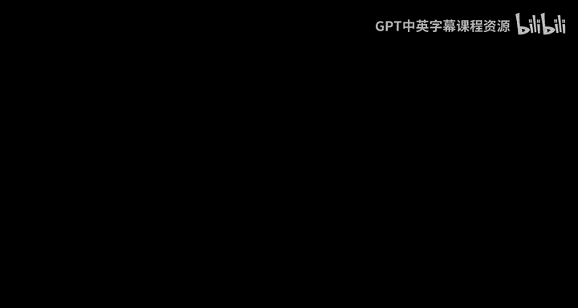
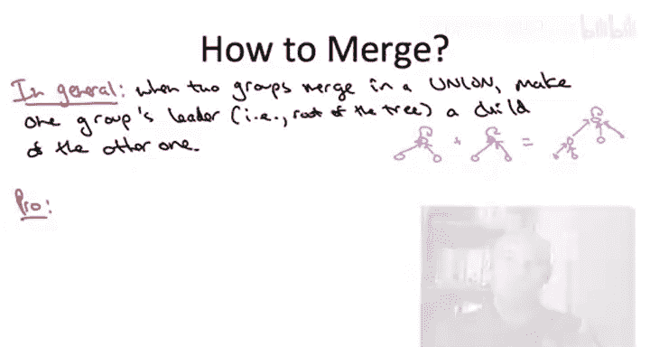

# 022：惰性合并

在本节课程中，我们将学习并查集数据结构的一种高级实现方法，即“惰性合并”策略。我们将探讨其核心思想、实现方式以及性能分析。

首先，需要明确几点。本节内容属于高级选学材料，因此要求学习者具备更强的学习动力。讲解将保持清晰，但某些细节可能需要学习者暂停思考以加深理解。本节重点在于数据结构设计背后的思想深度和性能分析，而非其应用场景。初次接触这些内容感到困惑是正常的，这代表着一个提升理解能力的机会。

现在，让我们回顾一下并查集数据结构的基本概念。

## 并查集回顾 🔄

并查集用于维护一组对象的动态划分。在Kruskal最小生成树算法的快速实现中，我们曾讨论过它。

数据结构支持两个核心操作：
*   **查找**：给定一个对象，返回其所在集合的名称（即代表元）。
*   **合并**：给定两个对象，将它们所属的集合合并为一个。

我们之前学习过一种实现方式：为每个集合维护一个链表结构，集合中所有对象都直接指向其代表元。这种实现下，查找操作是常数时间的，但合并操作需要更新较小集合中所有对象的指针。通过“按大小合并”的优化，可以保证一系列n次合并操作的总时间复杂度为**O(n log n)**。

在本系列视频中，我们将探讨一种不同的实现方法。

## 惰性合并策略 🦥

我们的新目标是：尝试在每次合并操作中，只更新一个指针。

让我们通过一个简单的例子来理解这个想法。假设有6个对象，初始分为两个集合：{1,2,3}（代表元为1）和{4,5,6}（代表元为4）。

在旧实现中，合并这两个集合（假设新代表元为4）需要更新对象1、2、3的指针，使它们都直接指向4。

新想法很简单：我们只更新其中一个集合代表元（例如1）的指针，让它指向另一个集合的代表元（4）。这样，对象2和3仍然指向1，但通过1的新指针，它们间接地以4为新的代表元。结果我们得到了一棵更深（两层）的树，而非所有节点都直接指向根节点的浅层树。

在数组表示法中，这体现为：合并前，数组`parent`为`[1,1,1,4,4,4]`。旧方法合并后变为`[4,4,4,4,4,4]`。新方法合并后，只更新`parent[1] = 4`，数组变为`[4,1,1,4,4,4]`。

### 一般情况下的合并操作

一般情况下，给定两个对象，它们各自属于某个集合，这些集合可以看作是以代表元为根的有向树。合并时，我们找到两个对象所在树的根节点`r1`和`r2`，然后将其中一个根节点的父指针指向另一个根节点，即将一棵树安装为另一棵树的子树。

以下是合并操作的一般步骤：
1.  对给定对象`x`和`y`，分别执行**查找**操作，找到它们的根节点`root_x`和`root_y`。
2.  如果`root_x`不等于`root_y`，则将`root_x`的父指针指向`root_y`（或反之）。这仅涉及一次指针更新。

### 惰性合并的权衡

惰性合并方法的优点在于合并操作本身（在找到根节点后）非常简洁。但需要注意的是，合并操作的成本主要在于两次查找根节点的过程，而不仅仅是最后那一次指针更新。

这种方法的主要问题在于，查找操作不再显然是常数时间。因为父指针不再直接指向根节点，所以从给定对象`x`出发，可能需要遍历一系列父指针才能到达根节点。

由于这些权衡，惰性合并方法是否是一种好策略、能否带来收益，并不显而易见。这需要相当微妙的分析，也是后续课程的重点。此外，它还需要一些优化，下一节视频将介绍第一个优化——“按秩合并”。你可能会想，当进行合并并需要将一棵树的根安装到另一棵树下时，该如何选择哪棵树的根作为子节点？正确的答案就是“按秩合并”。

## 总结 📝

本节课我们一起学习了并查集数据结构的“惰性合并”高级实现策略。我们回顾了并查集的基本操作，并引入了新方法的核心思想：在合并两个集合时，只更新一个指针（将一个集合的根节点指向另一个集合的根节点），而不是更新较小集合中的所有指针。我们通过例子和数组表示法理解了这一过程，并分析了其带来的权衡——合并操作看似简单，但查找操作的成本可能增加。这引出了对性能进行深入分析以及引入进一步优化（如按秩合并）的必要性。