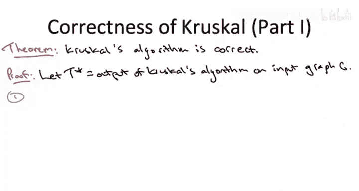
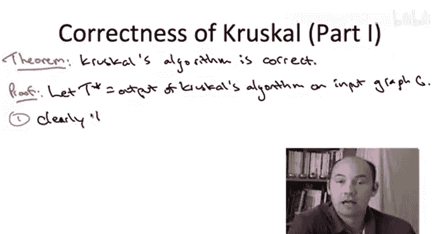

# 023：克鲁斯卡尔算法正确性证明 🧩

在本节课中，我们将学习如何证明克鲁斯卡尔最小生成树算法的正确性。我们将通过三个清晰的步骤来完成证明：首先证明算法输出的是一个生成树，然后证明该生成树是最小成本的。

## 概述

为了证明这个正确性定理，我们固定一个任意的连通输入图 `G`。我们用 `T*` 表示克鲁斯卡尔算法在此输入图上运行时的输出。

与普里姆算法的高层证明计划类似，我们将分三步进行。首先，我们将确立一个更基本的目标：证明克鲁斯卡尔算法输出的是一个生成树，此时暂不讨论其最优性。然后，我们将利用割性质证明它不仅是生成树，而且是最小成本生成树。本证明假设您已熟悉我们为证明普里姆算法正确性而建立的工具。

## 第一步：证明输出无环

生成树的一个重要性质是无环。观察克鲁斯卡尔算法的伪代码，很明显它不会产生任何环，因为任何会创建环的边都被明确排除在输出之外。

## 第二步：证明输出连通

不那么明显的是，只要输入图是连通的，克鲁斯卡尔算法就会输出一个连通的子图，从而构成一棵生成树。

为了论证输出是连通的，证明将分为两个子部分。首先，我们需要回顾所谓的“空割引理”。这是讨论图何时不连通（或等价地，何时连通）的一种方式。回想一下，一个图是连通的，当且仅当对于**每一个割**，都至少有一条边穿过该割。

因此，要证明 `T*` 是连通的，我们只需证明对于每一个割，`T*` 都至少有一条边穿过它。

### 论证过程

让我们从一个任意的割 `(A, B)` 开始。利用输入图 `G` 是连通的这一假设，`G` 肯定至少包含一条穿过此割的边。问题在于 `T*` 是否包含一条穿过此割的边。

论证的关键点在于：根据定义，克鲁斯卡尔算法会扫描所有边一次，即它恰好考虑原始输入图的每条边一次。现在，考虑这个至少有一条 `G` 的边穿过的割 `(A, B)`，让我们快进克鲁斯卡尔算法，直到它**第一次**考虑一条穿过此割 `(A, B)` 的边。

核心主张是：算法看到的这第一条边**肯定**会被包含在最终输出 `T*` 中。

### 为何成立？

让我们回顾“孤独割推论”。该推论指出，如果一条边是穿过某个割的唯一一条边（即它在割中是“孤独的”），那么它就不能参与任何环。因为如果它在环中，该环会绕回来并第二次穿过这个割。

这与我们当前的场景有何关联？如果这是克鲁斯卡尔算法遇到的穿过此割的**第一条**边，那么到目前为止的树 `T*` 肯定不包含任何穿过此割的边（因为它甚至还没见过任何穿过此割的边）。因此，在遇到这第一条边的时刻，包含这条边不可能创建环，因为这条边在割 `(A, B)` 中是孤独的。

**总结**：穿过一个割的第一条边保证会被克鲁斯卡尔算法选中，因为它不会创建环。这就是为什么至少有一条克鲁斯卡尔算法的输出边穿过这个特定的割 `(A, B)`。由于 `(A, B)` 是任意的，所有割都有 `T*` 的某条边穿过，因此 `T*` 是连通的。

这就完成了证明中论证克鲁斯卡尔算法输出一个生成树的部分。现在，我们必须继续论证它实际上是一个最小成本生成树。

## 第三步：证明输出是最小生成树

我们将采用与证明普里姆算法相同的方式来论证这一点：我们将论证克鲁斯卡尔算法选择的每一条边都**由割性质证明是合理的**，即满足割性质的假设。

回想我们对普里姆算法的正确性证明，这足以论证正确性——输出是最小成本生成树。如果算法输出一个生成树，并且从未犯错，那么它必然是最小成本生成树。这对克鲁斯卡尔算法也将成立。

这个陈述对普里姆算法来说很容易证明，因为普里姆算法的定义就是基于选择某个割中最便宜的边，所以它天生适合应用割性质。但对克鲁斯卡尔算法则不然。如果你看伪代码，没有任何地方讨论过基于割来选择最便宜的边。

因此，我们必须证明克鲁斯卡尔算法在效果上，在添加每条边时，都**无意中**挑选了穿过某个割的最便宜边。我们实际上必须在正确性证明中**展示出这个割是什么**。这就是我们在这里需要做的。

### 论证过程

让我们在克鲁斯卡尔算法添加一条新边的某个任意迭代处“冻结”算法。我们需要证明这条边由割性质证明是合理的。假设这条边的端点是 `u` 和 `v`，并用大写 `T` 表示算法到目前为止选中的边的当前集合。

让我们思考一下在克鲁斯卡尔算法的一个中间迭代中，世界的状态是什么样的。克鲁斯卡尔算法保持无环的不变性，但请记住，它并不保持当前边集形成连通集合的不变性。因此，一般来说，在克鲁斯卡尔算法的中间迭代中，你会得到许多“碎片”——许多漂浮在图中的迷你小树（可以看作是相对于当前边集 `T` 的连通分量），也可能有一些孤立的顶点漂浮着。

我们还能说什么？如果当前边的端点是 `u` 和 `v`，并且克鲁斯卡尔算法决定将边 `(u, v)` 添加到当前集合 `T` 中，那么我们肯定知道 `T` 中**没有** `u` 和 `v` 之间的路径。因为如果存在路径，那么这条新边就会创建一个环，克鲁斯卡尔算法就会跳过这条边。既然它没有跳过，说明 `u` 和 `v` 当前位于不同的“碎片”中——相对于当前边集，它们处于不同的连通分量里。

现在记住，最终如果我们要应用割性质，我们必须以某种方式从某处展示出一个割来证明这条特定边的合理性。这就是我们得到割的地方。这个论证与我们证明空割引理（用空割来刻画不连通性）时的论证非常相似。

我们将说：看，相对于我们目前拥有的树边（绿色边），从 `u` 到 `v` 没有路径。这意味着我们可以找到一个割，使得 `u` 在一侧，`v` 在另一侧，并且**没有边穿过这个割**。

### 证明的关键部分

这也是我们实际使用“克鲁斯卡尔是一个贪心算法”这一事实的部分——它按成本从低到高的顺序考虑边。请注意，到目前为止我们还没有使用这个事实，而我们最好使用它。

主张是：我们正在添加的这条边 `(u, v)` 不仅穿过这个割 `(A, B)`，而且它实际上是穿过这个割的**最便宜**的边。原始输入图 `G` 中穿过此割的边不可能比它更便宜。

### 为何成立？

让我们回忆在论证克鲁斯卡尔算法输出连通时，我们是如何结束上一部分的。我们说过：固定任意一个你喜欢的割，冻结克鲁斯卡尔算法，在它**第一次**考虑某条穿过该割的边时，我们注意到克鲁斯卡尔算法保证会将这第一条穿过该割的边包含在其最终解中。这第一条被考虑的边不可能与已选边创建环，因此它不会触发克鲁斯卡尔算法中的排除标准，这条边将被选中。

那么，成为穿过一个割的**第一条**边有何意义？由于贪心准则——因为克鲁斯卡尔按成本从低到高考虑边——它遇到的穿过一个割的第一条边，也必然是穿过该割的**最便宜**的边。

### 整合论证，完成证明

让我们记住我们进展到哪一步。我们正专注于克鲁斯卡尔算法的一次迭代。它即将把边 `(u, v)` 添加到过去已选的边集 `T` 中。我们已经展示了一个割 `(A, B)`，其性质是：没有先前选中的边（`T` 中的边）穿过这个割。边 `(u, v)` 将是第一条被选中并穿过此割的边。

我们刚刚论证过，克鲁斯卡尔算法保证会挑选穿过一个割的第一条边。因此，由于目前还没有任何已选边穿过割 `(A, B)`，当前边 `(u, v)` 必须是克鲁斯卡尔算法所见过的、穿过此割 `(A, B)` 的**第一条**边。

既然它是见过的穿过此割的第一条边，那么它也必须是输入图中穿过此割的**最便宜**的边。这正是割性质的假设条件。这就是为什么在当前这次任意迭代中添加的边 `(u, v)` 是由割性质证明合理的。

## 总结

在本节课中，我们一起学习了克鲁斯卡尔最小生成树算法的正确性证明。

1.  **证明输出是生成树**：我们首先证明了算法输出无环，然后利用“空割引理”和“孤独割推论”证明了在输入图连通的条件下，算法输出也是连通的，从而构成一棵生成树。
2.  **证明输出是最小生成树**：这是证明的核心。我们通过考察算法添加任意一条边 `(u, v)` 的时刻，构造了一个割 `(A, B)`，使得 `u` 和 `v` 分居两侧，且已选边集 `T` 不穿过该割。由于算法按权重升序考虑边，`(u, v)` 是它遇到的穿过此割的第一条边，因此也是穿过此割的最轻边。这恰好满足了**割性质**的条件，从而证明每次添加的边都是某个最小生成树的一部分。由于算法最终得到一个生成树，且其每条边都属于某个最小生成树，故其输出就是全局的最小生成树。

这个证明巧妙地结合了图的基本性质（连通性与割）、算法的贪心策略（按权重排序）以及最小生成树的关键定理（割性质），清晰地展示了克鲁斯卡尔算法为何总能找到最优解。