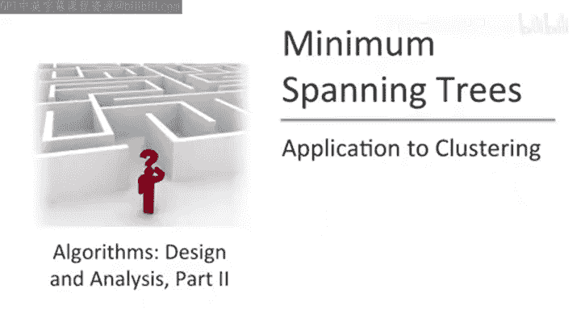
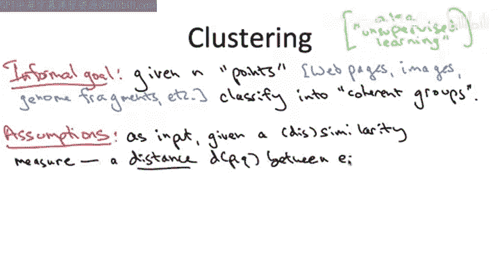
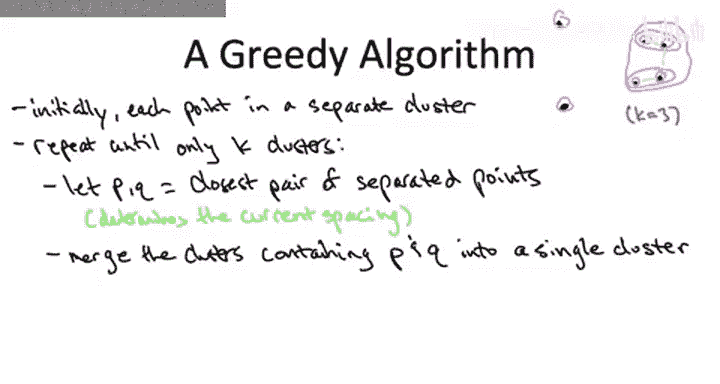

# 024：聚类应用

## 概述
在本节课中，我们将学习最小生成树问题的一个重要应用：聚类问题。我们将从一个非正式的目标描述开始，逐步形式化一个具体的优化目标——间距最大化，并最终推导出一个与克鲁斯卡尔算法高度相似的贪心算法来解决它。

---

## 聚类问题的目标

到目前为止，我们已经花了相当多的时间讨论最小生成树问题。我们这样做有多个动机。首先，它是研究贪心算法的一个绝佳问题。你可以提出许多不同的贪心算法，并且非常不寻常的是，它们似乎都有效。因此，你得到了正确的贪心算法，但其正确性背后的驱动因素相当微妙。你也得到了很多关于图论和交换论证的练习。

其次，花时间在这些算法上是值得的，因为它让我们更多地练习了数据结构以及如何使用它们来加速算法。具体来说，堆用于加速普里姆算法，并查集数据结构用于加速克鲁斯卡尔算法。

我们讨论它们的第三个原因是它们本身就有应用。这就是本视频和下一个视频的主题，我们将重点关注聚类问题的应用。

让我先非正式地谈谈聚类的目标，然后在下一张幻灯片上给出一个精确的目标函数。

在聚类问题中，输入是端点，我们将其视为嵌入在空间中的点。实际上，在我们关心的底层问题中，很少是真正本质上是几何的，即本质上是空间中的点。通常，我们是将我们关心的东西（可能是网页、图像或数据库）表示为空间中的点。

给定一堆对象，我们希望将它们聚类成，在某种意义上，连贯的组。对于那些有机器学习背景的人来说，你经常会听到这个问题被称为无监督学习，意思是数据没有标签。我们只是在数据未被标注的情况下寻找数据中的模式。

这显然是一个相当模糊的问题描述，所以让我们更精确一点。我们将假设输入的一部分是我们称之为相似性度量的东西，意思是对于任意两个对象，我们将有一个函数给出一个数字，表示它们彼此之间有多相似，或者更确切地说，有多不相似。为了与几何隐喻保持一致，我们将把这个函数称为距离函数。

一个很酷的事情是，我们不需要对这个距离函数施加很多假设。我们将假设的一件事是它是对称的，即从 P 到 Q 的距离与从 Q 到 P 的距离相同。

那么有哪些例子呢？如果你想真正遵循几何隐喻，如果你将这些点表示为某个维度 M 的空间 R^M 中的点，你可以直接使用欧几里得距离，或者如果你喜欢其他范数，比如 L1 或 L∞ 范数。在许多应用领域，有广泛接受的相似性或距离度量。一个例子是序列，正如我们在介绍性讲座中讨论过的，两个基因组片段最佳比对的罚分。

现在有了这个距离函数，拥有连贯的组意味着什么？那些彼此距离小、相似的东西，通常应该在同一个组里；而那些非常不相似、彼此距离很大的东西，你期望它们大多在不同的组里。

那么，我们如何评估一个聚类的好坏，即它在将相近的点放在一起、将不相似的点放在不同组方面做得如何？老实说，有很多方法来形式化这个问题。我们将采用的方法是**基于优化的方法**：我们将假设一个关于聚类的目标函数，然后寻找优化该目标函数的聚类。我想警告你，这不是解决问题的唯一方法，还有其他有趣的方法，但优化是一种自然的方法。此外，就像在我们的调度应用中一样，人们研究的目标函数不止一个，而且都有很好的动机。一个非常流行的目标函数是 K 均值目标，我鼓励你查阅并了解更多。对于本讲座，我将只采用一个特定的目标函数，它足够自然，但绝不是唯一的，甚至不是主要的。不过，它将服务于研究一个与最小生成树算法相关的自然贪心算法的目的，该算法在精确意义下是最优的。

让我发展陈述目标函数和优化问题所需的术语。

聚类问题中经常出现的一个问题是，你要使用多少个簇。为了在本视频中保持简单，我们将假设输入的一部分 K 指明了你应该使用多少个簇。因此，我们将假设你知道需要多少个簇。

在某些应用领域，这是一个完全合理的假设。例如，你可能知道你想要恰好两个簇（K=2）。在某些领域，你可能根据过去的经验有很好的领域知识，知道你需要多少个簇，这很好。另外，在实践中，如果你真的不知道 K 应该是多少，你可以继续运行我们将要讨论的算法，尝试一堆不同的 K 值，然后使用某个度量标准或只是目测，找出哪个是最好的解决方案。

我们将要研究的目标函数是根据**被分隔的点对**来定义的，即被分配到不同簇的点。现在，如果你有多个簇，不可避免地会有一些被分隔的点对。有些点在一个组里，其他点在另一个组里。因此，被分隔的点是不可避免的，而最令人担忧的被分隔点是最相似的那些，即距离最小的点。如果点被分隔，我们希望它们相距很远。因此，我们特别关注那些被分隔的相近点。这将成为我们的目标函数值，称为聚类的**间距**。它是**被分隔点对中距离最近的那一对的距离**。

现在，我们希望聚类的间距如何？我们希望所有被分隔的点都尽可能远离，因为我们希望间距大，越大越好。这自然引出了形式化的问题陈述：给定输入距离度量（即每对点之间的距离），以及期望的簇数量 K，在所有将点聚类成 K 个簇的方法中，找到使间距尽可能大的聚类。

让我们开发一个贪心算法，旨在使间距尽可能大。为了便于讨论，我将使用一个示例点集，在本幻灯片右上角只有六个黑点。

这个贪心算法背后的好主意是，不要担心最终我们只能输出 K 个不同簇的约束。实际上，在整个算法过程中，我们将是不可行的，会有太多的簇。只有在算法结束时，我们才会减少到 K 个簇，这将是我们的最终可行解。这使我们能够自由地初始化过程，从每个点都在自己簇中的退化解开始。

在我们的示例点集中，我们有这六个粉红色的孤立簇。一般来说，你将有 n 个簇，而我们必须减少到 K 个。现在让我们记住间距目标是什么：在间距目标中，你遍历所有被分隔的点对。对于这个退化解，所有点对都是被分隔的，你查看最令人担忧的被分隔对，即那些彼此最接近的点。所以间距就是被分隔点对中最近一对的距离。

在贪心算法中，你希望尽可能增加你的目标函数。但实际上，在这种情况下，事情相当简单明了。假设我给你一个聚类，你想让间距变大。你能做到这一点的唯一方法是，取当前最近的一对被分隔点，使它们不再被分隔，即将它们放在同一个簇中。因此，在某种意义上，为了增加目标函数值，你显然需要做什么：你必须查看定义目标的点对（即最近的一对被分隔点），并且必须融合它们，必须融合它们所在的簇，使它们不再被分隔。在这个例子中，在我看来，最近的一对点（当然是被分隔的）是右上角的这一对。所以，如果我们想让间距变大，那么我们将它们融合到一个共同的簇中。

我们开始时是六个簇，现在减少到五个。现在我们重新评估这个新聚类的间距。我们问，最近的一对被分隔点是什么？在我看来，这似乎是右下角的这一对。同样，我们通过合并聚类来增加间距的唯一方法是，将这两个孤立的簇合并为一个。

我们再做一次。我们说哪对点决定了当前的间距？即当前被分隔的点对中彼此最近的点。在我看来，这似乎是图片最右边的这一对。合并两个簇并使间距实际上升的唯一方法是，合并包含决定当前间距的点对的簇。所以在这种情况下，两个各有两个点的不同簇将坍缩成一个包含四个点的簇。假设我们最终想要三个簇，这正是我们目前的情况。此时，贪心算法将停止。

现在让我更一般地阐述贪心算法的伪代码，但根据到目前为止的讨论，这正是你所期望的。好的，我希望你盯着这个伪代码看10秒钟或你需要的时间，并尝试将其与我们课程中见过的算法联系起来，特别是我们最近见过的一个算法。我希望它能让你强烈地想起我们已经介绍过的一个算法。具体来说，我希望你看到这个贪心算法与计算最小成本生成树的克鲁斯卡尔算法之间有很强的相似性。

确实，我们可以认为这个贪心聚类算法与克鲁斯卡尔的最小成本生成树算法完全相同，只是提前中止了，在剩下 K 个连通分量时停止，即在最后 K-1 条边被添加之前。

为了确保对应关系清晰，图是什么？边是什么？边成本是什么？聚类问题中的对象（即点）对应于图中的顶点。聚类问题输入的另一部分是距离，它为每对点给出。所以这些扮演了最小生成树问题中边成本的角色。由于我们对每一对点都有一个距离或边成本，我们可以将聚类问题中的边集视为完全图，因为我们对每一对都有边成本或距离。

这种类型的凝聚聚类有一个名字：这种使用类似 MST 的标准一次融合一个分量的想法，被称为**单链接聚类**。因此，单链接聚类是一个好主意。如果你从事任何聚类问题或无监督学习问题的工作，它绝对应该是你工具箱中的一个工具。我们将在下一个视频中以一种特定的方式证明其存在价值，届时我们将展示它确实在所有可能的 K 聚类中最大化间距。

但即使你本身不关心间距目标函数，你也应该熟悉单链接聚类。它还有许多其他优良特性。

## 总结
本节课我们一起学习了如何将最小生成树算法应用于聚类问题。我们首先定义了聚类的目标——最大化被分隔点对之间的最小距离（即间距），然后介绍了一个贪心算法。该算法从每个点自成一簇开始，反复合并距离最近的两个簇，直到剩下 K 个簇为止。我们认识到，这个算法本质上就是提前终止的克鲁斯卡尔算法，它被称为单链接聚类，是解决此类问题的一个有效工具。