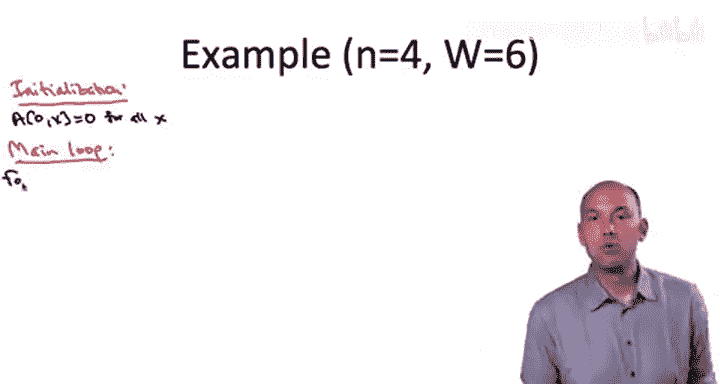
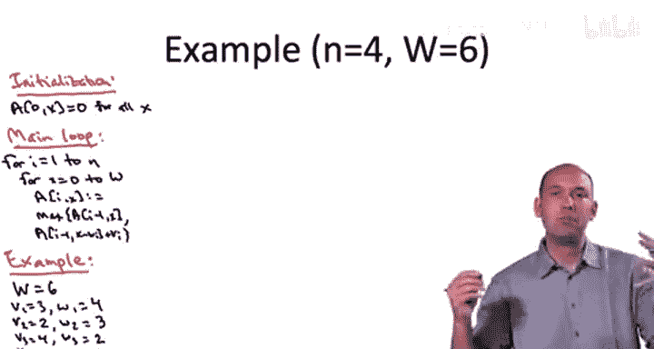
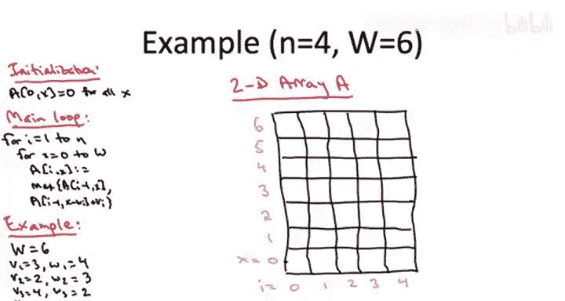
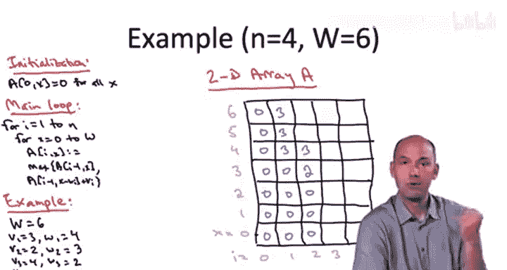
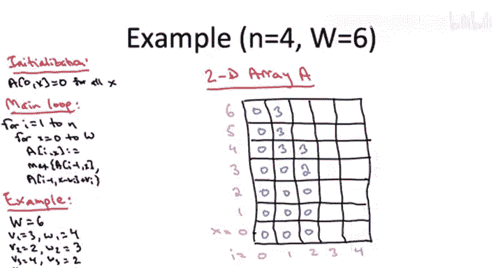
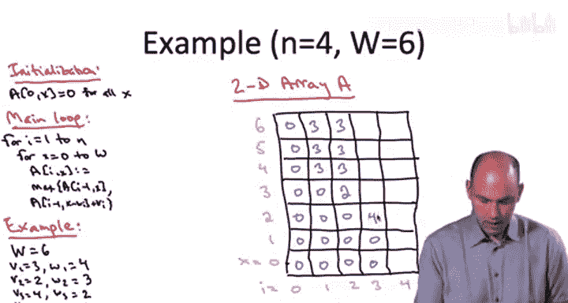

# 032：背包问题示例


在本节课中，我们将通过一个具体的例子，详细演示如何应用动态规划算法解决背包问题。我们将一步步填充动态规划表格，并最终通过回溯找到最优解的具体物品组合。



## 概述

我们已经掌握了两种动态规划算法：计算路径图中带权独立集的方法，以及解决经典背包问题的动态规划方案。在继续学习更多算法之前，我们通过一个完整的示例来确保对背包问题动态规划算法的理解清晰无误。


## 算法核心回顾

首先，我们回顾一下背包问题动态规划算法的关键点。我们使用一个二维数组 `A` 来存储子问题的解。





*   **初始化**：当物品索引 `i = 0`（即不允许使用任何物品）时，无论背包容量 `x` 是多少，最优解的值都是 `0`。
*   **递推关系**：对于物品 `i` 和剩余容量 `x`，最优解 `A[i][x]` 是以下两者的最大值：
    1.  **不选物品 `i`**：继承 `A[i-1][x]` 的值。
    2.  **选择物品 `i`**：获得物品 `i` 的价值 `v_i`，加上剩余容量 `x - w_i` 下的最优解 `A[i-1][x - w_i]`。

用公式表示如下：

```
A[0][x] = 0， 对于所有 x
A[i][x] = max( A[i-1][x], v_i + A[i-1][x - w_i] )， 如果 x >= w_i
A[i][x] = A[i-1][x]， 如果 x < w_i
```

## 示例问题设定

我们来看一个具体的例子。假设有 4 个物品，背包初始容量 `W = 6`。物品的价值和重量如下表所示：

| 物品 (i) | 价值 (v_i) | 重量 (w_i) |
| :------- | :--------- | :--------- |
| 1        | 3          | 4          |
| 2        | 2          | 3          |
| 3        | 4          | 2          |
| 4        | 4          | 3          |

我们将按照最直观的方式实现算法，显式地构建并填充二维数组 `A`，其中 `i` 的范围是 `0` 到 `n`（4），`x` 的范围是 `0` 到 `W`（6）。

## 逐步填充动态规划表

### 步骤 1：初始化

首先，我们初始化表格。根据规则，当 `i = 0`（没有物品可用）时，所有 `A[0][x]` 都等于 `0`。这对应表格最左边的一列。


### 步骤 2：处理物品 1 (i=1)

现在，我们进入主循环。外层循环处理物品索引 `i`，内层循环处理剩余容量 `x`。我们从 `i=1`（物品1）开始。

物品1的重量 `w_1 = 4`。这意味着当剩余容量 `x` 小于 4 时，我们无法选择物品1，只能继承 `i=0` 时的解。

以下是填充 `i=1` 这一列的过程：
*   当 `x = 0, 1, 2, 3` 时：`A[1][x] = A[0][x] = 0`。
*   当 `x = 4` 时：我们可以选择物品1（价值3），剩余容量变为 `4-4=0`，对应 `A[0][0]=0`，总价值为 `3+0=3`。也可以不选，继承 `A[0][4]=0`。显然，选择物品1更优，所以 `A[1][4] = 3`。
*   当 `x = 5, 6` 时：同理，选择物品1总是比不选（价值0）更优，所以 `A[1][5] = 3`，`A[1][6] = 3`。






### 步骤 3：处理物品 2 (i=2)

现在处理物品2，其重量 `w_2 = 3`，价值 `v_2 = 2`。



*   当 `x = 0, 1, 2` 时：无法选择物品2，`A[2][x] = A[1][x]`（分别为0, 0, 0）。
*   当 `x = 3` 时：选择物品2得到 `2 + A[1][0] = 2`，不选得到 `A[1][3] = 0`。选择更优，`A[2][3] = 2`。
*   当 `x = 4` 时：选择物品2得到 `2 + A[1][1] = 2`，不选得到 `A[1][4] = 3`。不选更优，`A[2][4] = 3`。
*   当 `x = 5, 6` 时：选择物品2分别得到 `2 + A[1][2] = 2` 和 `2 + A[1][3] = 2`，而不选分别得到 `A[1][5] = 3` 和 `A[1][6] = 3`。不选更优，所以 `A[2][5] = 3`，`A[2][6] = 3`。


### 步骤 4：处理物品 3 (i=3)

物品3的重量 `w_3 = 2`，价值 `v_3 = 4`。

*   当 `x = 0, 1` 时：无法选择，`A[3][x] = A[2][x]`（0, 0）。
*   当 `x = 2` 时：选择得到 `4 + A[2][0] = 4`，不选得到 `A[2][2] = 0`。选择更优，`A[3][2] = 4`。
*   当 `x = 3` 时：选择得到 `4 + A[2][1] = 4`，不选得到 `A[2][3] = 2`。选择更优，`A[3][3] = 4`。
*   当 `x = 4` 时：选择得到 `4 + A[2][2] = 4`，不选得到 `A[2][4] = 3`。选择更优，`A[3][4] = 4`。
*   当 `x = 5` 时：选择得到 `4 + A[2][3] = 4 + 2 = 6`，不选得到 `A[2][5] = 3`。选择更优，`A[3][5] = 6`。
*   当 `x = 6` 时：选择得到 `4 + A[2][4] = 4 + 3 = 7`，不选得到 `A[2][6] = 3`。选择更优，`A[3][6] = 7`。


### 步骤 5：处理物品 4 (i=4)

物品4的重量 `w_4 = 3`，价值 `v_4 = 4`。

*   当 `x = 0, 1, 2` 时：无法选择，`A[4][x] = A[3][x]`（0, 0, 4）。
*   当 `x = 3` 时：选择得到 `4 + A[3][0] = 4`，不选得到 `A[3][3] = 4`。两者相等，`A[4][3] = 4`。
*   当 `x = 4` 时：选择得到 `4 + A[3][1] = 4`，不选得到 `A[3][4] = 4`。两者相等，`A[4][4] = 4`。
*   当 `x = 5` 时：选择得到 `4 + A[3][2] = 4 + 4 = 8`，不选得到 `A[3][5] = 6`。选择更优，`A[4][5] = 8`。
*   当 `x = 6` 时：选择得到 `4 + A[3][3] = 4 + 4 = 8`，不选得到 `A[3][6] = 7`。选择更优，`A[4][6] = 8`。


至此，动态规划表填充完成。表格右上角 `A[4][6] = 8` 就是整个问题的最优解值。

## 回溯构造最优解

知道最优解值是 8 之后，我们通过回溯来确定具体选择了哪些物品。我们从最大的子问题 `A[4][6]` 开始。

1.  **查看 `A[4][6]`**：它的值 8 是如何得到的？它是通过选择物品4（价值4）并加上 `A[3][3]` 的值 4 得到的，而不是通过继承 `A[3][6]=7` 得到的。**因此，物品4在最优解中。**
2.  **回溯到 `A[3][3]`**：`A[3][3]=4` 是如何得到的？它是通过选择物品3（价值4）并加上 `A[2][1]=0` 得到的，而不是继承 `A[2][3]=2`。**因此，物品3也在最优解中。**
3.  **回溯到 `A[2][1]`**：`A[2][1]=0` 是直接继承自 `A[1][1]=0`，这意味着在剩余容量为1时，没有选择物品2或物品1。
4.  继续向左回溯到 `i=0`，回溯结束。

因此，最优解包含**物品3和物品4**，总价值为 `4 + 4 = 8`，总重量为 `2 + 3 = 5`，未超过背包容量6。

## 总结

本节课中，我们一起学习了如何通过一个具体示例来应用动态规划解决背包问题。我们系统地完成了以下步骤：

1.  **定义子问题**：`A[i][x]` 表示考虑前 `i` 个物品、在容量限制 `x` 下的最大价值。
2.  **建立递推关系**：基于“选”或“不选”当前物品做出决策。
3.  **自底向上填表**：从最小的子问题开始，逐步计算并填充整个动态规划表。
4.  **读取最优值**：表格右下角（或右上角，取决于定义）即为问题的最优解值。
5.  **回溯构造解**：通过追踪递推决策的过程，找出组成最优解的具体物品集合。

通过这个详细的例子，我们巩固了对背包问题动态规划算法的理解，为后续学习更复杂的动态规划问题打下了坚实的基础。