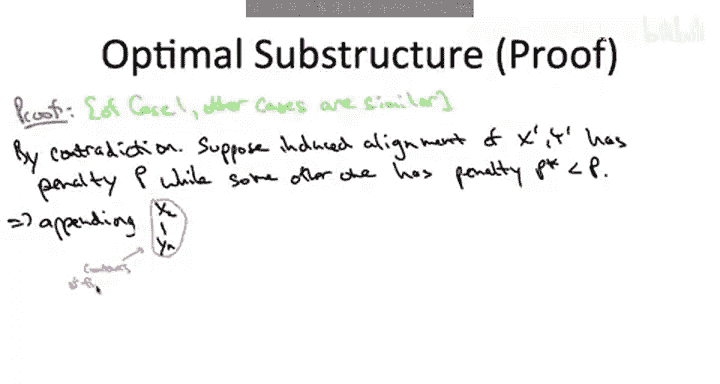

# 033：序列比对的最优子结构 🔬

在本节课中，我们将学习序列比对问题，并运用动态规划的思想来分析其最优子结构。我们将看到，一个最优的全局比对方案，其组成部分也必然是对应子问题的最优解。理解这一点是设计高效动态规划算法的关键。

---

## 问题回顾

序列比对是计算基因组学中的一个基础问题。其目标是计算两个字符串之间的相似度度量，该度量定义为最佳比对的总惩罚值（也称为Needleman-Wunsch分数）。

**输入**：
*   两个字符串 `X`（长度为 `m`）和 `Y`（长度为 `n`）。
*   各种惩罚值：插入空位的代价（`δ`），以及任意两个字符不匹配的代价（`α(xi, yj)`）。通常，字符与自身匹配的惩罚为0。

**可行解空间**：通过向两个字符串中插入空位，使它们长度相等，从而得到的所有比对方案。

**目标**：在所有指数级数量的比对方案中，找到总惩罚值最小的那个。总惩罚值是所有插入的空位和所有不匹配列的惩罚值之和。

---

## 应用动态规划思想

上一节我们回顾了动态规划的基本框架。现在，我们将这个框架应用于序列比对问题。动态规划解决方案的关键在于找出正确的子问题集合。我们将通过分析最优解的结构来推导出这些子问题。

具体来说，我们将研究最优比对方案在最后一个位置可能呈现的几种情况，并证明最优解必然由更小子问题的最优解构成。

---

## 最优解的结构分析

让我们思考一个最优比对方案。我们可以将其可视化：上方是字符串 `X` 及其插入的空位，下方是字符串 `Y` 及其插入的空位，两者长度相等。

为了分析最优解的结构，我们借鉴之前解决独立集和背包问题的经验：关注最优解的“最后部分”。在这里，我们关注最优比对的最后一个位置。

以下是最后一个位置可能出现的**三种相关情况**：
1.  **情况一**：最后一个位置匹配了两个字符串的最后一个字符（即 `X[m]` 与 `Y[n]` 对齐）。
2.  **情况二**：最后一个位置匹配了 `X` 的最后一个字符和一个空位（即 `X[m]` 与一个空位对齐）。
3.  **情况三**：最后一个位置匹配了 `Y` 的最后一个字符和一个空位（即 `Y[n]` 与一个空位对齐）。

> **注意**：我们不考虑最后一个位置上下都是空位的情况，因为删除这两个空位会得到一个惩罚值更低（或相等）的更好比对，这与最优性矛盾。

我们希望证明，对于上述每一种情况，原始问题的最优解都可以通过组合一个更小子问题的最优解来获得。

---

## 定义子问题与候选解

让我们定义更小的子问题。设：
*   `X' = X` 去掉最后一个字符 `X[m]`
*   `Y' = Y` 去掉最后一个字符 `Y[n]`

现在，针对三种情况，我们描述对应的候选最优解结构：

*   **情况一（`X[m]` 匹配 `Y[n]`）**：如果我们从最优比对中移除最后一列，剩下的“诱导比对”必然是字符串 `X'` 和 `Y'` 的一个最优比对。
*   **情况二（`X[m]` 匹配空位）**：如果我们从最优比对中移除最后一列，剩下的“诱导比对”必然是字符串 `X'` 和完整 `Y` 的一个最优比对。
*   **情况三（`Y[n]` 匹配空位）**：如果我们从最优比对中移除最后一列，剩下的“诱导比对”必然是完整 `X` 和字符串 `Y'` 的一个最优比对。

这个断言意味着，原始问题的最优解只能是以下三个候选者之一，每个候选者对应一种末尾情况，并由一个更小子问题的最优解扩展而来。

---

## 最优子结构证明（以情况一为例）

我们现在证明情况一的断言。其他情况的证明思路类似。

**断言**：在最优比对中，如果最后一列是 `X[m]` 匹配 `Y[n]`，那么去掉最后一列后得到的 `X'` 和 `Y'` 的比对，也必须是 `X'` 和 `Y'` 的最优比对。

**证明**（反证法）：
1.  假设原比对是最优的，但其诱导出的 `X'` 和 `Y'` 的比对 **不是** 最优的。
2.  那么，存在一个对 `X'` 和 `Y'` 的更好比对，其总惩罚值 `P*` 严格小于原诱导比对的惩罚值 `P`。
3.  现在，我们可以将这个更好的 `X'` 和 `Y'` 的比对，与最后一列的匹配 `(X[m], Y[n])` 组合起来，形成一个新的 `X` 和 `Y` 的完整比对。
4.  这个新比对的总惩罚值为：`P* + α(X[m], Y[n])`。
5.  由于 `P* < P`，我们有 `P* + α(X[m], Y[n]) < P + α(X[m], Y[n])`。
6.  而 `P + α(X[m], Y[n])` 正是我们最初假设的“最优”比对的总惩罚值。
7.  因此，我们找到了一个总惩罚值更低的比对，这与最初假设的“最优性”矛盾。
8.  所以，我们的假设不成立。诱导比对必须是 `X'` 和 `Y'` 的最优比对。

证毕。

---

## 总结

本节课中，我们一起学习了序列比对问题的最优子结构性质。我们分析了最优比对方案在最后一个位置的三种可能情况，并证明了在每种情况下，原始问题的最优解都必然由一个更小子问题（涉及前缀字符串）的最优解构成。

具体来说：
*   若末尾是字符匹配，则子问题是 `X[1..m-1]` 与 `Y[1..n-1]` 的比对。
*   若 `X[m]` 匹配空位，则子问题是 `X[1..m-1]` 与完整 `Y` 的比对。
*   若 `Y[n]` 匹配空位，则子问题是完整 `X` 与 `Y[1..n-1]` 的比对。

这个关键洞察为我们下一节课推导动态规划递推关系并设计高效算法奠定了坚实的基础。