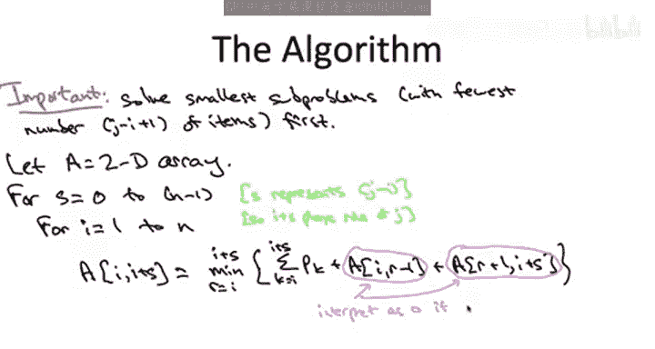
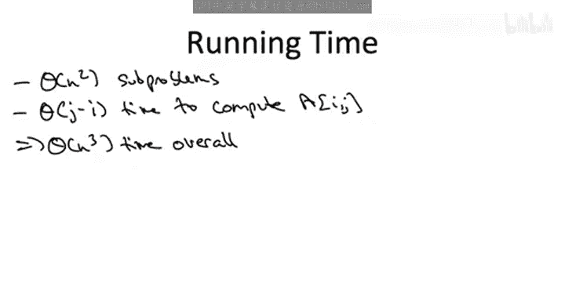
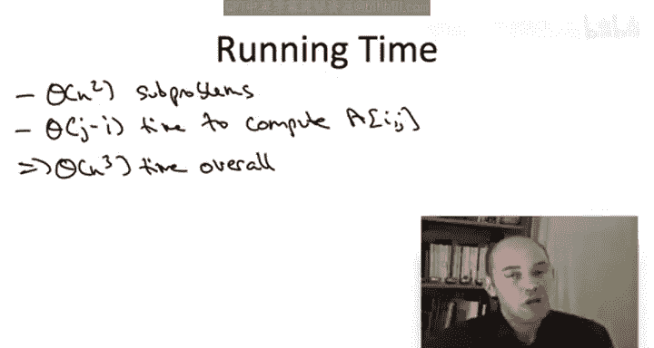
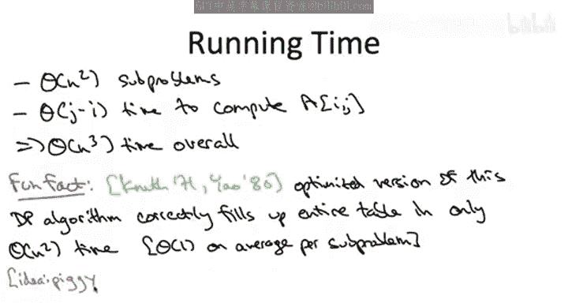

# 039：-39-_ 动态规划算法 2

在本节课中，我们将学习如何为最优二叉搜索树问题实现一个动态规划算法。我们将从理解递推公式开始，然后系统地解决子问题，并分析算法的时间复杂度。最后，我们会简要提及一个可以显著提升算法性能的优化方法。

## 概述

上一节我们推导出了求解最优二叉搜索树价值的递推公式。本节中，我们将基于这个“魔法公式”来构建一个具体的动态规划算法。我们将定义子问题，确定求解顺序，并用代码描述算法流程。同时，我们也会分析其时间复杂度，并了解一个可以将其从立方级优化到平方级的“有趣事实”。

## 系统求解子问题

既然我们已经有了递推公式，剩下的工作就是系统地求解子问题。和往常一样，**以正确的顺序（从小到大）求解子问题至关重要**。

在最优二叉搜索树问题中，衡量子问题大小的自然方式是看子问题中包含的项目数量。对于一个从索引 `i` 开始到索引 `j` 结束的子问题，其大小为 `j - i + 1`。我们将以此作为子问题大小的度量标准。

## 构建动态规划数组

接下来，我们请出我们信赖的数组。这个数组的维度将是**二维**的，因为子问题有两个自由度：连续区间的**起始索引**和**结束索引**。

外层 `for` 循环用于控制子问题的大小。它确保我们在处理更大的子问题之前，先解决所有更小的子问题。具体来说，我们将使用一个索引 `s`。在外层循环的每次迭代中，无论 `s` 的当前值是多少，我们只考虑大小为 `s + 1` 的子问题。你可以将 `s` 理解为较大索引 `j` 与较小索引 `i` 之间的差值：`s = j - i`。

内层 `for` 循环控制我们所考察的连续区间的第一个项目，也就是 `i`。

现在，我们要做的就是根据数组条目重写递推公式，并使用变量替换，其中 `s` 对应 `j - i`。



对于一个给定的子问题，起始于项目 `i`，结束于项目 `i + s`，我们通过暴力枚举来选取最佳根节点。根节点 `r` 将位于 `i` 和 `i + s` 之间。无论选择哪个根节点，我们都会加上一个常数项，即所有概率 `p_k` 的和，其中 `k` 的范围是从第一个项目 `i` 到最后一个项目 `i + s`。然后，我们还要查看两个相关子问题（一个从 `i` 开始到 `r-1` 结束，另一个从 `r+1` 开始到 `i+s` 结束）的先前计算出的最优解值。

以下是该递推关系的伪代码描述：

```python
# 假设 A 是一个二维数组，A[i][j] 存储从 i 到 j 的最优解值
# 假设 prob_sum(i, j) 能快速返回从 i 到 j 的概率之和
for s in range(0, n-1):          # 子问题大小控制
    for i in range(1, n-s+1):    # 起始位置控制
        j = i + s
        best = INFINITY
        constant = prob_sum(i, j)
        for r in range(i, j+1):  # 枚举所有可能的根节点
            left_cost = A[i][r-1] if r > i else 0
            right_cost = A[r+1][j] if r < j else 0
            total_cost = constant + left_cost + right_cost
            if total_cost < best:
                best = total_cost
        A[i][j] = best
```

关于上述公式右侧的两个数组查找，有两点需要说明：
1.  如果我们选择第一个项目 `i` 作为根节点，那么第一个查找（左子树）就没有意义；如果选择最后一个项目作为根节点，第二个查找（右子树）就没有意义。在这种情况下，我们应将这些查找结果理解为 `0`。在实际实现中，你需要包含处理这些边界情况的代码。
2.  第二个说明是我们通常的“健全性检查”。当你编写动态规划算法时，在写下填充数组条目的公式后，务必确保**公式右侧进行的任何数组查找，其对应的子问题确实已经被计算过并可供常量时间查找**。在本算法中，无论我们选择哪个根节点，两个相关的子问题所涉及的项目数都严格少于原始问题。因此，右侧的两个子问题查找值肯定已经在**外层 `for` 循环**的某次更早的迭代中被计算出来了。外层循环保证了我们从项目数最少的子问题开始，逐步求解到项目数最多的子问题。

当然，在两个 `for` 循环完成后，我们真正关心的是 `A[1][n]` 中的答案，即所有项目的最优二叉搜索树价值，这也是最终的输出。

## 算法执行的可视化理解

有些学生喜欢从图形角度理解这些双重循环。我们可以将二维数组 `A` 想象成一个网格。

*   **X 轴** 对应索引 `i`，即我们正在考察的项目集合的第一个项目。
*   **Y 轴** 对应索引 `j`，即当前集合的最后一个项目。

让我们标出这个网格的对角线。这些是 `i = j` 的子问题，即只包含单个元素的子问题。

我们只解决 `j` 至少与 `i` 一样大的问题，这意味着我们实际上只填充表格的**左上角（西北部分）**。我们从不费心去填充表格的右下角（东南部分），直接将其视为 `0`。

在动态规划算法的第一次外层迭代中（即 `s = 0` 时），算法会依次解决 `n` 个单项目子问题。因此，在内层 `for` 循环的第一次迭代中，它将解决子问题 `A[1][1]`，下一次迭代解决 `A[2][2]`，然后是 `A[3][3]`，依此类推。在每种情况下，两个数组查找都对应于 `0`，我们只是用基本情况（`A[i][i]` 就是项目 `i` 的概率）填充这条对角线。


随着动态规划算法的进行，我们将**按对角线**填充表格的左上角部分。每次我们增加外层 `for` 循环中的索引 `s`，我们就向上移动到下一个最西北的对角线。然后，当我们遍历所有可能的 `i` 值时，我们将逐个填充该对角线，从西南向东北移动。


当我们在其中一条对角线上填充一个子问题的值时，我们只需要查找位于**更低对角线**上的两个子问题的值。更低的对角线对应于项目数严格更少的子问题。

## 算法正确性与时间复杂度分析

以上就是计算给定一组项目及其概率的最优二叉搜索树价值的动态规划算法。关于正确性，其逻辑与我们过去所见相同：所有的繁重工作都在于证明最优子结构引理，该引理保证了我们递推公式的正确性。既然我们的“魔法公式”是正确的，并且我们只是系统地应用它，那么动态规划算法的正确性就可以通过归纳法直接得出。


然而，让我们对算法的运行时间做一些分析。



我们遵循通常的步骤：先看需要解决多少个子问题，然后看解决每个子问题需要做多少工作。

*   **子问题数量**：所有可能的 `i` 和 `j` 的组合，其中 `i <= j`。换句话说，这大致是那个 `n x n` 网格的一半，所以大约是 `n^2 / 2`，我们称其为 `Θ(n^2)`，即**平方数量级**的子问题。

    `子问题数量 = Θ(n^2)`

*   **每个子问题的工作量**：对于每个子问题，我们必须评估这个递推公式。从概念上讲，这是对我们已识别出的候选解进行暴力搜索。这个动态规划算法与我们最近看到的其他算法（序列对齐、背包问题、线图中的独立集）之间的一个区别在于，**最优解的可能选项实际上相当多**。这是我们第一次遇到的暴力搜索不是仅仅在常数个可能性中进行的情况。我们必须尝试每一个可能的根节点。我们给定子问题中的每个项目都是一个候选根节点，我们要尝试所有可能。

    给定起始项目 `i` 和结束项目 `j`，总共有 `j - i + 1` 个项目，我们必须为每个选择做常数工作。

    `每个子问题的工作量（最坏情况） = O(j - i + 1) = O(n)`



因此，有些子问题（当 `i` 和 `j` 非常接近时）我们可以快速评估，只需常数时间。但对于我们需要处理的大部分子问题（常数比例），这将需要线性时间 `Θ(n)`。总的来说，这给了我们一个**立方级的运行时间 `Θ(n^3)`**。

    `总运行时间 = Θ(n^2) * O(n) = O(n^3)`

## 性能评估与优化前景

我认为这个运行时间“还算可以，但不算出色”。它是多项式时间，这很好。它当然比枚举所有指数级数量的可能二叉搜索树要快得多，因此它完胜暴力搜索。但我不会称其为“极快”或“免费原语”之类的东西。你能够处理 `n` 在几百数量级的问题规模，但可能无法处理 `n` 在几千数量级的问题。这将覆盖一些你想使用此最优二叉搜索树算法的应用场景，但不是全部。所以它对某些事情有好处，但并非通用解决方案。

另一方面，这里有一个**有趣的事实** 😊：你实际上可以显著加速这个动态规划算法。

你可以保持完全相同的二维数组和完全相同的语义（每个索引仍然对应于项目 `i` 到 `j` 之间的最优二叉搜索树），但你实际上可以只用总共 `n^2` 的时间（即平均每个子问题常数工作量）来填充整个表格的所有 `n^2` 个条目。

这个有趣的事实非常巧妙，肯定比我们在这个视频中讨论的内容更复杂，但并非不可能理解。如果你感兴趣，我鼓励你回头查阅原始论文或在网上搜索关于这个动态规划算法优化加速版本的其他资源。从一个非常高的层面（3万英尺视角）来看，其目标是避免在每个子问题中都对所有可能的根节点进行这种暴力搜索。事实证明，最优二叉搜索树问题中存在**良好的结构**，允许你利用在更小子问题中已完成的工作。在更小的子问题中，你已经搜索了一堆候选根节点，利用这些先前暴力搜索的结果，你可以推断出当前根节点集合中哪些子集可能决定递推关系。这让你可以避免搜索所有可能的候选根节点，而只关注一个非常小的集合（事实上，平均而言，在所有子问题上平均只需考察常数个可能的根节点）。不用说，这将运行时间从立方级加速到平方级，**显著增加了你现在可以应用此算法的问题规模**。现在，你不再局限于几百的规模，而肯定能够解决几千规模的问题，甚至可能使用这个平方时间算法解决十万规模的问题。非常酷！



## 总结

本节课中，我们一起学习了如何为最优二叉搜索树问题实现一个动态规划算法。我们从递推公式出发，定义了二维状态数组，并通过双重循环按子问题规模从小到大的顺序系统地求解。我们分析了该算法具有 `Θ(n^3)` 的时间复杂度。最后，我们了解了一个重要的优化方向，通过利用问题本身的结构，可以将算法时间复杂度降低到 `Θ(n^2)`，从而能够处理更大规模的问题。