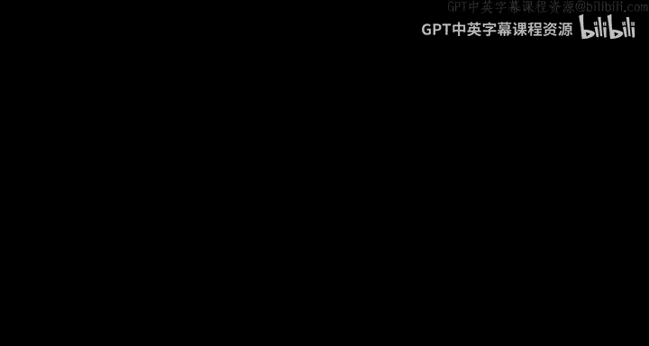
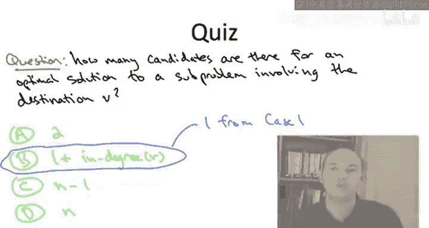

# 041：最优子结构

在本节课中，我们将开始开发贝尔曼-福特算法，作为动态规划范式的一个实例。我们将按照通常的方式，通过理解最优解如何必然由更小子问题的最优解构成来开发它。

首先，让我们快速回顾一下上一视频中关于单源最短路径问题输入图可能包含负边权时的微妙之处。

## 问题定义与目标

输入是一个有向图，每条边都有一个边权 `C(e)`。我们允许这些边权为负，并且给定一个源顶点 `s`。

我们的目标是计算从源点 `s` 到所有其他目标顶点 `v` 的最短路径距离。路径的长度定义为路径上所有边权的总和。

上一视频我们讨论过，当输入图包含负权环时，这个目标是有问题的。如果允许路径包含环，那么最短路径长度可能未定义（为负无穷大）。如果不允许环，那么计算最短路径在计算上是难处理的（NP难问题）。因此，如果算法无法计算最短路径，它至少应该输出一个负权环作为失败的原因。

在本视频中，我将首先为**不包含负权环**的输入图开发贝尔曼-福特算法。当然，在这些情况下，算法应该输出正确的最短路径。一旦我们为无负环图建立了贝尔曼-福特算法，我们将看到将其扩展到一般情况（包含负环的图）是相当容易的，并且能在不影响基本算法运行时间的情况下输出这样一个环。

## 动态规划与最优子结构

着眼于为最短路径问题设计动态规划算法，让我们开始思考最优子结构，即最短路径如何必然由更小子问题（更短路径）的最优解构成。

形式化的最优子结构引理陈述起来会有点繁琐。让我先花一页幻灯片来告诉你如何思考这个问题。

将动态规划范式应用于图问题通常很棘手。原因之一是图本质上不是顺序对象，没有明显的顺序。我们只是给定一个无序的顶点集和一个无序的边集。当然，一个特例是路径图，这是我们动态规划的第一个例子，在那里图的顶点有明显的顺序。但不像序列比对那样有明显的从左到右的顺序，在图问题中如何排序并不明确。

然而，对于这个特定的图问题，我们的输出（路径）确实是顺序对象，这给了我们希望。我们可以陈述并证明一个最优子结构引理，讨论最优解（最短路径）如何必须以某种方式由“更小”的最短路径构建而成。

不幸的是，如何正确定义“更小”和“更大”的子问题仍然远非显而易见。例如，你希望有一个智能的顺序来处理可能的目标顶点 `v`，但如果不首先知道最短路径距离，如何做到这一点并不清楚。这是一个微妙的问题，我鼓励你在私下里认真思考，以便更好地理解贝尔曼-福特解决方案的非平凡之处。

## 贝尔曼-福特算法的关键思想

贝尔曼-福特算法的一个关键且很好的想法是引入一个额外的参数，为我们提供子问题大小的明确定义。对于给定的目标顶点 `v`，这个参数将控制我们允许在从源点 `s` 到目标 `v` 的路径中使用多少条边。

为了解释这一点，让我们看幻灯片右侧这个有五个顶点的绿色图。

在贝尔曼-福特算法中，我们将为每个可能的目标顶点和每个可能的路径边数限制定义一个子问题。例如，假设我们看源点 `s` 和目标 `t`，并且我们考虑只有两条边或更少的路径。那么在这个图中，从 `s` 到 `t` 的、受此约束的最短路径长度为 `4`。底部那条有三条边的路径不是选项，因为当前子问题只允许两条边或更少。如果我们将边预算增加到 `3`，那么对应的最短路径距离将从 `4` 下降到 `3`，因为突然我们可以使用底部的三条边路径。

这里的重点是，它为我们提供了一个明确的子问题大小概念：你被允许在从源点到给定目标的路径中使用的边越多，那个子问题就“越大”。

## 形式化最优子结构引理

现在，我们将在完全一般性的情况下陈述并证明这个最优子结构引理。我们将处理任意的输入图，它们可能包含负环，也可能不包含。

像所有最优子结构引理一样，其陈述形式是：子问题的最优解必须是少数候选解之一，这些候选解以简单的方式由更小子问题的最优解构成。

那么如何索引一个给定的子问题呢？将有一个我们关心的目标顶点 `v`。正如上一张幻灯片所说，将有一个预算 `i`，限制在从 `s` 到 `v` 的路径中允许使用的边数。我们将用 `i` 表示这个预算。

因此，对于每个可能的目标顶点 `v` 和每个可能的边预算 `i`（`i` 是一个正整数，1 或更大），都有一个子问题。

假设 `P` 是一个最优解，即在所有从 `s` 开始、到 `v` 结束、且最多包含 `i` 条边的路径中，`P` 具有最小的边权和（最小长度）。

一个微妙之处是，因为我们是在完全一般性（即输入图可能包含负环）下证明这个引理，我们需要允许路径 `P` 使用环，包括可能多次使用负环。注意，我们不担心这条路径无限次使用环，因为它有一个有限的边预算 `i`。

有了这个设定，`P` 可能是什么候选解呢？我们将有两种情况。

**情况 1：路径未用尽边预算**
如果路径 `P` 没有用尽其全部的边预算，即如果它只有 `i-1` 条边或更少，那么自然地，`P` 必须是那个从 `s` 到 `v` 的、最多有 `i-1` 条边的最短路径。

**情况 2：路径用尽了边预算**
非平凡的情况是，当从 `s` 到 `v` 的、最多有 `i` 条边的最短路径实际上用尽了其全部预算，使用了所有 `i` 条边。

类比我们之前所有的动态规划算法，我们考虑从最优解中剥离最后一部分。这里，我们将从路径 `P` 中剥离最后一条边。

我们得到了什么？我们得到了一条少一条边的路径。这很好，它将对应某个更小的子问题，因为它最多有 `i-1` 条边。另一方面，请注意，如果我们从一条从 `s` 到 `v` 的路径中剥离最后一条边，我们得到一条从 `s` 到其他某个顶点（我们称之为 `w`）的路径。

因此，从 `P` 剥离最后一条边得到一条路径 `P'`，它从 `s` 开始，到 `w` 结束，最多有 `i-1` 条边。我希望你能猜到，我们的主张是：`P'` 不仅仅是任意一条从 `s` 到 `w` 的、最多有 `i-1` 条边的路径，它实际上是这样一条最短路径。

在这种情况下，我们当然知道 `P'` 恰好有 `i-1` 条边，而不仅仅是至多 `i-1` 条边。但这里声称的更强断言（`P'` 在所有最多有 `i-1` 条边的路径中是最优的）将是有用的。

## 引理证明

这个引理的陈述比证明更难。让我们快速讨论一下证明过程，它与我们之前看到的最优子结构引理相同。

**情况 1** 完全 trivial，是我们许多其他情况 1 中见过的明显矛盾。

**情况 2** 将是我们通常的“剪切-粘贴”矛盾法。

假设存在一条路径 `Q` 比 `P'` 更好。即 `Q` 从 `s` 开始，到 `w` 结束，包含 `i-1` 条边或更少，并且其边权和严格小于 `P'` 的边权和。

那么，如果我们只是将 `P` 的最后一段（即边 `w -> v`）附加到 `Q` 上，我们就得到了一条从 `s` 开始、到 `v` 结束、最多有 `i` 条边的路径。这条新路径 `Q + (w->v)` 的总边权和严格小于原始路径 `P` 的边权和。但这与 `P` 在所有从 `s` 开始、到 `v` 结束、且最多有 `i` 条边的路径中最优的假设相矛盾。

这就是最优子结构引理的证明，它足够简单。和往常一样，下一步是将这个引理编译成一个递推关系。非正式地说，递推关系将对最优解的可能候选进行暴力搜索。

## 理解候选解数量

为了确保你理解刚刚发生的事情，让我们进行一个小测验。

问题是：对于输入图的某个给定目标顶点 `v`，涉及 `v` 的子问题的最优解有多少个候选？

正确答案是第二个选项：答案取决于你谈论的是哪个目标顶点 `v`，而决定子问题数量的因素是**该顶点的入度**，即输入图中以 `v` 为头的边的数量。

为什么是这样？

*   **情况 1** 贡献了一个可能的候选：对于给定的 `i` 和给定的 `v`，你可能只是继承了目标为 `v`、预算为 `i-1` 条边的最优解。
*   **情况 2** 看似只贡献了另一个候选，但实际上它包含了多个候选，每个候选对应一个最后一段跳转 `w -> v` 的选择。具体来说，对于每个 `w` 的选择，它贡献了一个候选最优解，即从 `s` 到那个 `w` 的、最多使用 `i-1` 条边的最短路径，再加上边 `w -> v`。

因此，候选解的总数等于 **1（来自情况 1） + 顶点 `v` 的入度（来自情况 2）**。

## 总结

本节课中，我们一起学习了贝尔曼-福特算法动态规划思路的起点——最优子结构分析。我们明确了在允许负边权但（暂时）假设无负环的图中，如何通过引入**路径边数预算 `i`** 来定义子问题。我们证明了关键的最优子结构引理：从源点 `s` 到顶点 `v`、最多使用 `i` 条边的最短路径，要么是 `s` 到 `v` 最多使用 `i-1` 条边的最短路径，要么是 `s` 到某个前驱顶点 `w` 最多使用 `i-1` 条边的最短路径再加上边 `(w, v)`。这个引理自然地引出了对最优解候选的枚举，其数量取决于目标顶点 `v` 的入度。这为下一节推导动态规划递推公式奠定了坚实的基础。