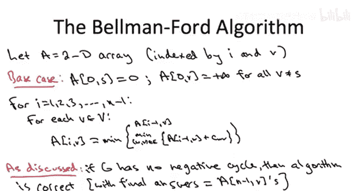

# 042：贝尔曼-福特算法基础


## 概述
在本节课中，我们将学习贝尔曼-福特算法的基础版本。我们将从理解最短路径问题的最优子结构开始，推导出动态规划递推公式，并最终构建出完整的算法。我们将重点关注算法如何通过引入“边预算”这一概念来控制子问题规模，并解释为何在图中没有负环时，该算法能正确工作。

---

上一节我们介绍了最短路径问题的最优子结构。本节中，我们来看看如何将其转化为一个动态规划递推公式。

我们用符号 **Lᵢᵥ** 来表示对应子问题的最优解值。每个子问题由两个参数索引：目标顶点 **V** 和允许从源点 **S** 到 **V** 的路径中使用的最大边数 **i**。

需要注意几个细节。首先，我们允许路径中包含环，因为我们通过有限的边预算 **i** 来限制路径长度，从而避免了无限循环遍历负环的问题。其次，如果不存在从 **S** 到 **V** 且最多使用 **i** 条边的路径，我们定义 **Lᵢᵥ** 为 **+∞**。

递推关系将对每个正整数 **i** 和每个可能的目标顶点 **V** 进行定义。它表明，子问题的最优解值是最优子结构引理中识别的所有可能候选方案中的最佳者。

以下是递推公式：

**Lᵢᵥ = min( Lᵢ₋₁ᵥ, min_{(w,v)∈E} ( Lᵢ₋₁_w + c_{wv} ) )**

公式的第一部分（**Lᵢ₋₁ᵥ**）对应情况一：继承使用最多 **i-1** 条边找到的从 **S** 到 **V** 的最短路径。第二部分对应情况二：考虑所有可能的最后一条边 **(w, v)**，其路径长度为到达 **w** 的最短路径（使用最多 **i-1** 条边）加上边 **(w, v)** 的成本 **c_{wv}**，然后取其中的最小值。

该递推关系的正确性直接源于最优子结构引理。无论图 **G** 是否包含负环，此递推对所有正的 **i** 值都是正确的。

---

现在，让我们看看假设输入图 **G** 没有负环是如何有用的。

我们之前讨论过无负环假设的用途。具体来说，我们论证了 **n-1** 条边总是足以捕获从 **S** 到任何可能目的地的最短路径。原因如下：假设没有负环，固定一个目标顶点 **V**。考虑一条至少有 **n** 条边的路径。由于它至少有 **n** 条边，它必然访问至少 **n+1** 个顶点。但图中只有 **n** 个顶点，因此路径必须至少访问某个顶点两次。在两次连续访问同一个顶点之间，存在一个有向环。根据假设，没有负的有向环，所有环的成本都是非负的。因此，如果我从路径中丢弃这个环，我将得到一条到达同一目的地 **V** 的新路径，并且其总长度只会减少。丢弃环只会使路径更短。这就是为什么存在一条没有重复顶点（即最多使用 **n-1** 条边）的最短路径。

这个观察结果与我们的递推关系有何关联？它告诉我们，我们只需要计算 **i** 值最大到 **n-1** 的子问题。如果没有负环，给子问题分配大于 **n-1** 的边预算是没有意义的，因为当 **i** 达到 **n-1** 时，我们保证已经找到了最短路径。

为了明确这一点，我们正式列出贝尔曼-福特算法中将要解决的子问题。对于没有负环的输入图 **G**，这些子问题足以正确计算最短路径。

以下是需要解决的子问题集合：

*   计算所有最短路径长度 **Lᵢᵥ**。
*   目标顶点 **V** 涵盖所有顶点。
*   边预算 **i** 的范围从 **0** 到 **n-1**。

这是一个相当简洁的子问题集合。虽然它看起来数量很多（有 **n** 个顶点和 **n** 个可能的 **i** 值，总共 **n²** 个子问题），但请记住，这个问题的输出大小是线性的（我们需要为每个目的地 **V** 输出一个数字）。因此，对于我们负责计算的每个统计数据，我们实际上只有线性数量的子问题，这与我们讨论过的其他动态规划算法一样好。

---

现在，我们可以简单地写出著名的贝尔曼-福特算法的伪代码。

由于我们的子问题由两个参数（边预算 **i** 和目标顶点 **v**）索引，我们将使用一个二维数组 **A**。子问题的大小通过边预算 **i** 来衡量，这是贝尔曼-福特算法中引入边预算来控制子问题规模的核心思想。

基础情况是当 **i = 0** 时。此时我们讨论的是使用零条边从 **S** 到达某个顶点 **V**。如果 **V** 恰好等于 **S**，那么我们可以通过空路径实现，空路径的长度为 **0**。如果 **V** 是 **S** 以外的任何顶点，那么显然无法使用零条边从 **S** 到达 **V**，在这种情况下，我们将最优解值定义为 **+∞**。

接下来，我们进入常规的双重循环。与大多数动态规划算法不同，这里的循环顺序很重要。必须确保在需要时，所有更小的子问题都已解决。这意味着外层的 **for** 循环应该按子问题大小 **i** 进行索引。

正如我们所讨论的，在无负环的情况下，我们不需要让 **i** 超过 **n-1**。对于每个 **i** 的选择，我们解决所有对应的子问题（即所有目标顶点 **V**）。对于每个 **(i, V)** 对，我们只需用代码写出递推公式中陈述的公式。

以下是贝尔曼-福特算法的伪代码：

```pseudocode
// 初始化
令 A[0][s] = 0
对于所有其他顶点 v ≠ s:
    令 A[0][v] = +∞

// 主循环
对于 i = 1 到 n-1:
    对于每个顶点 v ∈ V:
        // 情况1：继承使用 i-1 条边的最优解
        A[i][v] = A[i-1][v]
        // 情况2：考虑所有可能的最后一条边 (w, v)
        对于每条边 (w, v) ∈ E:
            如果 A[i-1][w] + c_{wv} < A[i][v]:
                A[i][v] = A[i-1][w] + c_{wv}
```

如果输入图 **G** 恰好没有负环，那么该算法将终止，并得到从 **S** 到所有目的地的最短路径。这些答案将存储在最大的子问题 **A[n-1][v]** 中。

正确性通常主要源于最优子结构引理。但在这种情况下，无负环的假设也保证了取 **i = n-1** 足够大，能够捕获最终答案。

---

我们稍后将讨论贝尔曼-福特算法的运行时间。但首先，让我们通过一个简单的例子来确保所有这些内容都清晰易懂。




## 总结
本节课中，我们一起学习了贝尔曼-福特算法的基础版本。我们从最短路径的最优子结构出发，推导出了动态规划递推公式 **Lᵢᵥ = min( Lᵢ₋₁ᵥ, min_{(w,v)∈E} ( Lᵢ₋₁_w + c_{wv} ) )**。我们解释了在图中没有负环的假设下，只需计算 **i** 从 **0** 到 **n-1** 的子问题就足够了。最后，我们给出了算法的完整伪代码，并概述了其正确性基础。该算法通过巧妙地引入边预算来控制问题规模，是处理可能带有负权边（但无负环）图中单源最短路径问题的有效工具。