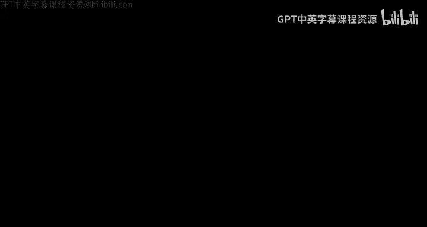
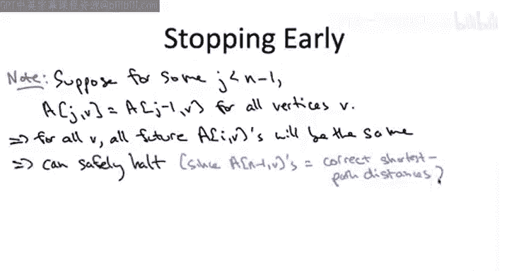

# 043：贝尔曼-福特算法基础（第二部分）

在本节课中，我们将通过一个具体的例子，逐步演示贝尔曼-福特算法如何计算图中所有节点的最短路径。我们将分析算法的运行时间，并探讨一个简单的优化技巧。

## 算法演示

上一节我们介绍了贝尔曼-福特算法的递推公式和基本框架。本节中我们来看看该算法在一个具体图例上的执行过程。

考虑以下包含五个顶点的图。图中用蓝色数字标注了各条边的成本。

我们将逐步遍历外层循环的索引 `I`。由于有五个顶点，`I` 将取值 0, 1, 2, 3, 4。让我们看看每一轮子问题计算的结果。

在基础情况下，当 `I = 0` 时，从源点 `S` 到自身的距离为 `0`，对于所有其他顶点，子问题的值被定义为 `+∞`。

以下是递推公式，以防你忘记：
`A[i, v] = min{ A[i-1, v], min_{(u,v)∈E} { A[i-1, u] + c_uv } }`

现在我们进入主循环，从 `I = 1` 开始。

我们以任意顺序遍历顶点并评估递推公式。

*   节点 `S` 将直接继承上一步的解决方案，它仍然满足总长度为 `0` 的空路径。
*   节点 `V` 当然不希望继承上一轮（`I=0`）的 `+∞` 解。实际上，当 `I=1` 时，顶点 `V` 的子问题解将是 `2`。这是因为我们可以选择最后一条边为 `(S, V)`，其长度为 `2`，而 `S` 在上一轮（`I=0`）的子问题值为 `0`。
*   同理，`X` 的新子问题值将是 `4`，因为我们可以选择最后一条边为 `(S, X)`，并将该边的成本 `4` 加到 `S` 在上一轮（`I=0`）的子问题值上。
*   现在，节点 `W` 和 `T` 希望摆脱它们的 `+∞` 解并获得有限值。你可能会想，既然 `V` 和 `X` 现在有了有限距离，这些值会传播到节点 `W` 和 `T`。这确实会发生，但我们必须等到下一次迭代，即 `I = 2`。原因是，如果你查看代码或递推公式，当我们计算给定迭代 `I` 的子问题时，我们只使用前一次迭代 `I-1` 的子问题解，而不使用当前迭代 `I` 中已经发生的任何更新。因为当 `I=0` 时，`A[0, V]` 和 `A[0, X]` 都是 `+∞`，所以 `A[1, W]` 和 `A[1, T]` 也将是 `+∞`。

现在让我们继续外层循环的下一次迭代，当 `I = 2` 时。

*   顶点 `S` 的子问题解不会改变，你不会得到比 `0` 更好的结果，所以它将保持不变。
*   类似地，在顶点 `V`，你不会得到比 `2` 更好的结果，所以它在此次迭代中也保持不变。
*   然而，在顶点 `X` 发生了一些有趣的事情。在递推公式中，你当然可以选择继承之前的解，所以一个选择是将 `A[2, X]` 设为 `4`。但实际上有一个更好的选择。具体来说，如果我们选择最后一条边为从 `V` 到 `X` 的单位成本弧，我们将该单位成本加到 `V` 在上一轮（`I=1`）的子问题值上，即 `2`。`2 + 1 = 3`。所以这将是 `I=2` 这次迭代中 `X` 的新子问题值。
*   正如所宣传的那样，在 `I=1` 迭代中对顶点 `V` 和 `X` 的更新，现在在 `I=2` 时传播到了顶点 `W` 和 `T`。因此，`W` 和 `T` 摆脱了 `+∞` 值，分别获得了值 `4` 和 `8`。

请注意，我将顶点 `T` 标记为 `8`，而不是 `7`。我计算出的 `A[2, T]` 是 `8`。原因同样是，本次迭代中的更新（特别是 `X` 从 `4` 降到 `3` 这一事实）不会在同一迭代中反映到其他节点。我们必须等到外层循环的下一次迭代，它们才会发生。因此，我们使用的是 `X` 的过时信息，即当 `I=1` 时，它的解值是 `4`，我们正是用这个信息来更新 `T` 的解值，所以是 `4 + 4 = 8`。

在倒数第二次迭代中，当 `I = 3` 时，`S`、`V`、`X` 和 `W` 的大部分值保持不变，实际上我们已经计算出了最短路径，所以它们都将直接继承上一轮的解决方案。

但在顶点 `T`，它将利用顶点 `X` 在 `I=2` 迭代中改进的解值，因此它的 `8` 被更新为 `7`，反映了 `X` 在上一轮的改进。

此时，我们实际上已经完成了计算，得到了所有目的地的最短路径。但算法还不知道我们已经完成，所以它仍然会执行外层循环的最后一次迭代，即 `I = 4`，但此时每个节点都只是继承了上一轮的解决方案，然后算法终止。

## 运行时间分析

对于我们讨论过的大多数动态规划算法，运行时间分析都很简单。贝尔曼-福特算法从运行时间分析的角度来看更有趣一些。

以下是运行时间界限，其中最小且正确的界限是 **B**，即边数乘以顶点数。

让我们解释为什么它是 `O(m * n)`，并评论其他选项。

*   **答案 A**：`O(n²)`。这是子问题的数量。子问题由 `I`（介于 `0` 和 `n-1` 之间）和目的地 `V` 的选择索引。每个都有 `n` 种选择，所以正好有 `n²` 个子问题。如果我们每次评估一个子问题只花费常数时间，那么贝尔曼-福特的运行时间确实是 `O(n²)`。在本课程讨论的大多数动态规划算法中，确实每个子问题只花费常数时间求解。一个例外是最优二叉搜索树问题，通常我们花费线性时间。这里也一样，像最优二叉搜索树一样，我们可能花费超过常数的时间来求解一个子问题。原因是我们必须对候选列表进行暴力搜索，而候选数量可能非常大。原因是，每条指向目的地 `V` 的边都提供了一个候选解。候选数量与顶点 `V` 的入度成正比，而最大入度可以达到 `n-1`，与顶点数成线性关系。这就是为什么贝尔曼-福特算法的运行时间通常可能比 `O(n²)` 差。

*   **答案 C**：`O(n³)`。这确实是贝尔曼-福特算法运行时间的有效上界，但它不是可能的最紧上界。为什么它是一个有效上界？如前所述，有 `O(n²)` 个子问题。每个子问题的工作量是多少？它与顶点的入度成正比，顶点的最大入度是 `n-1`，即 `O(n)`。所以，对 `O(n²)` 个子问题中的每一个进行线性工作，导致立方级的运行时间。

然而，对贝尔曼-福特算法有一个更紧、更好的分析。

为什么 `O(m * n)` 比 `O(n³)` 更好？在稀疏图中，`m` 是 `Θ(n)`；在稠密图中，`m` 是 `n²`。所以，如果是稠密图，`O(m * n)` 确实不小于 `O(n³)`。但如果图不是稠密的，那么这个上界确实是改进过的。

为什么这个界限成立？考虑所有子问题上的总工作量如下：

我们只需取外层循环单次迭代中所做的工作量，然后乘以外层循环的迭代次数 `n`。

那么，在外层循环的给定一次迭代（给定 `I` 值）中，我们做了多少工作？它就是所有顶点入度的总和。当我们考虑顶点 `V` 时，我们做的工作量与其入度成正比，并且在外层循环的给定迭代中，我们考虑每个顶点 `V` 一次。

但我们知道所有入度之和有一个更简单的表达式：这个和恰好等于 `m`，即图中边的数量。在任何有向图中，边的数量正好等于所有入度之和。一个简单的理解方法是：取你喜欢的有向图，想象你一次一条边地将边插入图中，从空的边集开始。显然，每次插入一条新边，图中的边数增加 `1`，同时恰好有一个顶点的入度增加 `1`（即你刚插入的那条边的头顶点）。因此，无论有向图是什么，入度之和与边的数量总是相等的。这就是为什么总工作量是 `O(m * n)`，优于 `O(n³)`。

## 算法优化

基本贝尔曼-福特算法可以进行一些优化。让我在本视频结束时快速介绍一个关于提前停止的简单优化。关于算法的一个更重要的空间优化，请参见另一个单独的视频。

基本版本的算法，外层循环运行 `n-1` 次。通常，你不需要全部迭代。我们已经在简单示例中看到，最后一次迭代没有做任何有用的工作，它只是继承了上一轮的解决方案。

一般来说，假设在最后一次迭代之前的某次迭代中，比如当前索引值为 `J`，恰好没有任何变化，在每个目的地 `V`，你都只是重用了在外层循环上一轮迭代中重新计算的最优解。那么，如果你仔细想想，在下一次迭代中会发生什么？你将用完全相同的输入集进行完全相同的计算集，因此你将得到完全相同的输出集。也就是说，在下一次迭代中，你仍然只会继承上一轮的最优解，并且这种情况将一直持续下去。

特别是，当你到达外层循环的第 `n-1` 次迭代时，你将拥有与现在完全相同的解值集。我们已经证明，第 `n-1` 次迭代结束时的结果是正确的，它们是真正的最短路径距离。如果你现在已经掌握了它们，那么不妨中止算法，并将它们作为最终的、正确的最短路径距离返回。

## 总结

本节课中我们一起学习了贝尔曼-福特算法的具体执行步骤。我们通过一个例子，观察了算法如何通过多轮迭代逐步更新和传播最短路径估计值，直至收敛到正确解。我们分析了算法的运行时间为 `O(m * n)`，这比朴素的 `O(n³)` 分析更精确。最后，我们介绍了一个简单的优化技巧：如果在某轮迭代中所有节点的最短路径估计值都没有发生变化，算法可以提前终止，因为后续迭代将不会产生新的结果。