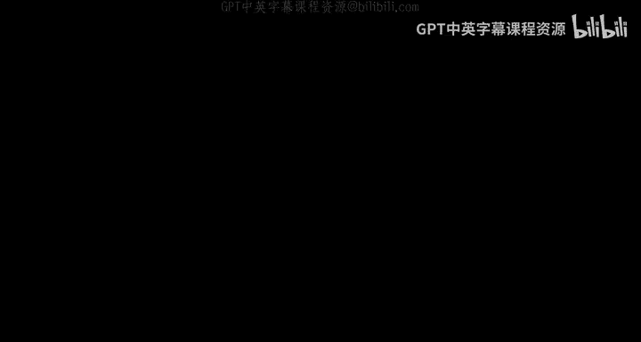

# 044：检测负成本环

在本节课中，我们将要学习如何扩展贝尔曼-福特算法，使其能够检测输入图中是否存在负成本环。我们将理解一个关键定理，它描述了算法行为与图中是否存在负环之间的关系，并学习如何通过增加一次迭代来实现检测功能。

## 概述

到目前为止，我们已经看到，在**没有**负成本环的输入图中，贝尔曼-福特算法能够正确计算从源顶点 `s` 到所有目标顶点 `v` 的最短路径。但对于**确实存在**负成本环的输入图，情况会如何呢？在这个简短的视频中，我们将看到如何扩展贝尔曼-福特算法，在几乎不改变其运行时间的前提下，轻松检查输入图是否包含负成本环。

## 核心定理与检测方法

上一节我们介绍了贝尔曼-福特算法在无负环图中的正确性，本节中我们来看看如何检测负环。

以下定理指明了贝尔曼-福特算法的适当扩展方式。具体来说，该定理根据贝尔曼-福特算法的行为，描述了输入图中是否存在负成本环。

实际上，我们考虑让贝尔曼-福特算法多运行一次迭代。目前，我们在外层循环索引 `i` 等于 `n-1` 时停止算法。对于这个定理，我们设想将外层 `for` 循环多运行一次迭代，即当 `i` 等于 `n` 时，对所有目标顶点 `v` 运行相同的旧递推关系。

那么，该定理断言：输入图 `G` **没有**负环，**当且仅当**我们从这额外的一批子问题中没有获得任何新信息。也就是说，当且仅当对于每个可能的目标顶点 `v`，`A[n][v]` 与 `A[n-1][v]` 完全相同。等价地，输入图**确实有**负成本环，当且仅当存在某个子问题，即存在某个目标顶点 `v`，在该次额外迭代中我们看到 `v` 处的值有所改进（变小）。

我们将在下一张幻灯片中证明这个定理。证明并不太难。但我希望定理的含义以及我们如何检查负成本环是立即清楚的。

现在，给定一个没有任何保证的任意输入图（它可能有负成本环，也可能没有），我们该怎么做？你运行贝尔曼-福特算法，但多运行一次迭代。你让外层 `for` 循环的索引 `i` 一直运行到 `n`。然后你检查：在最后一次迭代中，是否有子问题的值发生了变化？如果没有，如果你的所有 `A[n-1][v]` 都与 `A[n][v]` 相同，那么根据定理，你就知道图中没有负成本环。根据我们之前的工作，我们知道贝尔曼-福特算法是正确的。因此，我们可以像以前一样，愉快地返回 `A[n-1][v]` 作为正确的最短路径距离。

另一方面，如果你注意到存在一个顶点 `v`，使得 `A[n][v]` 与 `A[n-1][v]` 不同（更小），那么根据定理，你就说：“嘿，存在负环。” 因此，我不会为你计算最短路径距离，这没有意义。图中存在负成本环，算法终止。

当然，贝尔曼-福特算法中的这一次额外迭代对其运行时间的影响可以忽略不计，它仍然是 `O(m * n)`。

## 定理的边界情况说明

在这个定理中，我有一点小小的谎言。有一个边界情况我没有妥善处理。当我写下这个定理时，我考虑的是输入图 `G` 的常见情况，即存在一条从源点 `s` 到每个其他目标顶点 `v` 的路径。也就是说，所有最短路径距离都是有限值的输入图。如果不是这种情况，那么如上所述的定理就不正确。理解这一点的一个简单例子是一个退化实例：源顶点 `s` 根本没有出弧，而其余的顶点可能形成一个负成本环。在这种图中，该定理的左侧（`G` 没有负环）是假的，但定理的右侧（算法行为）是满足的。

因此，为了修改定理以适用于可能包含某些无限距离的图，我只需将左侧修改为：`G` 没有从源顶点 `s` **可达**的负成本环。

现在，如果你实际上想检测输入图中是否存在负环（无论是否从 `s` 可达），你可以使用各种技巧，再次利用贝尔曼-福特算法来解决这个问题。例如，给定一个输入图，你可以添加一个虚拟的额外顶点，并添加从该顶点到所有其他顶点的弧，弧长为 `0`。然后在该图上运行贝尔曼-福特算法，如果存在负成本环，它将被检测出来。

## 定理证明

既然我们知道了为什么希望这个定理成立，现在让我们来理解它为什么成立。让我们进入证明部分。

该定理断言了一个“当且仅当”的关系：左侧是输入图**没有**负成本环的性质；右侧是如果你多运行一次迭代，贝尔曼-福特算法**不会**做出任何改变的性质。

像这样的证明有两个部分：假设左侧成立，证明右侧；假设右侧成立，证明左侧。这两个部分中，如果你仔细想想，我们已经完成了一个。当我们证明贝尔曼-福特算法对于没有负成本环的图是正确的时候，我们就已经完成了。也就是说，如果左侧成立（输入图没有负成本环），我们已经论证过，你不需要将外层 `for` 循环运行超过 `i = n-1` 次，这足以捕获最短路径。因此，特别地，取任意大的 `i`，例如 `i = n`，你也不会看到更短的路径，你将得到完全相同的子问题解。

那么，证明的核心内容就是反向方向。因此，让我们假设我们多运行了一次贝尔曼-福特迭代，并且所有子问题的解都没有改变。我之前警告过，当输入图中不存在从 `s` 到所有其他顶点的路径，并且你有一些无限距离时，存在边界情况。这些细节我将留给你处理，所以让我们只关注从 `s` 到其他所有顶点都存在路径的情况，特别是这些子问题的值将是有限的。

用一点符号表示：我将使用小写 `d(v)` 来表示顶点 `v` 在最后两次迭代（当 `i = n-1` 和 `i = n` 时）中子问题的公共值。

现在的计划是，我们将仔细审视用于评估这些子问题的公式。它就在贝尔曼-福特算法的伪代码中注视着我们。从那个公式中，我们将得到一个关于这些 `d` 值的不等式，从这个不等式中，我们将能够轻松地推断出输入图的每个环确实是非负的——这正是定理左侧的陈述。

我们用什么公式来填充表格的这额外一次迭代（即 `A[n][v]`）呢？我们只是取以下两者中较好的一个：一方面是 `A[n-1][v]`（前一次迭代的解）；另一方面是使用最后一条边 `(w, v)` 的候选路径中的最佳者，该路径将一条最多有 `n-1` 条边的到 `w` 的路径与边 `(w, v)` 连接起来。

用我们的新符号 `d` 值（即第 `n-1` 次和第 `n` 次迭代中子问题的公共值）来表示，我们可以将这个公式的左侧写为 `d(v)`，在情况 2 的子问题中，我们可以将 `A[n-1][w]` 写为 `d(w)`。

因为这个等式的左侧是右侧一系列候选值的最小值，如果我们具体化、聚焦于右侧的任何一个候选值，即任何最后一条边 `(w, v)` 的选择，我们得到的东西至少和左侧一样大（因为左侧是所有候选值中最小的）。因此，特别地，对于最后一条边 `(w, v)` 的给定选择，我们得到 `d(v) <= d(w) + c(w, v)`，其中 `c(w, v)` 是从 `w` 到 `v` 的边的长度。

实际上，这个不等式所说的就是：获得一条从 `s` 到 `v` 的路径的一种方法是，取一条从 `s` 到 `w` 的路径并连接最后一条边 `(w, v)`。到 `v` 的最短路径只能比这条经过 `w` 的特定候选路径更好。

现在记住我们要证明什么：我们试图证明输入图没有负成本环。让我们任意选取一个环 `C`，并证明它具有非负成本。

这将是我们刚刚写下的粉色不等式的巧妙应用。具体来说，我们将对该不等式在环的所有边上求和。如果我稍微重新排列一下那个粉色不等式，就会很清楚。

让我们看看环 `C` 中边长的和。记住，这正是我们想要证明是非负的东西。我们对环 `C` 中的所有边 `(w, v)` 求和，对于每条边，我们查看它的成本 `c(w, v)`。根据粉色不等式，我们可以用环 `C` 中边的端点 `d` 值之差的求和来下界这个和。

注意，对于环上的一条给定弧 `(w, v)`，这条弧的尾部 `w` 的 `d` 值以系数 `+1` 出现，而这条弧的头部 `v` 的 `d` 值以系数 `-1` 出现。

但是，环当然有一个非常特殊的性质：环上的每个顶点恰好作为某条弧的尾部出现一次，也恰好作为某条弧的头部出现一次。因此，环上每个顶点的 `d` 值将出现一次系数为 `+1`，一次系数为 `-1`。所以我们得到大量的抵消，最后只剩下 `0`。

因此，环 `C` 具有非负成本。由于 `C` 是任意选取的环，所以输入图中所有环同时都具有这个性质——这正是我们试图证明的。

## 总结

本节课中我们一起学习了如何扩展贝尔曼-福特算法以检测负成本环。我们理解了一个关键定理：输入图中存在负环，当且仅当算法在额外运行一次迭代时，某些子问题的值会继续改善。基于此，我们只需在标准算法结束后多运行一次迭代，并检查子问题值是否变化，即可在不显著增加运行时间（仍为 `O(m * n)`）的情况下完成检测。对于存在从源点不可达的负环等边界情况，可以通过添加虚拟源点等技术来处理。这个扩展使得贝尔曼-福特算法成为一个更鲁棒的最短路径算法。