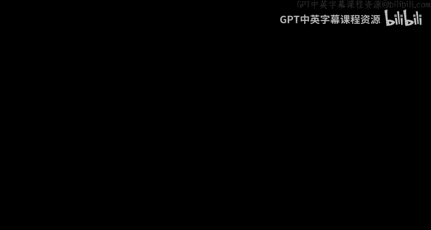
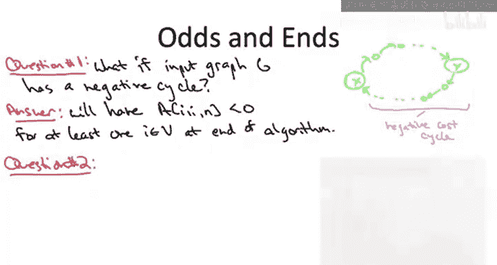

# 047：全对最短路径与弗洛伊德-沃舍尔算法 🧭



在本节课中，我们将学习如何将全对最短路径问题的最优子结构，转化为一个动态规划算法，即**弗洛伊德-沃舍尔算法**。我们将从基础情况开始，逐步构建算法，并讨论如何处理负成本循环以及如何重构最短路径。

---

## 基础情况

上一节我们识别了全对最短路径问题的最优子结构。现在，我们将其编译成一个动态规划算法。首先，让我们通过一个测验来确定基础情况。

我们的子问题有三个索引：起点 `i`、终点 `j` 和预算 `k`。预算 `k` 控制我们允许在最短路径中作为内部节点使用的顶点。因此，我们将使用一个三维数组 `A`。

最小的子问题集出现在 `k = 0` 时。测验要求我们填写所有 `A[i][j][0]` 的值。

以下是填写规则：
*   如果 `i` 等于 `j`，则存在一条空路径，其长度为 `0`。
*   如果 `i` 不等于 `j`，但 `i` 和 `j` 直接相连，则路径长度就是直接边的成本 `C[i][j]`。
*   如果 `i` 不等于 `j`，且 `i` 和 `j` 不直接相连，则没有不使用内部节点的路径，因此长度为 `+∞`。

---

## 弗洛伊德-沃舍尔算法

确定了基础情况后，我们现在可以写出完整的弗洛伊德-沃舍尔算法。我们将直接跳到代码实现，因为我们已经对构建递推关系有了足够的练习。

算法使用一个三维数组 `A`。基础情况 `k = 0` 在预处理步骤中根据上述规则填充。

核心是一个三重循环。重要的是，我们必须先解决最小的子问题，子问题的大小由 `k` 控制，因此 `k` 必须放在最外层循环。

```python
# 假设 n 是顶点数量，graph 是邻接矩阵，graph[i][j] 表示从 i 到 j 的边成本，若无边则为 INF
INF = float('inf')
A = [[[INF for _ in range(n)] for _ in range(n)] for _ in range(n+1)]

# 基础情况: k = 0
for i in range(n):
    for j in range(n):
        if i == j:
            A[0][i][j] = 0
        elif graph[i][j] is not None: # 存在直接边
            A[0][i][j] = graph[i][j]
        else:
            A[0][i][j] = INF

# 动态规划递推
for k in range(1, n+1):
    for i in range(n):
        for j in range(n):
            # 情况1: 不使用顶点 k 作为内部节点
            candidate1 = A[k-1][i][j]
            # 情况2: 使用顶点 k 作为内部节点
            candidate2 = A[k-1][i][k-1] + A[k-1][k-1][j] # 注意索引调整
            A[k][i][j] = min(candidate1, candidate2)
```

在代码中，为了计算 `A[i][j][k]`，我们取最优子结构引理中确定的两个候选值的最小值：
1.  **候选值1**：继承上一轮外层循环的解，即 `A[i][j][k-1]`。
2.  **候选值2**：使用节点 `k` 作为内部节点。此时，最短路径必然由从 `i` 到 `k` 的最短路径和从 `k` 到 `j` 的最短路径拼接而成，即 `A[i][k][k-1] + A[k][j][k-1]`。

算法的正确性依赖于最优子结构引理。运行时间方面，三重循环各迭代 `n` 次，总共有 `O(n³)` 个子问题，每个子问题执行常数时间的工作，因此总运行时间为 `O(n³)`。

---

## 处理负成本循环

现在，让我们解答两个常见问题。第一个问题是：**如果输入图包含负成本循环怎么办？**

我们的最优子结构引理和算法正确性论证都假设输入图没有负成本循环。但算法本身无论输入如何都会运行并填充三维数组。

有一个巧妙的方法可以检测负成本循环：**扫描最终轮次（`k = n`）计算出的数字的对角线**。如果输入图存在负成本循环，那么对于至少一个顶点 `i`，条目 `A[i][i][n]` 将是一个负数。

直观理解是：考虑负循环上标号最大的顶点 `Y`。当算法外层循环 `k` 达到 `Y` 时，计算从循环上某点 `X` 到自身的路径 `A[X][X][Y]`。候选值之一将是经过 `Y` 的整个循环的两半路径之和，即循环的总长度（负数）。这个负数从此将被记录并持续到算法结束。

因此，使用弗洛伊德-沃舍尔算法解决通用全对最短路径问题（图可能包含负循环）的流程如下：
1.  运行算法。
2.  扫描 `A[i][i][n]` 对于所有 `i`。
3.  如果发现任何负数，则声明存在负成本循环。
4.  如果对角线全为 `0`，则 `A[i][j][n]` 就是正确的最短路径距离。



---

## 重构最短路径

第二个常见问题是：**在运行弗洛伊德-沃舍尔算法后，如何重构具体的从 `i` 到 `j` 的最短路径序列？**

与贝尔曼-福特算法类似，我们需要在正向计算过程中存储额外的信息。我们将使用一个二维数组 `B`，其条目 `B[i][j]` 记录了在从 `i` 到 `j` 的某条最短路径上，**内部节点中标签最大的那个顶点**。

在正向计算过程中，每当我们在递推中使用了第二种情况（即通过顶点 `k` 更新了 `A[i][j][k]` 的值），我们就把 `B[i][j]` 设置为当前的 `k`。这表示 `k` 是导致这次更新的“关键”顶点。

假设我们已经正确计算了所有 `B[i][j]` 的值。现在要重构从源点 `s` 到终点 `t` 的最短路径：
1.  查询 `B[s][t]`。假设它返回顶点 `m`。这意味着最短路径可以分解为：`s` -> ... -> `m` -> ... -> `t`，并且 `m` 是路径上内部节点中最大的。
2.  然后，我们**递归地**重构从 `s` 到 `m` 的最短路径，以及从 `m` 到 `t` 的最短路径。
3.  递归的基准情况是当 `B[s][t]` 未定义（例如，`s` 和 `t` 直接相连或 `s == t`）时，此时路径就是边 `(s, t)` 或空路径。

这个过程一定会终止，因为每次递归调用都会确定路径上的一个顶点，而路径最多包含 `n` 个顶点。

---

## 总结

本节课中，我们一起学习了**弗洛伊德-沃舍尔算法**。我们从其最优子结构出发，定义了三维动态规划状态，并确定了基础情况。我们看到了算法如何通过三重循环，系统地计算所有顶点对之间的最短路径距离，运行时间为 `O(n³)`。此外，我们还探讨了算法如何扩展以**检测输入图中的负成本循环**，以及如何通过维护一个辅助数组 `B` 来**重构具体的最短路径**。这个算法是解决稠密图上全对最短路径问题的经典且高效的方法。