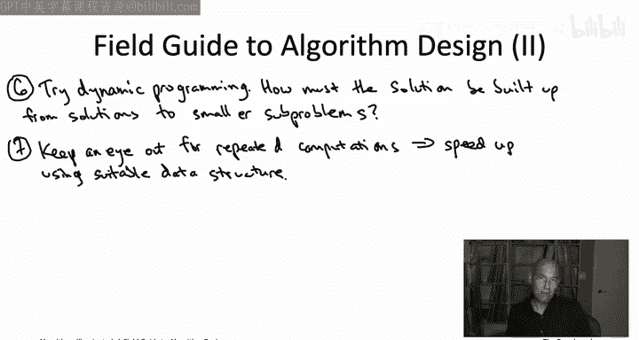
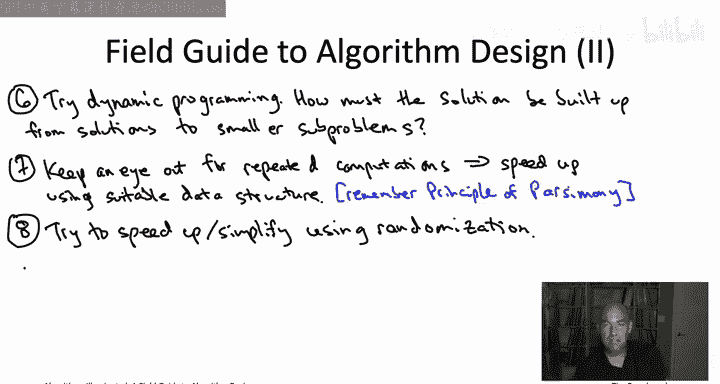
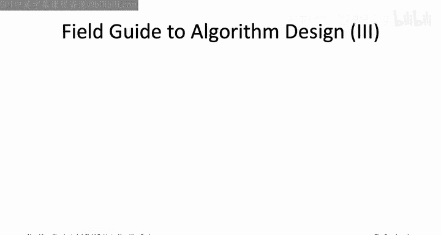
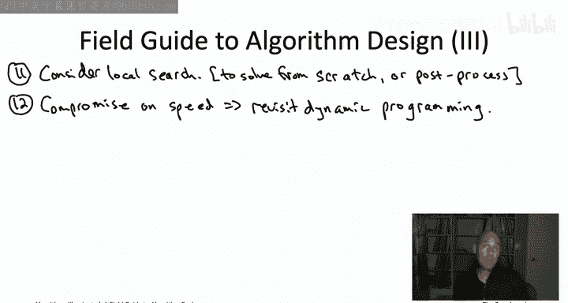
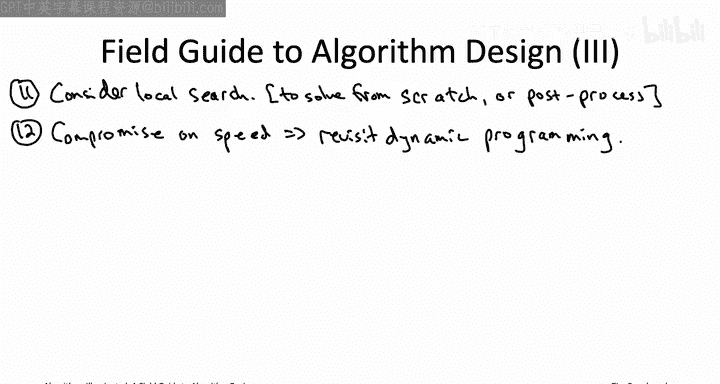
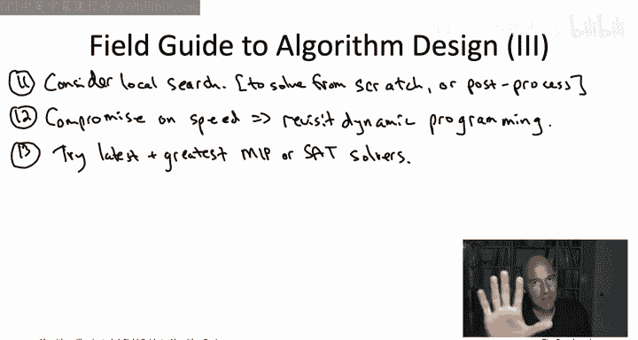

# 048：算法设计实战指南 🧭

在本节课中，我们将一起学习一个系统化的“算法设计实战指南”。这个指南包含13个步骤，旨在帮助你高效地应对新的计算问题。我们将从最省力的方法开始，逐步深入到更复杂的设计范式，并探讨如何处理NP难问题。

## 概述

恭喜你完成了《算法详解》系列的学习。现在，你已经拥有了一个丰富的算法工具箱，可以应对各种计算问题。面对如此多的工具，如何最高效地使用它们呢？本节视频将介绍一个我本人在面对新问题时常用的“配方”。随着你经验的积累，我鼓励你发展出最适合自己的方法。

## 13步算法设计指南

### 第一步：尝试现成算法

首先，尝试“偷懒”。看看你的新问题是否可以直接归结为你已经知道如何解决的问题，或者其特例。例如，许多问题本质上都是最短路径问题，你可以直接使用**Dijkstra算法**或广度优先搜索来解决。

### 第二步：应用“四大免费原语”

如果第一步不成功，继续尝试省力的方法。考虑应用我们在本系列中学到的“四大免费原语”（如排序、连通分量计算等）。这些子程序运行在线性或近线性时间，如果能简化你的问题，何乐而不为呢？

### 第三步：评估朴素解法

接下来，明确最显而易见的朴素解法是什么（例如穷举搜索）。然后评估这个解法是否已经足够好。例如，如果图的顶点数只有10个，那么用穷举搜索解决旅行商问题完全可行。

### 第四步：尝试贪心算法

如果朴素解法不够好，现在需要开始思考算法设计范式。通常，最好的起点是**贪心算法**。你可以为问题构思多种贪心策略并在小例子上测试。虽然它们很可能在某些输入上失败，但观察失败的具体案例能帮助你更好地理解问题。

### 第五步：考虑分治算法

如果贪心算法不奏效，可以考虑**分治算法**。这种范式适用于输入可以自然分割的问题（例如数组可以分成左右两半）。你尝试递归地解决每个子问题，然后合并结果。

### 第六步：转向动态规划

从分治算法很自然地过渡到**动态规划**。如果你尝试分治时，发现合并递归解需要大量重复计算，这通常是一个信号，表明你应该考虑动态规划。应用动态规划的关键在于理解：**最优解必须由更小子问题的最优解以有限的方式构建而成**。一旦有了这种洞察，通常就能自然地写出递归式，并自底向上地填充表格来解决问题。

### 第七步：利用数据结构优化

假设你在前六步中成功设计出了一个正确的算法。接下来要问：我们能做得更好吗？一个重要的优化方向是**部署数据结构**。数据结构的用武之地是**重复进行同类型计算**。

以下是常见操作与数据结构的对应关系：
*   **重复最小/最大值计算**：调用**堆（Heap）**，将操作从线性时间加速到对数时间。
*   **重复集合成员查找**：调用**哈希表（Hash Table）**，支持接近常数的插入和查找时间。

选择数据结构时，要遵循**简约原则**：使用能满足操作需求的最简单、最轻量的数据结构，这样操作速度才能最快。

### 第八步：考虑随机化

在优化算法时，另一个需要审视的方向是**随机化**。例如，如果在算法中需要从多个元素中选择一个，尝试随机选择可能会带来意想不到的加速效果。我们在系列中看到的快速排序和用于寻找长路径的**着色编码算法**都是随机化的成功应用。

### 第九步：诊断NP难问题

如果前八步都失败了，你仍然没有找到在合理时间内解决问题的正确算法，那么是时候考虑这个问题可能**没有高效算法**，例如它是一个**NP难问题**。

这一步的目标是诊断问题是否为NP难，以避免浪费时间寻找“好得不真实”的算法。你可以咨询专家，或者如果你掌握了NP难问题的证明技巧（如本书第22章所述），可以尝试自己证明。证明通常分为两步：
1.  选择一个已知的NP难问题。
2.  将已知的NP难问题**归约**到你的问题。因为归约沿着归约方向传播难解性，这就能证明你的问题也是NP难的。

### 第十步：妥协于正确性（设计启发式算法）

如果确认问题是NP难的，你必须做出妥协。假设你决定**妥协于正确性**，即追求快速但允许在某些输入上出错。这时，所有之前用于设计精确算法的范式（分治、动态规划）依然有用，但**贪心算法设计范式**因其“通常不正确”的特性，反而成为设计快速启发式算法最常用的起点。

### 第十一步：尝试局部搜索

除了之前学过的范式，我们在第四部分学到的**局部搜索算法设计范式**对设计启发式算法也极为有用。如果你能清晰定义问题的可行解集合、目标函数以及“局部移动”的方式（即如何从一个可行解变到另一个相近的解），就值得尝试局部搜索。它既可以作为独立的启发式算法，也可以作为其他算法（如贪心算法）的**后处理步骤**，对已有解进行改进。

### 第十二步：妥协于速度（设计精确算法）

现在考虑另一条路：假设你决定**妥协于速度**，即追求在所有输入上都正确，但接受它可能很慢（指数时间）。这时，**动态规划**再次展现出强大威力。虽然对于NP难问题，动态规划算法在最坏情况下仍需要指数时间（例如因为子问题数量是指数级的），但它通常能显著优于朴素的穷举搜索。背包问题和旅行商问题的**Bellman-Held-Karp算法**就是经典例子。

### 第十三步：使用“魔法黑盒”

最后，如果你需要精确算法，但动态规划不适用或仍然太慢，可以考虑使用一些“半可靠的黑盒”求解器，例如**混合整数规划（MIP）** 或**可满足性问题（SAT）** 求解器。MIP更适合编码优化问题，而SAT更适合搜索可行解。如果你的问题能方便地编码成MIP或SAT问题，就值得用最新的求解器尝试一下。

## 总结

本节课我们一起学习了由13个步骤组成的算法设计实战指南。我们从尝试最省力的现成工具开始，逐步深入到贪心、分治、动态规划等核心设计范式，并探讨了如何利用数据结构和随机化进行优化。最后，我们学习了面对NP难问题时，如何在正确性与速度之间做出妥协，并介绍了相应的算法设计策略。请记住，这个指南只是一个起点和模型。随着你算法经验的积累和技能的提升，你将能够发展出属于你自己的、个性化的算法设计方法论。

至此，我们的《算法详解》系列之旅暂时告一段落。算法与数据结构的学习永无止境，希望本系列课程不仅为你提供了实用的工具，也激发了你对计算机科学更深的好奇与热情。站在巨人的肩膀上，愿你能在自己的项目中创造性地应用这些 brilliant 的思想。下次再见！