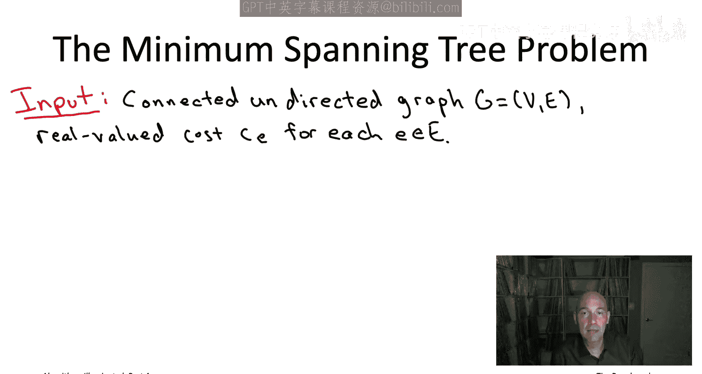
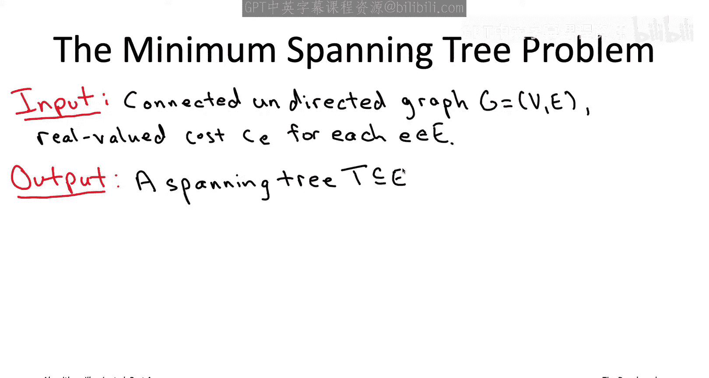
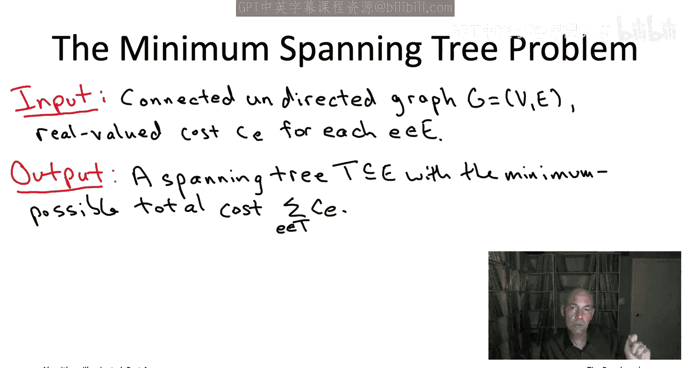
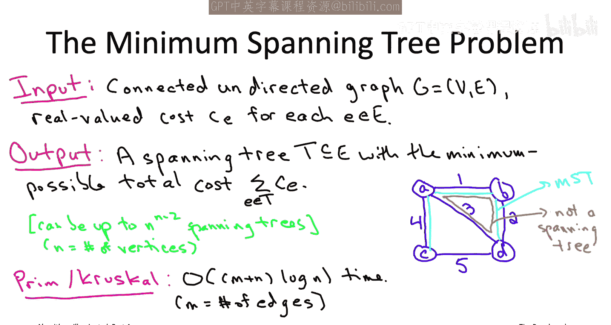
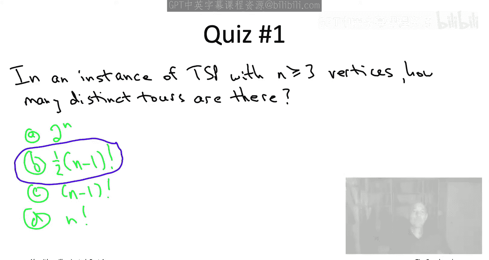
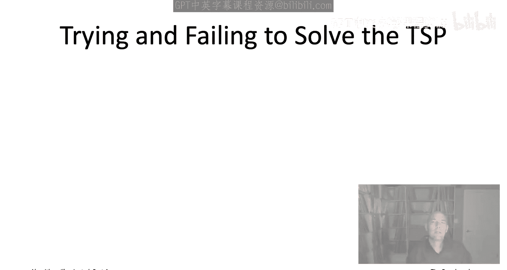
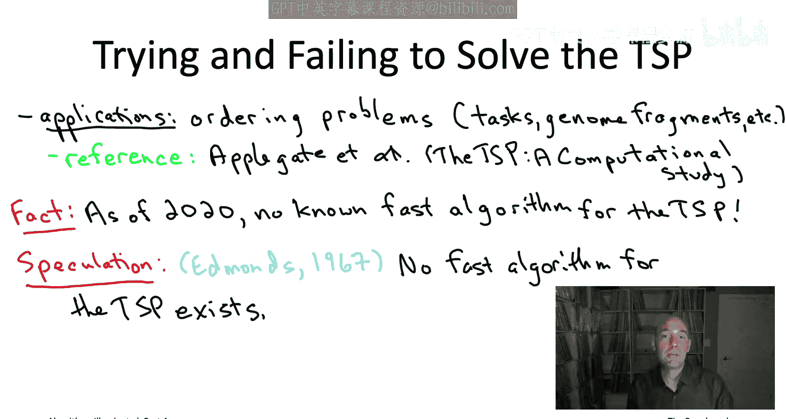

# 002：最小生成树与旅行商问题的算法之谜 🧩

在本节课中，我们将要学习两个看似相似但计算复杂度截然不同的问题：最小生成树问题和旅行商问题。我们将探讨它们之间的核心差异，并初步了解什么是NP难问题。

---

许多算法入门书籍，包括《算法启蒙》的前三册，都存在一种选择偏差。它们主要关注那些总能找到正确解且运行速度极快的算法，以及通常非常巧妙的算法。毕竟，学习一个聪明的算法捷径既有趣又能赋予我们力量。

然而，这种精心挑选的问题集合并不能代表算法设计的现实。在现实中，计算难解性的幽灵时常困扰着算法设计师。尽管存在许多拥有快速且正确算法的问题，例如图的搜索、连通分量、最短路径、序列比对等，但同样存在大量重要问题，它们似乎无法被总是快速且正确的算法解决。

意识到这一严峻现实后，两个问题立刻浮现出来。首先，如何识别一个问题属于这些难解问题，从而避免无意中浪费时间试图为其设计总是快速且正确的算法？其次，当知道一个问题本质上是计算难解时，应该如何调整目标？算法工具箱中又有哪些工具可以帮助我们实现这些调整后的目标？本视频系列以及《算法启蒙》第四册的目的，就是为你提供这两个问题的详尽答案。

## 最小生成树问题 🌲

计算难解问题有时看起来很像简单问题，我们需要适当的训练才能区分它们。让我们从一个希望你已经熟悉的问题开始：著名的**最小生成树问题**。

最小生成树问题的输入是一个**无向图**。该图应该是**连通**的，意味着它是一个整体，你可以通过路径从图中的任意顶点到达其他任意顶点。每个边都有一个实数值的边成本，我们用 `c(e)` 表示边 `e` 的成本。

最小生成树算法的职责是计算图的一个**生成树**，并且在所有生成树中，它应该计算出一个**最小化树中边成本总和**的生成树。生成树顾名思义，它是一棵树（无环），并且是生成树（覆盖图的所有顶点）。换句话说，对于每对顶点 `v` 和 `w`，在生成树 `T` 中应该存在一条从 `v` 到 `w` 的路径。

例如，考虑一个具有四个顶点和五条边的图。

每条边都标有其成本。观察这个图，你会发现最小成本生成树包含成本为1、2和4的边。因为你有四个顶点需要连接，确实需要三条边。唯一比1、2、4成本更低的三条边组合是1、2和3，但它们会形成一个三角形，这既不是无环的，也不能覆盖所有顶点。因此，你能做到的最好选择就是1、2和4。所以，在这个例子中，最小生成树的总成本是7。

那么，最小生成树问题有多难？一方面，一个图可以有非常多的生成树。例如，组合数学中有一个著名的结果叫做**凯莱定理**，它指出：如果一个图有 `n` 个顶点，并且它是**完全图**（即所有 `n` 选 `2` 条边都存在），那么这个 `n` 个顶点的完全图有 `n^(n-2)` 个不同的生成树。在本系列的这个阶段，你应该非常熟悉指数级数字增长极快的概念。例如，当 `n=50` 时，`n^(n-2)` 已经超过了已知宇宙中估计的原子数量。

这对我们意味着什么？图可以有海量的生成树。这意味着你能想到的最朴素的算法——**穷举搜索**（即逐个检查每个生成树并记住你见过的最好的那个）——除了在极小的图上，完全是一个无望实现的算法。生成树的数量如此之多，穷举搜索绝对不是快速算法。

但另一方面，你希望知道的是，尽管可能性数量是指数级的，但存在快速算法能够非常迅速地锁定所有生成树中最好的那个。我们在之前的视频中详细讨论过两种算法：**普里姆算法**（有点像迪杰斯特拉算法，缓慢地生长一棵树以覆盖整个图）和**克鲁斯卡尔算法**（对边进行排序，然后单次遍历，像小碎片一样生长生成树，最后融合在一起）。我们看到，如果使用适当的数据结构（例如普里姆算法用堆，克鲁斯卡尔算法用并查集数据结构），这两种算法都有极快的实现。它们可以在几乎线性的时间内运行（线性时间加上一个额外的对数因子），这非常惊人，尤其是考虑到它们是在海量的生成树中寻找最优解。

## 旅行商问题 🧳

现在让我们看第二个著名问题：**旅行商问题**。实际上，我们在之前的书籍和播放列表中甚至没有提到这个问题，但正如我们将在第四部分看到的，旅行商问题将扮演一个核心角色，它是最著名的NP难问题之一。有趣的是，这个问题听起来非常像最小生成树问题。

旅行商问题的输入，与MST问题类似，是一个**无向图**。在MST问题中，我们假设图是连通的；在TSP中，为了方便，我们假设它是一个**完全图**，即所有 `n` 选 `2` 条边都存在（`n` 是顶点数）。与MST问题一样，每条边都有一个实数值的边成本。不要被MST要求连通而TSP要求完全图所困扰，这完全是一个表面的区别。例如，常规的MST问题完全等价于完全图上的MST问题，因为如果你给我一个不完全的图，我可以添加所有缺失的边并赋予它们极高的成本，这样MST就永远不会使用这些超高成本的边，它只会在原始图中找到MST。所以，当我们说图是完全的时，基本上不失一般性。

旅行商问题算法的职责不是返回一个生成树，而是返回一个**旅行**或**旅行商回路**，同样要求**最小化边成本的总和**。什么是旅行商回路？它只是图中的一个行走路径，**恰好访问每个顶点一次**，并且**结束于起点**。

例如，想象一个具有四个顶点的完全图。一个回路可能沿着边界走，即四条边界边。另一个回路可能使用锯齿形边。

为了确保你理解完全无向图中的回路含义，我们来看一个测验。

问题是：在一个有 `n` 个顶点（`n` 至少为3）的旅行商问题实例中，有多少个不同的旅行商回路？答案选项中的 `n!` 是阶乘函数，即1到 `n` 所有整数的乘积。例如，`3! = 6`，`4! = 24`，`5! = 120`，等等。注意，阶乘函数比 `2^n` 增长得更快。和往常一样，我鼓励你在这里暂停视频，思考一下这个测验，得出你的答案猜测，然后再继续播放视频，我们将讨论解决方案。

正确答案是 **B：`1/2 * (n-1)!`**。例如，如果 `n=4`，则有3个不同的回路。在上一张幻灯片中，我们看了四个顶点的完全图。我们看到了两个回路，实际上还有第三个回路，它也使用锯齿形边，但这次使用的是侧边而不是顶边和底边。一般来说，公式是 `1/2 * (n-1)!`。为什么答案是B？你可能直观地感觉到旅行商回路和顶点顺序之间存在对应关系。回路感觉就像你选择访问顶点的顺序，这可能会让你觉得选项D（`n!`）可能是正确答案。但实际上，所有顶点顺序都**重复计算**了回路。每个回路实际上被计算了 `2n` 次。首先，它被多算了 `n` 次，因为对于每个起点的选择，最终得到的都是同一个回路。其次，一个回路可以沿两个方向遍历，这给出了两个不同的顺序。所以，每个不同的回路对应 `2n` 个不同的顺序。总共有 `n!` 个顺序，因此就剩下 `1/2 * (n-1)!` 个不同的回路。

所以，回路的数量非常多，但这至少表明旅行商问题可以在有限的时间内解决——时间有限但很长。至少，你可以通过穷举搜索来解决旅行商问题，系统地枚举这 `1/2 * (n-1)!` 个回路中的每一个，并记住最好的那个。你可以自己在一个四顶点的例子中尝试穷举搜索。

这个测验的正确答案是第二个选项 **B：13**。同样，你可以通过枚举这个四顶点图中的三个不同回路来验证。一个是沿着边界的回路，总成本确实是13；一个是使用顶部和底部边的锯齿形路径，总成本为15；还有一个是使用锯齿形和侧边的回路，总成本为14。其中最便宜的是13，即沿着边界的回路。

对于像这样的小实例（四个顶点，或者五个、六个顶点），仅仅枚举指数级的回路并记住最好的那个没什么大不了的。但这只适用于最小的实例。作为算法设计师，我们有责任问：我们能否比朴素的穷举搜索做得更好？是否存在类似于MST问题的算法，能够神奇地在旅行商问题指数级大小的解空间中快速找到最小成本的那个“针”？

## 问题的根本差异 ⚖️

尽管这两个问题的陈述表面上相似，但旅行商问题实际上似乎比最小生成树问题**根本性地困难得多**。

我可以给你讲一个关于旅行商问题的俗套故事，但那真的会贬低这个问题的价值，它实际上非常基础。每当你有一堆任务需要完成，并且完成一个任务的成本取决于你之前完成的任务时，你就遇到了一个TSP实例。例如，想象你在工厂里组装一批不同的汽车，你可以想象工厂需要处于某种特定配置才能组装特定类型的汽车，你也可以想象在将工厂从A型车重新配置为B型车时，可能会产生设置成本或转换成本。如果你需要组装许多不同类型的汽车，并试图找出正确的顺序，以便在最短的设置时间内全部组装完毕，这正是一个旅行商问题。

或者，对于一个非常不同的应用，在计算基因组学中，你可以想象你有一堆基因组短片段，它们部分重叠，你想逆向推导出这些片段在基因组上最可能的排列顺序。如果我给你每对片段的配对合理性度量（例如，基于它们最长公共子串的长度），那么逆向推导出最可能的顺序，这又是一个旅行商问题。

如果你想了解更多关于旅行商问题的应用及其迷人的历史，可以查阅Applegate、Dixby、Faal和Cook在2006年出版的一本好书。

TSP一直有很多自然应用，显然也具有巨大的美学吸引力。由于这两个原因，许多最伟大的优化思想者长期以来都在努力研究TSP的算法，至少可以追溯到20世纪50年代。许多非常严肃的人都在认真思考如何解决TSP。尽管经过70年的努力，许多杰出的头脑参与其中，但直到今天（2020年），**仍然没有已知的快速算法**来解决旅行商问题。还没有人提出哪怕接近普里姆算法和克鲁斯卡尔算法（用于最小生成树问题）那样好的算法。

更准确地说，我应该说明“快速算法”的含义。记得在本系列的第一部分或早期视频播放列表中，我们一致认为，快速算法应该是指运行时间随输入规模线性或接近线性增长的算法。那将是极快的算法。但在这里，我实际上是在谈论一个非常宽松的快速算法概念，即任何具有**多项式运行时间**的算法。先别提极快的运行时间，甚至没有人知道一个保证在 `n^100` 时间内运行的旅行商问题算法（`n` 是顶点数），甚至 `n^10000` 时间的算法也不知道。

对于这种令人沮丧的现状（即我们不知道任何保证多项式运行时间解决TSP的算法），有两种可能的解释。解释一：实际上存在一个快速算法，只是我们还不够聪明，没有发现它，它正等待着被发现。解释二：实际上我们找不到这样的算法，是因为**根本不存在**这种类型的算法。直到今天，我们也不知道这两种情况哪一种是真实的——是存在算法但我们没找到，还是根本不存在算法。

但大多数专家相信第二种解释，这等价于著名的 **P ≠ NP 猜想**。实际上，早在1967年（甚至在P与NP问题被正式提出之前），Jack Edmonds在一篇名为《最优分支》的著名论文中就推测，事实上**不存在**好的TSP算法，其中Edmonds所说的“好”是指运行时间随输入规模呈多项式函数增长。

TSP是**NP难问题**的一个例子。这意味着，在这个著名的数学猜想（P ≠ NP猜想）下，如果该猜想成立，那么Edmonds就是对的：事实上，不存在保证多项式时间的旅行商问题算法。随着我们继续学习，我们将看到，不仅仅是TSP是NP难的，不幸的是，计算难解性实际上是一个普遍现象，**许多许多问题都是NP难的**，其计算难度与旅行商问题相当。

---

本节课中我们一起学习了最小生成树问题和旅行商问题，这两个问题在表面上相似，但在计算复杂度上存在根本差异。我们了解到，尽管MST存在高效的算法（如普里姆和克鲁斯卡尔算法），但TSP被认为是NP难问题，目前没有已知的多项式时间算法，并且大多数专家相信这样的算法可能根本不存在。这引出了对计算难解性更广泛的探讨。在接下来的视频中，我们将讨论NP难度的不同专业级别，以及本系列中哪些部分最适合你想要达到的理解水平。