# 004：19.3_ 简单与困难问题

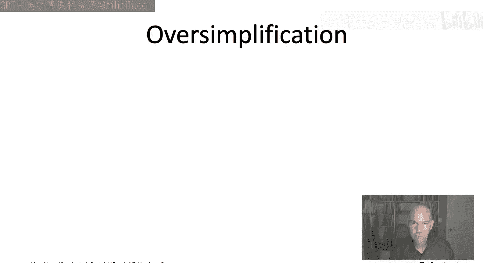

在本节课中，我们将初步、非正式地理解一个问题在计算上是“简单”还是“困难”意味着什么。我们将学习NP难理论如何对问题进行精确分类，区分像最小生成树这样的“简单”问题和像旅行商问题这样的“困难”问题。

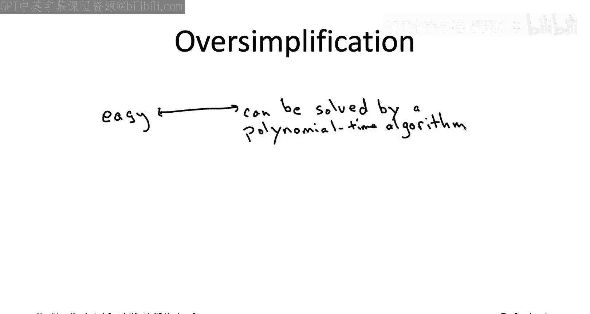

## 一个简化的二分法


首先，让我们通过一个高度简化的二分法来理解NP难理论的核心观点。

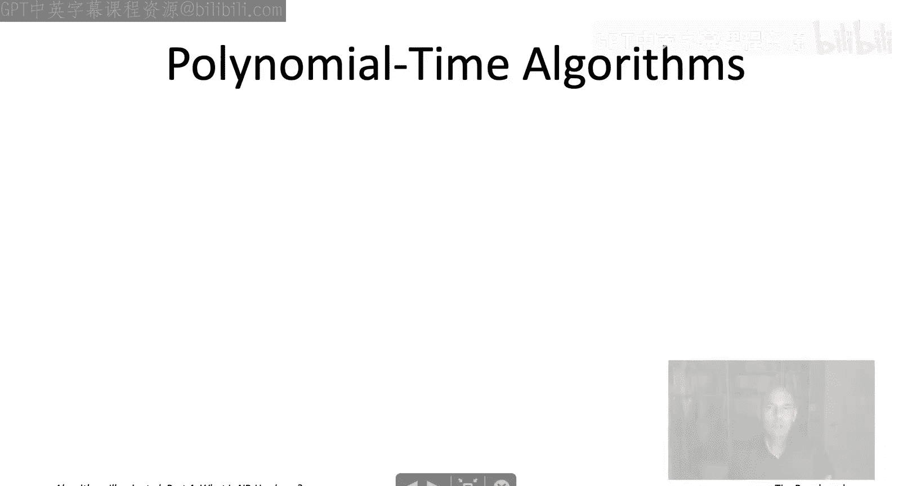

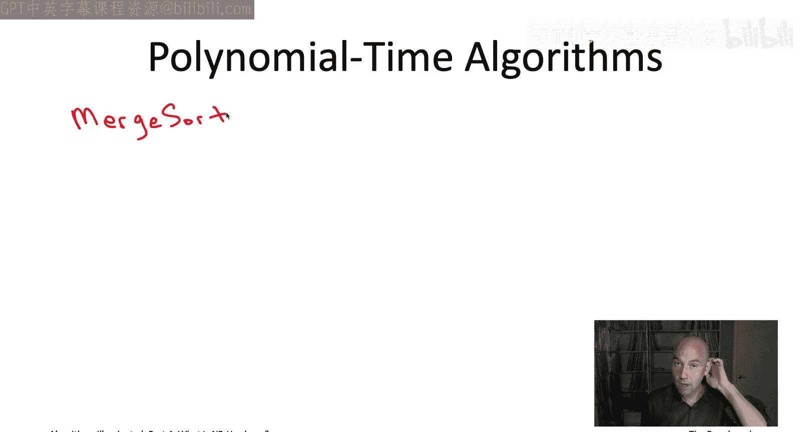

在NP难理论中，一个“简单”问题指的是存在一个算法，其运行时间可以表示为输入规模的多项式函数。理想情况下，我们希望算法像最小生成树算法那样快（接近线性时间）。但对于NP难理论的目的而言，即使是二次方、三次方，甚至 `n^100` 时间复杂度的算法（其中 `n` 是输入规模），也足以将问题归类为“简单”。


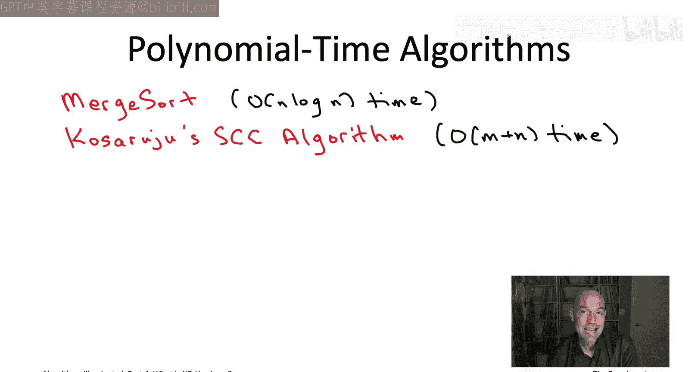

**简单问题运行时间公式**：`O(n^d)`，其中 `d` 是一个与 `n` 无关的常数。


相比之下，一个“困难”问题（如旅行商问题被推测的那样）在最坏情况下需要指数级的时间。任何正确的算法，对于某些输入，其运行时间将像输入规模的指数函数那样增长。

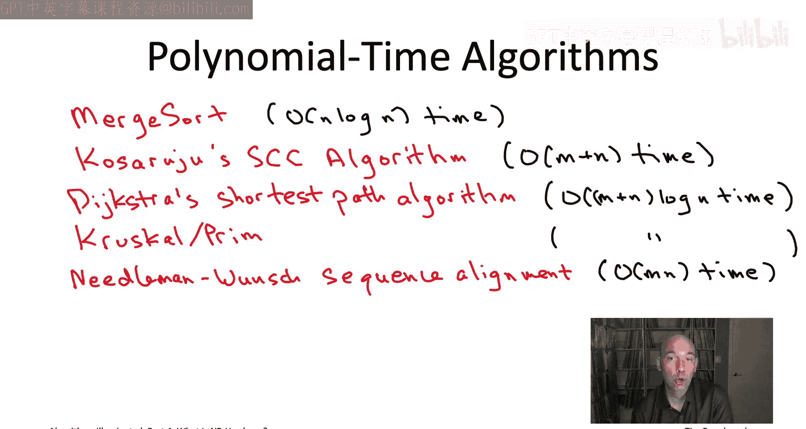

这个二分法并非100%准确，它忽略了一些我们稍后将详细讨论的微妙之处。但作为一个入门级的简化理解，记住这个观点非常有帮助。

## 简单问题：多项式时间可解

上一节我们介绍了简单与困难问题的简化二分法。本节中，我们来看看什么是“简单”问题，即多项式时间可解的问题。

多项式时间算法是指运行时间由输入规模 `n` 的某个多项式函数（如 `O(n^d)`，`d` 为常数）所限定的算法。我们在本系列的前三部分已经见过许多这样的算法。


以下是我们在之前学习中遇到的一些多项式时间算法的例子：

*   **归并排序**：排序是一个简单问题，因为归并排序算法以 `O(n log n)` 的时间运行，这几乎是线性的。
*   **Kosaraju算法**：用于计算有向图的强连通分量，该算法运行时间为 `O(m + n)`，其中 `m` 是边数，`n` 是顶点数。
*   **Dijkstra最短路径算法**：在边长为非负的有向图中，计算从起点到所有其他顶点的最短路径。与Prim的最小生成树算法类似，它能在接近线性的时间内运行。
*   **Prim和Kruskal最小生成树算法**：两者在配合合适的数据结构时，都能获得接近线性的运行时间。
*   **序列比对问题**：我们看到了一个动态规划算法，其运行时间为 `O(m * n)`，其中 `m` 和 `n` 是两个输入字符串的长度。
*   **Floyd-Warshall全对最短路径算法**：该算法运行时间为 `O(n^3)`，`n` 是顶点数。

所有这些算法的运行时间都由输入规模的多项式函数限定，因此它们都是多项式时间算法。

**多项式时间算法定义**：一个算法，如果其运行时间为 `O(n^d)`，其中 `n` 是输入长度，`d` 是一个与 `n` 无关的常数，则该算法是多项式时间的。

这个定义可能看起来非常宽松（例如 `n^77` 也算）。然而，我们也见过非多项式时间的算法，例如穷举搜索最小生成树，其运行时间是指数级的。任何指数函数最终都会比任何多项式函数增长得快得多。

下图清晰地展示了这一点：尽管 `100n^2` 初始值较高，但在 `n` 约为13或14时，`2^n` 就会超越它，之后指数函数会以惊人的速度增长。

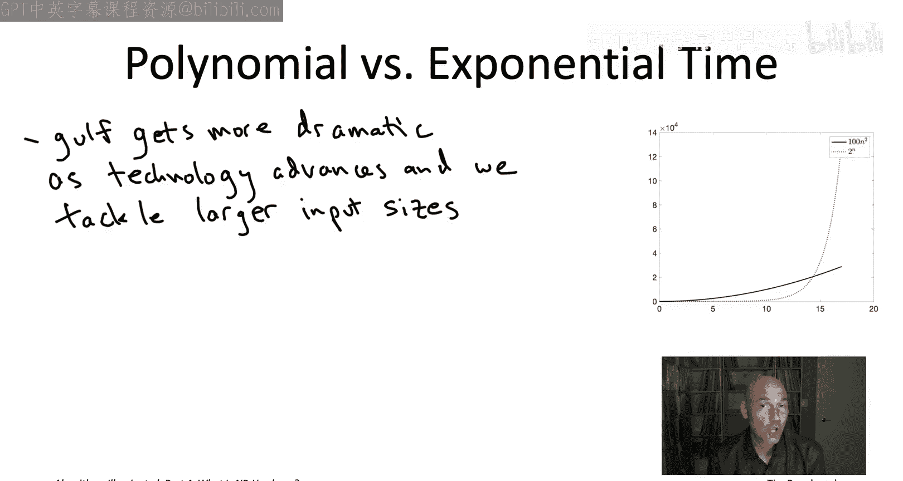

```
多项式 vs. 指数增长：
100n^2 (多项式)  vs.  2^n (指数)
```

这种差异的一个有趣含义是，随着计算能力的增长（摩尔定律），我们处理的问题规模也越来越大。问题规模越大，多项式时间算法和指数时间算法之间的性能鸿沟就越显著。因此，这种区分随着技术进步而变得更加重要。


另一种思考方式是考虑固定的时间预算（例如一小时或一天）。对于多项式时间算法，计算能力翻倍，能处理的问题规模也会成倍（或接近成倍）增加。但对于指数时间算法（如 `O(2^n)`），计算能力翻倍仅能将可处理的问题规模增加 `1`。因此，多项式时间算法才能真正从技术进步中受益。

在NP难理论中，我们定义“简单”问题为可由多项式时间算法解决的问题。根据这个定义，我们上面列举的所有问题（排序、最短路径、序列比对、最小生成树等）都是多项式时间可解的。

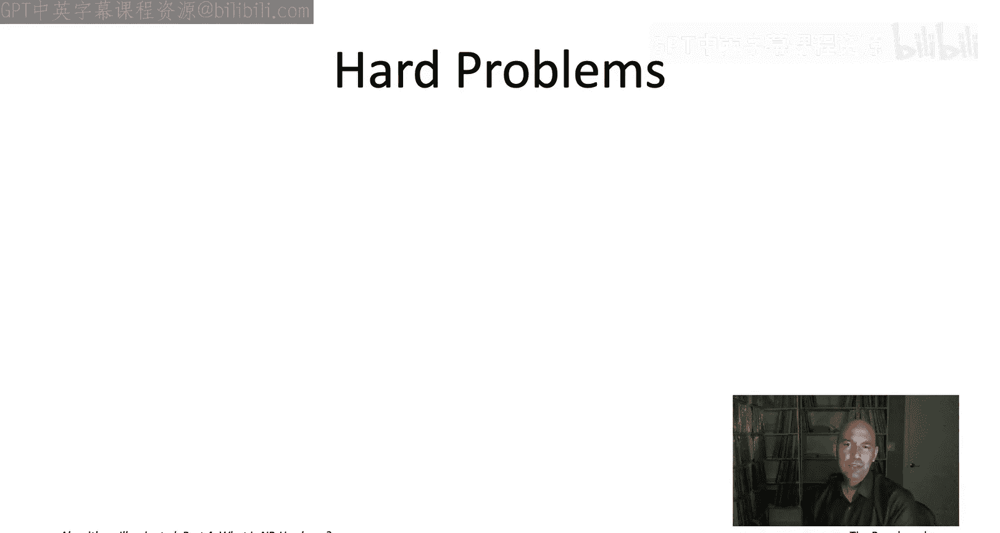

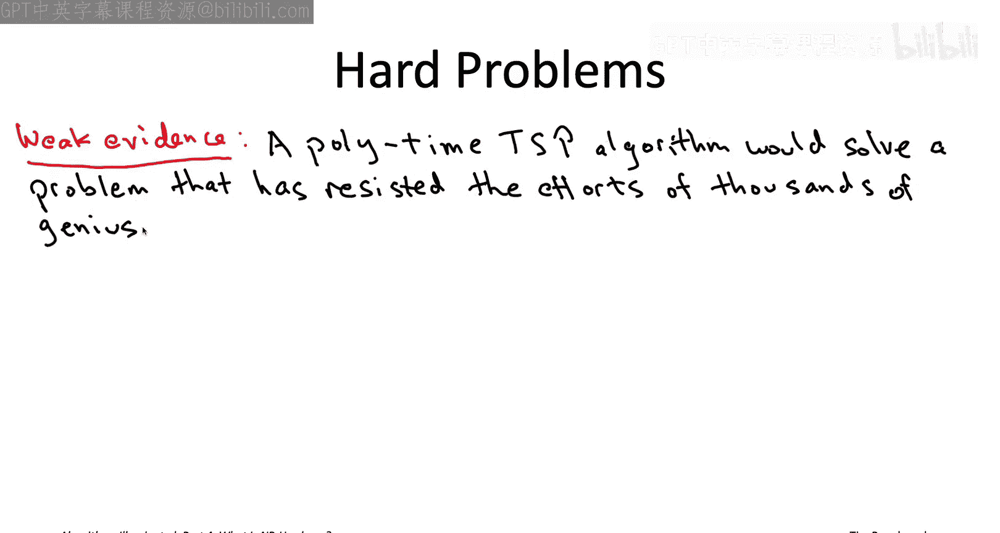

## 困难问题：NP难问题

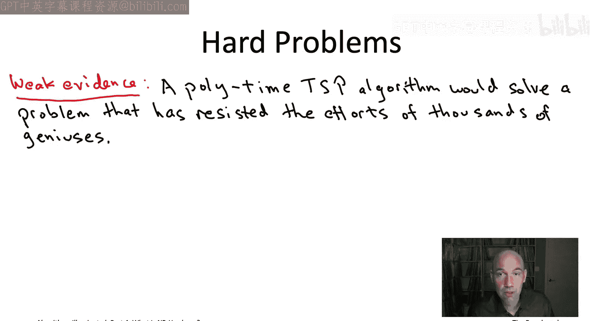

上一节我们明确了多项式时间可解问题的定义。本节中，我们来看看如何定义“困难”问题，特别是NP难问题。

考虑旅行商问题。如果我们认为它不属于上一节定义的“简单”问题（即不存在多项式时间算法），我们如何收集证据来支持这个观点？

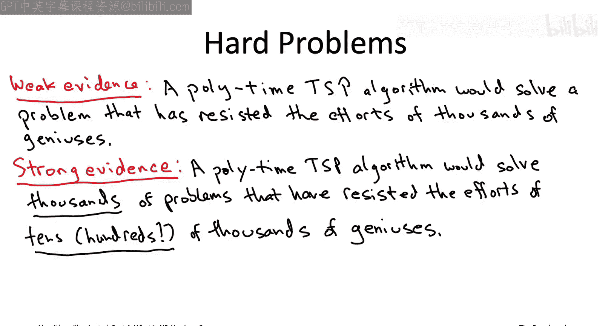

最直接的证据当然是数学证明，但至今无人能证明TSP不存在多项式时间算法。不过，我们可以收集一些间接证据。

第一个间接证据是，TSP是一个极其著名的问题，许多顶尖学者研究了数十年（约70年）仍未找到多项式时间算法。这虽然不能证明不可能，但强烈暗示了其难度。


然而，NP难理论提供了更强有力的证据。它表明，如果存在TSP的多项式时间算法，那么将自动为成千上万个其他目前未解决的难题也提供多项式时间算法。本质上，NP难理论揭示了包括TSP在内的数千个计算问题都是“同一问题”的不同伪装，它们的计算命运紧密相连。因此，试图为TSP设计快速算法，就等于在同时挑战这成千上万个相关难题。

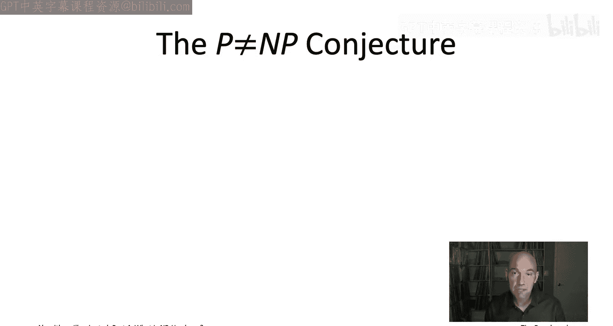


你可能会说，同样有很多人尝试证明TSP没有快速算法也失败了。区别在于，人类似乎更擅长证明计算可行性（即设计巧妙算法），而不太擅长证明不可行性。如果TSP真有快速算法，以目前的研究投入和时长来看，尚未被发现是相当令人惊讶的。而如果它没有快速算法，鉴于当前的数学工具水平，我们尚未能证明这一点则不那么令人意外。因此，大多数专家倾向于相信TSP不存在多项式时间算法。

那么，什么是NP难问题？基本上，它意味着有强有力的证据表明该问题是难解的，即如果存在多项式时间算法解决它，将自动解决成千上万的其他难题。


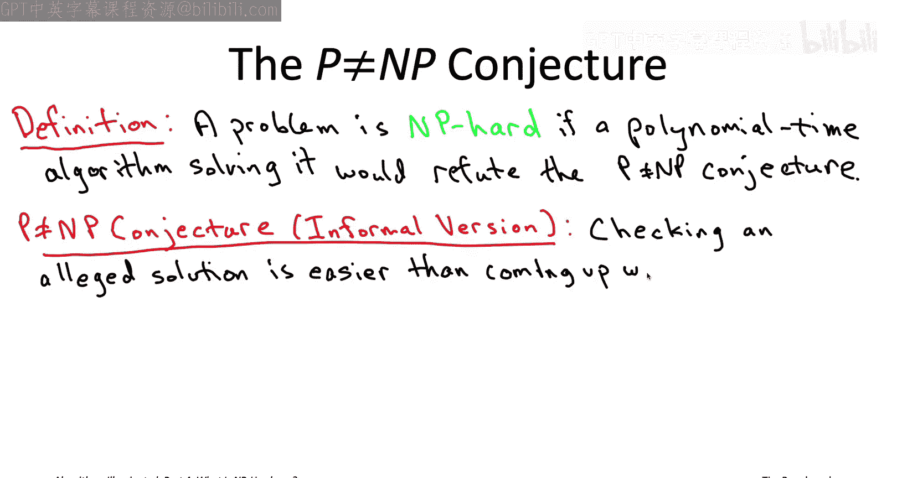

在接下来的许多视频中，我们将采用一个临时定义：**一个问题被认为是NP难的，如果存在多项式时间算法解决它会推翻一个著名的数学猜想——P ≠ NP猜想。**

反过来理解：如果P ≠ NP猜想成立（大多数人相信如此），那么包括TSP在内的任何NP难问题都不存在多项式时间算法（即使是 `n^100` 或 `n^10000` 的算法也不存在）。

**P ≠ NP猜想**（非正式表述）：验证一个给定解的正确性，在本质上应该比从头开始寻找一个解要容易。例如，检查一个已完成的数独答案是否合规，远比你自己解出这个数独要简单快捷。对于TSP，验证一条路径的总成本是否小于等于某个值，也远比找到这样一条路径容易。这个猜想看似直观，但由于多项式时间算法可能非常精巧和出人意料（例如Strassen的矩阵乘法算法），我们至今无法证明它。尽管如此，大多数专家相信P ≠ NP是成立的。

## 澄清与总结


现在，让我们回顾并澄清本节开头给出的简化解释与NP难真实定义之间的差异。

在视频开头，我说NP难理论将“简单”问题识别为多项式时间可解，将“困难”问题识别为在最坏情况下需要指数时间。但现在我告诉你，“困难”问题的真实定义是NP难，而NP难意味着如果存在多项式时间算法解决它，将推翻P ≠ NP猜想。这与“需要指数时间”的说法并不完全相同。

以下是几个关键差异点：

1.  **条件性**：NP难的难解性是**有条件**的，它依赖于P ≠ NP猜想这一尚未被证明的数学猜想。如果P = NP（即猜想错误），那么许多NP难问题实际上可以在多项式时间内解决。
2.  **介于多项式与指数之间**：即使P ≠ NP成立，它也只是排除了多项式时间算法。这并不意味着算法**必须**运行指数时间。存在一些函数，其增长速度比任何多项式都快，但比任何指数函数都慢，例如 `n^(log n)` 或 `2^(√n)`。这些仍然是NP难问题潜在算法运行时间的候选。
3.  **指数时间假设**：对于本课程将讨论的大多数NP难问题，专家们不仅相信没有多项式时间算法，而且相信没有亚指数时间算法，即确实需要指数时间。这由一个更强的猜想——**指数时间假设**所形式化。
4.  **可解性**：本课程讨论的所有NP难问题，至少可以通过穷举搜索在指数时间内解决。世界上还存在一些甚至指数时间也无法解决的问题（如停机问题）。
5.  **非严格的二分法**：虽然绝大多数自然问题要么是P（简单），要么是NP难（困难），但也存在少数例外，如**整数分解**和**图同构**问题，它们被认为是介于两者之间的“中间”问题。

尽管如此，开头的简化二分法——NP难通常意味着在最坏情况下需要指数时间——对于覆盖你将遇到的大多数情况以及作为一个易于记忆的总结来说，仍然是一个非常好的近似。

本节课中，我们一起学习了计算问题“简单”与“困难”的初步概念。我们明确了“简单”问题对应于多项式时间可解的问题，并看到了许多例子。对于“困难”问题，我们引入了NP难的概念，理解到其难解性通常基于P ≠ NP猜想，并且对于许多经典问题（如TSP），这实际上意味着需要指数级计算时间。我们还澄清了简化模型与精确定义之间的细微差别。


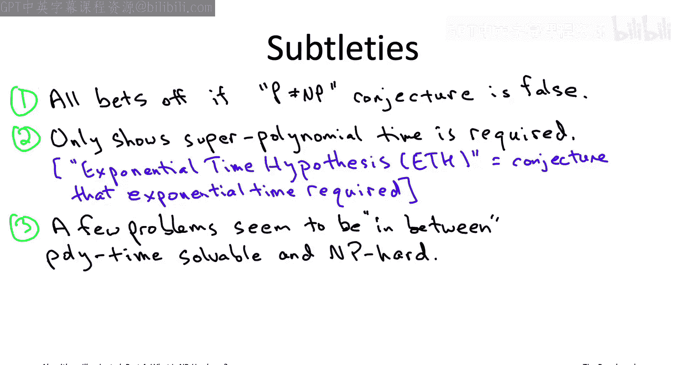

接下来，我们将概述当在实际应用中遇到NP难问题时，算法工具箱中有哪些策略可以使用。