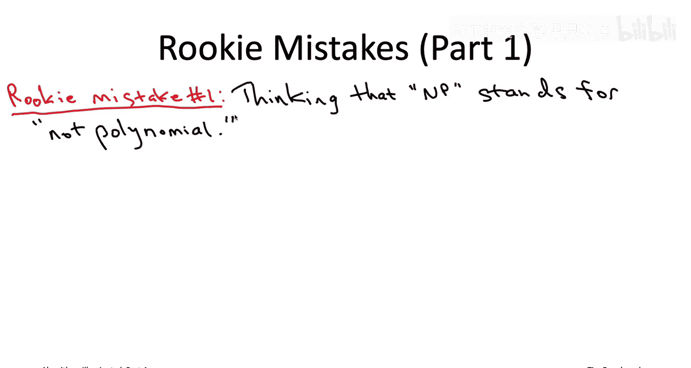
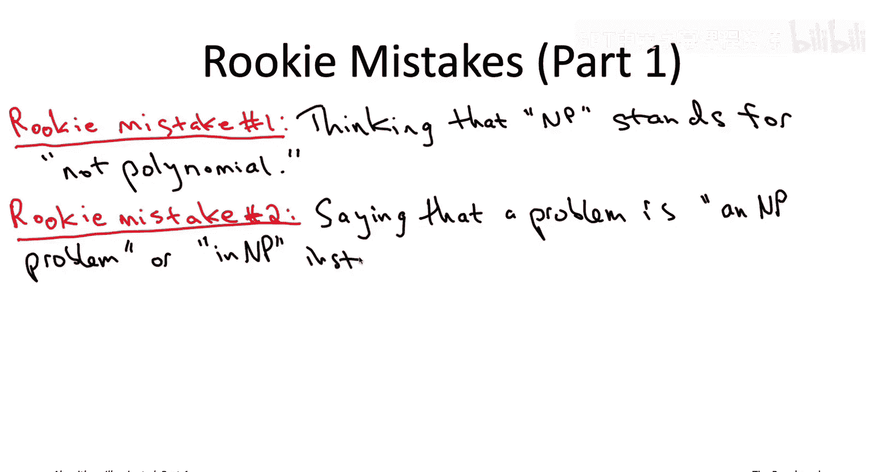
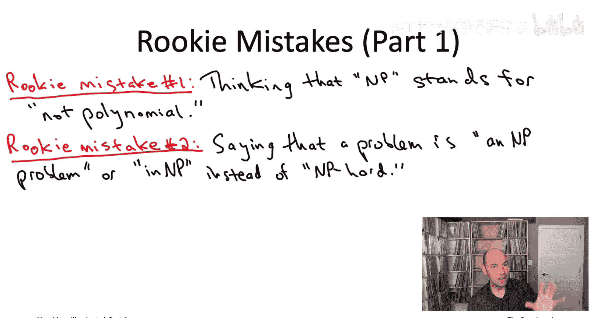
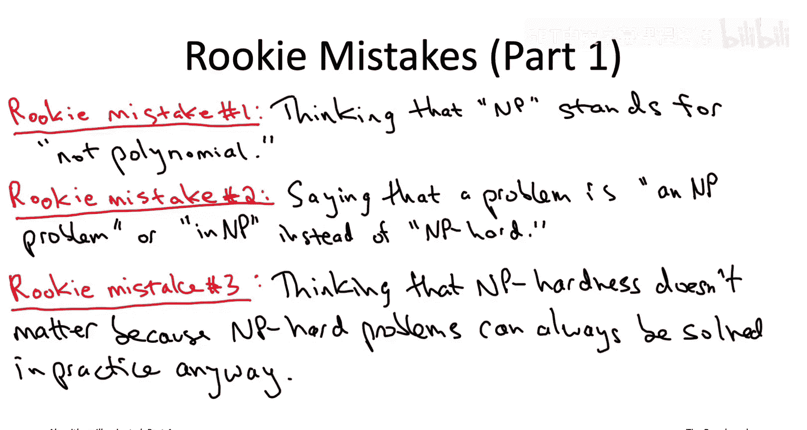
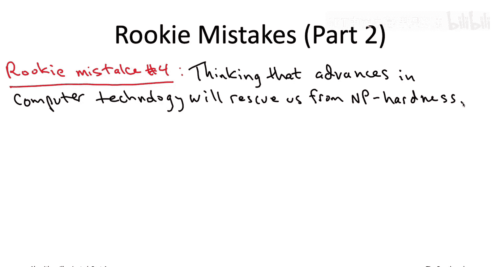
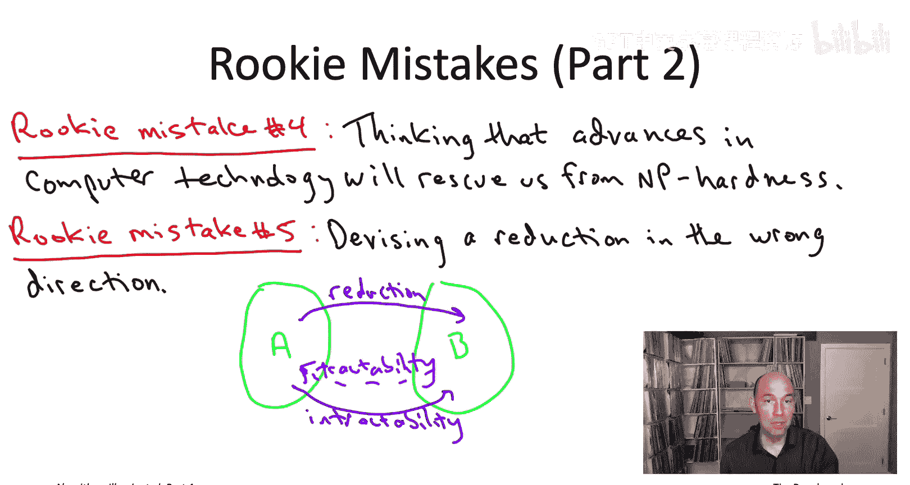
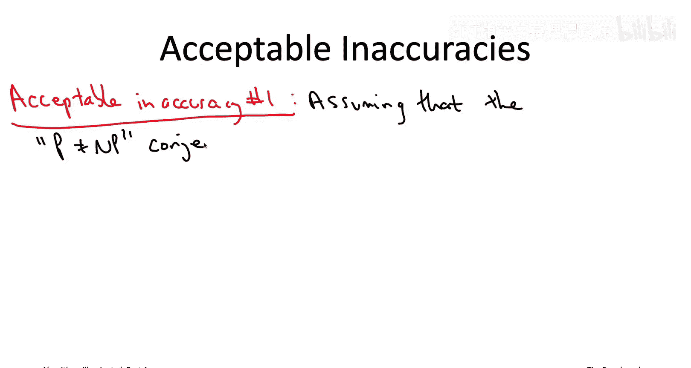
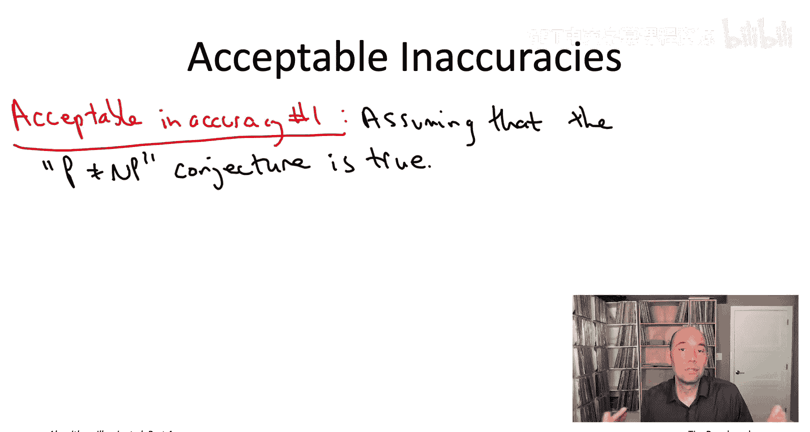
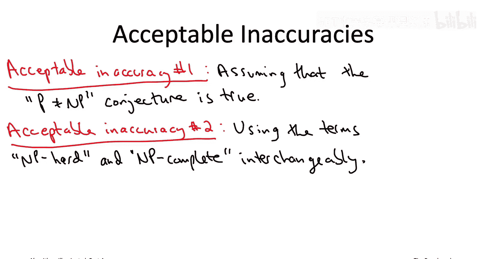

# 007：新手常见错误 🚫

在本节中，我们将探讨关于NP难问题的一些常见误解和错误表述。理解这些内容有助于你在学术讨论和实际工作中更准确地使用相关概念，避免因表述不当而被视为“新手”。

## 概述

NP难是一个技术性较强的话题，但对程序员和计算机科学家而言又高度相关。在日常交流中，人们有时会对严格的数学定义进行一些宽松的解释，以方便沟通。然而，某些关于NP难的不准确表述会明显暴露你对概念的生疏，而另一些则被广泛接受。本节将列出五个常见的新手错误，并解释哪些不准确表述在文化上是可接受的。

## 五个常见的新手错误

以下是五个需要避免的常见错误。

### 错误一：误解“NP”的含义

第一个错误关乎“NP”这个缩写词的含义。重要的是记住它**不代表**什么，而不是它代表什么。它**不代表**“非多项式”。虽然普遍认为NP难问题无法在多项式时间内解决，但“NP”并非“非多项式”的缩写。如果你真的好奇，它代表“非确定性多项式时间”。更多细节将在本系列课程末尾的选修讲座中讨论。

### 错误二：混淆“NP难”与“NP问题”

第二个常见错误是，当想说一个问题“NP难”时，却说它是“NP问题”或“属于NP”。如果你继续观看关于NP复杂性类形式定义的选修视频，你会了解到，说一个问题“属于NP”实际上是在说关于该问题的正面特性，即**可验证性**，而非**难解性**。例如，我给你一个填好的数独，你可以快速验证它是否是一个有效解。因此，当谈论计算困难时，务必加上“难”字，说“NP难”。

### 错误三：认为NP难仅是学术概念

第三个错误是认为NP难仅仅是学术概念，与实际应用无关。这是一个很大的误解。确实，NP难并非“死刑判决”，有许多成功驯服NP难问题的实际案例，前提是投入足够的人力和计算资源。本系列后续视频将展示几个例子。然而，在现实世界中，也有大量因NP难带来的挑战而不得不修改甚至完全放弃计算问题的案例。人们更倾向于夸耀成功解决NP难问题的经历，而非多次失败的尝试，因此你听到的成功案例远多于失败案例。但请相信，失败案例大量存在。如果NP难在实践中不重要，为什么快速启发式算法在实践中如此普遍？如果总能解决难题，就没有必要诉诸启发式方法了。事实上，现代电子商务所依赖的密码系统（如RSA）的安全性，就建立在“大数分解在计算上困难”的假设之上。如果有一个能快速可靠解决NP难问题的“魔法盒”，那将催生高效的因数分解算法，从而破解RSA密码系统——据我们所知，这尚未发生。

### 错误四：认为硬件进步能解决NP难问题

第四个错误是认为随着计算机速度越来越快，今天困难的问题明天就会变得简单。正如我们过去讨论的，计算技术的进步（例如摩尔定律）实际上使NP难理论变得更加相关。请记住，随着计算能力提升，我们感兴趣解决的问题规模也在增长。问题规模越大，多项式运行时间和指数运行时间之间的差距就越大。因此，随着技术越来越好，NP难问题变得比以往任何时候都更相关。

### 错误五：归约方向错误

第五个错误很难避免，即使是专业理论计算机科学家有时也会犯。这个错误关乎设计归约时弄错了方向。请记住，当我们证明一个问题是NP难时，难解性沿着归约的**相同方向**传播。如果你将问题A归约到问题B，那么难解性是从A传播到B。在构思NP难证明及其涉及的归约时，通常会有一种强烈的诱惑去做错误方向的归约，仅仅因为那是我们习惯的方向。你必须记住，如果你想证明问题B是难解的，难解性必须从某个已知的难问题沿着归约方向传播到B。也就是说，你必须将一个已知的难问题A归约到你的目标问题B，而不是反过来。这是非常容易犯的错误。唯一的解决办法是，每次你认为自己证明了一个问题是NP难时，回过头再三检查归约方向是否正确，即难解性是否从已知的难问题流向感兴趣的问题。

## 三种可接受的不准确表述

以上是五个需要避免的新手错误。接下来，让我以三种在文化上可接受的不准确表述作为总结。严格来说，这些陈述在数学上并不完全正确，但如果你这样表述，每个人都能理解你的意思，不会动摇别人对你掌握NP难概念的信心。

### 可接受表述一：假设P≠NP猜想为真

第一种可接受的不准确表述是直接假设P≠NP猜想为真，即认为验证问题的解从根本上比从头开始想出解更困难。正如我们所讨论的，时至今日我们仍不知道P≠NP猜想是真是假。我们的直觉强烈认为它应该是真的。因此，虽然感觉像是在等待我们的数学技术赶上直觉，但大多数计算机科学家或多或少将P≠NP视为自然法则，并据此进行推理。

### 可接受表述二：将“NP难”与“NP完全”视为同义词

第二种可接受的不准确表述是将两个术语视为同义词，而实际上它们并非完全相同。这两个术语是“NP难”和“NP完全”。基本上，“NP完全”是“NP难”的一种特定形式。细节有些技术性，我仅在那些讨论NP复杂性类形式定义的选修视频中讨论。如果你关注算法方面，一个问题究竟是NP完全还是NP难，其实并不重要。关键结论是一样的：假设P≠NP猜想成立，这些问题都没有多项式时间算法能解决。因此，无论你的问题是NP完全还是NP难，你都必须做出妥协，这将在后续视频中讨论。

### 可接受表述三：将NP难等同于最坏情况下需要指数时间解决

第三种可接受的不准确表述是将NP难等同于在最坏情况下需要指数时间来解决。这基本上是我首次引入该术语时给出的过度简化的总结。正如我们后来所见，这种说法忽略了一些细微之处。例如，有些问题甚至无法在指数时间内解决（如停机问题）。还有一些问题似乎处于中间状态——太难以至于无法用多项式时间解决，但又不够难到成为NP难问题（如大整数分解）。但一般来说，日常工作中的计算机科学家或多或少会将NP难与最坏情况下的指数时间可解性等同起来。因此，如果你在非正式对话中隐含地将这两者等同，没有人会感到惊讶。

## 总结

本节课我们一起学习了关于NP难问题的五个常见新手错误和三种可接受的不准确表述。我们明确了“NP”的正确含义、区分了“NP难”与“NP问题”、认识到NP难的实际相关性、理解了硬件进步无法从根本上解决NP难问题，并学会了如何正确设计归约方向。同时，我们也了解到在非正式交流中，假设P≠NP、混用“NP难”与“NP完全”、以及将NP难等同于指数时间复杂性，通常是可被接受的简化表述。

本章（第19章）的视频序列到此结束，我们直观地解释了什么是NP难、它对算法设计者意味着什么、遇到NP难问题时可以做什么、以及如何自行证明问题是NP难的。接下来，我们将丰富你的算法工具箱，为你提供遇到NP难问题时可以取得进展的新工具。接下来的重点将是**快速启发式算法**。这是我们在愿意牺牲一点正确性（即有时允许出错），但确实需要快速算法时，对NP难问题做出的一种妥协。我们将在下一个视频序列中探讨这些内容。